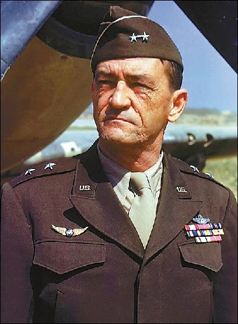
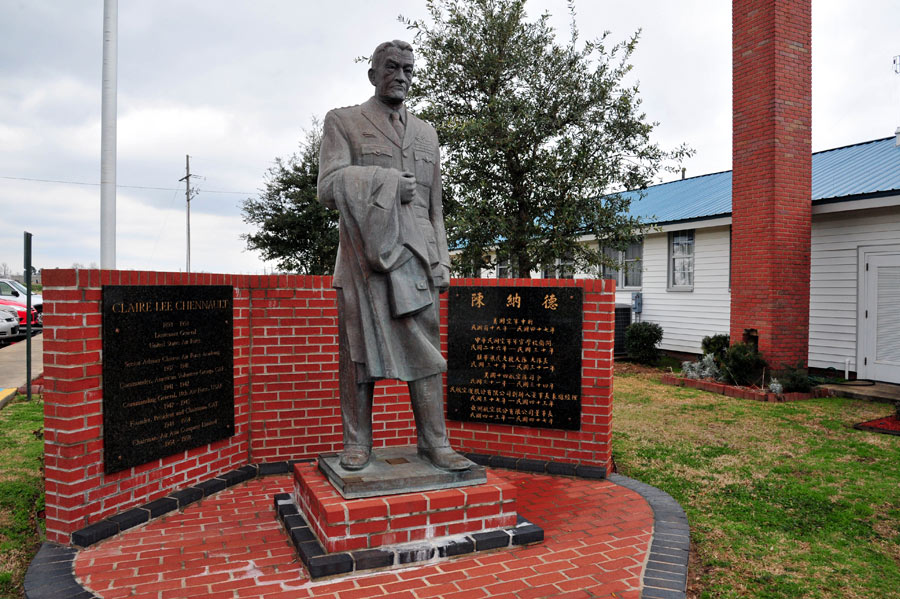
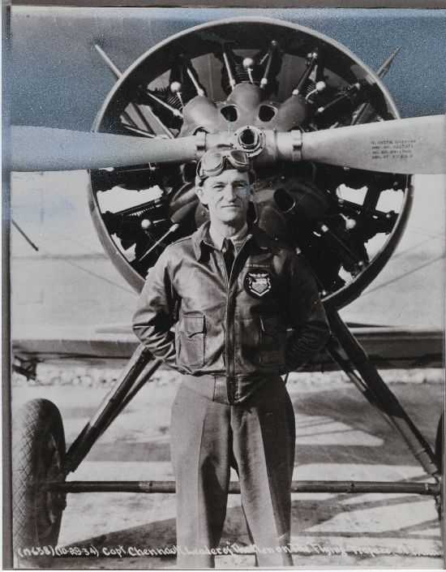
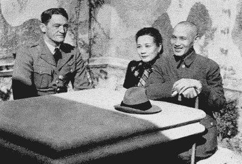
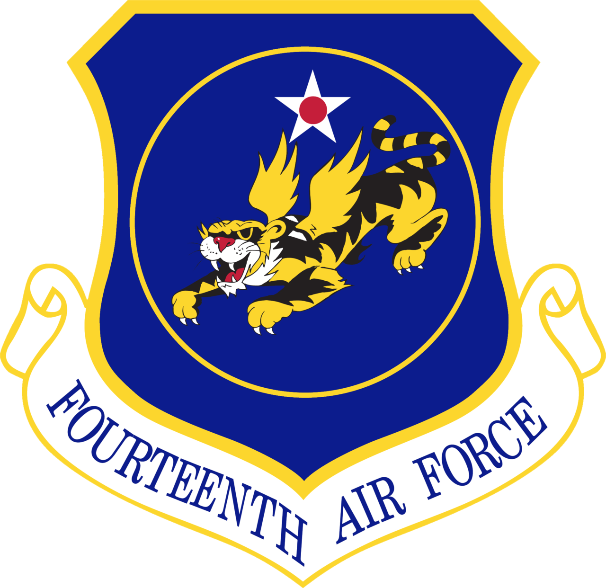
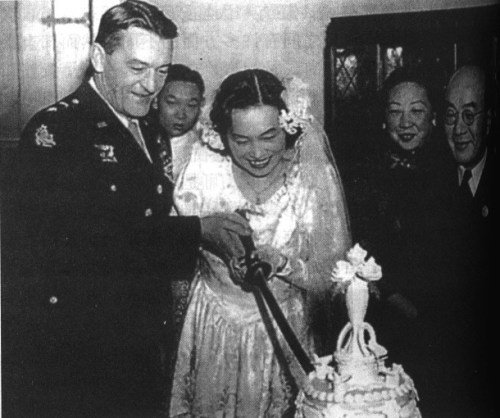

0727陈纳德

59年前的今天，战果辉煌，上演最美忘年恋的飞虎将军陈纳德逝世

（万象特约作者：东西望）

59年前的今天，1958年7月27日，战果辉煌，上演最美忘年恋的飞虎将军陈纳德逝世

陈纳德（1893年9月6日－1958年7月27日），美国陆军航空队中将，飞行员。

原本是乡下教师，考入飞行员。抗日期间，在美国退役后，被蒋介石和宋美龄邀请到中国，组建了一支外国雇佣空军。对日本发动了两次攻击后，全军覆灭。

后得到美国支持，组建美国志愿航空队，称为飞虎队，战绩非凡，击毁超过2,500架日机。陈纳德也被称为飞虎将军。日本投降前，离开中国，被授予中华民国最高荣誉青天白日大蓝绶带。

后来重回中国，54岁的他娶了22岁的中国女记者陈香梅，被称为最美的异国忘年恋。

没能参加的第一次世界大战

1893年9月6日，陈纳德出生在美国德克萨斯州，童年时代在路易斯安那州度过。1911年（18岁），从路易斯安那州州立师范学院毕业，担任乡间教师。

1917年8月（24岁），考入印第安纳州本杰明士官学校，成为一名陆军中尉，被派往第九十师服务。1918年，应招飞行员被录用，到长岛担任第46战斗机队的副官，被派往法国参加第一次世界大战，因德国投降，中途返航。

退役的伤残空军军官

1919年（26岁），在克里佛航空学校攻读。1920年，被新组建的陆军航空队录用为空军军官。1923年（30岁），被派往夏威夷，负责指挥第19战斗机中队，并编写了《战斗机飞行技巧手册》。

1930年（37岁），陈纳德被保送到弗吉尼亚州兰黎空军战术学校学习，毕业后，在航空兵战术学校任战斗机的战术教官。1937年初（44岁），因失去部分听觉，而以伤残军人身份（上尉衔）从美军退役。

中国的外国雇佣军

1937年春天（44岁），蒋介石派人到请陈纳德复出。5月，陈纳德应约赴中国，6月3日，面见蒋介石及宋美龄后，获时为航空委员会秘书长的宋美龄任为顾问，协助发展空军。

1937年7月7日，抗战正式爆发后，陈纳德雇用了4个法国人、3个美国人，1个荷兰人和1个德国人和4名外籍机械员。1937年10月，购买的“伏尔梯”、“诺斯罗普”轻型轰炸机和“马丁”重型轰炸机12架到货，组成了一支外国雇佣军——国际志愿队（简称“国际中队”）。

只打了两仗的国际志愿队

这支雇佣军虽然为国民政府高薪聘请，但却不受空军指挥，只受陈纳德领导，形成了军中之军。到1938年1月，国际中队即改名为国民革命军空军轰炸航空兵第14队，编制共计115人。该队开始驻汉口，后调往孝感。

1938年2月7日（45岁），首次实战，该队7架轰炸机，对在蚌埠附近的日军阵地实施轰炸，战果是日军阵地5处被炸起火。2月24日，5架轰炸机第二次出动，对日军占领的新乡站实施轰炸，战果不详。

不久，日军飞机突袭孝感机场，第14航空队的飞机在跑道上被日机全部炸毁。1938年9月，这支由外籍人员组成的“国际中队”被航空委员会下令解散。

中国空军美国志愿大队

1940年（47岁），陈纳德受蒋介石之托到美国寻求援助，得到了罗斯福总统的支持，为中国组建空军；并以援助盟国武器的租借法案，为中国提供一百架P-40战斗机；同时又准许退役或备役的美军到中国参加志愿队。

1941年7月（48岁），陈纳德回到中国时，已有68架飞机、110名飞行员、150名机械师和其他一些后勤人员到达中国。8月1日，“中国空军美国志愿大队”正式成立，由陈纳德任大队指挥官。

张扬个性的飞虎队

1941年11月，美国志愿大队编为3个中队。第1队为“亚当与夏娃队”，该队飞机均有亚当围着苹果追夏娃的图案。第2队为“熊猫队”，该队飞机未画熊猫，而画有飞行员的漫画像。第3队为“地狱天使队”，该队飞机均画有姿态各异的裸体天使图案。

12月20日，首战。一批日机向云南方向飞来，昆明机场所有的飞机都升空迎击，日入侵飞机10架，被击落6架，3架负伤。志愿队无1架飞机损失。至1942年5月期间，美国志愿队的三个战斗机中队多次和空袭的日军作战，经常取得胜果，令中国军民士气大增，被称为“飞虎队”。

1942年7月3日（49岁），陈纳德根据美国陆军部命令，解散美国航空志愿队。美国航空志愿队在中国、缅甸、印度支那作战7个多月，以空中损失12架飞机和地面被摧毁61架的代价，取得击落约150架敌机和摧毁297架敌机的战绩。美国航空志愿队共损失26名飞行员。

获最高荣誉的少将司令

之后，陈纳德任美国驻华航空特遣队司令，军衔仍为准将。1943年3月10日，驻华特遣队改编为美国陆军第14航空队，陈纳德晋升少将司令。陈纳德上任后，强烈要求罗斯福总统加强驻华空军力量，夺回中国战场的制空权，并伺机攻击日本本土，但并未得到支持。

1945年7月（52岁），在日本投降前夕，陈纳德提出辞呈。在陈纳德离开中国前，被授予中华民国最高荣誉青天白日大蓝绶带。抗战期间，陈纳德指挥的第14航空队以500架飞机的代价击毁超过2,500架日机，同时击沉为数不少的商船和军舰。

最美的异国忘年恋

1945年12月，陈纳德重返中国。1946年10月，成立民航空运队。1947年（54岁），陈纳德与中央通讯社女记者陈香梅（22岁）结婚，被称为最美的异国忘年恋。

1948年（55岁），在国共内战中，民航空运队帮助空运国军军队、给养。1949年，又协助空运中华民国政府人员及国军部队到台湾，并且为美国中央情报局提供服务。

1950年（57岁），民航空运队改组为控股公司，陈纳德任公司董事长。1958年7月18日，美国国会通过晋升他为空军中将的法案；7月27日，陈纳德因病在华盛顿去世，终年65岁，美国国防部以最隆重的军礼将其安葬于华盛顿阿灵顿军人公墓。

2015年9月，中国向陈纳德的遗孀陈香梅颁发了抗战胜利70周年纪念章。

