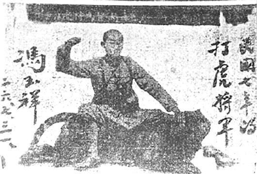
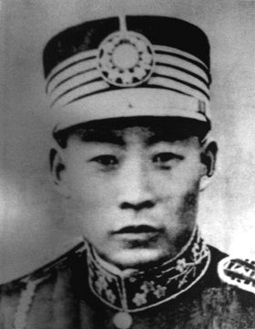

80年前的今天，著名抗日歌曲《大刀进行曲》里大刀队将领原型的赵登禹将军在和日本侵略军的战斗中牺牲。

（万象特约作者：一一）

80年前的今天，大刀向鬼子头上砍去的打虎将军赵登禹壮烈牺牲

赵登禹（1898年－1937年7月28日），山东省菏泽县赵楼村人。

早年追随冯玉祥起家，曾打死老虎，被称为打虎将军。参加中原大战，后来成为国民革命军第29军第132师师长，参与长城抗战，取得喜峰口战斗胜利，击毙日军3000人。日本《朝日新闻》评价说：“明治造兵以来，皇军名誉尽丧喜峰口外，遭受60年来未有之侮辱。”

卢沟桥事变后，赵登禹守南苑与日军作战，因军事计划泄露，中日军埋伏，不幸阵亡。南京国民政府追赠他为陆军上将。作曲家麦新根据赵登禹的大刀队的事迹，创作抗日歌曲《大刀进行曲》，传唱大江南北。

抗日战争胜利后，1946年，在中山公园举办赵登禹、佟麟阁公祭大会后，安葬于卢沟桥畔。

追随冯玉祥的打虎将军

1898年，赵登禹出生于山东省菏泽县赵楼村一个贫苦农民家庭。因家境贫寒，未能入私塾读书，在家务农并与哥哥拜师练习武术。1914年春（16岁），赵登禹和哥哥赴西安加入冯玉祥的第十六混成旅。1916年（18岁），随部队调到廊坊后，赵登禹任冯玉祥的随身护兵。在冯玉祥影响下，赵登禹积极读书识字，学习文化。

1918年（20岁），冯玉祥部驻防湖南常德。有一次，赵登禹在训练中发现了一只猛虎，赵登禹连发数枪，皆击中老虎的要害。事后冯玉祥请城里的照相馆为赵登禹照了一张骑在虎背挥拳的照片。赵登禹牺牲后，冯玉祥在南京找出这张照片，题写了“民国七年（1918年）的打虎将军”，以示纪念。

1920年（22岁），赵登禹被任命为第16混成旅直属工兵连第3排排长，后来历任连长、营长、副团长、团长、旅长、师长等职。1926年（28岁），参加北伐。1930年（32岁），随冯玉祥参加中原大战，战败后被整编。1933年（35岁），赵登禹任国民革命军第29军第37师第109旅旅长。

振奋人心的长城抗战

1933年初（35岁），日军入山海关，进入热河省。3月4日，攻占热河省省会承德，随后向长城各口发动进攻。3月10日，日军逼近喜峰口。赵登禹奉命率第109旅从蓟县出发，夜间急行军40华里，在日军之前抵达喜峰口孩儿岭，并击退日军先头部队，在孩儿岭及口门一线稳定了前沿阵地。

为有效消灭进攻的日军，赵登禹要求所部待日军进至百米之内，再突然出击，用手榴弹炸，用大刀砍。由于两军混杂，日军的飞机、大炮、坦克无法发挥作用。战斗中，赵登禹腿部被炸弹炸伤。入夜，赵登禹利用日军警戒疏忽的机会，率3000人自两翼迂回到日军侧后包抄，日军措手不及，死伤惨众。此后，激战数日，日军多次进攻未果，中国军队取得喜峰口战斗胜利。

赵登禹领导的喜峰口战斗，击毙日军3000人，中国军队营、连、排长伤亡五十余名，士兵千名以上。日本《朝日新闻》评价说：“明治造兵以来，皇军名誉尽丧喜峰口外，遭受60年来未有之侮辱。”

（身背大刀的赵登禹）

被出卖遭埋伏壮烈牺牲

长城抗战之后，第29军被调回察哈尔省驻防，赵登禹因功升为第29军第132师师长，并获授陆军中将军衔。1935年8月（37岁），第29军被调往北平地区驻防。1937年7月7日，卢沟桥事变爆发。第29军军长宋哲元任命赵登禹为南苑指挥官，与第29军副军长佟麟阁一起负责指挥南苑的所有军事力量。

1937年7月28日拂晓（39岁），日军进攻宛平城、衙门口、八宝山、北苑的中国军队阵地，同时以步兵3个联队、炮兵1个联队、飞机30余架进攻南苑。因力量悬殊，中国军队伤亡较大，日军从东、西两侧攻入南苑。赵登禹指挥第29军卫队旅、平津大学生军训团等部与日军展开肉搏战。

当天，赵登禹和佟麟阁接到宋哲元的命令，要求他们放弃南苑，率部撤往北平方向。但是，日军起先获得汉奸潘毓桂等人出卖的第29军作战计划，7月28日当天日军又得到宋哲元身边的参谋周思静（已受日军收买）的密报，遂抢先在南苑至北平之间的天罗庄（推测为今大红门一带）的公路两侧进行埋伏。当天中午，赵登禹乘轿车遭遇日军袭击。赵登禹当场阵亡，年仅39岁。

（赵登禹阵亡时乘坐的轿车）

永远纪念的民族英雄

赵登禹阵亡后，国共双方都对其做出积极评价。1937年7月31日，南京国民政府发布命令，追赠赵登禹为陆军上将。1937年，作曲家麦新根据赵登禹的大刀队的事迹，创作抗日歌曲《大刀进行曲》，流传很广。

1947年，北平市政府将北沟沿大街改名为赵登禹路，以示纪念。中华人民共和国成立后，人民政府向赵登禹的家属颁发了由毛泽东签署的烈士证书。在台湾的忠烈祠也供奉有赵登禹烈士的牌位。

赵登禹阵亡后，其遗体先被红十字会掩埋，后被龙泉寺僧人收殓。抗日战争胜利后，1946年，在中山公园举办赵登禹、佟麟阁公祭大会后安葬于卢沟桥畔。新中国成立后，人民政府确认赵登禹为抗日烈士。文革期间，赵登禹墓被毁。1980年，赵登禹墓被人民政府修复。2009年9月，赵登禹被评选为“100位为新中国成立作出突出贡献的英雄模范人物”。

（1980年重建于卢沟桥城东关文子山的赵登禹墓）