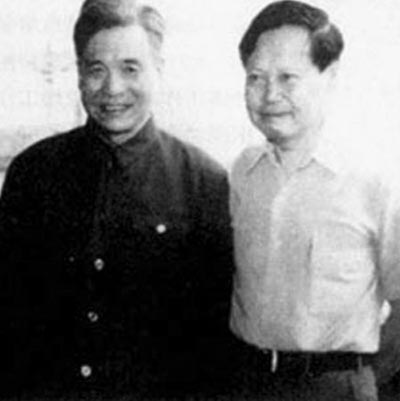

0729邓稼先

（万象历史特约作者：东西望）

31年前的今天，设计原子弹氢弹的两弹元勋邓稼先因辐射致癌病逝

邓稼先（1924年6月25日－1986年7月29日），安徽怀宁人，理论物理学家，核物理学家。

他出自名门，与杨振宁是打小的朋友。留学美国名校普渡大学，不到两年，拿到博士学位，年仅26岁，人称娃娃博士。仅9天后，就决定回国效力，义无反顾地投入到核武器研究的秘密工作中。

在苏联专家撤出的极度困难下，他领导设计了原子弹和氢弹，获得成功。从第一颗原子弹到第一颗氢弹，美国用了7年零3个月，苏联用6年零3个月，法国是8年零6个月，英国用了4年零7个月，中国只用了2年零8个月。

他生前共参与了32次核试验，亲自去罗布泊指挥试验队达15次。在一次试验中，不慎受辐射影响，患上了直肠癌。病重后的要求是：在国庆节去看天安门。死后13年，1999年，被追授“两弹一星功勋奖章”。他是中国核武器事业最重要的开拓者与奠基人之一，被称为“两弹元勋”。

出自名门的好朋友

1924年6月25日，邓稼先出生于安徽怀宁县的邓家祖屋，也叫铁砚山房的祖居内。家中为书香门第，是乾隆时期著名书法大师邓石如的六世孙。父亲是清华大学、北京大学的哲学系教授，与杨振宁的父亲是多年之交。

邓稼先出生8个月后，随母亲和两个姐姐来到北京。1936年（12岁），考入北平崇德中学读初二。1939年（15岁），读到高一，学校因抗战停办。杨振宁也在崇德中学，高他两个年级。

美国普渡大学的娃娃博士

1940年5月（16岁），邓稼先为避战乱，途径上海、香港、越南，到达昆明。9月，入四川江津国立第九中学，读高三至毕业。1941年，进入由清华大学、北京大学、南开大学三校合并而成的国立西南联合大学物理系。

1945年（21岁），抗战胜利同时大学毕业，回到北京任北京大学物理系助教。1947年（23岁），通过了赴美研究生考试。第二年，进入美国普渡大学研究生院。1950年，由于他学习成绩突出，不足两年便读满学分，并通过博士论文答辩，获得了博士学位！此时他只有26岁，人称“娃娃博士”。

没有家庭的秘密工作

他在获得博士学位后，第9天就决定回国，历任中国科学院近代物理研究所助理研究员、副研究员。期间与何祚庥等人合作，在《物理学报》上发表多篇论文。1956年（32岁），加入中国共产党。

1958年（34岁），中央决定发展原子弹。6月21日，毛泽东在军委扩大会议上说：“搞一点原子弹、氢弹，洲际导弹。我看有十年工夫完全可能。”不久，中国第一个原子反应堆启动成功！邓稼先被邀请参加这项必须严格保密的工作。邓稼先义无反顾地同意，回家对妻子只说自己“要调动工作”，不能再照顾家和孩子，通信也困难。妻子表示支持。从此，邓稼先的名字便在刊物和对外联络中消失。

1958年8月，邓稼先调到新筹建的核武器研究所，任理论部主任，负责领导核武器的理论设计，随后任研究所副所长、所长。10月16日，以聂荣臻为主任的国防科学技术委员会成立。越来越多的仁人志士，投入到这项秘密的工作中来。

第一颗原子弹成功爆炸

1959年6月（35岁），苏联拒绝提供原子弹数学模型和有关技术资料。不久，又单方面终止两国签订的国防新技术协定，撤走全部专家。工作陷入困境，为了记住这个日子，中国第一颗原子弹的工程代号定名为“五九六”。

在中国荒凉的大西北，“五九六”的战士们，硬是把青海、新疆、神秘的古罗布泊建设成中国第一个核武器基地。1962年（38岁），邓稼先和其同事拿出了原子弹理论设计方案，为中国核武器研究奠定了基石。此后，原子弹进入生产、试爆阶段。

1963年9月，邓稼先、于敏率领九院理论部研究原子弹的原班人马，承担中国第一颗氢弹的理论设计任务。1964年10月16日（40岁），中国的第一颗原子弹成功爆炸。

2年零8个月的第一颗氢弹

不久，邓稼先、于敏拿出了氢弹的设计方案。1967年6月17日（43岁），330万吨当量的氢弹试验获得成功。从第一颗原子弹到第一颗氢弹，美国用了7年零3个月，苏联用6年零3个月，法国是8年零6个月，英国用了4年零7个月，中国只用了2年零8个月。

在美国杨振宁曾写信问邓稼先说：“在美国听人说，中国的原子弹是一个美国人帮助研制的。这是真的吗？”邓稼先请示了周恩来后，写信告诉他：“无论是原子弹，还是氢弹，都是中国人自己研制的。”杨振宁看后激动不已。

因辐射得癌症的院士

1971年夏（47岁），杨振宁回中国访问，是美籍知名学者访问新中国的第一人。他开列了在北京要见的名单，第一个人就是邓稼先。正在青海基地遭受文革批斗的邓稼先，在周恩来总理批示下回京，得到解救。但家人仍受到一定冲击。

1972年，任核工业部第九研究院副院长。1979年（55岁），任第九研究院院长。此年，在一次试验中，身体受辐射影响，患上了直肠癌。1980年，当选为中国科学院院士（原称学部委员）。

1982年（58岁），获全国自然科学一等奖。同年，他在大漠深处指挥中国第二代新式核武器试验成功；距第一颗原子弹爆炸，整整20年。邓稼先高兴地写下：“红云冲天照九霄，千钧核力动地摇。二十年来勇攀后，二代轻舟已过桥。”

寻回未爆的核武器弹头.jpg)

想看天安门的两弹元勋

1983年（59岁），他的癌细胞扩散已无法挽救，他在国庆节提出的要求就是去看看天安门。1985年7月30日，他因病住院。1986年7月16日，被授予全国“五一”劳动奖章。13天后，1986年7月29日，邓稼先因癌症晚期大出血去世，享年62岁。

他生前共参与了32次核试验，亲自去罗布泊指挥试验队的就达到15次。邓稼先是中国核武器事业重要的开拓者与奠基人，对中国核科学事业做出了突出贡献。1999年，被追授“两弹一星功勋奖章”，被称为“两弹元勋”。

