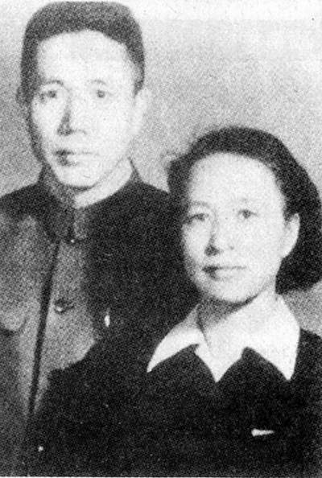
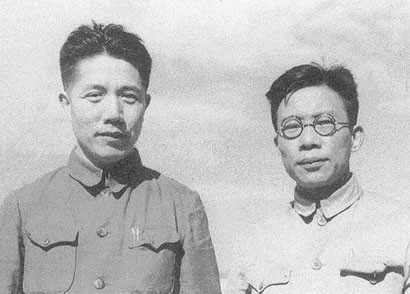

（万象特约作者：一一）

28年前的今天，鲁迅称四条汉子之一、文艺沙皇周扬在北京逝世

28年前的今天，鲁迅称他为四条汉子之一的文艺沙皇周扬逝世

周扬（1907年11月7日－1989年7月31日），湖南益阳人，文艺理论家、翻译家、建国初期文艺界的官方领导。

左联的实际领导人之一。在未告知原配的情况下，与参加左联的女青年结婚，并将怀孕的原配妻子和孩子送回老家。他是“国防文学”的代表人物，被鲁迅称为“四条汉子”之一。

他是建国初期文艺界的官方领导地位，亲自参与发动多次文化批判运动，被称为“文艺沙皇”。文化大革命一开始，便遭监禁，音讯全无，家人将其户口都注销了。监禁多年被释放后，思想大变，深刻反思，并向在历次运动中被攻击过的人士道歉。

与周扬(左三)为齐白石做寿.jpg)

（周扬（右二）给齐白石祝寿）

重婚的左联领导人

1907年11月7日，出生于湖南益阳。1923 年2月（16岁），与同岁的吴淑媛成婚，婚后两人到长沙读书。次年长女出生，四岁时夭折。1927年（20岁），周扬考入上海大夏大学（今华东师范大学），同年加入中国共产党。

1928年，失掉组织联系，留学日本3年。1932年，重新加入中国共产党，并加入中国左翼作家联盟，成为“左联”的实际领导人。1934年（27岁），与参加左联的女青年苏灵扬（20岁）结婚。周扬再娶并未告之怀孕的元配妻子吴淑媛，并将她和两子送回益阳。

（周扬和苏灵扬）

国防文学的四条汉子

1936年（29岁），左联内部出现“国防文学”（周扬、夏衍、郭沫若提出）和“民族革命战争的大众文学”（鲁迅、冯雪峰、胡风提出）的两个口号的争论，周扬与胡风有关于现实主义问题的争论。以周扬为首的“国防文学”代表人物被鲁迅称为“四条汉子”。

1937年秋（30岁），抗日战争爆发后，周扬一家抵达延安。先后任陕甘宁边区教育厅长，文协主任，鲁迅艺术学院院长，延安大学校长。抗日战争胜利后，率延安大学部分人员到晋察冀，任华北联合大学副校长。

等在延安.jpg)

（毛泽东与周扬(左)等在延安）

文艺界的沙皇

解放战争期间，曾任中共晋察冀中央局、华北局宣传部长。1949年（42岁），参与负责筹备全国文学艺术工作者代表大会，并当选为全国文联副主席。之后，一直担任文化宣传方面的领导工作，担任宣传部副部长、文化部副部长等职。

1950年代、1960年代，他是中国大陆文艺界的实权人物，具体领导了中共中央部署的各种文艺运动和思想斗争，发表了许多重要的文艺讲话。在其担任文宣领导期间，策动了多次批判运动，如胡风、丁玲反党集团案等，有“文艺沙皇”之称。

（周扬和宣传部部长陆定一）

文革中音讯全无

1964年6月（57岁），毛泽东对周扬领导下的各个文艺协会，严肃批评：“这些协会和他们掌握的刊物的大多数……十五年来，基本上……不执行党的政策，做官当老爷，不去接近工农兵，不去反映社会主义的革命和建设。最近几年，竟然跌到了修正主义的边缘。”周扬大规模地对文联、作协和文化部负责人进行激烈批判，却未能自保。

1965年（58岁），周扬患了肺癌，在阜外医院动了手术，去天津休养。还在养病期间，“文化大革命”爆发，周扬立即被打倒，逮捕入狱。从此与家人断绝音信，家人都以为他已离开人世，连他在北京的户口也被注销了。

值得尊敬的反思

1975年3月17日（68岁），全国人大决议“对全部在押战争罪犯，实行特赦释放”。毛泽东亲自批示：“周扬一案，似可从宽处理，分配工作，有病的养起来并治病。”1975年，周扬从秦城监狱出来后，住在北京西郊中央组织部招待所里养病。

1978年（71岁），全国文联全委扩大会议开幕式上，满头银发但仍然神采奕奕的周扬来到会场，走上主席台，全场报以暴风雨般的掌声，代表们无比激动。很多人以为周扬已不在人世的代表，惊喜交加，热泪盈眶。

晚年他的思想有巨大转变，对早期种种批判运动都有反思，陆续对胡风等被其批判过的人士道歉。这段时期，周扬先后在《人民日报》、《瞭望》、《解放日报》、《文艺报》等报刊志上发表了上百篇重要文章或讲话。

（1977年12月30日,北京，周扬在文学创作座谈会上讲话）

清除精神污染的运动

1983年3月7日（76岁），在中央党校纪念马克思去世一百周年的学术报告中，周扬做了《关于马克思主义的几个理论问题的探讨》报告中的第四章“论人道主义和异化问题”。并在3月16日的《人民日报》上全文刊发。

该讨论引发党内激烈争议，进而爆发了针对周扬的，持续28天的“清除精神污染”运动。周扬成为批判对象，并被要求做公开检讨。后因胡耀邦出面，才将批判风波平息。

1984年（77岁），周扬前往南方访问，在广州时不慎摔倒，回京住院治疗。1985年，由于脑软化病危，成为植物人。1989年7月31日（82岁），周扬在北京病逝。

（晚年周扬（左））