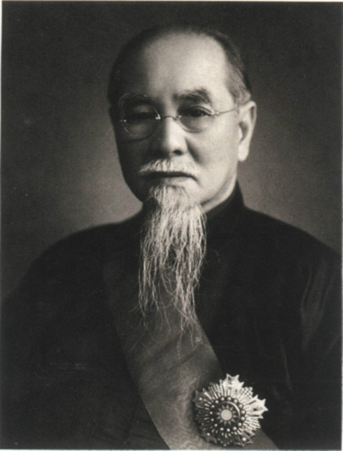

0801林森死亡

（万象历史特约作者：东西望）

74年前的今天，1943年8月1日，23岁起不近女色的国民政府主席林森车祸去世

林森（1868年3月16日－1943年8月1日），福建省闽侯县，近代著名政治家，担任了12年国民政府主席。

他早在1895年台湾割让给日本时，就开始抗日。抗日时期，为国家元首，更是对抗日的问题上从不含糊，严厉通缉汉奸，开除汪精卫党籍，带领全国军民坚持抗战。

他23岁丧妻，之后却终身不娶。他一直不近女色，无妻无妾，也无子无女，连家产也很少。他是辛亥革命的先驱、反袁护法的功臣、中华民国的缔造者之一。却不喜张扬，做事低调，奉行“不争权揽利、不作威作福、不结党营私”的“三不”原则。

1943年8月1日，在重庆与美军车辆相撞，车祸逝世，享年75岁。国民政府为他举行隆重国葬，延安也举行了隆重的公祭大会。《新华日报》发表社论《为元首逝世致哀》，内容为“这是抗战中全国人民最哀痛的事情，是国父逝世以后我国最大的损失……”。

不近女色的抗日先锋

1868年3月16日，林森出生于福建省闽侯县。从小在福州长大，9岁，入美国教会学校，13岁，考入福州鹤龄英华书院。15岁，考入台湾中西学堂电科，随后在台北电报局工作。

1891年（21岁），与邻村郑氏女结婚，两年后，郑氏病故。从此终生未娶，也没有子女。传闻，林森与表妹相恋，表妹父母给表妹私定了婚事，表妹要求跟林森私奔，林森没有同意，结果表妹绝望自杀，林森内心受到强烈谴责，从此不近女色。

1895年（27岁），中日甲午战争清朝战败，台湾被割让给日本。林森愤而参加抗日军，失败后回到母校英华书院任教。1898年（30岁），再次到台湾，加入兴中会，进行抗日活动。第二年，被日本追捕，又逃回家乡。

(台湾介寿公园的林森铜像)

率先响应武昌起义

1902年（34岁），考入上海海关工作。1905年（37岁），加入同盟会。1909年（41岁），调往江西九江海关工作。他在九江设立当阳书报社宣传革命，创办商团，举办军事训练班，联络新军，进行反清活动。

1911年10月23日（43岁），武昌起义后， 他率先在九江响应，成立江西九江军政府，任民政长，成为革命元勋。1913年4月（45岁），袁世凯夺取了革命成果，林森到北京当选为首届国会参议院议长。

（辛亥革命时的林森）

孙中山忠实的追随者

1913年11月（45岁），二次革命爆发，林森离京南下，失败后，流亡日本，加入中华革命党。1914年，离日本赴美洲，为美洲总支部负责人，负责筹饷和党务活动。在此期间，因误以为民国三大名记者之一的黄远生在为袁世凯卖命，策划谋杀了黄远生，轰动一时。

1916年（48岁），袁世凯死后，回国。1917年，随孙中山从上海南下广州，任护法军政府外交部长。1921年（53岁），任广州国会非常会议议长。1922年，任福建省省长。1923年，任大本营建设部部长。1924年，国民党第一次全国代表大会，被选为中央执行委员，任命为国民党海外部部长。

派去修中山陵的西山会议

1925年3月（57岁），孙中山逝世。11月，在北京西山祭奠孙中山之际，召开国民党四中全会，即“西山会议”。会议宣布取消国共合作。1926年元旦（58岁），国民党“二中”全会召开，通过《弹劾西山会议决议案》，林森受警告处分，派去南京修建中山陵。

1927年（59岁），宁汉合流后，建立统一的南京国民政府，林森被重新起用，任国民政府常务委员、立法院副院长。

（西山会议现场）

12年的国民政府主席

1931年（63岁），九一八事变后，蒋介石遭到弹劾，被迫下野。林森被推为国民政府代理主席，从此成为中国的国家元首，长达12年。1932年元旦，就职。此后国民政府虽多次改组，林森都一直担任国民政府主席。

1932年，“一·二八”淞沪抗战后，主持召开国难会议，拒绝承认“满洲国”。1936年12月（68岁），“西安事变”时，认为“张学良部队是爱国的”，促成西安事变和平解决。后来以主席名义，连给张学良下赦免令、复权令，但蒋介石拒不执行。

毫不含糊的坚持抗战

1937年（69岁），卢沟桥事变，对日全面战争爆发，林森号召“全民奋起，全力抵抗”。10月，国民政府西迁重庆后，不断发表严正声明，明令通缉北平、南京伪政权的汉奸。

1938年3月（70岁），主持国民党临时全国代表大会，通过《抗战救国纲领》，手书“抗战必胜”激励全国军民。12月，汪精卫叛逃，林森力主开除党籍，并明令通缉。1941年12月9日，以国家元首名义，向德、意、日三国宣战。

出乎意料的车祸身亡

1943年8月1日，在重庆与美军车辆相撞，车祸逝世，享年75岁。国民政府为他举行隆重国葬，葬于重庆市歌乐山南麓“林园”内。

8月15日下午2时，延安也举行了隆重的公祭大会。《新华日报》发表社论《为元首逝世致哀》，内容为“这是抗战中全国人民最哀痛的事情，是国父逝世以后我国最大的损失……”。

在台湾，以林森为名的道路和建筑，到处都能见到，就如同中山路与中正路。1944年，国民政府将闽侯县改名为林森县。1950年4月，复名为闽侯县。

（重庆大学校门的林森题字）

