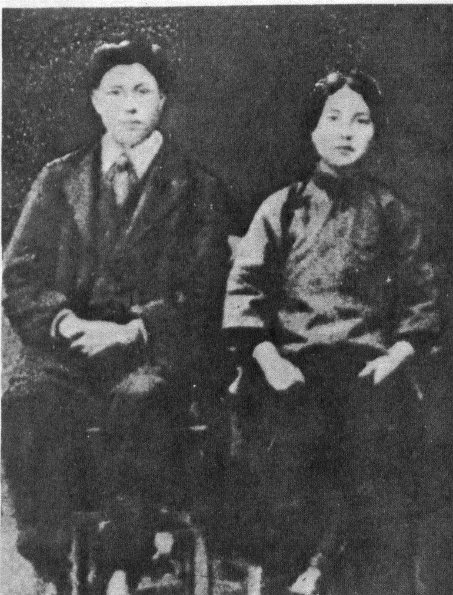
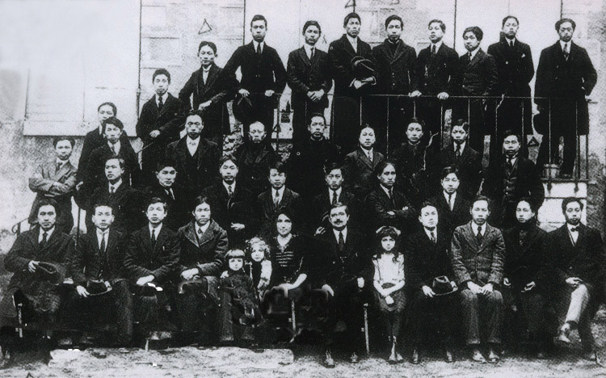

86年前的今天，第一个正式提出建立中国共产党、毛泽东的革命领路人蔡和森牺牲

万象特约作者：一一

蔡和森（1895年3月30日－1931年8月4日），字润寰，又名和仙，湖南省双峰县（原属湘乡县）永丰镇人。中国共产党早期的著名领导人之一，中共领导人毛泽东青年时代的学友和战友。

蔡和森是毛泽东革命的领路人，1918年，蔡和森和毛泽东等人以“革新学术，砥砺品行，改良人心风俗”为宗旨成立新民学会，这是五四运动前成立最早的革命团体之一。又创办《湘江评论》，在湖南进步青年中产生很大影响。为求得“对外发展”，他北上联络赴法国勤工俭学事宜，毛泽东因故没能去成，但是到上海为蔡和森送行。

蔡和森是第一个提出“正式成立一个中国共产党”的人。在法国留学期间，他多次致信毛泽东，还致函陈独秀。在这些信函中，他第一次提出“明目张胆正式成立一个中国共产党”的主张，毛泽东复信，称赞他的主张“见地极当，我没有一个字不赞同”。蔡和森系统阐述了有关建党的理论、路线、方针和组织原则。他还与向警予、周恩来、赵世炎、邓小平、李富春等一起筹建中国共产党旅欧的早期组织，是党的创始人之一。

和毛泽东同学
1895年3月30日出生于上海。1913年进入湖南省立第一师范学校和湖南高等师范学校读书，曾受业于杨昌济，与毛泽东同学，并且从事学生运动。1918年4月与毛泽东等组织新民学会。创办《湘江评论》，参加五四运动。后又参与不少的劳工运动。
赴法留学
1919年春偕母亲、妹妹蔡畅与女友向警予前往法国，毛泽东到上海为蔡送行。在巴黎参与组织“勤工俭学励进会”，他“猛看猛译”马克思主义著作，认真研究俄国十月革命的经验，很快接受共产主义，成为坚定的马克思主义者。他在法国勤学，拒绝俭工，并随身携带字典致力于翻译外文著作。1920年下半年至1921年初，他先后给毛泽东等写信，明确提出：只有社会主义能够拯救中国与改造世界，要发展中国革命，先要组织党——共产党。共产党是无产阶级革命运动的“发动者、宣传者、先锋队、作战部”。他第一次旗帜鲜明地称这个党为“中国共产党”。毛泽东对他的主张“深切赞同”。同时，蔡和森对中国共产党建党的理论、方针及组织原则也作了较系统的阐述，为党的创建和早期党的建设作出重要贡献。

回国
1921年下半年因组织勤工俭学学生闹学潮，被法国政府拘捕，旋即并被武装驱逐出境。与妻向警予返国，加入中国共产党。1922年起，担任中央机关报《向导》周报的主编，撰写论著，宣传党的方针等。

中共代表
1925年曾参加领导五卅运动，同年去苏联，后出任中共驻共产国际代表团代表；1927年回国，任中央宣传部长；1928年以疾赴莫斯科治疗，1929年担任中共驻共产国际代表。1931年回到上海，后前往香港支援中共广东省委工作。
担任过中共第二、三、四届中央执行委员，第五、六届中央政治局委员、常委等要职。

遇害
1931年6月10日，蔡和森和赵普生，方世林，李庆全，林剑彩，李丙五人一道于香港骆克道464号3楼被香港政府警探擒获，经广东与香港政府交涉，于6月12日押解至广东。经审讯后于1931年8月4日被广东军阀陈济棠枪决。
有一种说法蔡和森是被到香港的顾顺章认出来的。

身后

2009年9月10日，在中央宣传部、中央组织部、中央统战部、中央文献研究室、中央党史研究室、民政部、人力资源社会保障部、全国总工会、共青团中央、全国妇联、解放军总政治部等11个部门联合组织的“100位为新中国成立作出突出贡献的英雄模范人物和100位新中国成立以来感动中国人物”评选活动中，蔡和森被评为“100位为新中国成立作出突出贡献的英雄模范人物”。
家庭
蔡和森的前妻向警予、后妻李一纯（原为李立三之妻）与妹妹蔡畅都参与过中国共产党，其中蔡畅为李富春之妻。
蔡和森共有4个子女。向警予生蔡妮、蔡博，李一纯生蔡转、蔡林。蔡畅独生女李特特。和很多中共高级干部和烈士的子弟一样，他们都先后在莫尼诺国际儿童院生活，接受苏联教育后回国。

