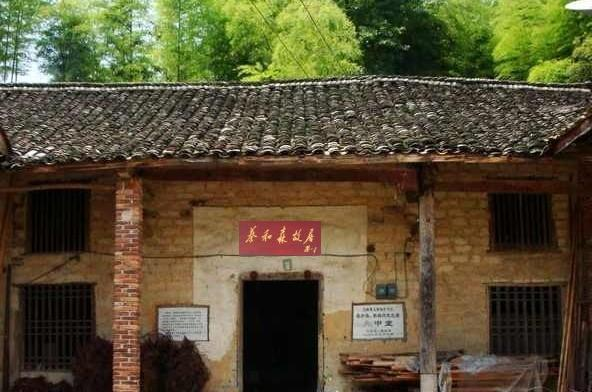

86年前的今天，第一个正式提出建立中国共产党的蔡和森牺牲

万象特约作者：一一

蔡和森（1895年3月30日－1931年8月4日），湖南省双峰县人，中国共产党早期的著名领导人之一，毛泽东青年时代的学友和战友。

蔡和森和毛泽东等人以“革新学术，砥砺品行，改良人心风俗”为宗旨成立新民学会，这是五四运动前成立最早的革命团体之一。又创办《湘江评论》，在湖南进步青年中产生很大影响。

蔡和森是第一个提出“正式成立一个中国共产党”的人，也是第一个提出“打倒帝国主义”的人。在法国留学期间，他多次致信毛泽东，还致函陈独秀。在这些信函中，他第一次提出“正式成立一个中国共产党”的主张，毛泽东复信，称赞他的主张“见地极当，我没有一个字不赞同”。蔡和森系统阐述了有关建党的理论、路线、方针和组织原则。他还与向警予、周恩来、赵世炎、邓小平、李富春等一起筹建中国共产党旅欧的早期组织，是党的创始人之一。

蔡和森是一个满怀革命激情和浪漫情怀的人，他的前妻向警予牺牲后，蔡和森写道：“伟大的警予，英勇的警予，你没有死，你永远没有死。你不是和森个人的爱人，你是中国无产阶级永远的爱人！”

和毛泽东同学

1895年3月30日，蔡和森出生在上海，父亲是江南机械制造总局的一个小官员。4岁，随母亲回到家乡湖南省双峰县永丰镇。13岁，到辣酱店当学徒。三年学徒期满后，蔡和森立志读书，进入了永丰国民小学读三年级，跳级考入了双峰高等小学。

1913年（18岁），进入湖南省立第一师范学校和湖南高等师范学校读书，曾受业于杨昌济，与毛泽东同学，并且从事学生运动。1918年4月（23岁），与毛泽东等组织新民学会，创办《湘江评论》，参加五四运动，后又参与不少的劳工运动。

（长沙橘子洲头蔡和森和毛泽东雕像）

第一次提出中国共产党名号

1919年春，他和母亲、妹妹蔡畅、女友向警予前往法国，毛泽东到上海为他送行。他在巴黎参与组织“勤工俭学励进会”，他发愤学习马克思主义著作，认真研究俄国十月革命的经验，很快接受共产主义，成为坚定的马克思主义者。

1920年下半年至1921年初，他先后给毛泽东等写信，明确提出：只有社会主义能够拯救中国与改造世界，要发展中国革命，先要组织党——共产党。共产党是无产阶级革命运动的“发动者、宣传者、先锋队、作战部”。他第一次旗帜鲜明地称这个党为“中国共产党”。毛泽东对他的主张“深切赞同”。同时，蔡和森对中国共产党建党的理论、方针及组织原则也作了较系统的阐述，为党的创建和早期党的建设作出重要贡献。

娶妻向警予

1921年下半年，因组织勤工俭学学生闹学潮，被法国政府拘捕，旋即并被武装驱逐出境。与妻子向警予回国，加入中国共产党。1922年起，担任中央机关报《向导》周报的主编，笔名振宇，即“警予”的谐音。

1925年，蔡和森因体弱多病，去北京治疗。替任中央宣传部部长的彭述之对向警予关照有加，两人陷入情网。年底，蔡和森和向警予一同去莫斯科。在莫斯科期间，两人婚姻破裂。

蔡和森是一个满怀革命激情和浪漫情怀的人，1928年，向警予牺牲后，蔡和森写道：“伟大的警予，英勇的警予，你没有死，你永远没有死。你不是和森个人的爱人，你是中国无产阶级永远的爱人！”

（1920年蔡和森向警予于法国）

娶妻李一纯

在莫斯科，同行的还有李立三和他的妻子李一纯，经常对他照顾帮助。不久，李一纯被蔡和森吸引，产生了恋情。后来就与蔡和森结合，与李立三分手。蔡和森的前妻向警予、后妻李一纯（原为李立三之妻）与妹妹蔡畅都参与过中国共产党，其中蔡畅为李富春之妻。

1925年，出任中共驻共产国际代表团代表。1927年，回国，任中央宣传部长。1928年，因生病赴莫斯科治疗。1929年，担任中共驻共产国际代表。1931年，回到上海，后前往香港支援中共广东省委工作。担任过中共第二、三、四届中央执行委员，第五、六届中央政治局委员、常委等要职。

遇害

1931年6月10日，蔡和森等人在香港骆克道464号3楼被香港政府警探擒获，经广东与香港政府交涉，于6月12日押解至广东。1931年8月4日，被广东军阀陈济棠枪决。

2009年，蔡和森被评为“100位为新中国成立作出突出贡献的英雄模范人物”。

（蔡和森纪念馆）