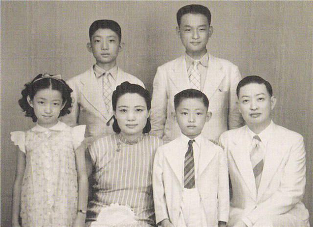

0808梅兰芳

56年前的今天，娶18岁老生引发血案的四大名旦之首梅兰芳逝世

梅兰芳（1894年10月22日－1961年8月8日），祖籍江苏泰州，出生于北京的京剧世家，著名的京剧艺术家、四大名旦之首。

他曾多次到日本、美国、苏联等地演出，轰动一时。他曾同时娶有三房妻子，都来自京剧界。尤其，与女老生孟小冬的一段颠鸾倒凤的恋情，轰动一时，甚至引发一场血案。

梅兰芳在50余年的舞台生活中，发展和提高了京剧旦角的演唱和表演艺术，形成一个具有独特风格的艺术流派，称为“梅派”。其代表作有《贵妃醉酒》《天女散花》《宇宙锋》《打渔杀家》等，先后培养学生100多人。

（贵妃醉酒剧照）

轰动上海的京剧世家

1894年10月22日，梅兰芳出生于北京前门外李铁拐斜街梅家老宅，祖父是京城著名青衣花旦演员，父亲早亡，由伯父抚养。8岁开始学戏，10岁登台。

1907年（13岁），搭“喜连成班”演出。1910年（16岁），与出身于京剧世家的王明华结婚。1913年（19岁），赴上海演出《穆柯寨》等戏，轰动上海，一举成名。

再访日本和再婚

1919年（25岁），梅兰芳访问日本演出，引起轰动，有人评论“有此双手，其余女人的手尽可剁去”。1921年（27岁），因子女意外病亡，妻子又已作绝育，为延续自己和伯父两家香火，梅兰芳以兼祧的名义娶旦角演员福芝芳为妻。

1924年（30岁），因日本发生关东大地震，他为了赈灾义演再次赴日演出，期间突患急性肠胃炎危及生命，而被日本医生医治。这位医生并未收费，仅要求他给予一副景泰蓝袖扣。

（梅兰芳第三次访日留影）

颠鸾倒凤的一场血案

当时，梅兰芳以男扮女，有“伶王”之称，而最有名的老生孟小冬，却是以女扮男，嗓音苍劲醇厚，中气充沛，满宫满调，毫无雌音。1925年，两人合作演出了《四郎探母》、《游龙戏凤》，男女角色颠鸾倒凤，精彩非凡。两人陷入热恋。

1926年（32岁），一位对孟小冬心仪已久的年轻人，持手枪到梅家寻衅，说抢了他的未婚妻，勒索10万元。梅兰芳恰不在家，报警后警察赶到，年轻人枪杀梅兰芳的一位好友后，被击毙身亡。梅家发生如此血案，社会舆论沸沸扬扬，种种绯闻，扑面而来。

1927年（33岁），梅兰芳被评为京剧“四大名旦”之首，并迎娶孟小冬，成为轰动一时的新闻。

（著名女老生孟小冬）

不当汉奸的蓄须明志

1930年（36岁），他前往美国，并在西雅图、芝加哥、华盛顿、纽约、旧金山、洛杉矶、圣地亚哥、檀香山等地演出72天，引起轰动。1931年，与孟小冬解除婚姻关系。后来，孟小冬在1950年嫁给青帮大佬杜月笙。

1932年（38岁），梅兰芳迁居上海。1938年（44岁），因抗日战争爆发，梅兰芳率领梅剧团，移居香港。1941年（47岁），因经济原因，回到上海，日伪汉奸力邀他演出，但他不为所动，还刻意蓄须明志，绝不演出。

1945年（51岁），日本投降后，梅兰芳这才重出舞台，盛极一时。1948年（54岁），演出中国第一部彩色电影《生死恨》。

新中国的穆桂英挂帅

1949年10月1日（55岁），参加天安门新中国成立典礼。1951年7月，迁回北京，定居护国寺街1号（现梅兰芳纪念馆）。1954年9月，梅兰芳当选第一届全国人民代表。1955年，任中国京剧院院长。

1956年（62岁），应日本邀请，组建了阵容强大的访日京剧代表团，梅兰芳任团长。这也是梅兰芳第三次访问日本。先后在东京、九州、大阪、京都、名古屋等地演出，再次引发轰动。同时，他找到当年的医生，履行30多年前袖扣的承诺。

1961年5月31日，在中国科学院为科学家们演出《穆桂英挂帅》，这是梅兰芳在舞台生涯中的最后一次演出。1961年8月8日凌晨5时，梅兰芳病逝于北京，享年67岁。

（北京梅兰芳大剧院的梅兰芳雕像）

京剧界的三段婚姻

1910年（16岁），梅兰芳与出身于京剧世家的王明华（18岁）结婚。婚后王明华生了一双儿女后做了节育手术，后来儿女不幸夭折。1929年，病逝天津。

1921年（27岁），梅兰芳以兼祧的名义娶旦角演员福芝芳（16岁）为妻，即民间习俗上的“平妻”。福芝芳和梅兰芳共生有九个小孩，但只有四个长大成人，分别是梅葆琛、梅葆珍、梅葆玥、梅葆玖。1980年，福芝芳去世。

1925年（31岁），梅兰芳与京剧名老生孟小冬（18岁）相恋。1927年（33岁），再度以兼祧的名义娶孟小冬为“平妻”。此段婚姻未获得外界认可，特别是福芝芳的承认。1931年，两人正式分手。1933年9月，孟小冬在天津《大公报》刊登启事，公开宣布与梅兰芳脱离家庭关系。1950年，孟小冬嫁给青帮大佬杜月笙。1977年，在台湾去世。

（1940年代的梅兰芳全家福照片，前排自左至右为梅葆玥、福芝芳、梅葆玖、梅兰芳，后排左起为梅绍武、梅葆琛）

四大名旦之首

梅兰芳与程砚秋、尚小云、荀慧生并称“四大名旦”，梅兰芳为领衔人。他是中国京剧旦角的最重要代表，风靡一代，他男扮女装的技巧出神入化，梅腔悠然而有余韵，有着古典女子优美的情致。

梅兰芳是中国京剧史上，承上启下最具有代表性的人物。他在五十余年的舞台生涯中，塑造了众多的优美的妇女艺术形象。其幼子梅葆玖是当今梅派的著名传人。

（梅兰芳、程砚秋、尚小云、荀慧生四大名旦合影）