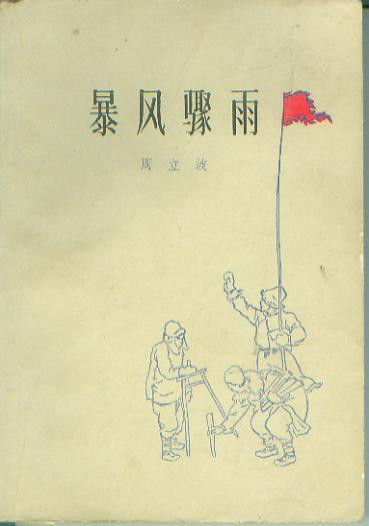
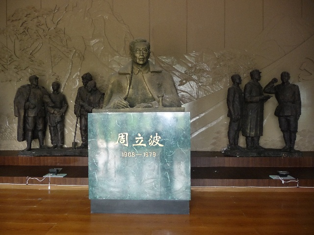
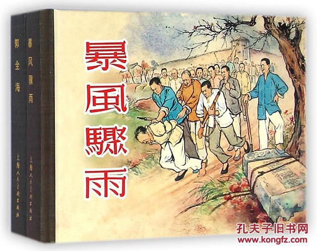

（万象特约作者：一一）

109年前的今天，获斯大林文学奖，暴风骤雨下自由的周立波出生

扎根农村，抗日前线

109年前的今天，与赵树理并称“南周北赵”、曾经获得斯大林文学奖的周立波出生

周立波（1908~1979），湖南益阳人，中国现代著名作家。

“立波”是笔名，取自“自由”的英文“liberty”。因参加工人罢工被捕入狱，后成为左联的一员。抗战期间，作为战地记者走遍华北前线。参加延安文艺座谈会，深受影响。

作为编剧，参与苏联和中国联合摄制的大型彩色纪录片《解放了的中国》，并因此获得斯大林文学奖。第二年，以描写土地改革的代表作《暴风骤雨》再获斯大林文学奖。用10年时间，写成描写农村走向集体化的续作《山乡巨变》。

他的小说清新秀丽，别具一格，擅长描写农村中的生活，乡土气息浓厚，为读者所喜爱，与同时期的著名乡土作家赵树理享有“南周北赵”之美誉。

用自由命名的立波

1908年8月9日，周立波出生于湖南省益阳县（今益阳市高新区）邓石桥清溪村的一个私塾教师家庭，他原名周绍仪，“立波”是笔名，取自“自由”的英文“liberty”。

1924年秋（16岁），考入长沙省立第一中学。1927年，第一次国内革命结束，局势混乱，因而辍学回县，在高小任教。1928年春（20岁），随同乡周扬到上海，后考入江湾劳动大学经济系学习。1930年春，因散发传单，被校方开除。不久返乡，开始从事文学写作和翻译。

坐过牢的左翼作家

1931年，“九·一八事变”后，周立波到上海神州国光社当校对员。1932年，因参加工人罢工被捕入狱。1934年7月（26岁），被保释出狱，后在上海参加中国左翼作家联盟（周扬为左联实际领导人）。

1935年1月，加入中国共产党，负责编辑左联秘密会刊，任中共左联党团成员，并任《时事新报》副刊《每周文学》编辑。他积极从事左翼文艺运动，翻译了《被开垦的处女地》《秘密的中国》，译著近百万字。

到抗日前线的战地记者

1937年（29岁），抗日战争爆发后，赴华北抗日前线，任战地记者，写了不少报告文学与散文集。1938年冬，到湖南沅陵参与地下党领导工作，并参加编辑《抗战日报》。1939年5月，被周恩来调到桂林，任《救亡日报》编辑。12月，到达延安，在鲁迅艺术文学院任教。

1942年（34岁），参加延安文艺座谈会，毛泽东发表的《在延安文艺座谈会上的讲话》，对周立波影响巨大。1944年，任《解放日报》社副刊部副部长，同年冬任八路军南下第一支队司令部秘书，随军南征。1945年，日本侵略军投降后，任中原军区《七七日报》《中原日报》社副社长。

土地改革的《暴风骤雨》

1946年（38岁），被调往东北，参加土地改革运动，并编辑《松江农民报》。1947年，开始创作其最重要的作品《暴风骤雨》。1948年，调任东北文协《文学战线》主编。1949年7月，被选为全国文联和全国文协委员。

1950年（42岁），作为编剧，参与苏联和中国联合摄制的大型彩色纪录片《解放了的中国》，并因此获得斯大林文学奖。

1951年（43岁），他以长篇小说《暴风骤雨》，再获斯大林文学奖。

《暴风骤雨》是周立波的代表作，以东北松花江畔一个村子为背景，描绘出土地改革这场波澜壮阔的革命斗争的画卷，刻画了一系列生动的农民形象，成为中国最早出现的以土改为题材的优秀作品之一，曾风靡全国。

集体化道路的《山乡巨变》

1955年至1965年，他回家乡创作了长篇小说《山乡巨变》和20多篇乡土短篇小说。他开创了乡土文学的新主题、新风格，与同时期的著名乡土作家赵树理享有“南周北赵”之美誉。

《山乡巨变》是《暴风骤雨》的续篇。描写了湖南省一个农业生产合作社从初级社到高级社的发展过程，艺术地展现了中国农民走上集体化道路时的精神风貌，剖析了农民在历史巨变中的思想感情、心理状态和理想追求。

1979年9月25日，周立波同志因病在北京逝世，享年71岁。

.jpg)