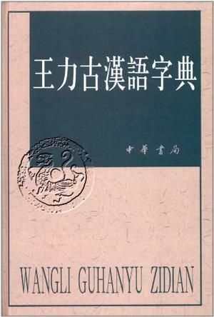
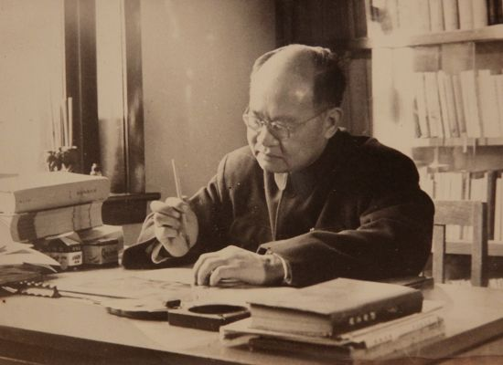
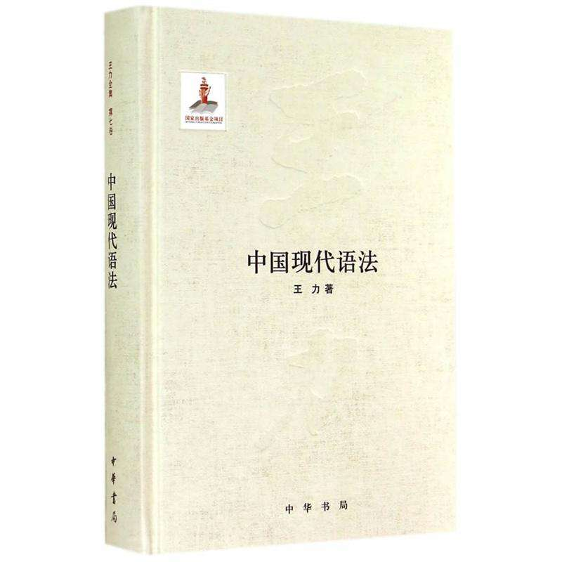

31年前的今天，主张汉字拉丁化的语言学家王力逝世于北京

（万象特约作者：一一）

117年前的今天，1900年8月10日，117年前的今天，主张汉字拉丁化，现代语言学奠基人王力出生

王力（1900年8月10日－1986年5月3日），广西博白人，中国当代杰出的语言学家，中国现代语言学的奠基人之一。

王力在语言学方面的专著有40多种，论文近 200篇，共约1000万余字，内容几乎涉及语言学各个领域，有许多具有开创性。不少著作列为研究生必读之书和汉语基础课教科书。

他主张汉字拉丁化，在其主要著作中多次推崇，要求简化汉字并且推行汉语拼音。以求将来逐渐达到全民汉字拼音化，便利“国际友人学习汉语”，预言“中国进入社会主义社会的时代，也正是汉语在全世界传播的时代”。

清华国学院的高材生

1900年8月10日，王力出生于广西博白的一个书香门第，父亲为晚清秀才。11岁，考入博白高小，14岁毕业。

1926年（26岁），自学考入清华国学研究院，师从梁启超、陈寅恪、王国维、赵元任四位学术大师。赵元任先生非常欣赏王力，与之深交。1927年（27岁），自费留学法国攻读语言学。1931年（31岁），获巴黎大学文学博士学位。

1932年（32岁）回国后，先后在清华大学、燕京大学、广西大学、昆明西南联合大学、岭南大学、中山大学任教授、文学院院长、语言学系主任等。

扛起中国语言学研究重担

1935年，王力呼吁制定一部中文标准文法，然而民国政府无心响应。1936年，王力写了《中国文法学初探》，倡言抛弃模仿，运用西方语言学理论工具，从汉语的现实中寻求语言规律。此文几乎是他扛起中国语言学研究重担的宣言。

在抗战流亡的艰苦岁月中，王力的研究已经在语法、音韵、词汇、诗律、方言各领域全面铺开，取得不少开创性成果。

支持汉字拉丁化的语言大师

1954年（54岁），调任北京大学教授，直至去世。曾兼任汉语教研室主任，中文系副主任，中国文字改革委员会副主任。王力和胡适、朱光潜、周培源、冯友兰等人合列“北大名家名师”，是北大人所最为自豪的学者之一。1956年（56岁），被聘为中国科学院哲学社会科学部委员。

王力一直从事语言科学的教学和研究工作，为发展中国语言科学、培养语言学专门人才作出了重要的贡献。他在语言学方面的专著有40多种，论文近200篇，共约1000万余字，内容几乎涉及语言学各个领域，有许多且具有开创性。其代表作有《中国音韵学》、《中国现代语法》等等。

他主张汉字拉丁化，在其主要著作中多次推崇，要求简化汉字并且推行汉语拼音，以求将来逐渐达到全民汉字拼音化，便利“国际友人学习汉语”，并预言“中国进入社会主义社会的时代，也正是汉语在全世界传播的时代”。

万人大演讲的公开课

1966年（66岁），“文化大革命”开始，王力的研究和教学戛然而止，曾被当作右派与“资产阶级学术权威”批判。

1984年（84岁），中山大学邀请他做题为“现代汉语的语音系统”的演讲。5000人座位的纪念堂，竟来了12000人，把纪念堂四周的草坪都坐满了。84岁的王力，足足讲了一个钟头。这是他最后的一次公开课。”

1986年5月3日（86岁），王力逝世于北京。

中国语言学的奠基人

王力综合古代语言研究成果和西欧语音学，为建立中国现代语言学的科学体系做出了巨大的贡献。他以西方诗律学为参照系、用技术定量分析手段，为中国现代汉语诗歌的写作提供了基本范式。

王力先生一生从事汉语教学与研究工作，对汉语语音、语法、训诂、文字、词汇的历史和现状，进行了深入广泛的研究，成就巨大。著作中中不少被译为美、英、法、日、俄等多国文字，列为研究生必读之书和汉语基础课教科书。

王力成为继王国维、赵元任之后，和罗常培同期著名汉语语言学家。

（王力中学）