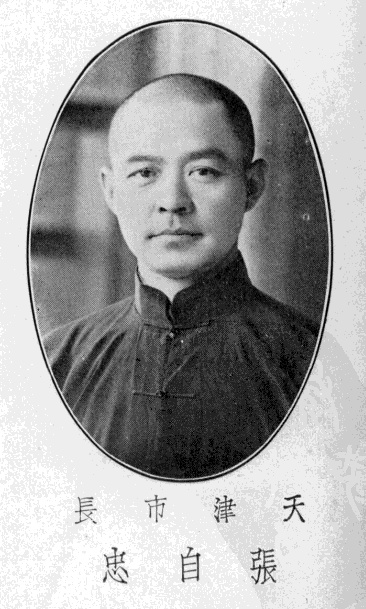
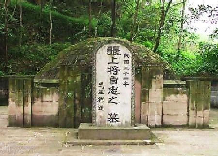

126年前的今天，抗日战争中国阵亡的最高将领、北京二环内有一条路以他命名的张自忠出生

万象特约作者：一一

张自忠（1891年8月11日－1940年5月16日），字荩臣，后改荩忱，中华民国陆军二级上将，原为西北军系将领，中原大战后接受中央政府改编，任国民革命军第二十九军第三十八师师长，曾参与喜峰口战斗。
1937年七七事变爆发后，曾代理冀察政务委员会委员长与北平市市长。后升任国民革命军第五十九军军长，后升第卅三集团军总司令兼第五战区右翼兵团司令。曾参与临沂保卫战、徐州会战、武汉会战、随枣会战与枣宜会战等。在枣宜会战中因伤以身殉国，妻李敏慧闻耗绝食而死。
张自忠为第二次世界大战中国阵亡的最高将领之一，北京二环内有一条路以他命名。

从奉军转投西北军

1891年8月11日，张自忠生于山东省临清县唐园村。张家为临清望族，其父张树桂（字冬荣）曾任江苏省赣榆县知县，1905年卒于任内。张自忠6岁入私塾，后随父至江苏，由父亲教导。父亲过世后随母扶柩返回临清，1908年进入临清高等小学堂就读，1910年毕业后进入天津市北洋法政学堂，1911年加入中国同盟会，并转入济南法政专门学校。
1914年，前往奉天（今沈阳）。张投效陆军第三师随营学校。后加入军籍，投效第二十师第三十九旅第八十七团（团长车震），驻屯在新民屯。
1916年，护国战争爆发，车震已升为旅长，率第三十九旅至湖南长沙以镇压护国军。当时湖南将军汤芗铭将第三十九旅扩编为湖南陆军第一师，师长车震，张自忠被委任为军官，任师部幕僚。但该师旋即被湖南护国军第一师击败，所部瓦解。张自忠遂改投冯玉祥第十六混成旅，历任排长、连长、营长等职。

中原大战击败张治中
1924年，张自忠任团长，参与第二次直奉战争。
1926年，任第十五混成旅旅长，入山西与晋军作战。因战事不利，恐为其直属长官、第六师师长石友三所害，遂率部入晋（但并未加入晋军）。
直到1927年4月，冯玉祥加入国民革命军北伐序列，改编西北军为国民革命军第二集团军后，张自忠方从山西回归冯玉祥麾下，任集团军总部副官处长（总务行政庶务）。1927年底，任第二十八师师长兼第二集团军军官学校校长。1928年北伐结束后，任第二十五师师长，该师曾在1929年的全国军风纪考察中列为全国第一。
1930年中原大战爆发，张自忠任第六师师长，先后击败国民革命军第四十八师（师长徐源泉）与教导第二师（师长张治中）。西北军失败后率第六师残部入晋追随冯玉祥。
1931年1月接受张学良节制与改编，西北军残部编为东北边防军第三军（后改番号为第二十九军，军长宋哲元），张自忠任第三十八师师长。率部参加喜峰口长城抗战。

一度被认为是亲日派
在率部参加长城战役后，第二十九军返回山西，后将察哈尔省的抗日同盟军缴械，全军移驻察哈尔省，张自忠仍任第二十九军第三十八师师长，驻宣化。1935年6月，由于何梅协定，国民政府中央军退出河北省，于是日军默许下，第二十九军进驻平津。12月成立冀察政务委员会，由宋哲元任委员长，张自忠任委员，兼察哈尔省省主席与第三十八师师长。
1936年6月改任天津市长，第38师亦移防天津。1937年3月，日军突邀宋哲元访日。从4月23日至5月29日，张自忠访问了东京、大阪、神户、奈良、名古屋等地，日方宣传为“代表团在日期间受到各方面热烈的招待，满载而归，每个人都满脸喜气，亲日气氛的造成已收到相当效果。”虽然张自忠发表声明称仅考察日本工业，但国内舆论并不相信，自始张自忠被视为亲日派，甚至是汉奸。

1937年的七七事变爆发后，张自忠与宋哲元均认为日本还不至于对中国发动全面战争，但7月17日军事委员会委员长蒋中正在庐山发表谈话，已拒绝对日方做进一步的让步。7月25日，冀察政务委员会中止对日军协商，同日日军发动攻击，28日第二十九军军部被日军攻破，佟麟阁副军长与赵登禹师长殉国。于是宋哲元决定将第二十九军撤到保定，将冀察政务委员会与北平市长都交由张自忠代理，以掩护第二十九军撤退。但这么一来，张自忠就成为众矢之的，全国各大报刊纷纷发表痛斥张自忠的文章，报界一度凡提及必称“张逆自忠”。待第二十九军撤出平津之后，张自忠从8月1日试图逃离北平，但一直到9月3日才成功抵达天津，10月10日才在秦德纯与张樾的陪同下，在南京市与蒋中正见面，之后张自忠以军政部中将部附的身份留在南京。中央政府于12月迁至武汉后，才发表张自忠为升任第五十九军军长，编入第一战区战斗序列。

战死沙场
1938年1月，张自忠率领第五十九军在临沂一战阻隔了日军第5师团与第10师团，使之无法合流进攻徐州。后第10师团在台儿庄被重创，是为台儿庄大捷。张自忠亦因功升第二十七军团军团长兼第五十九军军长，辖第五十九军与第九十二军。
1939年3月，由于在京山一役击退日军，国民政府加张自忠为二级上将衔，并颁四等宝鼎勋章。
由于日军冬季攻势损失严重，为消除第五战区威胁，遂调集6个师团，装甲与航空大队，向枣阳与宜昌一线进攻，拉开枣宜会战序幕。5月中旬，张率部渡过襄水，阻截由襄花路向枣阳集中之日军主力。5月16日，张自忠将军亲率第七十四师与日军在方家集激战。张自忠将军部随身官兵仅2,000人，而日军步骑在4,000人以上，国军伤亡殆尽，张将军在枪林弹雨中指挥，肩部已中弹，仍誓不退后，未几张将军再中一弹，拟拔剑自刎，为属下阻止，张终声竭而殉国。 日军发现张自忠将军遗体，在陈家集征集一口棺木盛殓，并竖木牌，墓碑上书：“支那大将张自忠之墓”；第三十八师师长黄维纲获报后率便衣队将遗体夺回，5月18日送回集团军司令部，以上将礼服重殓，经宜昌转送回重庆。张将军殉国后，国府明令褒扬特予国葬。追赠陆军二级上将。5月28日，灵柩抵达重庆，蒋中正率军事委员会高级将领与国民政府五院院长亲临致祭，蒋还抚棺痛哭。1940年7月7日，国民政府明令褒扬张自忠，立张自忠墓位于重庆市梅花山麓。

荣誉和纪念
1942年12月31日，国民政府明令张自忠入祀全国忠烈祠。1944年8月，国府将宜城县改为自忠县（今宜城市），以志其忠，张自忠殉国年五十，遗有二子一女，妻李氏，因病在上海疗养，闻耗绝食而死。张自忠与夫人李敏慧在1908年结婚。育有二子张廉珍、张廉静和一女张廉云。张夫人后于上海因癌症过世，国民政府特颁“相成忠杰”匾额以嘉节行。

1940年8月15日，中共在延安为张自忠将军举行悼念大会。
1946年，张自忠获国府颁荣字第一号荣哀状。1947年3月13日，北平市政府颁令，将铁狮子胡同改为张自忠路，“文革”中张自忠路一度改称张思德路，后又改称工农兵东大街。1984年复称原称。天津市和平区海河西岸有张自忠路，上海和武汉亦有张自忠路以示纪念。5月10日，国民政府明令国葬国民政府故委员蔡元培、故陆军上将张自忠。
1951年，蒋中正至阿里山视察，发现该区有一遗留日本式地名“儿玉”，为纪念张自忠，下令更名自忠。台湾桃园市中坜区有自忠街、自忠二街和自忠三街，以纪念张自忠将军。
1982年4月16日，中华人民共和国民政部追认张自忠为革命烈士。2010年5月16日，重庆市举行仪式纪念张自忠将军殉国70周年。

