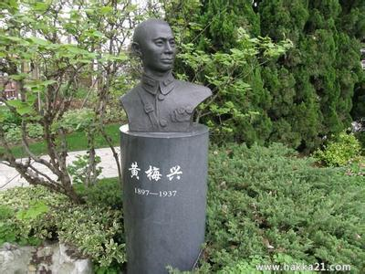

80年前的今天，抗日战争中第一个阵亡的高级将领黄梅兴壮烈殉国

（万象特约作者：一一）

80年前的今天，1937年8月14日，抗日战争中第一个阵亡的高级将领黄梅兴壮烈殉国

黄梅兴（1897年7月21日－1937年8月14日），字敬中，广东平远县东石镇坳上村人。

 黄梅兴自幼家境贫寒，靠租种土地和挑担度日，后来毕业于黄埔军校一期，与徐向前、陈赓是同窗，与杜聿明、黄维、宋希濂、孙元良等关系甚密。

淞沪会战爆发后，任中华民国陆军第9集团军第88师第264旅少将旅长的黄梅兴奉命率所部进攻位于虹口的日海军陆战队司令部。日军凭借优势火力和坚固工事，给我军官兵造成了极大伤亡。激战中，黄梅兴将军不幸被敌人炮弹击中，壮烈殉国，成为中国抗日战场第一个阵亡的高级将领，后被追授陆军中将。

妻子亲写挽联：“马革裹尸还，是男儿得意收场；可怜母殁半年，瞑目尚多身后事。鹃声啼血尽，痛夫子抬魂不返；最苦孤生匝月，伤心犹剩未亡人”。

（黄梅兴将军遗体上面盖有中华民国国旗）

黄埔军校一期生

1897年7月21日，出生于广东平远县。家境贫寒，10岁才入学读书。1917年秋（20岁），考入县立平远中学初中部就读，两年后因家境辍学，担任村中小学的教员。1921年，辞职赴广州就读宪兵学校，毕业后加入粤军第一师，为一名普通士兵。

1924年5月（27岁），在团长邓演达的保荐下，投考黄埔军校，入黄埔军校第一期第四队学习。1925年，参加第一次东征，属黄埔军校学生军教导团，任建国粤军二军薛岳团部见习排长，在揭西棉湖战役中，作战勇敢升任连长。 

淞沪抗战中的黄老虎

1925年10月上旬（28岁），参加国民革命军第二次东征， 黄梅兴在兴宁合水战役再次立功，升为营长。1926年7月，国民革命军北伐。在江西，作战时负伤，入院治疗，伤愈后奉命招募新兵。1928年春，任第四军教导第一师政治部主任，随军北伐。

1930年春（33岁），任国军陆军第45师266团团长。1931年1月，任陆军88师264旅528团团长。1932年，在上海的 “一·二八”淞沪抗战中，率部配合蔡廷锴的十九路军作战。多次与日军较量，被称为“黄老虎”。战后升为264旅旅长，驻防鄂西。

淞沪会战中壮烈殉国

1937年（40岁），卢沟桥事变后，黄梅兴奉令移驻淞沪地区，并随后参与庐山会议。1937年8月11日， 率部从镇江开往上海江湾大场一带驻防，以抵御日军。

8月13日，淞沪抗战开始，日军从天通庵、横浜桥跨越淞沪铁路冲到宝山路口，被264旅击退。次日下午6时，在进攻爱国女校日军堡垒时，黄梅兴在八字桥附近被日军迫击炮弹击中殉国，时年40岁。黄梅兴成为中国抗日战场第一个阵亡的高级将领。

马革裹尸还，是男儿得意收场

黄梅兴牺牲后，国民政府在南京的中国殡仪馆设灵堂悼念。追授黄梅兴为陆军中将。遗体送至南京雨花台落葬。黄梅兴的妻子亲写挽联：“马革裹尸还，是男儿得意收场；可怜母殁半年，瞑目尚多身后事。鹃声啼血尽，痛夫子抬魂不返；最苦孤生匝月，伤心犹剩未亡人”。

1938年3月12日，毛泽东在延安纪念孙中山逝世１３周年及追悼抗日阵亡将士大会上，高度评价黄梅兴等抗日烈士，为“全国人民崇高伟大的模范”。1957年，平远县人民政府新建烈士陵园。民政部追认黄梅兴为革命烈士。

2004年8月12日，上海纪念“八·一三”淞沪会战67周年，黄梅兴将军的塑像被安放在上海奉贤海滨的“人文之林”海上名人纪念园。 

