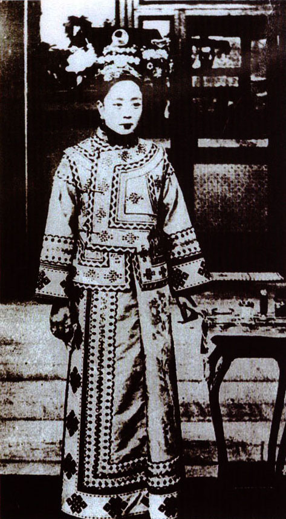
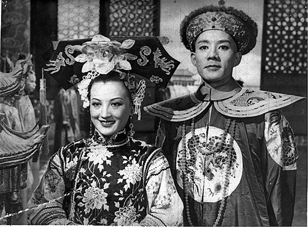
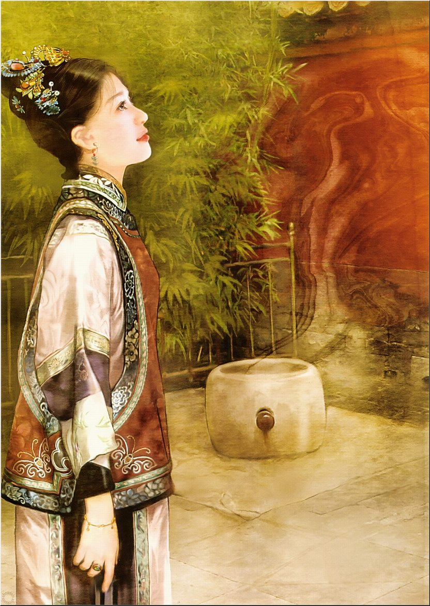
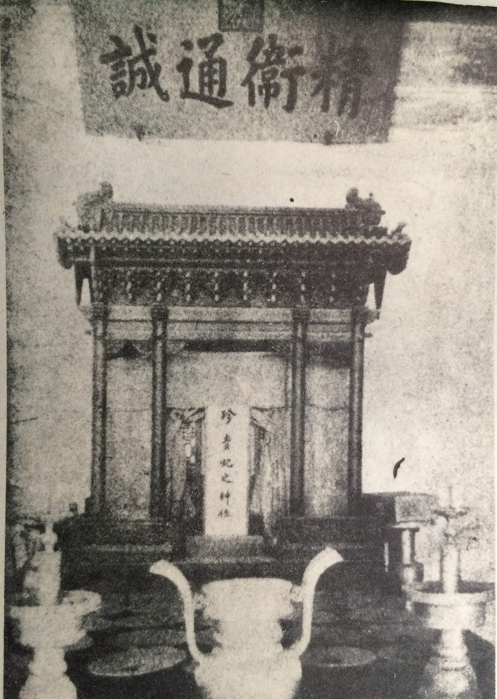
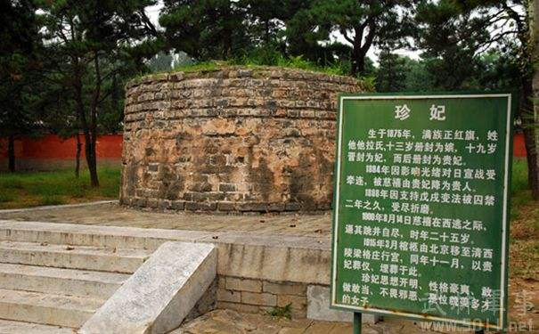
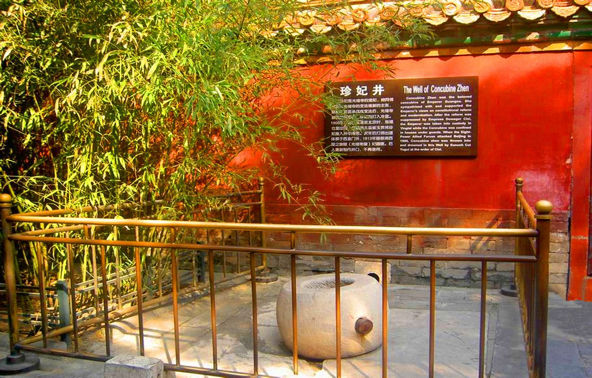

## 0815珍妃（步骤2：成文）

### 引导阅读

- 习惯按她曾获封的珍妃来称呼她，为清朝光绪皇帝的仅有的两个妃嫔之一。
- 光绪帝的嫔妃，也是最为受宠的妃子
- 接受西方思想，敢于和宫廷封建礼教相抗衡，喜欢照相，

- 无视宫中礼仪，卖官被打屁股
- 获罪于慈禧太后而被投井杀害
- 电视剧的原型

#### 标题

（万象历史特约作者：东西望）

117年前的今天，臭美爱照相，被扒了裤子打屁股的珍妃投井而亡

（1960年，故宫刊发的珍妃照）

#### 导言

珍妃（1876年2月27日—1900年8月14日），满洲镶红旗人，光绪皇帝最为宠爱的妃子。

一个天生丽质、活波开放、爱照相、爱臭美的皇妃，深得皇帝宠爱。因无视宫中礼仪，且有卖官行为，慈禧太后非常不满，把她扒了裤子打屁股，降为贵人。

恢复称号后，又因支持维新，和光绪分别被幽禁。八国联军进入北京，慈禧太后不愿带她走，将其投井杀害。井因而得名：珍妃井。

故宫曾在1930年，1960年分别刊登了珍妃的两张照片，但两人迥然不同。两张都无法确信是真的珍妃，可以说百年来并没有人见过珍妃的貌美如花。

#### 思想开放的满族女

1876年2月27日，珍妃出生。满洲镶红旗人，祖父曾任陕甘总督，父亲曾任户部右侍郎，伯父曾任广州将军。姐姐瑾妃和她是妾所生的四女、五女。

珍妃与姐姐瑾妃自幼随伯父在广州长大。广州是中国最早开放的口岸城市，与西方世界接触最早最多，思想较内地开放许多。伯父也广交名人雅士，对珍妃影响巨大。

（1930年刊印在出《故宫周刊》“珍妃专号”上的照片，后被认为并非珍妃）

#### 当选为皇妃的姐妹

10岁时，伯父卸任广州将军，珍妃和瑾妃北返北京。1889年（13岁），18岁的光绪帝选妃，她和姐姐两人当选，分别封为珍嫔、瑾嫔。嫔为九等嫔妃序列中的第五等。慈禧太后选定其侄女叶赫那拉氏（即隆裕皇后）为光绪帝的皇后。

光绪大婚后，隆裕皇后逐渐失宠，而瑾妃性情忠厚，不会巴结人，与光绪也感情一般。珍妃天生丽质，生性乖巧，善解人意，能歌善舞，工翰墨擅奕棋，精通琴棋书画，深受光绪皇帝宠爱。光绪帝几乎每天都召幸珍嫔，每隔三四天还到珍嫔的景仁宫去一次。

1894年正月初一（18岁），慈禧太后因60大寿，晋封姐妹俩为妃。光绪帝一生仅有一后二妃。

（《清宫秘史》（1948）剧照，周璇饰珍妃）

#### 爱照相爱臭美的“疯婆子”

珍妃入宫时，照相技术已传入中国，但在当时人以为：照相会摄人魂魄，使人折寿。传闻珍妃却偏偏迷上了照相，她托人买来照相机，在皇宫内，“不拘姿势，任意装束”地拍照。她不仅自己照，还给别人照，还教太监照。她把照相作为生活中的一大乐趣，可惜珍妃所拍的照片一张也没能留传下来。

珍妃爱美，好打扮，喜欢追新潮，经常做各式新款服装，她尤其爱女扮男装，穿戴男子的冠服，有时还穿上光绪皇帝的龙袍戏耍。

#### 被打屁股、被关禁闭

珍妃无视宫中礼仪，惹得慈禧太后非常不满。尤其，从宫中搜获记有珍妃卖官收入的一本账本。1894年十月二十八日（18岁），珍妃遭到了“褫衣廷杖”（即剥去衣服，由太监用竹板重打坦裸的臀部）。皇妃遭此惩处，这在清朝是极为罕见的。

随后慈禧太后下懿旨，将瑾妃、珍妃著降为贵人。珍妃被幽闭于宫西二长街百子门内牢院，与光绪隔绝，不能见面。十一月，珍妃位下的太监高万枝，因所行“诸多不法，若再审问，恐兴大狱，于政体有伤”，交内务府重责处死。

1895年（19岁），瑾妃、珍妃的称号得到恢复。1898年（22岁），戊戌变法失败，光绪帝被幽禁。支持光绪维新的珍妃，被幽禁于钟粹宫后的北三所。

#### 被逼投井、葬入宫女墓地

1900年（24岁），八国联军进攻北京，慈禧太后和光绪帝慌忙出逃。慈禧太后不愿带走珍妃，又担心留下后惹出是非，有辱皇家颜面。8月14日，慈禧命太监将幽禁的珍妃唤出，将其推入慈宁宫后贞顺门的井中溺亡。当时，珍妃年仅24岁。

1901年春，清朝与八国联军讲和，慈禧和光绪还朝。慈禧见珍妃井依然如故，便命人将尸骨打捞出来，装殓入棺，葬于阜成门外恩济庄太监公墓南面的宫女墓地。赐“贞烈殉节”，并追封为珍贵妃。

10多年后，光绪和慈禧先后去世。1915年，姐姐瑾妃（时为兼祧皇考瑾贵妃）将珍妃迁葬光绪崇陵妃园寝，并在珍妃井北侧的门房为她布置了一个小灵堂以供奉珍妃的牌位，灵堂上悬挂一额纸匾，上书“精卫通诚”。

#### 旁观者的历史见证

1930年（民国十九年），《故宫周刊》第30期〈珍妃专号〉采访了当时的宫监唐冠卿，详细叙述了珍妃投井的过程：

> 庚子七月十九日联军入京，宫中惊惕万状。总管崔玉桂率快枪队40人守蹈和门，予亦率40人守乐寿堂。
>
> 时甫过午，予在后门休憩，突观慈禧后自内出，身后并无人随侍，私揣将赴颐和轩，遂趋前扶持。乃至乐寿堂右，后竟循西廊行。予颇惊愕，启曰：‘老佛爷何处去？’曰：‘汝勿须问，随余行可也。’及抵角门转弯处，遽曰：‘汝可在颐和轩廊上守候，如有人窥视，枪击毋恤。’予方骇异间，崔玉桂来，扶后出角门西去。窃意将或殉难也，然而亦未敢启问。
>
> 少顷，闻珍妃至，请安毕，并祝老祖宗吉祥。后曰：‘现在还成话吗？义和团捣乱，洋人进京，怎么办呢？’继语言渐微，哝哝莫辨。忽闻大声曰：‘我们娘儿们跳井吧！’妃哭求恩典，且云未犯重大罪名。后曰：‘不管有无罪名，难道留我们遭洋人毒手么？你先下去，我也下去。’妃叩首哀恳，旋闻后呼玉桂。
>
> 桂谓妃曰：‘请主儿遵旨吧！’妃曰：‘汝何亦逼迫我耶？’桂曰：‘主儿下去，我还下去呢。’妃怒曰：‘汝不配！’予聆至此，已木立神痴，不知所措。忽闻后疾呼曰：‘把她扔下去吧！’遂有挣扭之声，继而砰然一响，想珍妃已堕井矣。
>
> 斯时，光绪帝居养心殿，尚未之知也。后玉桂疽发背死。

