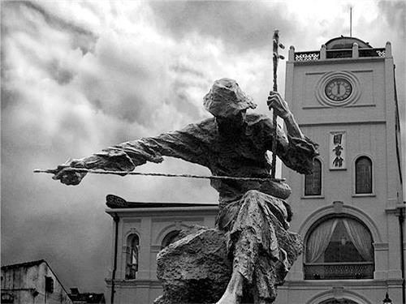
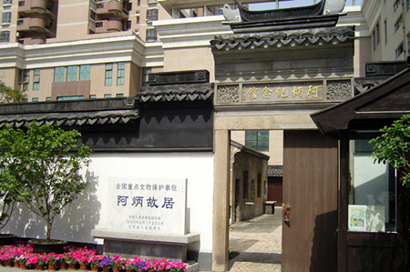
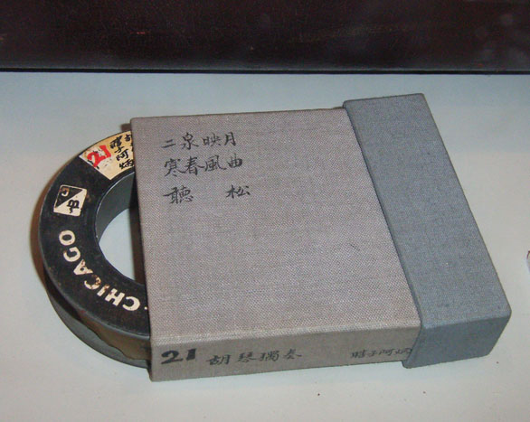

## nnnn姓名（步骤2：成文）

### 成就特点

- 道士、瞎子、二胡
- 父亲为道士
- 好吸食鸦片和嫖妓
- 梅毒导致双目失明
- 《二泉映月》天下第二泉；映月=音乐？？
- 中国的贝多芬
- 1985年美国评出了10首最受西方人欢迎的流行乐曲，《二泉映月》名列榜首。
- 要跪下来听

---

#### 标题

124年前的今天，因性病双目失明的中国贝多芬阿炳出生于道家

### 导言

阿炳（1893年8月17日——1950年12月4日），又称瞎子阿炳，流浪艺人，因作品《二泉映月》闻名于世。

### 出身道家的小天师

1893年8月17日，阿炳出生于无锡市洞虚宫雷尊殿旁山房，父亲为雷尊殿当家道士。幼年被送至无锡县东亭镇老家托人抚养，8岁后被带回道观，并送入私塾读书，取名为华彦钧。

阿炳在父亲的传授下，10几岁学习笛子、二胡和琵琶等，开始参与法事。17岁，正式参与道教音乐吹奏，因外表、声线讨好，被当地人称为“小天师”。

### 双目失明沦落街头

1918年（27岁），父亲去世，阿炳继承雷尊殿“当家道士”职位，与族兄轮流主管收入。后阿炳好吸食鸦片和嫖妓，入不敷支。34岁，因梅毒致双目失明，无力参与法事工作，遂以街头卖艺为生。

46岁，与江阴农村寡妇董彩娣结婚。再往后的日子里，一个说唱时事，在街头卖艺，以“瞎子阿炳”闻名的创作型民间艺人新生了。

（日军占领无锡期间，阿炳良民证上的照片）

### 小邻居的一次演奏

阿炳的一个名叫黎松寿的邻居，少年时喜好二胡，常常得到阿炳的点拨。黎松寿后来考上了南京艺术学院民乐系。一次无意中，演奏了阿炳的乐曲，被中央音乐学院教授杨荫浏听到，非常惊讶。而杨荫浏正打算收集民乐。

1950年8月下旬（57岁），中央音乐学院教授杨荫浏联系到阿炳，要给他录音。因阿炳已经三年没有弹琴，练习几天后，延至9月2日下午7时30分开始录音，录制《二泉映月》、《听松》、《寒春风曲》3首二胡曲和《大浪淘沙》、《龙船》、《昭君出塞》3首琵琶曲。

传说中最得意的《梅花三弄》与其他约300首乐曲，因为录音钢丝不够而没有录制。

### 人生的最后一曲

1950年9月，中央音乐学院民乐系本拟聘阿炳为教师，因没有医疗费用预算而告吹。1950年9月25日，无锡牙医协会成立大会的表演节目，是阿炳唯一也是最后的正式公开演奏。演出结束的时候，台下掌声和叫好声不断，阿炳听见就脱下帽子点头示意。

1950年12月4日，阿炳病逝，终年57岁，无后，葬于无锡西郊道教墓地。1983年，墓地被毁，无锡博物院得到通知，派人原地拾骨，安葬于无锡锡惠公园。

### 命运的二泉映月

《二泉映月》是阿炳最有名的曲子，它如哭如泣地抒发了阿炳的痛苦身世。这首曲子一开始并无名称，阿炳常在行街穿巷中，信手拉奏。录制完后，根据无锡著名景点“二泉”而命名为《二泉映月》（江苏无锡惠山泉，世称“天下第二泉”）。“映月”来自“音乐”的谐音。

1951年，天津人民广播电台首次播放此曲；1959年，10周年国庆时，中国对外文化协会又将此曲作为我国民族音乐的代表之一送给国际友人。从此，此曲在国内外广泛流传，并获得很高评价。1985年，此曲在美国被灌成唱片，并在流行全美的中国乐曲中名列榜首。

1991年，一位英国音乐家听了《二泉映月》后，激动地说：“中国的贝多芬！中国的《命运》！”

