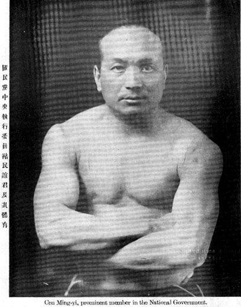
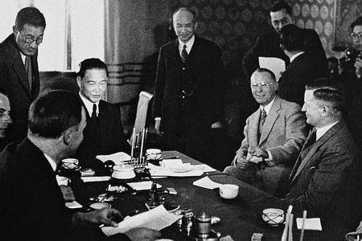
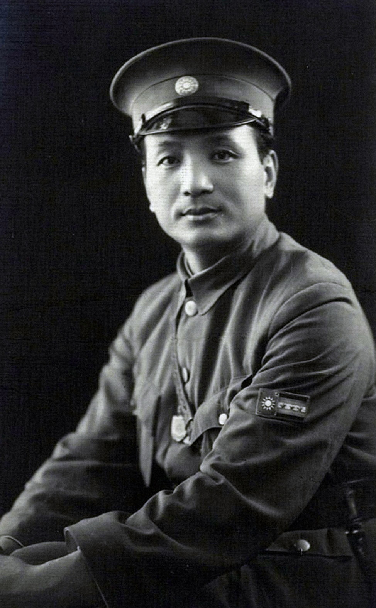
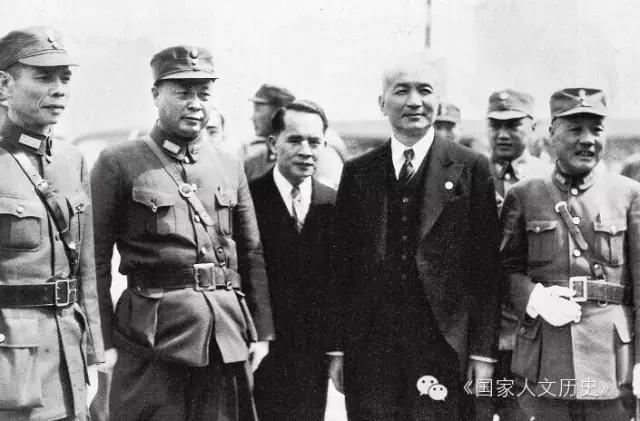

## nnnn姓名（资料）

### 成就特点

- 国民党元老
- 抗战期间叛国投敌，沦为汉奸，成为汪伪政府要人
- 抗战胜利后被国民政府以汉奸罪逮捕，1946年被执行枪决
- 以精于书法和太极拳闻名
- 其妻子陈舜贞是汪精卫外母的养女
- 汪伪政权第四号人物
- 私藏孙中山的肝脏

### 生平

1884年1月17日，生于吴兴南浔一个士大夫世家。父亲褚吉田是一位名医。

1903年，他赴日本留学，入日本大学学习政治经济学。当时，他为革命思想倾倒。

【国民党元老】1906年，随同乡张静江赴法国，抵巴黎后，与吴稚晖、李石曾、蔡元培等创办中国印书局，发行《新世纪月刊》和《世界画报》等，宣传反满革命。（张静江、吴稚晖、李石曾、蔡元培并称为国民党四大元老）

【汪精卫连襟】1911年11月，褚民谊回到辛亥革命后由革命派掌握的上海。经黄兴介绍，结识了汪精卫、陈璧君夫妇，随后同陈璧君的义妹陈舜贞结婚，遂成了汪精卫的连襟。

1912年4月，就任中国同盟会本部驻上海机关部总务长。后来，宋教仁将同盟会等团体改组为国民党，褚民谊对此失望而于9月赴欧留学比利时，在布鲁塞尔自由大学学习。

1915年，他在反袁世凯运动中一度归国。回到欧洲后，在法国他和蔡元培、汪精卫组织华法教育会，以支持中国留学生。此后不久，他为无政府主义倾倒。

【医学博士】1920年，他和吴敬恒、李石曾创建巴黎中法大学。同年，他赴斯特拉斯堡大学学习医学。1924年，他获得医学博士。

1924年末，褚民谊归国，在孙文领导的中国国民党内从事教育工作，历任广东大学教授、代理校长，广东医学院院长。

1926年1月，他在中国国民党第二次全国代表大会上当选中央候补执行委员，不久又升任中央执行委员。以后，他作为汪精卫的心腹参加党政活动，成为改组派要人。同年北伐开始，他任总司令部军医处长。

1928年，他赴欧洲研究公众卫生。归国后，他任国民卫生建设委员会委员长。

【与汪精卫同进同出】1932年1月，蒋介石同汪精卫和解，汪精卫就任行政院院长，褚民谊出任行政院秘书长。1934年，他兼任中国国民党新疆建设计划委员会主任委员。

1935年11月，汪精卫在南京中央党部被王亚樵派遣的刺客孙凤鸣刺成重伤，因而辞任，褚民谊也一同辞任，赴上海任中法国立工学院院长等职务。

1937年，日军攻占上海，褚民谊因要负责中法国立工学院的事务而留在上海。

【汪伪大员】1939年5月，他被秘密访问上海的汪精卫拉拢，参与建立亲日政府的活动。同年8月，汪精卫在上海召开中国国民党第六次全国代表大会，褚民谊当选中央监察委员会常务委员、中央党部秘书长。

随后，在伪国民党六届一中全会上，褚民谊任秘书长，成为汪伪国民党的“总管家”。当时，人们对汪精卫政府的汉奸，以“陈公博的嘴，周佛海的笔，褚民谊的腿”并称。

1940年3月，南京国民政府（汪精卫政权）成立，褚民谊任行政院副院长兼外交部部长。以后，他负责对日本的外交折冲。同年12月，他任驻日本大使。1941年10月，他复任外交部长。此后他曾任访日特使，获昭和天皇授予勋一等旭日大绶章。

1944年11月，汪精卫逝世，陈公博代理国民政府主席一职。此后陈公博和褚民谊发生激烈冲突，周佛海乃从中斡旋调和。

1945年7月，褚民谊被任命为广东省长兼保安司令、广州绥靖主任。同年8月日本投降，褚民谊摆出了对蒋介石的顺从姿态。然而10月他还是在广州被蒋介石下令逮捕。

1945年10月14日，褚民谊在广州被军统局诱捕，与陈璧君等被软禁，后又被押送南京宁海路25号看守所。

1946年，褚民谊被关入江苏高等法院第三监狱。同年3月21日，南京高等法院审判褚民谊，后被判处死刑。

【汉奸处死】1946年4月，他以汉奸罪被宣判死刑。同年8月23日，他在苏州的监狱被处决。终年63岁。

【法庭辩词】法庭辩词：“至南京政府(按即指汪政权而言)成立，已距首都沦陷，在两年之后，沦陷区民众痛苦万分，以为有一政府与敌折冲，可稍解人民倒悬，况南京政府承党国大统，与重庆实为相辅相成。我的所以参加，亦不欲以国家作孤注一掷，南京政府之建立，可为国家前途留一余地。”

“若说我是叛国之凶，实觉太不敢当。但我仍然愿意请求一死，一死或足以满足若干人之希望，省得我再活十年，虚耗国家囚粮，如能将我囚粮供我子女求学，我愿足矣！总之，蒋汪两先生救国心同，今一则赍恨而终，一则光荣获胜，汪先生在九泉之下，对国家的剥复，当亦笑于九泉。我能于国家胜利后随汪先生于地下，更所甘心。”

【免死传闻】且曾以美国方面的一位白司令对褚联络协助的证明文件，面呈蒋氏，经蒋氏考虑后，亲笔于美军文件上批准免予一死，文件交由褚之家属收执，…. 褚氏女公子孟嫄持蒋氏之续命符由沪搭车专程赴苏，向高院呈递时，不料在车上独有此重要文件竟被人窃去，虽然事出离奇，但无从证明是否另有原因。而褚民谊终以铁券既失，起死无方，更审仍判死刑。

妻子陈舜贞，是陈璧君的义妹，高中文化，职业是家庭主妇。生有三子二女。

【孙中山的肝脏】

1925年3月12日，孙中山在北京病逝。

太平洋战争爆发后，美国人开办的协和医院落入日本人手中。日本人在搜查协和医院研究室时，意外地发现了孙中山的内脏切片和腊块标本，便将内脏切片和腊块标本盗取掠走。原来，协和医院当年在给孙中山做防腐处理时，并没有将孙中山的内脏火化，而是留下供研究之用了。但实际上，由于诊断结果是孙中山患有肝癌，为了研究之用。

1942年3月25日，汪精卫派出所谓的外交部长褚民谊为奉迎大员，专程去北平接收孙中山的“灵脏”。褚民谊与日军首脑冈村宁次商谈，请求奉还孙中山的“灵脏”。日本方面处于政治上的考虑，同意奉还。

3月28日，褚民谊带着“灵脏”乘车南下，在第二天到达浦口，汪精卫等乘“汪绥”号军舰到浦口迎接，然后把“灵脏”送往中山陵。4月5日，汪精卫还在中山陵祭堂主持了“国父灵脏”奉迎仪式。

后来，正在研究攻克癌症的上海镭锭医院汤齐平医生请求借用研究，得到汪精卫同意。“灵脏”在他那里保存了一段时间。抗战胜利前夕，褚民谊将“灵脏”偷出，密藏在南京他的一个亲戚家中。

在供出孙中山肝脏下落后，江苏高等法院发表了对褚民谊的裁定书，认定褚保护“国父”“灵脏”及遗著“不能谓无功”，有再审的理由，获准再审。法院通过传媒详细介绍了褚民谊如何与日本人交涉，如何获得中山先生肝脏及文献，有意为褚表功。但立刻引发舆论哗然，许多国民党元老级人物更是对褚民谊盗窃“国父”“灵脏”，攫为己有的行为，表示愤慨。在强大的外界压力下，褚民谊最终被执行枪决。

### 照片

拿钢球练习太极拳.jpg)

.JPG)

.jpg)

