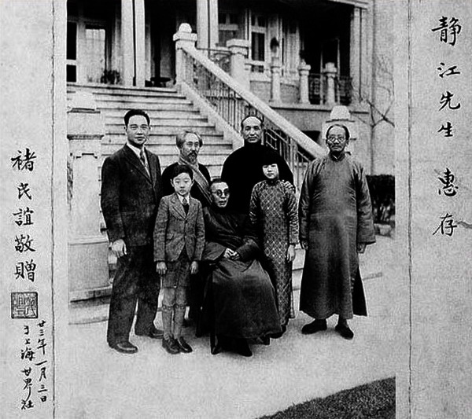
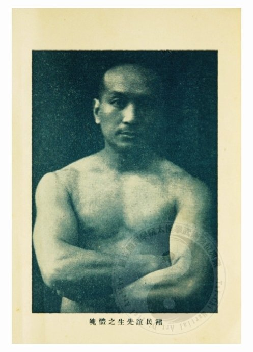
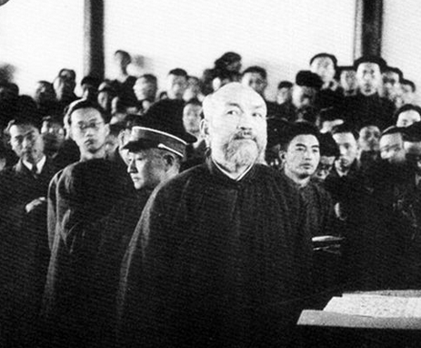

## nnnn姓名（资料）

### 成就特点

- 国民党元老
- 抗战期间叛国投敌，沦为汉奸，成为汪伪政府要人
- 抗战胜利后被国民政府以汉奸罪逮捕，1946年被执行枪决
- 以精于书法和太极拳闻名
- 其妻子陈舜贞是汪精卫外母的养女
- 汪伪政权第四号人物
- 私藏孙中山的肝脏

### 正文

标题：71年前的今天，私藏孙中山肝脏的汉奸褚民谊被处决

（万象历史特约作者：东西望）

71年前的今天，1946年8月23日，私藏孙中山肝脏的汉奸褚民谊被处决

褚民谊（1884年1月17日—1946年8月23日），浙江湖州人，国民党元老，汪精卫政府的4号人物。

早年加入同盟会，与国民党四大元老共事。迎娶陈璧君的义妹，与汪精卫成了连襟。40岁获得医学博士后，成为汪精卫的心腹，两人同进同出。

汪精卫建立南京政府，他任外交部长，成了“总管家”，以“陈公博的嘴，周佛海的笔，褚民谊的腿”并称。抗战胜利后被捕，以汉奸罪判处死刑。曾以献出私藏的孙中山肝脏，以求免死，结果舆论大哗，最终被枪决。

#### 国民党四大元老擦肩而过

1884年1月17日，褚民谊生于浙江湖州的一个士大夫世家。父亲是一位名医。1903年（19岁），赴日本留学，入日本大学学习政治经济学，为革命思想所倾倒。

1906年（22岁），随同乡张静江赴法国，抵巴黎后，与吴稚晖、李石曾、蔡元培等创办中国印书局，发行《新世纪月刊》和《世界画报》等，宣传反满革命。（张静江、吴稚晖、李石曾、蔡元培并称为国民党四大元老）

#### 汪精卫的连襟

1911年11月（27岁），辛亥革命后，褚民谊回到由革命派掌握的上海。经黄兴介绍，结识了汪精卫、陈璧君夫妇，随后与陈璧君的义妹陈舜贞结婚，遂成了汪精卫的连襟。1912年4月，就任中国同盟会驻上海机关部总务长。不久，宋教仁将同盟会改组为国民党，褚民谊非常失望，于9月赴欧留学比利时，在布鲁塞尔自由大学学习。

1915年（31岁），在反袁世凯运动中，他短暂回国，再赴欧洲。在法国他和蔡元培、汪精卫组织华法教育会，以支持中国留学生。思想渐渐转为无政府主义。1920年（36岁），他和吴敬恒、李石曾创建巴黎中法大学。同年，赴斯特拉斯堡大学学习医学。1924年（40岁），他获得医学博士。

#### 与汪精卫同进同出

1924年末，褚民谊归国，在孙中山领导的国民党内从事教育工作，历任广东大学教授、代理校长，广东医学院院长。1926年1月，当选为中国国民党的中央执行委员。此后，他作为汪精卫的心腹参加各种党政活动，成为改组派要人。

1932年1月，蒋介石同汪精卫和解，汪精卫就任行政院院长，褚民谊出任行政院秘书长。1935年11月，汪精卫被王亚樵派遣的刺客刺成重伤，被迫辞职，褚民谊也一同辞职，赴上海任中法国立工学院院长。1937年，日军攻占上海，褚民谊留在上海没有撤离。

#### 汪精卫政府的总管家

1939年5月，秘密访问上海的汪精卫拉拢褚民谊，参与建立亲日政府。8月，汪精卫在上海召开中国国民党第六次全国代表大会，褚民谊当选中央监察委员会常务委员、中央党部秘书长。褚民谊成为汪精卫政府的“总管家”。当时，人们以“陈公博的嘴，周佛海的笔，褚民谊的腿”并称。

1940年3月，南京国民政府（汪精卫政权）成立，褚民谊任行政院副院长兼外交部部长。12月，任驻日本大使，曾获昭和天皇授予勋一等旭日大绶章。

1944年11月，汪精卫逝世，由陈公博代理国民政府主席。褚民谊不满，经常发生激烈冲突。1945年7月，褚民谊被任命为广东省长兼保安司令、广州绥靖主任。

#### 以汉奸罪判处死刑

8月，日本投降。10月，在广州被蒋介石下令逮捕。1946年3月21日，南京高等法院审判褚民谊，以汉奸罪判处死刑。

褚民谊在法庭辩说：“至南京政府（即汪精卫政府）成立，已距首都沦陷，在两年之后，沦陷区民众痛苦万分，以为有一政府与敌折冲，可稍解人民倒悬，况南京政府承党国大统，与重庆实为相辅相成。我所以参加，亦不欲以国家作孤注一掷，南京政府之建立，可为国家前途留一余地。若说我是叛国之凶，实觉太不敢当。但我仍然愿意请求一死，一死或足以满足若干人之希望，省得我再活十年，虚耗国家囚粮，如能将我囚粮供我子女求学，我愿足矣！总之，蒋汪两先生救国心同，今一则赍恨而终，一则光荣获胜，汪先生在九泉之下，对国家的剥复，当亦笑于九泉。我能于国家胜利后随汪先生于地下，更所甘心。”

1946年8月23日，他在苏州的监狱被处决，终年63岁。

#### 私藏孙中山的肝脏

1925年3月12日，孙中山在北京病逝。协和医院在给孙中山做防腐处理时，并没有将他的内脏火化，而是留下来供研究使用。协和医院落入日本人手中后，意外地发现了孙中山的内脏切片和标本。

1942年3月25日，在汪精卫政府的请求下，日方同意归还，派褚民谊为奉迎大员，专程去北平接收孙中山的“灵脏”。汪精卫等乘“汪绥”号军舰到浦口迎接，送往中山陵，并主持了“国父灵脏”奉迎仪式。

抗战胜利前夕，褚民谊将“灵脏”偷出，密藏在南京他的一个亲戚家中。审判时，褚民谊交出“灵脏”，以求免死。法院通过传媒详细介绍了褚民谊如何与日本人交涉，如何获得中山先生肝脏及文献，有意为褚表功。但立刻引发舆论哗然，许多国民党元老级人物更是对褚民谊盗窃国父“灵脏”，非常愤慨。在强大的外界压力下，褚民谊最终被执行枪决。

