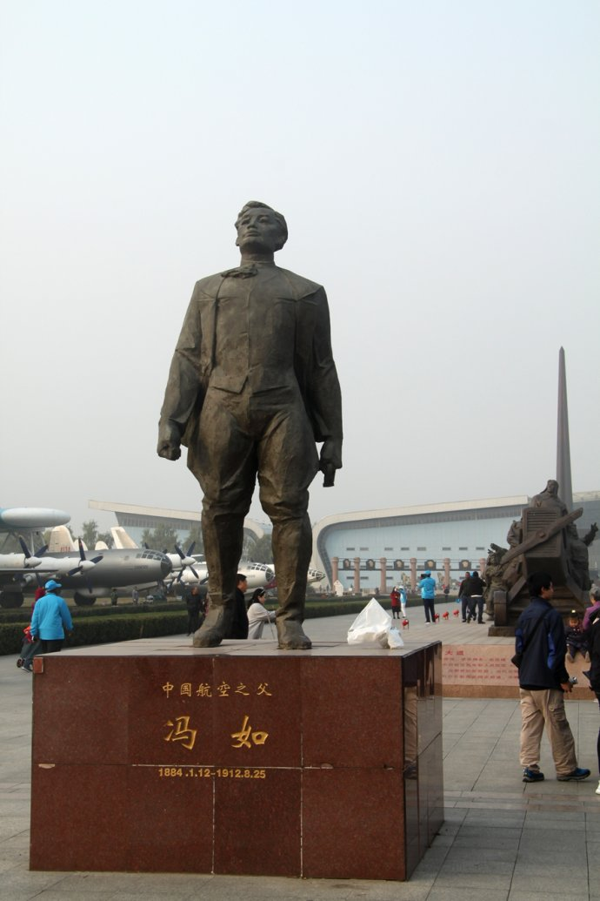
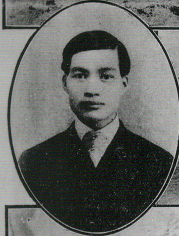
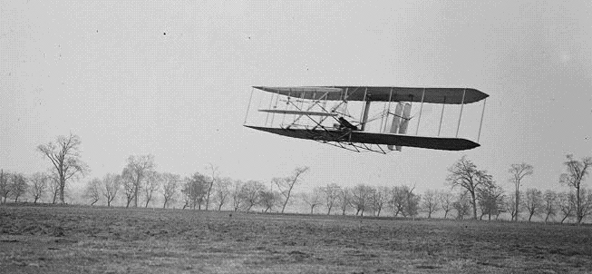
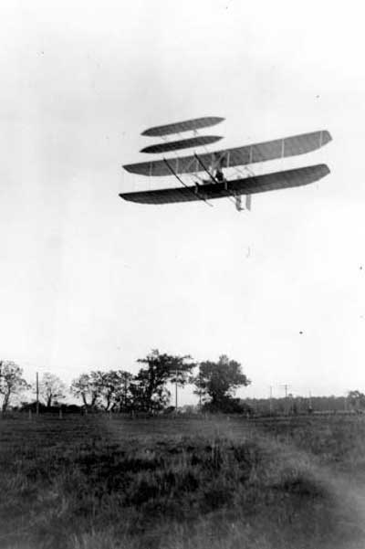
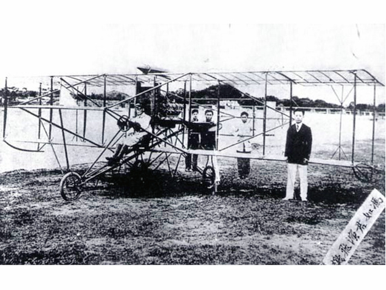
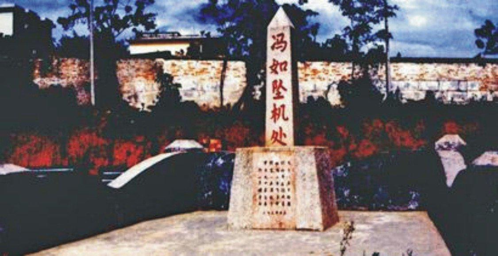
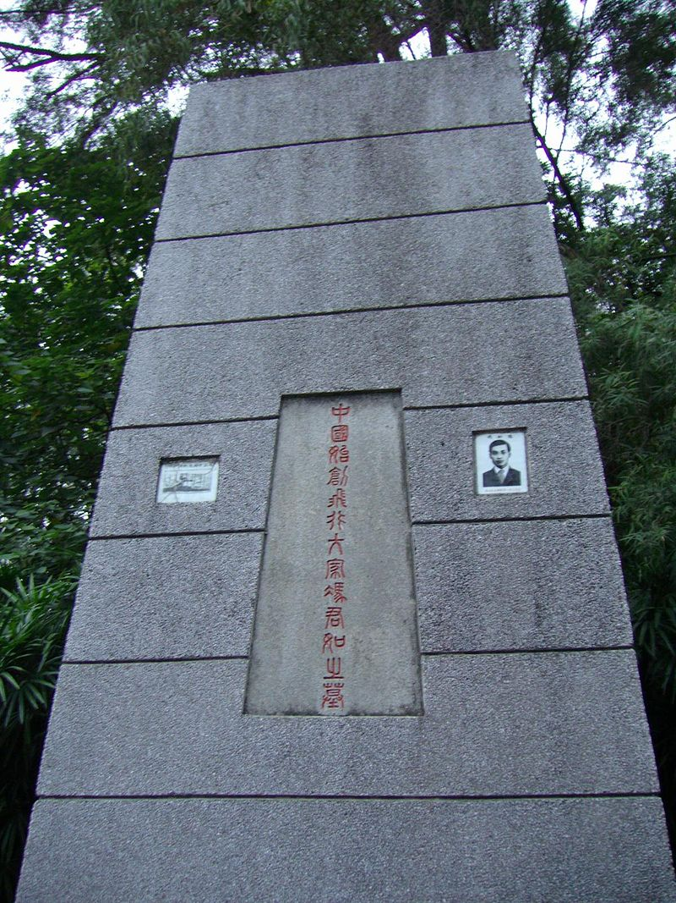
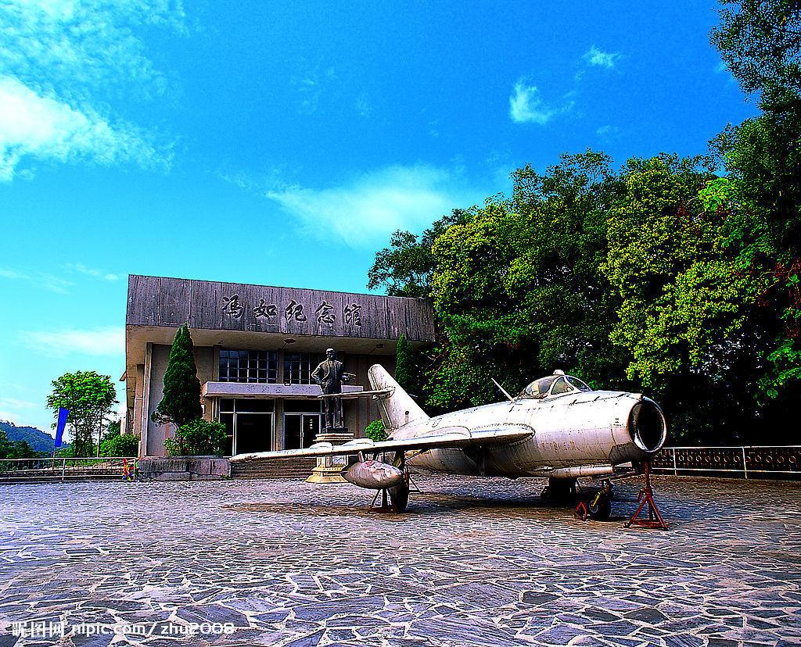

## 105年前的今天，造出中国第1架飞机的中国航空之父冯如遇难

（万象历史特约作者：一一）

105年前的今天，1912年8月25日，造出中国第1架飞机的中国航空之父冯如遇难

​	冯如出生寒微，随家人到旧金山讨生活，却志向远大，走在世界科技前沿，制成中国的第一架飞机，在经历了“冯如1号”飞机试验失败 、厂房被火灾付之一炬后，冯如卧薪尝胆，制造出“冯如2号”并试飞成功，被被美国报纸赞为“东方莱特”。

​	美国推行具种族歧视的排华政策，《中美华工条约》让华人在美国受到不平等的对待，冯如只能期待在中国实现航空报国的梦想。他回国后投身辛亥革命，被任命为广东革命政府飞机长，后在一次飞行表演中不幸失事殉职，被袁世凯追授陆军少将军衔，遗体安葬在广州黄花岗七十二烈士墓（今黄花岗公园），并立碑纪念，被尊为“中国始创飞行大家”。2009年，中国航空百年暨空军建军60周年之际，中国空军授予冯如“中国航空之父”的称号。

- 

在旧金山谋生

1884年1月12日，冯如出生于广东省恩平县莲岗堡（牛江镇昌梅管区）杏圃村的一户贫农家中。冯如有四位哥哥，三个家境因贫困于早年夭折，已成人的三哥也在他1911年旅美归来前早逝。

冯如家境贫寒，儿时是个放牛娃，并没有受到过完备的教育。他7岁到11岁时在家乡读过两年私塾和在邻村学校半工半读过两年，文化未过初小水平。

11岁时，跟随在国外做小生意的舅父远涉重洋到美国旧金山谋生。初到美国旧金山，冯如在乡亲的介绍下来到旧金山耶稣教纲纪慎会堂（公理会）做童工，日工夜读补习英文，生活艰苦。

1899年，冯如回乡完婚后，重回美国。由于当时美国推行具种族歧视的排华政策，《中美华工条约》让华人在美国受到不平等的对待。冯如先后在船厂、电厂和机器制造厂当过学徒和工人，历时近七年，但经常遭到企业无理解雇，工作极为不稳定。

冯如通过工作中自学，逐渐地掌握了多种机械和电器的设计制造技术。1906年冯如返回旧金山经营机器制造和销售业。

刚刚起步的世界航空事业

   冯如潜心钻研机械制造技术的年代是飞机设计和制造在世界范围内遭遇普遍挫折的时期。1896年德国工程师奥托·李林达尔在进行悬挂式滑翔机试验时不幸坠亡，1899年英国工程师皮尔彻滑翔机试验中失事，伤重不治。1903年美国科学家塞缪尔·兰利配备汽油发动机的飞机场号试飞失败。

尽管同一年莱特兄弟成功试飞了他们的飞行者一号，但由于他们在申请到专利前，不想自己的主意被竞争对手窃取而一直保持低调，以至于当时的航空界和媒体非但没有认可他们的成就，还对其百般质疑和挖苦。当时不少权威科学家对飞机的前景持怀疑态度，就连物理学大家开尔文也在1896年拒绝了航空学会的邀请，并在回信时写道：“除了气球升空，关于空中航行的事情我一点都不相信。”

1905年，莱特兄弟新造的飞行者三号做了6次在当时来说距离超长的飞行。这次试飞的飞行持续时间长达38分钟03秒，航程达到了39.4公里（24.5英里），飞机在燃油耗尽后安全着陆。经过了这一系列的长距离飞行，莱特兄弟相信自己终于达成了既定目标，造出了一架具有实用价值的，可以拿来出售的飞机。1906年5月，获得专利。1907年，获得法国、美国陆军的飞机合同。1908年8月8日，在法国马赛试飞，大获成功，一举成名。

中国人造的第一架飞机

冯如看到了飞机前景，并从1906年开始立决意为中国制造第一架飞机。1907年9月，冯如终于在旧金山的奥克兰租了一所工厂，开始制造飞机。

1908年4月，冯如制造出第一架飞机，进行试飞时，没有成功。接着，奥克兰的厂房失火，工厂的材料、设备全被焚毁，冯如陷于困境之中。5月，冯如租得奥克兰市东九街359号的一间面积仅80平方英尺的屋子作厂房，定名为广东制造机器厂。

1909年9月21日傍晚，“冯如2号”正式试飞。冯如驾机迎着强风起飞，升至4.5米高，环绕一个小山丘飞行，飞行了约800米，显示了他的飞机具有良好的性能，从而为中国动力载人飞行史，谱写了光辉的第一页。当时中西报刊竞相报道。美国《旧金山考察者报》在头版显著位置刊登了冯如的大照片，赞誉冯如为“东方的莱特”，并惊呼“在航空领域，中国人把白人抛在后面了！”

10月，正式成立公司，由冯如担任总机器师，并公开招集优先股份，招得优先股东67人，筹得股金5875美元 。

1910年7月，冯如根据寇蒂斯“金箭”和莱特兄弟的“飞行者一号”，又制作了一架飞机，10月至12月，冯如驾驶它在奥克兰进行飞行表演获成功，并受到孙中山先生和旅美华侨的赞许，同时获得美国国际航空学会颁发的甲等飞行员证书。

用生命实现航空报国

1911年2月，冯如决定带着公司人员、机械设备和造好的飞机回国。把公司改名为“广东飞行器公司”，并亲自担任总机器师。3月22日，抵达香港。清政府两广总督张鸣岐特派宝璧号军舰到香港迎接。并将飞机和机器安置在广州郊区燕塘。4月8日，到达广州。

1911年10月10日，武昌起义爆发，全国沸腾。11月9日，广州光复，广东革命政府成立，冯如参加革命。冯如被任命为广东革命政府飞机长，成为中国第一个飞机长。而广东飞行器公司是中国国内的第一个飞机制造厂。

经过3个月的努力，于1912年3月，制成一架与“冯如2号”相似的飞机，这也是中国国内制成的第一架飞机，揭开了中国航空工业史的第一页。

1912年8月25日，冯如在广州燕塘机场公开进行飞行表演。冯如先向到场的各界人士介绍情况，包括飞机如何利用、如何制造、如何驾驶等内容。接着，冯如驾驶自制飞机凌空而上，高约36米，东南行约8千米。当时飞机运转正常，操纵自如，鼓掌之声，不绝于耳。但冯如急于升高，操纵过猛，致使飞机失速坠地，机毁人伤。医院抢救无效，冯如以身殉国，时年仅29岁。

身后荣誉

冯如被追授为陆军少将，遗体安葬在黄花岗，并立碑纪念，被尊为“中国首创飞行大家”。

1912年9月24日，在冯如蒙难处召开追悼大会，各界人士送来很多挽联，其中文学家何淡如的挽联是：殉社会者则甚易，殉工艺者则尤难，一霎坠飞机，青冢那堪埋伟土；论事之成固可嘉，论事之败亦可喜，千秋留实学，黄花又见泣秋风。

2009年，中国航空百年暨空军建军60周年之际，中国空军授予冯如“中国航空之父”的称号。

