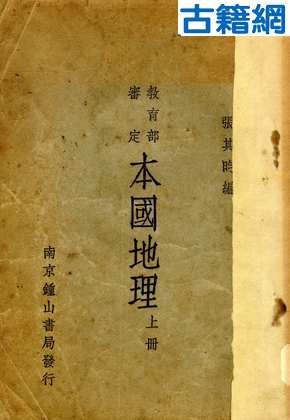
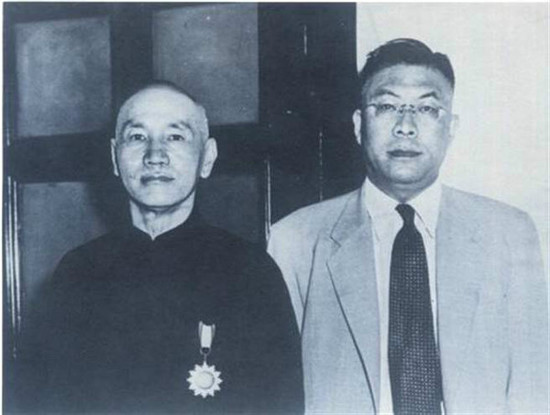
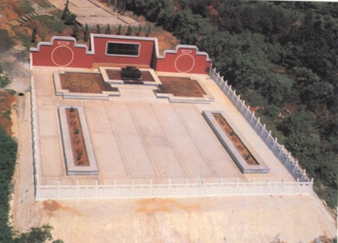

## 0826张其昀（资料）

### 成就特点

- 中国人文地理学的开山大师
- 提倡华学

- 创立全神教
- 创办中国文化大学
- 历史地理学的鼻祖
- 中华文化复兴运动的重要领袖和儒学复兴运动的中坚
- 著书《中华五千年史》（完成到第九册西汉史）
- 提倡华学

### 生平

标题：32年前的今天，提倡华学，创立全神教的人文地理开山大师张其昀病逝

32年前的今天，建议国民党退守台湾，师徒保钓的人文地理开山大师张其昀病逝

32年前的今天，建议国民党退守台湾，保卫钓鱼岛的张其昀病逝

（万象历史特约作者：东西望）

32年前的今天，1985年8月26日，建议国民党退守台湾，保卫钓鱼岛的张其昀病逝

张其昀[yún]（1901年9月29日－1985年8月26日），浙江宁波鄞县人。著名史学家、地学家及教育家。曾任中华民国教育部部长、中国文化大学创办人。

他是中国人文地理学的开山大师。国民党战败后，他强烈建议“上上良策是退守台湾！”，得到蒋介石采纳。任台湾教育部部长，奠定了台湾教育的基础，贡献巨大。

他极力推崇中华文化，是中华文化复兴运动的重要领袖和儒学复兴运动的中坚。写下《中华五千年史》的巨著，创办中国文化大学，被称为台湾的文化之父。创立以儒家文化为中心的全神教。

1972年，他与恩师竺可桢不约而同，在海峡两岸新出版的地图上，将钓鱼岛划入中国版图。为保卫钓鱼岛，提供了重要依据。

编写全国教材的年轻人

1901年9月29日，张其昀[yún]出生于浙江宁波鄞县。1919年（18岁），从浙江省立第四中学（现宁波中学）毕业后，考入国立南京高等师范学校（后改为东南大学、中央大学、南京大学），就读于史地部。当时的南高公认为中国南方的第一学府，名师荟萃，张其昀师从哲学大师刘伯明、史学大师柳诒徵、地学大师竺可桢等人。

1923年（22岁），毕业后在上海商务印书馆工作，其间编的高中教科书《本国地理》（竺可桢校），成为当时全国的通用教材。

人文地理学的开山大师

1927年起，在中央大学地理学系任教，曾主讲中国地理。曾先后出版《人生地理学》、《人生地理学之态度与方法》、《中国人地关系概论》等著作，为中国人文地理学的开山大师。

1932年，张其昀发起成立中国科学化运动协会，担任《科学的中国》总编辑。积极参与中国科学社的活动。中国科学社（1915年－1960年）是近现代中国历史上规模最大、影响最广的民间综合性科学团体。

1935年（34岁），当选为第一届中央研究院中央评议会评议员，是从未出国留学、最年轻的评议员。1936年，受聘为浙江大学史地系主任、史地研究所所长，后又兼任文学院院长。1941年，当选为中华民国教育部首批部聘教授。1943年，受美国国务院之邀聘，在哈佛大学研究讲学一年。

建议国民党撤退台湾

1949年，国民党战败后，当时有撤退到西北、西南、海南、台湾等多种方案，尤其如同抗战时退守西南重庆的方案被推崇。张其昀坚定地认为方案不妥，对蒋介石强烈建议：“上上良策是退守台湾！”

张其昀详述撤到台湾的优势：台湾海峡海阔浪高，可以阻止共产党军队的乘胜追击。台湾有着大陆其他地区无法比拟的优越之处：一、台湾物产丰富，农产品基本可满足军民所需。二、台湾交通便利，工业有日据时代留下的基础。三、台湾战略地位极为重要，美国不会弃之不顾，若得到美援，台湾防守将万无一失。四、台湾居民经过日据时代，回到祖国后对国民党政权有一种回归感，利于稳定社会秩序。五、台湾岛长期与大陆相隔，中共组织与人员活动较少。台湾四面环海，未来即使有动荡，也易于镇压，稳定社会。

台湾文化教育的巨大贡献

1949年，随国民政府到台湾。曾任中国国民党总裁办公室秘书组主任、中央宣传部部长、中央评议委员会主席、教育部部长等职。在任教育部部长期间，促成多所大学的在台复校和建立新学校，开创博士学位教育，着力中小学基础义务教育，奠定了台湾的教育格局。

将当时南海学园规模大幅扩张成为“南海五馆”，即国立历史博物馆、国立教育资料馆、国立台湾艺术教育馆、国立台湾科学教育馆、国立教育广播电台等。又创办了中国新闻出版公司、中华文化出版事业委员会，中国历史学会等组织，对台湾的文化教育事业贡献巨大。

中华文化复兴运动的领袖

张其昀对中华文化非常眷恋，是中华文化复兴运动的重要领袖和儒学复兴运动的中坚。早年他是南高史地学派和学衡派的重要成员；中央大学时期是国风社的灵魂人物；再于浙江大学时创办《思想与时代》，汇集了张荫麟、谢幼伟、熊十力、钱穆、冯友兰等学者，大有复兴人文主义之势。

在台湾，计划《中华五千年史》的巨著，原计划32册，不幸只出版了9册。创办了中华学术院和中国文化学院（中国文化大学），执教的文史学者有钱穆、杨家骆、黎东方、陈立夫、曾虚白等人；设立中华文化出版事业委员会，出版《中华丛书》、《华学月刊》，形成了研究中国文化的中心。被称为台湾的“文化之父”。

创立全神教

张其昀创立全神教。他认为，各种宗教都有相通之处，应摒弃造成纷争的各种“人格神”教及一神教的弊端，尊重多元文化和包容的“多神教”。中国的儒教、道教和佛教是“非人格神”的多神教，可以和谐共容兼包并蓄，“道并行而不悖”。

“全神教”之教育，以儒家文化为中心，以先贤圣哲以来人类共通的良好精神，培养宗教情操，即为“圣教育”。“宗教是学术研究的最高境界和最后目的”，“科学愈进步，宗教愈重要。敬天爱人，乃万事之表，万福之源”，认为教育的最高境界为“圣教育”。

师徒保卫钓鱼岛

张其昀与恩师竺可桢选择了不同的政治道路，但他们在海峡两岸不约而同地上书著文，捍卫国家领土主权。在竺可桢等人的努力下，1972年10月，新出版的《中华人民共和国地图集》明确将钓鱼岛海域划入中国版图，并用大字标出。1972年后，台湾出版的地图也明确标出钓鱼岛不属于琉球群岛，而属于台湾省宜兰县。

1985年8月26日，于台北市逝世，葬于中国文化大学境内“晓园”。

