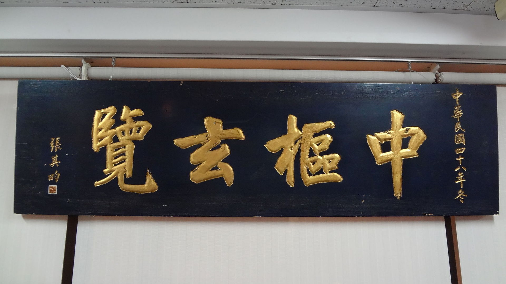
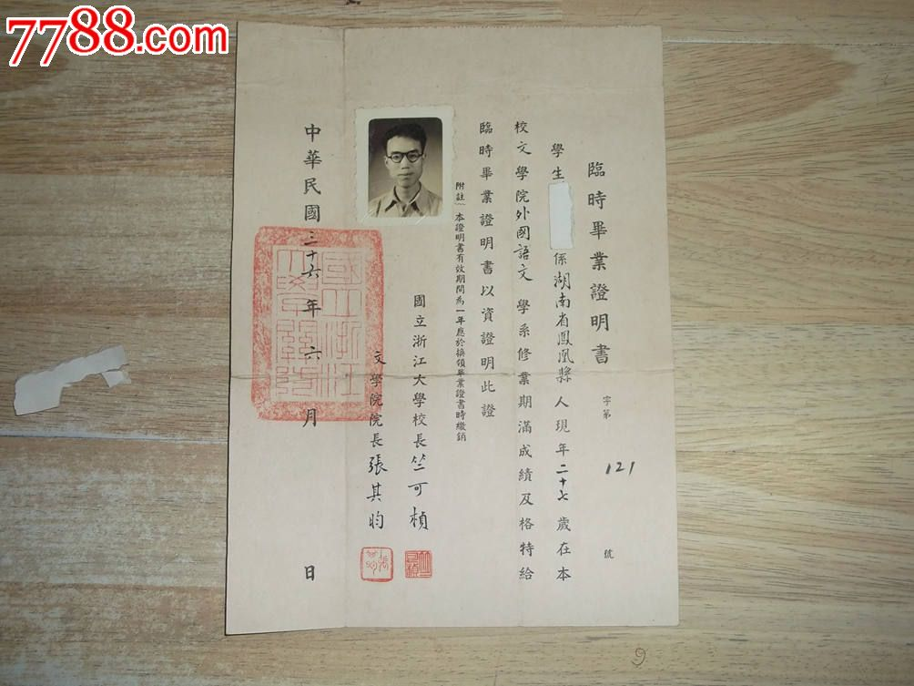
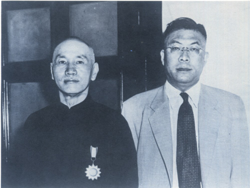
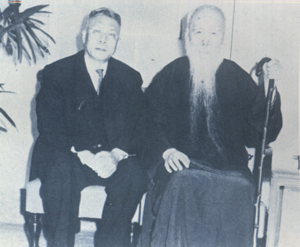
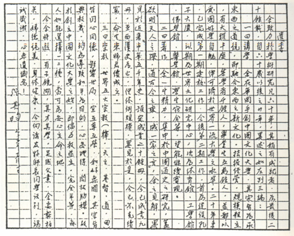

## 0826张其昀（资料）

### 成就特点

- 中国人文地理学的开山大师
- 提倡华学

- 创立全神教
- 创办中国文化大学
- 历史地理学的鼻祖
- 中华文化复兴运动的重要领袖和儒学复兴运动的中坚
- 著书《中华五千年史》（完成到第九册西汉史）
- 提倡华学

### 生平

张其昀yún（1901年9月29日－1985年8月26日），浙江宁波鄞县人，南京高等师范学校毕业，著名史学家、地学家及教育家。曾任中华民国教育部部长、中国国民党秘书长、中华民国总统府资政等要职，亦为中国文化大学之创办人。

1919年，浙江省立第四中学（现宁波中学）毕业，考入国立南京高等师范学校（后改为国立东南大学、中央大学、南京大学），就读于史地部。当时的南高声誉蜚腾，公认为中国南方第一学府，名师荟萃，师从哲学大师刘伯明、史学大师柳诒徵、地学大师竺可桢等人。

1923年，毕业后在上海商务印书馆工作，其间编的新学制高级中学教科书《本国地理》（竺可桢校），成为当时全国的通用教材，对中学教育发挥了很好的提升作用。

1927年起，在国立中央大学地理学系任教，曾主讲中国地理，为中国人文地理学之开山大师。

1932年，张其昀发起成立中国科学化运动协会，担任《科学的中国》总编辑。张其昀亦曾积极参与中国科学社的活动，为《科学》杂志撰稿。（中国科学社（1915年－1960年），近代中国历史上第一个民间综合性科学团体，也是近现代中国历史上规模最大、影响最广的科学团体。）

1935年，当选为第一届中央研究院中央评议会聘任评议员，是从未出国留学的当选评议员中最年轻的一位。

1936年，受聘为浙江大学史地系教授兼主任、史地研究所所长，后又兼任文学院院长。

1941年，当选为中华民国教育部首批部聘教授。曾任中国地理学会总干事。

1943年，受美国国务院之邀聘，在哈佛大学研究讲学一年。

1949年，随国民政府到台湾，曾任中国国民党总裁办公室秘书组主任、中国国民党中央委员会宣传部部长、中国国民党中央评议委员会主席、中华民国教育部部长、总统府资政等职，又创办了中国新闻出版公司、中华文化出版事业委员会，发起创办《学术季刊》等多种学术期刊以及中国历史学会等组织，对台湾的文化教育事业贡献甚巨。

1985年8月26日，于台北市逝世，葬于中国文化大学境内“晓园”。

【国家战略学】张其昀也是中国第一位研究现代国家战略学（方略学）的学者。

【台湾的教育格局】张其昀在台湾担任中华民国教育部部长期间，促成多所大学的在台复校和新学校的建立，开创博士学位教育，着力中小学基础义务教育，奠定了台湾的教育格局。

【南海五馆】并将当时南海学园规模大幅扩张成为“南海五馆”，亦即国立历史博物馆、国立教育资料馆、国立台湾艺术教育馆、国立台湾科学教育馆、国立教育广播电台等。

【文化复兴领袖】张其昀先生对中华文化眷恋倾恭，是中华文化复兴运动的重要领袖和儒学复兴运动的中坚，时间之长、影响之远，令人感念。张其昀早年是南高史地学派和学衡派的重要成员；嗣后中大时代成为国风社的一位灵魂人物；再后于浙大创办《思想与时代》，汇集了张荫麟、谢幼伟、郭斌龢、熊十力、钱穆、陈康、贺麟、冯友兰等学者，世人评说当时浙大蔚然有重振东大学衡之风、复兴人文主义之势。

在台湾，张其昀除著书《中华五千年史》外，还创办中华学术院和中国文化学院（中国文化大学），执教的文史学者便有钱穆、杨家骆、黎东方、梁嘉彬，蒋复璁、陈立夫、高明、宋晞、曾虚白、谢然之等人；张其昀设立中华文化出版事业委员会，出版《中华丛书》、《华学月刊》，形成了研究中国文化之中心。被称为台湾的“文化之父”。

【建议国民党东撤台湾】

张其昀向他说了一句话：“上上良策是退守台湾！”蒋介石心头一震，马上请他进密室详谈。

张其昀坚定地认为西撤川康不妥，详述东撤台湾的优势：台湾海峡海阔浪高，可以暂时阻止共产党军队的乘胜追击。其次，台湾有着大陆其他地区无法比拟的优越之处：一、台湾物产丰富，农产品基本可满足军民所需。二、台湾交通便利，工业有日据时代留下的基础，若善于经营，经济可望起飞。三、台岛有海峡与大陆相隔，易于防守。且台湾战略地位极为重要，美国不会弃之不顾，若得美援，台湾防守将万无一失。四、台湾居民在日本殖民统治下生活了半个世纪，回到祖国怀抱后对国民党政权有一种回归感，正可利用来稳定社会秩序。五、台湾岛长期与大陆相隔，中共组织与人员活动较少。未来即使社会稍有动荡，台湾四面环海，极易镇压不稳定因素以稳定社会。

【治学五事】

张其昀自喻，一生治学，不外五事：
一曰国魂，以谋发扬中华民族精神；
二曰国史，探索中华文化之渊源；
三曰国土，研究中国在世界之地位；
四曰国力，衡断经济建设对国计民生之关系；
五曰国防，以唤起爱国思想与民族正义，培养新生力量。

【提倡华学】
张其昀提倡华学。他认为，以“汉学”称中国学，造成中国学和与宋学等并称之汉学的混淆，且西方学者以“汉学”称中国学，将汉族之学等同中国学（英语：Sinology），把藏学、满学等排除在外，无以含括全部中国之学。满、蒙、藏等中国各族群和汉族在政治、经济、文化及地理上有着最密切的交融关系，这些研究也共同构成了中国学。华学不仅是汉学，不仅研究汉族之学，也研究中国少数族群之学。

【创立全神教】
张其昀创立全神教。他认为，各种宗教的良好精神都有相通之处。一方面，尊重世界各种宗教所具有的相通的良好精神，另一方面，摒弃造成纷争的各种“人格神”教及一神教的弊端，尊重多元文化和包容的“多神教”。

中国的儒教、道教和佛教是“非人格神”的多神教，可以和谐共容兼包并蓄，“道并行而不悖”。“全神教”之教育，以儒家文化为中心，以先贤圣哲以来人类共通的良好精神，培养宗教情操，即为“圣教育”。

“宗教是学术研究的最高境界和最后目的”，“科学愈进步，宗教愈重要。敬天爱人，乃万事之表，万福之源”，认为教育之最高境界为“圣教育”。全神教之所谓“宗教”，实指信仰、教化。

【师徒保钓】张其昀与恩师竺可桢选择了不同的政治道路，但他们在海峡两岸不约而同地上书著文，捍卫国家领土主权。在竺可桢等人的努力下，1972年10月，新出版的《中华人民共和国地图集》明确将钓鱼岛海域划入中国版图，并用大字标出。1972年后，台湾出版的地图也明确标出钓鱼岛不属于琉球群岛，而属于台湾省宜兰县。这一系列行动对于维护钓鱼台列岛属于中国的一部分意义深远。

【著作】

《中华五千年史》巨著 （全书总目初分为三十二册，出版了9册）

《中国地理学研究》
《中国区域志》
《中华民国史纲》

人文地理学著作
《初级中学人文地理编辑例言》
《江浙两省人文地理之比较》
《人生地理学之态度与方法》
《人生地理学》
《中国人地关系概论》

### 照片

