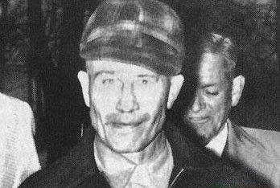
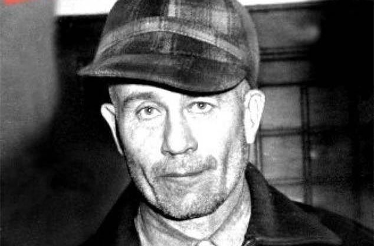
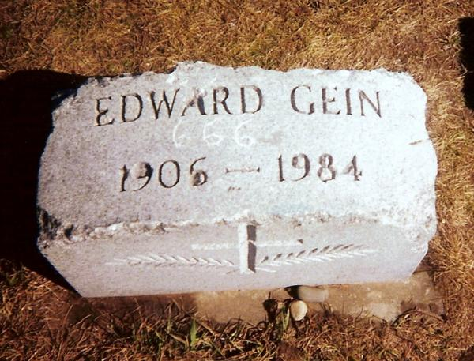

## 111年前的今天，《惊魂记》、《沉默的羔羊》、《德州电锯杀人狂》的真人原型艾德·盖恩出生

111年前的今天，三部最经典恐怖电影的真人原型艾德·盖恩出生

（万象特约作者：一一）

111年前的今天，1906年8月27日，三部最经典恐怖电影的真人原型艾德·盖恩出生

艾德·盖恩（Edward Theodore Gein，1906年8月27日－1984年7月26日）是美国最有名的连环杀手之一。虽然他“只”犯了三级谋杀，但他对其受害者的所作所为却震惊了整个世界。他犯了谋杀、毁尸、盗墓、食人和恋尸癖等罪。他的案件促成了很多恐怖电影的诞生，他是《惊魂记 》（希区柯克导演，获1961年第33届奥斯卡最佳导演奖提名）、《沉默的羔羊 》（获得1992年第64届奥斯卡最佳影片奖）、《德州电锯杀人狂》等电影的真人原型。

#### 挣扎的社会边缘人

1906年8月27日，艾德·盖恩出生在威斯康辛州的拉克罗斯郡。他的父亲是个酒鬼农夫，母亲是个极度严苛的天主教徒，他还有一个哥哥。

后来一家搬到偏僻的普莱恩菲尔德（Plainfield）。他们家有一小座农场，位于很偏远的乡间，隐密性很高，平常不会有陌生人去拜访。艾德一家可说是在穷困中挣扎的社会边缘人。

母亲对艾德的影响是最大的，她是一个狂热的天主教徒。她恐吓儿子们女人是危险的，沉浸女色是不道德的，用各种方法吓阻儿子们对异性的兴趣。艾德只被允许去学校上学而不被允许交任何朋友。在艾德心中，母亲占有崇高的地位。

艾德受其影响甚深，他从未约会过，而且一直是处男。他在生命中的前半段都循规蹈矩，除了在自家农场工作之外，偶尔会到镇上打打零工，赚点零花，在镇民眼中是个“很安静，有点古怪，害羞善良“的男人。

#### 所有亲人离世

但是平静的生命开始出现变数。首先，在他年近三十的时候，他的父亲过世了。接着他的哥哥死于一场仓库火灾。最后，他最爱的母亲，在1945年死于中风。就这样，四十岁的艾德突然发现自己孑然一身。他在世界上再也没有亲人，没有同伴，更没有妻子和儿女，他唯一拥有的，是一座贫脊农场，和空虚的人生。他和世界的疏离感越来越强。

当1945年12月29日奥古丝塔因癌症死去时，39岁的艾德无法控制地哭泣。对他来说，他的妈妈是他生命中唯一的女人。在警方后来的搜查中，屋内所有房间都脏乱不堪，除了奥古丝塔的卧室以外，这显示母亲在艾德心中崇高的形象。从他母亲去世开始，他扭曲的性格开始显露，他先是把母亲的尸体保留在家中，好像她从未死去。到后来更为了满足他对女性的欲望而去盗墓，把尸体剥皮并缝制成人偶。

#### 被判无罪的连环杀人凶手 

但他第一次亲手把活人杀死，却要等到1954年的12月8日（48岁），他把附近酒吧的职员玛丽霍根杀死并剥皮。

1957年11月16日（51岁），警方在调查杂货店主柏妮丝·沃登（Bernice Worden）失踪一案，他们怀疑艾德牵涉此案。警方进入他的房子，他们在厨房里发现了店主的尸体。另外他们在卧室发现一颗头颅，人皮做的灯罩和椅子、头骨做成的汤碗、被当作面包来烤的人心、嘴唇做成的项链、脸皮和乳房做成的背心、乳头做成的皮带以及著名的木乃伊人皮面具。

警方在他家中搜出了约15具已被肢解而不能确认身份的女性尸体，但艾德只承认从坟墓中挖出8具尸体。在询问之下，艾德很大方的承认最近自己曾经挖过墓，并将一个刚葬不久的中年女性尸体带回家，被砍掉脑袋、挖空内脏的尸体被倒吊在架子上，并用她的皮来做手工艺品。艾德也承认谋杀了1954年失踪的酒店职员玛丽·霍根（Mary Hogan）。艾德还坦承，他会穿上这些人皮服，假装自己是自己的母亲。

由于他患有慢性精神障碍症，因此被判无罪（笔者注：这实在对受害者家属太不公平）。他先被送到中央国家犯罪精神病院，后转送至门多塔精神卫生研究院渡过他的余生。在罹癌多时之后于1984年7月26日（78岁）不治去世，葬于其母墓侧。

相关电影介绍

【惊魂记】

《惊魂记》是环球宇宙公司出品的惊悚片，由阿尔弗雷德·希区柯克执导，安东尼·博金斯、珍妮特·利等主演。

该片讲述了玛莉莲在浴室中被精神分裂的狂人杀死，之后玛莉莲的姐姐和男友加入警方的调查，在逐步侦查下终于揭露狂人杀人真相的故事。1960年6月16日，该片在美国上映。

《惊魂记》不仅是阿尔弗雷德·希区柯克技巧最为纯熟的作品之一，同时也是心理恐怖惊悚片的开山之作。这部电影的价值首先在于它开辟了一个电影类型，精神问题导致的犯罪行为从此成为电影的主题，而相对于躲在门后惊吓观众的恐怖片，《惊魂记》对于人类心理直至精神层面的剖析使之可以登堂入室成为经典。

获1961年第33届奥斯卡4项提名（包括最佳导演），但并未获奖。

【德州电锯杀人狂】

《德州电锯杀人狂》是由美国新线电影公司发行，由托比·霍珀执导，玛里琳·伯恩斯、泰莉·麦克明、贡纳·汉森、艾伦·丹奇格联合主演的惊悚恐怖片。该片于1974年10月1日在美国上映。

影片改编自真实案件，讲述了身无分文的贩毒者途经德州特拉维斯镇，被变态杀人狂追杀的故事。

《德州电锯杀人狂》电影中充满了追逐的暴力血腥场面，尽管几乎没有剧情，但充满了前卫、时髦的元素，而且血腥场面惊人，恐怖效果极佳，是恐怖片的典范之作。后来被多次翻拍。

【沉默的羔羊】

《沉默的羔羊》是一部改编自托马斯·哈里斯同名小说的惊悚电影，由乔纳森·戴米执导，朱迪·福斯特、安东尼·霍普金斯等人主演。

该片讲述了实习特工克拉丽斯为了追寻杀人狂野牛比尔的线索，前往一所监狱访问精神病专家汉尼拔博士，汉尼拔给克拉丽斯提供了一些线索，最终克拉丽斯找到了野牛比尔，并将其击毙。

1991年该片在美国上映。1992年该片获得第64届奥斯卡奖最佳影片、最佳男演员、最佳女演员、最佳导演、最佳改编剧本5项奖项，此外还获得了第49届美国金球奖剧情类最佳影片、法国凯撒奖最佳外国电影等奖项。

