## nnnn姓名（资料）

### 成就特点

- 《中国历史地图集》
- 中国历史地理学主要奠基人
- 版图中国论的概念，
- 明确的中国范畴
- 论黄河安流
- 中国行政区划不合理

### 生平

谭其骧（1911年2月25日－1992年8月28日），浙江嘉兴人，是中国著名历史学家、中国历史地理学主要奠基人。

1911年2月25日，谭其骧出生于浙江嘉兴书香门第，谭其骧在2岁时就随父亲回到家乡，以后进家塾、小学、秀州中学。

1926年，高中未毕业，离校后在上海考入上海大学。1927年，因四一二事变后，上海大学被封，转入暨南大学历史系。清华百年历史上四大哲人之一潘光旦的赏识。1930年，论文《中国移民史要》，毕业于暨南大学历史系。

1932年毕业于燕京大学研究生院硕士学位。师从顾颉刚先生。

此后先后任教于辅仁大学、北京大学、燕京大学、清华大学等。

1934年，协助顾颉刚创办《禹贡》半月刊，筹备成立禹贡学会。

1940年春，到贵州浙江大学任史地系副教授。1942年，任贵州浙江大学任史地系教授。1946年，随浙大回到杭州，并给上海暨南大学兼课。

1950年，浙江大学被迫停办历史系，他转到上海复旦大学。

1951年加入九三学社。

1955年，经吴晗推荐，到北京主持《中国历史地图集》的编绘。

1957年至1982年间任历史系主任，其间创立了历史地理研究室。

1978年2月，因长期紧张工作所累，谭其骧突发脑血栓，不久又致半身不遂。

【黄河安流】“大跃进”时期，在大批树木被砍去炼钢时，谭其骧撰写了论黄河安流的文章，指出黄河决徙病源在于植被遭到破坏，从而导致严重水土流失。《何以黄河在东汉以后会出现长期安流的局面》一文，提出以牧业为主的民族迁入中游地区和人口锐减造成前农垦区缩小，客观上减少了水土流失量，是黄河长期安流的决定因素。

1980年，成为中国科学院院士。1982年至1986年，历史地理研究室成为历史地理研究所，谭其骧出任所长。

1982年至逝世，他又主持了《中华人民共和国国家历史地图集》的编绘，这将是一部包括历史人文和自然两方面十多个专题图组上千幅地图的巨型地图集，将在近年出版。（2014年出版，第三届中国出版政府奖2013）

1983年，加入中国共产党。

1992年8月28日，因病医治无效，在上海逝世，享年82岁。

谭其骧是第三、四、五届全国人大代表。他是中国地理学会的发起人之一，历任理事。

【中国历史地图集】谭其骧主编的《中国历史地图集》，从1950年代初开始编撰，直到1980年代初才开始正式出版，是当代中国历史、历史地理研究的重要参考资料。

1993    国家图书奖荣誉奖    中国历史地图集    （获奖） 

1991    被美国传记研究所列为最近25年间对世界有重大影响的500位人物之一

此外，谭其骧还主编了《简明中国历史地图集》、《中华人民共和国国家历史地图集》并有《长水集》、《长水集续编》等历史论文集。

谭其骧长期从事中国史和中国历史地理的教学和研究，他对中国历代疆域、政区、民族迁移和文化区域做了大量研究，对黄河、长江水系、湖泊、海岸变迁均有精辟见解，建树颇多。主要著作有《长水集》《长水集续编》等。

【版图中国论】谭其骧在其著作《历史上的中国和中国历代疆域》提出了版图中国论的概念，他认为现代的中国人不能拿古人心目中的"中国"作为中国的范围。也不能拿今天的中国范围来限定我们历史上的中国范围，而是清朝鼎盛版图的范围为中国历史上的范围，在这个范围之内活动的民族，都是中国史上的民族；在这个范围之内所建立的政权，都是中国史上的政权。对于高句丽，当其定都现中国境内时，就是中国历史上的政权。但是等到公元427年迁都朝鲜半岛时，就不是中国历史上的政权了，不管其在朝鲜半岛还是中国东北的领土都不是中国历史上的范围。从而成为大陆历史观的标准之一。

【中国行政区划不合理】谭其骧认为中国行政区划不合理，表示：“中国现行的沿袭元明清旧制的一级行政区划极不合理，一是许多省区不符合自然、经济和人文区域，二是多数省区太大。这种区划状况不仅阻碍经济发展，并且也不利于社会和谐、政治稳定，有必要予以改变。也就是说，通盘制定适应中国当前和今后国境治理、经济发展的新的行政区划，应该就在近期内列入国家大事类的议事项目之内。”

【论曹操】

五十年代末期,郭沫若先生接连发表了几篇为曹操翻案的文章,主张替曹操恢复名誉。于是,对曹操的评价问题便逐渐引起了全国史学界、文学界和戏剧界的热烈讨论。

1959年3月，郭沫若的《论曹操》一文在《文汇报》发表，提出为曹操翻案。其后，谭其骧觉得其中不少论据站不住脚，发表了商榷文章。

在商榷文章中，谭其骧列举了古人对曹操的评价也是有毁有誉，甚至连司马光的《资治通鉴》中的评价，也几乎是全盘接受了曹魏本朝臣子王沈的话。

在这篇论文中，谭其骧首先指出，对曹操不存在翻案的问题。“说是替某人翻案，无论正翻反也好，反翻正也好，总得新的评价和旧的评价完全相反或基本上相反，才算得上翻案。”但“自古及今，果然有很多人说曹操坏，却也有不少说他好，也有人在某些方面认为他好，同时在某些方面又认为他坏的”。

谭其骧具体论述了曹操的历史贡献，归纳为四项大功：1．结束了汉末豪族军阀间的混战，统一了北方。2．征服了乌丸和鲜卑，保障了边境的安宁。3．打击了名门豪族，在一定程度上抑制了兼并，澄清了吏治。4．恢复了生产，在一定程度上还发展了生产。同时指出了曹操的四项罪过：1．打了农民起义军。2．曹操一生打的仗大多数属于统治集团间内部的战争。为了结束混战，求取统一，这些战争是不可避免的，但他在战争过程中杀人太多，这也不能不算是一大罪。3．摧抑豪强兴办屯田诚然对人民有利，但所谓屯田制，实际上是一种用军事手段强制束缚军民在土地上进行官六私四或对半分的高度剥削的制度。并且不论是佃兵（军）或屯田客（民），由于他们的劳动生产得受政府设置的农官的直接管辖，身分因而降落，走上了农奴化的道路。4．在道德品质方面，他的忌刻残忍实在也是不可饶恕的。

他直截了当地提出：“评价历史人物，应该是是非非，尽可能做到恰如其分，不应该恶之则恨不得把他打入地狱，爱之则唯恐捧不上天。在郭老的笔底下，似乎曹操简直没有什么不是，即使有也算不得什么大不是，我看郭老这种看法在许多地方是值得商榷的。”

谭其骧的结论是：“总之，曹操是一个有优点、有缺点，功劳很大，罪孽也不小的历史人物。从全面看问题，总的评价应该是功过于罪。但我们不能，也用不着因为他有功而讳言其罪。过去有许多人并没有把他说成是罪过于功，所以这案子基本上无需翻。若一定要把他犯的罪也翻过来，说是并无其事，或虽有其事，但算不得罪，那恐怕是翻不过来的，因为那是历史事实。”

蔡文姬《胡笳十八拍》的争论

谭其骧也进而研究了有关论文，于7月3日写成《蔡文姬的生平及其作品》一文，与郭沫若等人商榷。原来参与争鸣的刘大杰、刘开扬、李鼎文、王达津等都是从文学史的角度入手的，而谭其骧“就当时的历史事实，作者的生平经历和作品中所描叙的事物情景相互予以参证，从而对这整个问题中所包含着的各个问题，即作者生平的各个阶段和各篇作品的真伪，一一提出我的不成熟的看法”；在这场讨论中别树一帜。

认为《胡笳十八拍》是一篇能够相当深切体会蔡文姬心情的、感情炽烈而逼真的动人的好诗，但它是出于去蔡文姬时代已远，不了解蔡文姬的时代背景及其经历的一位作者之手的一篇拟作。

郭沫若对不同意见一般都要著文加以反驳，但对谭其骧这三篇论文居然始终保持沉默，没有作出任何反应。

### 照片

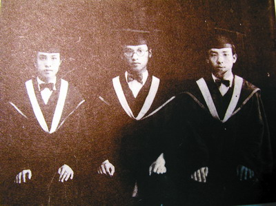

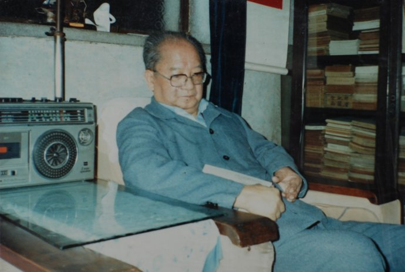

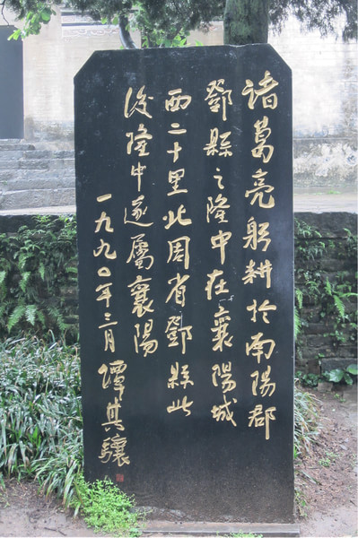

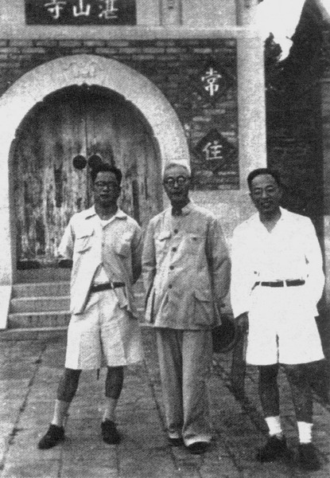

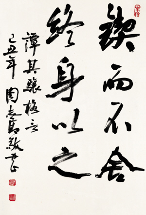

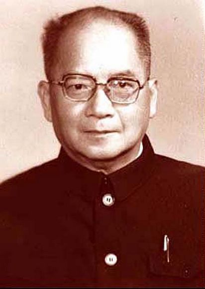

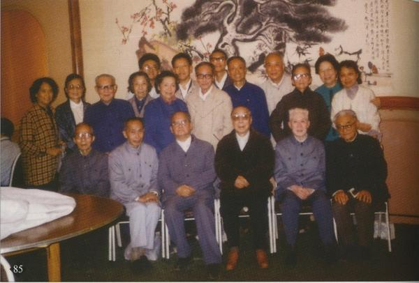

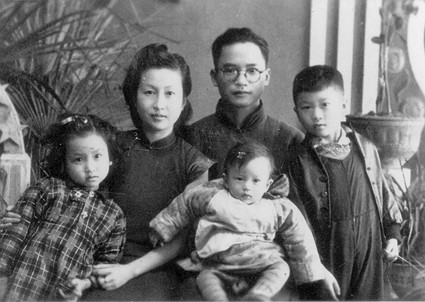

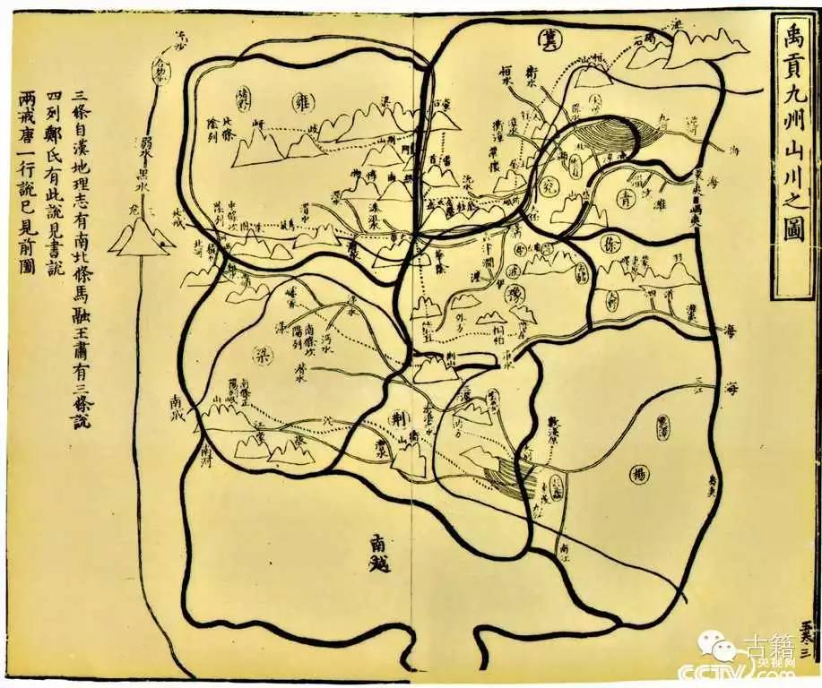

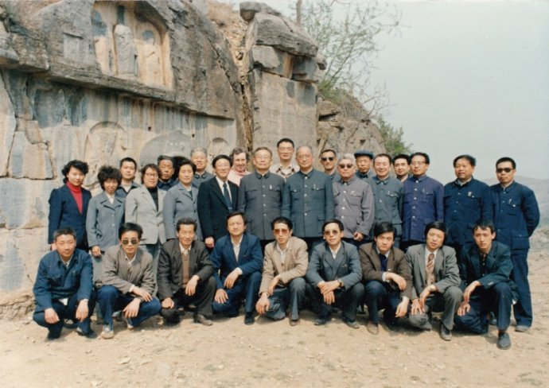

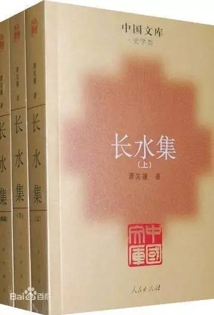

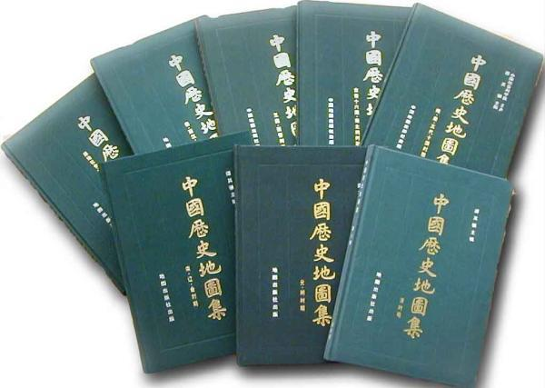