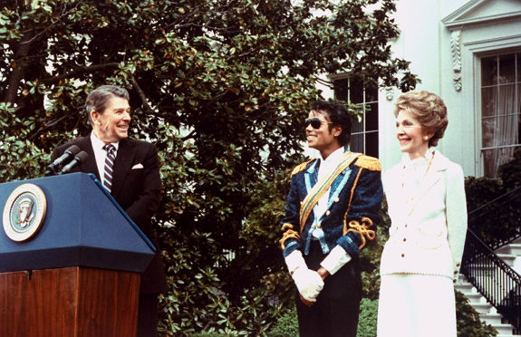
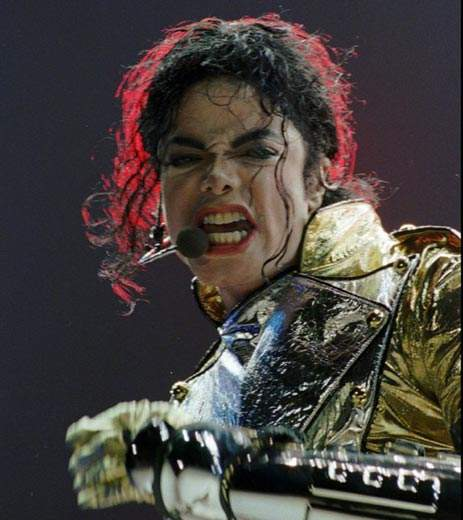
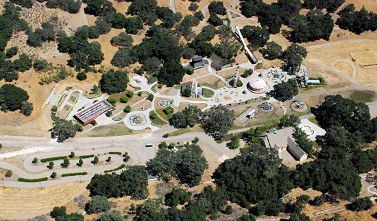
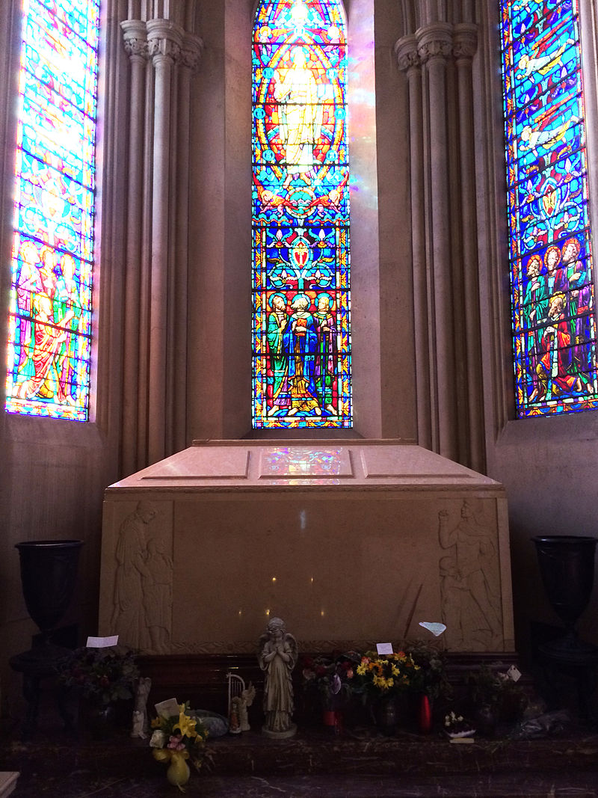

## nnnn姓名（资料）

### 成就特点

- “流行音乐之王”（King of Pop）
- 全球流行文化的代表人物超过四十年
- 1982年所发行的专辑《颤栗》是迄今为止全球销量最高的专辑。
- 一些由他所命名的如“机械步”和“月球漫步”之类的舞蹈技术
- 两次入选摇滚名人堂的艺术家之一
- 唯一一位进入舞蹈名人堂的流行艺人
- 13个格莱美奖以及“格莱美传奇奖”和“格莱美终身成就奖”；26个全美音乐奖，为所有艺人之最
- 拥有13个美国冠军单曲
- 外貌变化
- 性侵害儿童案件

### 生平

59年前的今天，传奇、传奇、传奇、传奇的迈克尔·杰克逊诞生

59年前的今天，传奇传奇传奇的流行音乐之王迈克尔·杰克逊诞生

展露头角的黑人兄弟

1958年8月29日，迈克尔·杰克逊出生在美国印第安纳州。家中属于非裔工薪阶层，十个兄弟姐妹中排行第八。父亲是一位钢厂工人，在一个节奏布鲁斯乐队演奏。1964年，杰克逊加入由哥哥们创建的乐队，乐队称为“杰克逊五人组”。

1966至1968年间，乐队在美国中西部巡演，常在黑人俱乐部演出。1968年，乐队签约摩城唱片公司。1972到1975年间，杰克逊与摩城唱片合作发行了四张个人专辑，但成绩平平。

1978年，杰克逊出演音乐电影《新绿野仙踪》，与著名音乐创作人昆西·琼斯结识。不久，两人共同出品了专辑《墙外》。1979年，《墙外》成为首张诞生了4支美国前十单曲的专辑，全球销量超过2000万。1980年，杰克逊因此获得三项美国音乐奖、公告牌年终奖与一项格莱美奖。

（杰克逊（中间）作为杰克逊五人组的成员，摄于1972年）

让世界为之《颤栗》

1982年末，专辑《颤栗》的发行获得了更大的成功，为杰克逊赢得了7个格莱美奖和8个全美音乐奖。《颤栗》成为美国有史以来销量最高的专辑，也是全球销量最高的专辑，据估计销量达到6500万张。（2009年3月，《颤栗》被美国唱片业协会认定销量为2900万）

专辑《颤栗》在公告牌占据第一名的位置长达37周，并且在前十停留了连续的80周。这也是第一张拥有7首十强单曲的专辑，包括《比利·简》、《避开》、《Wanna Be Startin' Somethin'》等。杰克逊还发布了14分钟长的僵尸题材的《颤栗》MTV，震惊世界。

《时代》杂志这样描述杰克逊：“唱片之星，广播之星，摇滚音乐影片之星。一位拯救了音乐事业的人。一位拥有奇幻双脚的舞者。一位打破所有品味、风格和肤色障碍的歌手”。《纽约时报》写到：“在流行乐坛，只有迈克尔·杰克逊和其余所有人”。

停不下来的月球漫步

1983年3月25日，迈克尔与其他摩城唱片的明星进行了一场传奇性的现场表演，作为NBC的电视特别节目，命名为《摩城唱片25周年：昨日，今日，明日》。节目5月16日播出，收视率达了4700万。

表演中，杰克逊独唱《比利·简》，他身穿特制的带有亮片的黑色夹克，手戴莱茵石镶嵌的高尔夫手套，表演了他招牌的月球漫步，所有观众为之疯狂。有人说：“我惊呆了，这就像魔术一样，迈克尔·杰克逊进到了轨道上，根本停不下来。”

1984年1月27日，杰克逊为百事可乐拍摄广告，期间烟火烧伤了杰克逊，导致他头皮二级烧伤。杰克逊为了掩盖头皮上的疤痕进行了治疗，不久又第三次进行鼻整形手术。

1985年，他与莱昂纳尔·里奇合作的慈善歌曲《天下一家一家》（We Are the World），以关爱美国和非洲的贫困儿童为主题，跻身历史上销量最高的单曲行列，销量接近三千万。

（里根总统与第一夫人南希·里根为杰克逊颁奖，1984年）

谣言四起的怪人杰克

杰克逊从小的肤色就是深棕色，但之后逐渐变白，谣言称他可能在漂白皮肤。但根据后来的传记和尸检报告，其实他是得了白癜风和红斑狼疮，因而对阳光很敏感，显得非常苍白。

1986年，有消息称杰克逊为延缓衰老在高压氧舱里睡觉，并配有照片。杰克逊买了一只黑猩猩，报道称他脱离现实。还有报道称杰克逊试图购买“象人”约瑟夫·梅里克的骨头。开始他认为这些故事能提高他的知名度，但后来，这些报道越来越惊人，越来越匪夷所思。

因此，他得到了一个自己很厌恶的昵称“怪人杰克”。杰克逊对自己的传记作者说：“干脆跟人们说我是从火星来的外星人得了，告诉他们我生吞活鸡，在午夜时分跳巫婆之舞。你说什么人们都信，因为你是记者。”

《飙》向全世界

1986年9月，杰克逊拍摄了17分钟长的3D电影《伊奥船长》，在佛罗里达的迪士尼和艾波卡特内播映；1987年3月，在日本迪士尼公园播映；1992年，在巴黎迪士尼播映，大受欢迎。

1987年，杰克逊五年内第一次推出新专辑《飙》。其中《止不住的爱恋》（I Just Can't Stop Loving You）、《飙》、《你给我的感觉》、《镜中人》以及《肮脏的戴安娜》（Dirty Diana）成为了冠军单曲，是在Hot 100榜单上拥有冠军单曲最多的专辑。截止到2012年，这张专辑在全球销量约为3000-4500万。

飙世界巡回演唱会于该年9月12日开始，次年1月14日结束。仅在日本巡演就吸引了57万观众。在英国温布利体育馆进行7场演出时，有50.4万观众，创造了吉尼斯世界纪录。巡演期间，共举办了123场演唱会，观众总数约440万。

1988年，出版了他唯一的一本个人传记《月球漫步》，卖出20万本，登上了《纽约时报》畅销榜的首位。

（杰克逊于1988年在他破纪录的飙世界巡回演唱会上表演）

《治愈世界》的梦幻庄园

1988年3月，他在加州买下11平方公里的土地，建造梦幻庄园私人公园，里面有摩天轮、动物园、影院等等。1989年，伊丽莎白·泰勒给他颁奖时，宣称他是“流行乐、摇滚乐和灵乐的真正王者”。“流行音乐之王”的称号风行。

1991年，发行了他的第八张专辑《危险之旅》，专辑中首次加入饶舌的曲风。截止到2013年，专辑在美国售出了700万，全球销量大约3000万。危险之旅世界巡回演唱会于1992年6月27日展开，1993年11月11日结束。在70场演唱会中共有350万人到场，收入超过1亿美元。

1992年，根据歌曲《治愈世界》，创立了治愈世界基金会。慈善组织将贫困儿童带到杰克逊的梦幻庄园，享受主题公园的游乐设施。

1993年1月，杰克逊在第27届超级碗的中场休息时段现身。表演一开始，杰克逊从舞台下方跳出，与此同时他身后的焰火绽放开来。他一动不动的站着，“紧握着拳头，犹如雕像的姿态”，身穿金色和黑色相间衣服，头戴太阳镜。他保持一动不动的姿态长达一分半钟，观众持续的欢呼。他然后缓缓地摘下太阳镜，扔向人群，演唱了四首歌曲：《困境》（Jam）、《比利·简》、《黑或白》和《治愈世界》。

（1992年，杰克逊的演出）

性侵儿童与猫王之女

1993年夏天，杰克逊被一位13岁男孩和他的父亲指控性侵犯儿童。8月，在杰克逊的家里，搜查出有裸体男孩的书籍和图片。12月，对杰克逊进行了裸体检查。检查的结果显示，13岁男孩正确描述了杰克逊患有白癜风症状的臀部、短阴毛、有粉色和棕色斑点的生殖器官。

然而，事件的调查却没有定论，且没有提起任何的诉讼。1994年1月1日，杰克逊与钱德勒以2200万美元的金额庭外和解。

1994年5月，杰克逊与猫王的女儿结婚，性侵儿童案让两个人走到了一起。他们的婚礼在多米尼加共和国秘密地举行。两人的婚姻持续了不到两年的时间，以友好的离婚协议而结束。

结婚生子的《历史》

1995年，他发行了双唱片专辑《他的历史：昨日，今日，明日》。第一张唱片名为《History Begins》，是精选集；第二张唱片名为《History Continues》，包括了13首新歌及2首翻唱歌曲。专辑是有史以来销量最多的多唱片专辑，全球的销量达到2000万套（4000万张）。

历史世界巡回演唱会于1996年9月7日展开，1997年10月15日结束。横跨了五大洲的35个国家，在58个城市的82场演唱会上表演，共计450万歌迷入场，总收入高达1.65亿美元。

在巡演期间，杰克逊与多年的朋友皮肤科护士黛比·罗薇结婚。1997年2月13日，他们的第一个儿子出生。第二年4月3日，女儿出生。1999年，两人友好离婚。

《万夫莫敌》的再次性侵案

2001年10月，新专辑《万夫莫敌》发布。2002年，杰克逊的第三个孩子出生，昵称“毯子”。孩子的生母未知，据说孩子是使用他的精子与代孕母亲通过人工授精产生的。

从2002年5月开始，杰克逊允许一个纪录片剧组跟随着他拍摄。纪录片命名为《迈克尔·杰克逊大追踪》，于2003年3月播出。片中有一个极具争议的镜头，是关于杰克逊与一名年轻的男孩牵着手，讨论住宿的安排。

2003年11月，杰克逊被捕，并受到了与片中13岁男孩相关的7项性侵犯儿童和2项施用酒精的指控。2005年1月31日开始，对杰克逊的审判，持续了5个月。6月13日，杰克逊被宣判所有指控均不成立。

2006年3月，梦幻庄园被迫关闭。

《就是这样》的历史时刻

2009年3月，杰克逊宣布举行名为《就是这样》的巡回复出演唱会。杰克逊称这可能是他“最后的谢幕”。演唱会最初的计划是在伦敦举行10场，之后去往巴黎、纽约和孟买。演唱会定于2009年7月13日开始，于2010年3月6日结束。在伦敦首演前不到三周，所有场次的演唱会门票全部售罄。

然而，2009年6月25日，杰克逊在他位于洛杉矶的住处逝世。经证实，在杰克逊死亡的时候已经被施用异丙酚、劳拉西泮以及咪达唑仑。他的私人医生被指控过失杀人罪。

杰克逊逝世这条新闻迅速在网络上迅速传开，谷歌遭到数以百万计的人搜索“迈克尔·杰克逊”，以为遭遇到了DDoS攻击，所以关停搜索长达30分钟。维基称在不到一小时内有将近一百万人访问杰克逊的生平，这可能是维基百科历史上访问量最多的一小时。

美国在线即时通讯瘫痪了40分钟。美国在线称这是“互联网历史上一个有重大意义的时刻”，又称“无论从广度还是深度来看，我们从来没有见过这样的事情。”在新闻传开后，大约15%的推特，或者说每分钟5,000条推文提到了杰克逊。杰克逊的逝世占据《太阳报》的头版头条长达两周。美国三大电视网络的晚间新闻，ABC世界新闻、CBS晚间新闻以及NBC晚间新闻，多达34%的时间都在报道杰克逊。

2009年9月3日，杰克逊在加州格伦代尔森林草坪纪念公园下葬。传奇巨星杰克逊《就是这样》。

（杰克逊的墓地）

### 照片

