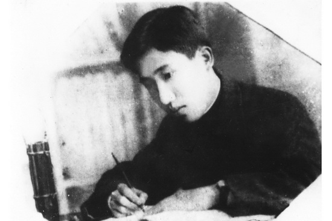
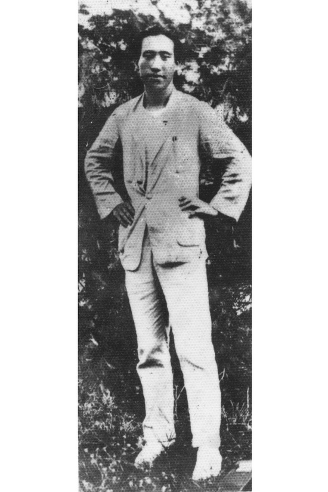
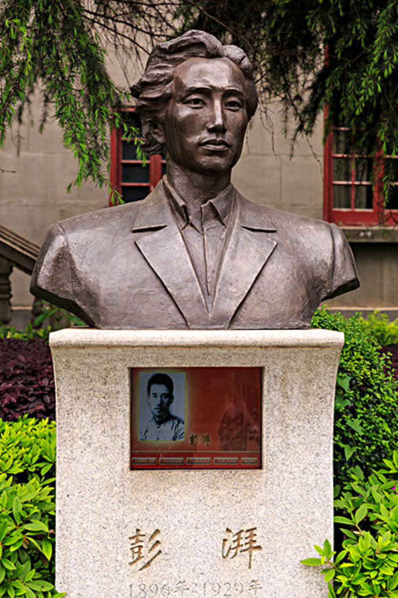
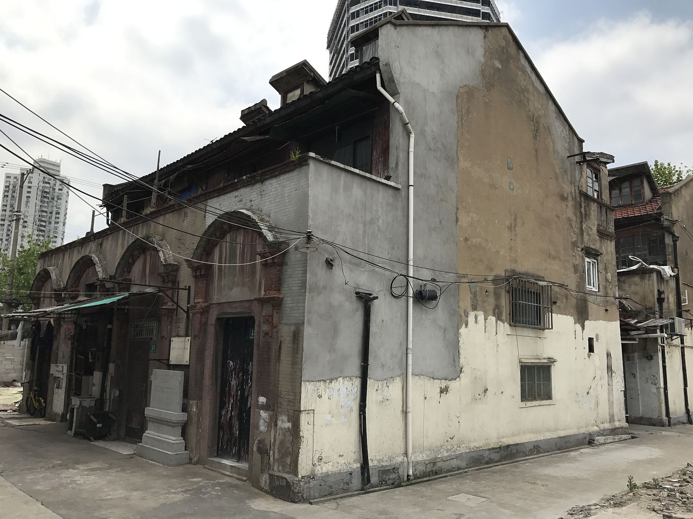
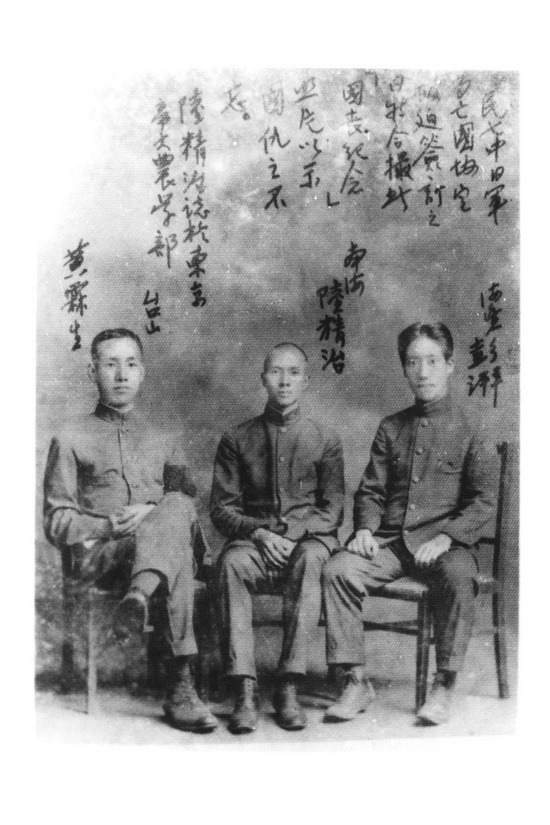

## nnnn姓名（资料）

### 成就特点

- 毛泽东称其为中国“农民运动大王”
- 出生地主家庭
- ​

### 生平

彭湃（1896年10月22日－1929年8月30日），原名彭汉育，1896年10月22日，出生在中国广东省海丰县一个地主家庭，中国共产党早期领导人之一，民国时期中国农民运动的领导人，毛泽东称其为中国“农民运动大王”。他认为土地和农民问题是1920年代初中国诸多社会问题中最根本的问题。

1896年10月22日，彭湃生于广东省汕尾市海丰县，出身地主家庭，但颇受母亲周凤的穷苦农家身世背景影响。10岁时父亲病逝。

有兄弟姐妹七男四女。1901年（5岁）彭湃进海城七圣宫读私塾。1903年（7岁）进林祖祠小学读书。1906年（10岁）父与嫡母相继去世。1909年（13岁）进海丰县第一高等小学读书。

1912年（17岁）彭湃与鹿境乡蔡素屏结婚。1913年（18岁）进县立海丰中学读书。

【留日黑名单】1917年前往日本留学，就读于早稻田大学政治经济科。留日期间亲历了日本发生的米骚乱，并深受俄国发生的1917年十月革命、中国发生的五四运动等第一次世界大战后的重大事件影响；曾因参加反对日本瓜分侵略中国的集会游行被日本警察殴伤、列入黑名单。最终由基督徒转变为社会主义革命者。

1921年夏返回中国。应海丰当地学联会学生的请愿，主政广东的陈炯明责成海丰县长任命彭湃出任海丰县教育局局长。1921年加入社会主义青年团。

1922年夏，由于组织学生游行庆祝“五一劳动节”，被撤去海丰县教育局长职务。

【农会】

1922年（27岁）7月29日晚上，彭湃与另外5位农民组成全国第一个农民协会——六人农会。

此后开始从事农民运动。为发动、组织农民，成立农会，当众烧毁自家祖传田契，将自己的农田分给农民无偿耕作，同时自己过着俭朴的农民生活。

农会里可以得到免费医疗、农业指导；并调解婚姻、债务、土地所有权纠纷，也提供人身保护。农会经常散发简单的图表，用以描述地主对农民的剥削。并把农民的贫困和生活中各种遭遇编成标语和口号，广为散播。

1923年1月1日元旦，领导成立海丰县总农会，并当选为会长，时会员达2万户，农会人口有10万人，约占全县人口的四分之一。海丰农会发展迅速，并扩大至惠州地区及广东全省，同年5月广东省农会成立，彭湃获推选为广东省农会执行长。

1923年夏（7-8月），海丰台风受灾，造成农业大损失，农会提出减租70%等意见；时任县长等拒绝，并与陈炯明部下一起解散农会，抓捕通缉农会骨干。彭湃等人逃离后与陈炯明周旋，使被捕农会骨干得以获释。

1924年4月转为中国共产党党员。

1924年孙中山在广州召开了国民党第一次全国代表大会，重新解释了三民主义，确定了“联俄、容共、扶助农工”的三大政策，彭湃以个人身份加入国民党，出任国民党中央农民部秘书。他提议农民运动的实施方案，被国民党中央执行委员会通过。

同年6月30日，国民党中央执委会根据彭湃的提议，决定开办广州农民运动讲习所（农讲所，当时全称“中国国民党中央执行委员会农民运动讲习所”），彭湃担任第一届和第五届农讲所主任。

【第一部农民运动著作】

彭湃在创办主持农讲所期间完成了《海丰农民运动报告》，在国民党中央农民部主办的《中国农民》上连载，后改名为《海丰农民运动》。这本书是中国共产党最早的一部农民运动著作，对后来毛泽东写的一系列关于农民问题的文章包括《湖南农民运动考察报告》，也产生了重要的影响。

1925年2月、9月，许崇智、蒋介石、周恩来率领以黄埔军校校军为主力的孙中山部发动两次东征，最后击溃陈炯明的部队，海丰县农会于1925年3月恢复。

1927年4月12日蒋介石领导的国民党的部分势力在上海开始清党，捕杀中共成员和国民党左倾党员 ，并成立南京国民政府，与武汉国民政府对立。彭湃时任武汉国民政府中华全国农民协会执行委员兼秘书长，被南京国民政府通缉。

4月底，中国共产党第五次全国代表大会在武汉召开，彭湃当选中央委员。7月2日，汪精卫武汉政府宣布解散共产党机关。

八一南昌起义期间，彭湃参加前敌委员会，参与领导南昌起事，撤出南昌后随军南下广东 ；在8月7日举行的中共中央紧急会议“八七会议”上当选为临时中央政治局的正式委员。

【第一个苏维埃政府】

1927年10月，发动海陆丰暴动，占领海丰、陆丰两县。1927年11月21日，成立海陆丰工农兵苏维埃（工农兵民主）政府，为最早的中国苏维埃地方政权，形成割据势力。

制订和颁布了“土地革命法规”，主张“一切田地归农民”，实践“耕者有其田”。

彭湃在海陆丰地区有着非常高的威望，彭湃成为实际上最高决策者，拥有所有权力，[8] 他当时的职务是“中国共产党东江地区特委书记”。

红宫红场位于汕尾市海丰县城，面积为1850平方米，是第一个苏维埃政权的革命活动场所。1961年3月4日国务院颁布海丰红宫红场旧址为全国重点文物保护单位。1986年在红场中心安放了彭湃烈士铜像，后成为第三批全国爱国主义教育示范基地、广东省爱国主义教育基地。

【以牙还牙】

因“四一二”清党开始的“白色恐怖”地主得势时采用恐怖手段滥杀农民、农会成员，而当地农民复仇时则以牙还牙也采取恐怖的方式折磨虐杀反对者。40万人口的海陆丰地区，适时有超过5万名民众逃离到香港、广州避祸。目前没有史料证明彭湃有过试图阻止屠杀的行为。

1928年2月29日，苏维埃政权被政府军击溃，彭湃率领残部撤至大南山地区。同年10月，受上海的中共中央指令，彭湃离开广东，绕道香港转往上海。

1928年7月，彭湃在中国共产党第六次全国代表大会上当选为中共中央政治局委员，同年底任中共中央农委书记兼江苏省军委书记。

【被杀和复仇】

1929年8月24日，由于军委秘书白鑫的招供，彭湃、杨殷、颜昌颐、邢士贞、张际春5人在上海公共租界新闸路经远里白鑫家中举行江苏省军委会议时被捕。彭湃在狱中屡遭酷刑，拒屈，8月30日被国民政府淞沪警备司令部秘密枪杀于上海龙华刑场。当时刊登在上海报刊上的法院判决文是判处彭湃、杨殷等八年的有期徒刑。

同年11月11日夜，周恩来组织陈赓、顾顺章等中共中央特科人员在法租界霞飞路和合坊将白鑫杀死。

1928年至1933年，彭湃家人共有八人丧生，其中六人被中华人民共和国追认为革命烈士。

为纪念彭湃、杨殷，当时中国共产党曾在其根据地的许多地方建立了“彭杨红军学校”，即现在的中国人民解放军国防大学的历史前身之一。

彭湃曾就读过的海丰县立中学改名为彭湃纪念中学。

【文革迫害】

1956年彭母周凤赴北京受到毛泽东、周恩来、刘少奇等人的接见，获誉为“革命母亲”。1966年文革开始，海丰发生了反彭湃事件； 彭湃的堂侄彭科于1967年被斩首示众（涉案者文革后被追究法律责任）；曾任海丰县长的彭湃三子彭洪从广州华南农学院水稻生态研究所被抓到海丰批斗，1968年遭残害致死。文革结束后，1978年，习仲勋主政广东，为彭湃亲属和大批有关受牵连的人员平反。

彭士禄，彭湃次子，中国工程院院士，中国核动力科学家，“中国核潜艇之父”，中国核电站主要设计者领导者。

### 照片

