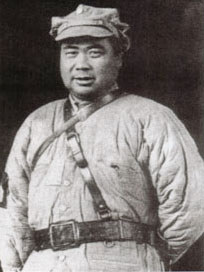
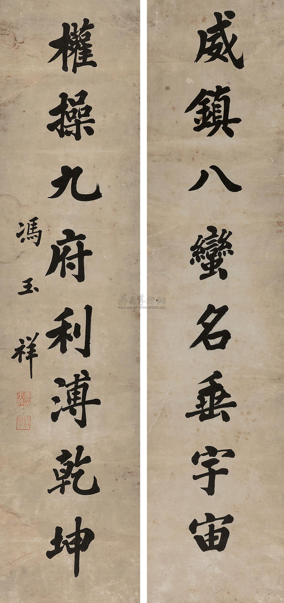

## nnnn姓名（资料）

### 成就特点

- 瞎编出来的名字
- 大嗓门
- 北京政变，赶走溥仪
- 五原誓师（去苏联）
- 三姓家奴（变来变去）、八姓家奴、倒戈将军
- 中原毁佛
- 抗日同盟军，任总司令

### 生平

冯玉祥（1882年11月6日－1948年9月1日），安徽巢县（今巢湖市夏阁镇竹柯村）人，生长于直隶省保定府（今河北省保定市）。民国军阀，本属直系军阀，第二次直奉战争中倒戈，改所部为国民军，后败退西北，自成势力。西北军领袖。1935年，晋任国民革命军陆军一级上将军衔。

1882年11月6日，冯玉祥出生。父亲冯有茂是淮军，驻扎保定府，因此保定成了冯玉祥儿童时代的养育之地，第二故乡。冯玉祥一生都是保定府口音。冯玉祥的父母早年都染有鸦片的嗜好。当时因为生活艰难，营养不足，冯有茂的七个儿子死了五个。

1892年（10岁），营里有一个兵额，营里决定给冯有茂的儿子补缺，因被别人抢去兵额，来不及问，就给直接编造了一个名字“冯御香”登记入册，后改为“冯玉祥”。从此，就叫冯玉祥。

从此，冯基善就更名为冯玉祥，才11岁，不用随营操练，发饷时到营中应名领饷外（步兵，每月3两6钱银子），其余时间仍在家中过活。这在保定府的淮军，叫做“恩饷”。

12岁时，结束了1年零3个月的私塾教育，入保定练军营拿枪操练。后来冯玉祥的父亲因伤丢了差事，断了经济来源。冯玉祥为了多挣一点银子，就十年如一日在教场练喊队列口令想成为传令教习，结果练出一副惊人的大嗓门。

1896年，冯玉祥加入淮军，1902年改投袁世凯的武卫右军。1911年担任由武卫右军改编而成的新编陆军第二十镇第八十标第三营管带，曾参与滦州起义。

1914年7月，冯玉祥任陆军第七师第十四旅旅长，参加镇压白朗起义。

【第十六混成旅旅长】

9月，任陆军第十六混成旅旅长。1915年，奉令率部入川与讨袁的蔡锷所部护国军作战，曾一度击败蔡锷，获袁世凯颁发三等男爵。后暗中与蔡锷联络，于1916年3月，议和停战。

1917年4月，被免去第十六混成旅旅长职，7月率旧部响应段祺瑞的讨伐张勋复辟，复任第十六混成旅旅长。

1917年冯氏皈依基督教并受洗，还利用宗教力量来控制军队，故有“基督将军”的称号。

【护法军】

1918年2月，护法运动中被段祺瑞命令率部南下攻打孙中山、陆荣廷的护法军，冯玉祥在湖北武穴通电主和，被免职留任。6月，率部攻占湖南常德后，被撤销免职处分。

【徐树铮恩仇】

6月14日，段祺瑞的心腹徐树铮杀死冯玉祥夫人的姑父、主张南北议和、支持直系军阀的北洋元老陆建章。11月，段祺瑞为了安抚冯玉祥任命他为湘西镇守使。1925年，冯玉祥杀死徐树铮为陆报仇。

1921年8月，任陆军第十一师师长，从属直系军阀，率其部队入陕西，在陕西督军阎相文自杀之后，接任陕西督军，并以此地为地盘扩充，受到苏联大力支持壮大，其军队因此被称为“西北军”。

【直奉战争】

1922年，第一次直奉战争中，出潼关，击败河南督军赵倜，任河南督军，因妄杀降将宝德全，被吴佩孚撤去河南督军，赴京面见曹锟，曹改任其为陆军检阅使。

【北京政变】

1924年10月，第二次直奉战争时，负责在热河一路抵抗奉军，在参战途中，接受奉军张作霖50万银元的贿赂，率军返回北京，发动北京政变，推翻北洋政府，囚禁总统曹锟，逼其弟曹锐自杀，脱离北洋军系，改其部为“国民军”，电请孙文北上。导致山海关一路的吴佩孚失败。于11月5日驱逐清朝逊帝溥仪出紫禁城。后因无法抗拒直、奉系军阀的压力，请来段祺瑞主政，遭到排挤。

【五原誓师】

1925年底，冯玉祥参加反奉战争，1926年1月1日兵败后通电下野，赴包头。

4月9日，国民军再度发动政变，逼走段祺瑞，释放曹锟，但随后因军事上失利，不得不撤出北京，在南口坚守。5月，冯赴苏联考察，同年8月回国。国民军在南口坚守四个月后，于8月退回西北。

9月17日，冯在绥远五原誓师，任国民革命军联军（后改国民革命军第二集团军）总司令，宣布所部加入中国国民党。在击溃刘镇华的镇嵩军之后，率领西北军东出潼关参加国民革命军北伐，为国民革命军指挥官之一。

9月初，冯玉祥到达山西五原。国民军的流散部队，听说冯玉祥回国，纷纷携枪归队。冯在同于右任、邓宝珊等人商量过之后，决定成立国民军联军。同年9月17日，国民军在五原城内举行了誓师授旗典礼，冯玉祥宣布成立国民军联军总司令部，并就任联军总司令。参加典礼大会的有官兵万余人。誓师会上还举行了易旗仪式，将五色旗更换为青天白日旗。冯玉祥当场宣布：为表明国民军忠于孙中山的三民主义，决心出师北伐，国民军全体将士加入中国国民党；并郑重地向全国发出誓师宣言。会后，冯玉祥、于右任扛着红旗，率领全体官兵在五原街上游行。誓师大会后成立了国民军联军总司令部，鹿钟麟任总参谋长，刘伯坚任政治部副部长，聘请苏联顾问乌斯曼诺夫为政治军事顾问。随即率部参加北伐战争，出师甘、陕，11月解西安之围。

1926年，北洋军阀刘镇华包围西安8个月之久，使西安人民饿死4万多人，直到冯玉祥将军率国民军击败刘镇华后西安才得以解围。1928年，时任陕西省主席宋哲元为纪念冯玉祥的历史功绩在西安城墙特开一门，此门位于西门以北，又叫小西门，取名玉祥门。

1927年4月，宁汉分裂之后，先在郑州与汪精卫会面，后在徐州与蒋中正会面，最后选择与身在南京的蒋中正合作，应蒋中正要求，清除西北军内部的中国共产党人-将西北军中的中国共产党员“礼送出境”。

【中原毁佛】

1927年，笃信基督教的冯玉祥在河南废寺逐僧，将大相国寺改成市场。并发动全省毁佛运动，所有比丘、比丘尼一律驱逐。所有寺产没收，寺院改为学校，或作救济院、图书馆，或成为娱乐场所。继河南之后，直、鲁、秦等各行省，也都纷纷跟从，华北佛教因此几乎衰绝。

1929年4月，冯玉祥不满国军编遣会议比例式裁兵原则的决议，称病离开南京。5月14日于潼关出任“护党救国军西北军”总司令，但迅速被南京方面内外夹攻而失败，被迫离职前往山西。

1930年，联同阎锡山、李宗仁等与蒋中正对抗，引发中原大战，兵败后隐居山东泰山。10月，冯玉祥通电下野。

1933年5月26日，与吉鸿昌、方振武、佟麟阁在察哈尔张家口建立察哈尔民众抗日同盟军，任总司令，时任察省主席的部将宋哲元并不支持，但又不便反对，因而离职，之后冯率军攻下由亲日军队占领的多伦，引起一阵骚动。

惟因实力不足且北平军事委员会分会方面也派遣凃思宗及徐思贤先生，策反冯系将领与给予番号，因此，冯玉祥忖于大势已去，遂电请北平军分会派员整编，愿意将抗日同盟军旗帜放下，1933年6月9日，北平军分会代表凃思宗及徐思贤抵张家口，冯玉祥亲迎并举行整编会议，商讨善后事宜后返鲁。

中国抗日战争时，任国防最高委员会常委，第三战区、第六战区司令长官，不久被蒋中正撤职。

【在美国反蒋】

1946年，赴美国考察水利，并发表反蒋言论。1947年6月8日，冯玉祥在美国发表声明，警告蒋介石政府官员应对国内逮捕、镇压学生之暴行负责。9月7日，冯玉祥在美国群众集会上发表演说，希望美国人民及政府帮助中国人民争取和平、民主与自由，而不可帮助中国国民党内战独裁。9月日，冯玉祥在美国发起组织“华侨和平民主协会”。1948年，参加中国国民党革命委员会，任中央政治委员会主任。最终与以蒋中正为总裁及总统的中国国民党中央及中华民国政府彻底决裂。

【离奇船难】

1948年，接受中国共产党的邀请，搭苏联轮船“胜利”号，由美返国参加中国人民政治协商会议第一届全体会议，8月22日，中途因轮船出事，于黑海遇难。“胜利”号正向敖德萨港口进发时，轮上失火，冯玉祥被烟熏窒息致死，与女儿冯晓达一起罹难，时年66岁。也有人认为他是死于谋杀。其墓位于泰山西麓。

【八次倒戈】冯玉祥，其一生中倒戈的次数共为八次，分别是滦州起义倒满清，护国运动倒袁世凯，武穴停兵倒段祺瑞，北京政变倒吴佩孚；拉郭松龄时倒张作霖，五原誓师倒北洋政府，国共分裂时倒共，到了中原大战又倒蒋介石， 也仅仅是被称为“倒戈家俊”而已，而非几姓家奴。

第一次 滦州起义 倒清朝
第二次 护国运动 倒袁世凯
第三次 武穴停兵 倒段祺瑞
第四次 北京政变 倒吴佩孚
第五次 拉郭松龄 倒张作霖
第六次 五原誓师 倒北洋政府
第七次 国共分裂 倒共产党
第八次 中原大战 倒蒋介石

【墓志铭】

《我》
平民生，平民活
不讲美，不求阔
只求为民，只求为国
奋斗不已，守诚守拙
此志不移，誓死抗倭
尽心尽力，我写我说
咬紧牙关，我便是我
努力努力，一点不错

【植树打油诗】

自1915年，孙中山倡导全民植树后，冯玉祥就忠诚执行孙先生训教，热心植树造林。他在徐州时，他一边练兵，一边大力种树，他曾针对滥伐林木，破坏植被的行为，写下一首诗：

老冯驻徐州，
大树绿油油。
谁砍我的树，
我砍谁的头。

【评价】

1945年8月，毛泽东在重庆说：“焕章先生的丰功伟绩，已举世尽知，尤其在抗日战争期间，你为反对投降、坚持抗战，呼吁团结、反对分裂作出了不懈的努力。还望焕章先生为实现祖国和平、民主、团结而努力，不负国人所望。”

1953年，时任中央人民政府政务院总理的周恩来在冯玉祥骨灰安放仪式上评价：“冯玉祥将军是一位从旧军人转变而成的坚定的民主主义战士；虽然和所有的历史人物一样，由于政治视野的局限，在他身上不可避免地存在这样那样的缺陷，但是，瑕不掩瑜，冯玉祥将军为中国民主事业的贡献，将是永垂不朽的。”

1959年的庐山会议上，林彪称彭德怀“是野心家、阴谋家、伪君子、是冯玉祥式的人物。” 

1982年乌兰夫（次年担任中华人民共和国副主席）在冯玉祥诞辰100周年纪念大会上评价：“冯玉祥将军是一位杰出的爱国主义者，可敬的民主斗士，著名的军事家和政治家，中国共产党的真挚朋友。”

【妻子】

结发夫人刘德贞于1905年与冯玉祥结为伉俪，婚后夫妻相敬如宾。他们育有两男三女共5个孩子，长子冯洪国、次子冯洪志、长女冯弗能、次女冯弗伐、三女冯弗矜。1923年，刘德贞身染重疾在北京协和医院病逝。刘德贞与冯玉祥共同生活近20年，身为官太太，没有一点官太太的架子，平时与孩子们吃的都是粗茶淡饭，穿的是粗布衣，出门从不坐轿，在家里照样缝缝补补。因此，人们都称她为“平民夫人”。

冯玉祥将军与李德全女士的婚事经人介绍，一拍即合。李德全女士也是贫苦家庭出身，父亲是一位牧民，靠省吃俭用供女儿读书，后考入京师女子协和大学。毕业后到一家女中任教。1924年，李德全女士与冯玉祥将军结婚。

全国解放后，李德全女士曾任卫生部部长，全国妇联副主席，全国政协副主席，国家体委副主任，中国红十字会会长等职。

### 照片

