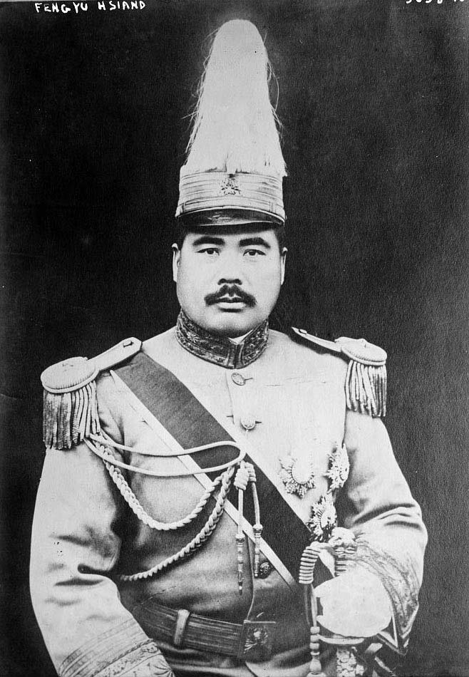

69年前的今天，8次倒戈的冯玉祥在苏联轮船上火灾遇难

冯玉祥（1882年11月6日－1948年9月1日），安徽巢湖人，成长于河北省保定市。本属直系军阀，在第二次直奉战争中倒戈，改为国民军，后败退西北，成为西北军。抗战期间，晋升为陆军一级上将。解放前夕，从苏联坐船回国，遭遇火灾意外身亡。

冯玉祥一生中倒戈的次数共为八次，分别是1滦州起义倒满清，2护国运动倒袁世凯，3武穴停兵倒段祺瑞，4北京政变倒吴佩孚；5拉郭松龄时倒张作霖，6五原誓师倒北洋政府，7国共分裂时倒共，8中原大战倒蒋介石。可以说他的一生充满背叛，但是他的背叛也不全是为了一己私利。

他把对自己的评价写了一首诗《我》，刻在墓志铭上：“平民生，平民活。不讲美，不求阔。只求为民，只求为国。奋斗不已，守诚守拙。此志不移，誓死抗倭。尽心尽力，我写我说。咬紧牙关，我便是我。努力努力，一点不错。”

在保定的淮军二代

1882年11月6日，冯玉祥出生，出生后他被命名为冯基善。父亲冯有茂是淮军，驻扎保定府，因此保定成了冯玉祥儿童时代的养育之地，第二故乡。冯玉祥一生都是保定府口音。

1892年（10岁），营里有一个兵额，决定给冯有茂的儿子补缺，因怕被别人抢去兵额，来不及问，就给直接编造了一个名字“冯御香”登记入册，后改为“冯玉祥”。从此，冯基善就更名为冯玉祥。

1894年（12岁），入保定练军营拿枪操练。1896年（14岁），加入淮军；1902年（20岁），改投袁世凯的武卫右军。1911年（29岁），武卫右军改编为新编陆军，任管带，曾参与滦州起义，反对满清。

护国护法双倒戈

后任陆军第十六混成旅旅长。1915年（33岁），率部入川与讨袁的蔡锷护国军作战，曾一度击败蔡锷，获袁世凯颁发三等男爵。后暗中与蔡锷联络，于1916年3月，议和停战。1917年4月，被免去第十六混成旅旅长职，7月率旧部响应段祺瑞的讨伐张勋复辟，复任第十六混成旅旅长。

1917年（35岁），皈依基督教并受洗，并利用宗教力量来控制军队，有“基督将军”的称号。1918年2月，护法运动中被段祺瑞命令率部南下攻打孙中山、陆荣廷的护法军，冯玉祥在湖北武穴通电主和，被免职留任。6月，率部攻占湖南常德后，才被撤销处分。

驱赶溥仪的北京政变

1918年6月14日（36岁），段祺瑞的心腹徐树铮杀死冯玉祥夫人的姑父、主张南北议和、支持直系军阀的北洋元老陆建章。11月，段祺瑞为了安抚冯玉祥任命他为湘西镇守使。七年后，1925年，冯玉祥杀死徐树铮为陆报仇。

1924年10月（42岁），第二次直奉战争时，负责在热河一路抵抗奉军，在参战途中，接受奉军张作霖50万银元的贿赂，率军返回北京，改为“国民军”，发动北京政变，推翻北洋政府，囚禁总统曹锟，电请孙中山北上。并于11月5日，驱逐清朝逊帝溥仪出紫禁城。后因无法抗拒直、奉系军阀的压力，又请来段祺瑞主政，遭到排挤。国民军再度发动政变，逼走段祺瑞，释放曹锟，但随后因军事上失利，不得不撤出北京。

转为革命的五原誓师

1925年底，冯玉祥参加反奉战争。1926年1月1日，兵败后通电下野，赴包头。9月17日，在绥远五原誓师，任国民革命军联军（后改国民革命军第二集团军）总司令，宣布所部加入中国国民党。在击溃刘镇华的镇嵩军之后，率领西北军东出潼关参加国民革命军北伐，为国民革命军指挥官之一。

1927年4月，宁汉分裂之后，先在郑州与汪精卫会面，后在徐州与蒋介石会面，最后选择与身在南京的蒋介石合作，并应蒋介石要求，将西北军中的中国共产党员“礼送出境”。

中原大战到抗日同盟军

1927年，笃信基督教的冯玉祥在河南废寺逐僧，将大相国寺改成市场。并发动全省毁佛运动，所有和尚、尼姑一律驱逐。所有寺产没收，寺院改为学校、救济院、娱乐场所等。继河南之后，华北各省纷纷跟从，华北佛教因此几乎衰绝。

1930年（48岁），联同阎锡山、李宗仁等与蒋介石对抗，引发中原大战，兵败后隐居山东泰山。

1933年5月26日，与吉鸿昌、方振武、佟麟阁在察哈尔张家口建立察哈尔民众抗日同盟军，任总司令，不久冯系将领均被北平军分会给予番号拉拢，冯玉祥被迫同意将抗日同盟军旗帜放下。抗战期间，曾任国防最高委员会常委，第三战区、第六战区司令长官，但不久被蒋介石撤职。

苏联轮船上的意外火灾

1948年，冯玉祥参加中国国民党革命委员会，任中央政治委员会主任，与以蒋介石为总统的中国国民党及中华民国政府彻底决裂。

1948年，接受中国共产党的邀请，搭苏联轮船“胜利”号，自美返国准备参加政治协商会议。9月1日，中途因轮船失火，与女儿一起遇难，时年66岁。也有人认为他是死于谋杀。其墓位于泰山西麓。

（冯玉祥在美国）