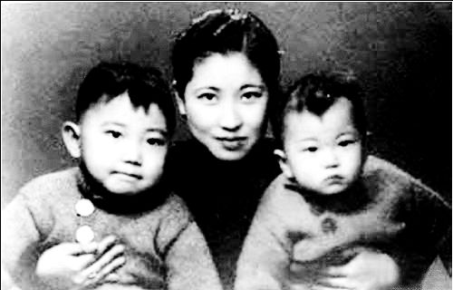
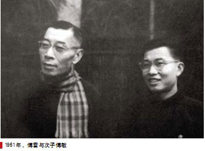

51年前的今天，对儿子“施暴”的著名翻译家傅雷携妻自杀身亡

（万象特约作者：一一）

 

傅雷出生于今上海市浦东新区，是中国著名的翻译家，傅雷的译作多为法国文豪巴尔扎克和罗曼·罗兰的名著。傅雷作为一个翻译家，别人说“没有他，就没有巴尔扎克在中国”。他翻译罗曼·罗兰的《约翰·克利斯朵夫》深深影响了几代中国人。

除了翻译作品，他更为世人所知的是他儿子整理的书信《傅雷家书》。儿子傅聪为在世界享有盛誉的钢琴家。傅雷对儿子家教极严，甚至会施以暴力。长大以后，傅聪去欧洲留学，傅雷在家书中对傅聪幼时的暴力教育感到后悔。傅聪心里明白父亲只是为了要磨砺他，父子和好如初。

“傅雷满头棱角，动不动会触犯人又加脾气急躁，止不住要冲撞人”（杨绛语 ）。在文革中他首当其冲遭到批判，夫妻两人被逼于家中自尽。他的墓碑上题有傅雷名言：“赤子孤独了，会创造一个世界。”

###   

早年生活

1908年4月7日，傅雷生于中国江苏省南汇县傅家宅（今上海市浦东新区航头镇王楼村五组）。4岁时，父亲因冤狱病故，由母亲抚养成人。12岁，考入上海南洋公学附属小学（今南洋模范中学），次年考入上海徐汇公学。

1924年（16岁），因批评宗教而被开除，同年考入上海大同大学附属中学。1925年，参加五卅运动。1926年，在北伐胜利的鼓舞下，与同学带头参加反学阀运动，被大同校董吴稚晖下令逮捕，母亲为安全起见，强行送子回乡。秋后考入上海持志大学读一年级。

1928年（20岁），傅雷留学法国巴黎大学，学习艺术理论。开始受罗曼·罗兰影响，热爱音乐。1931年，傅雷回国任教于上海美术专科学校（现南京艺术学院），任校办公室主任，兼教美术史及法文，致力于法国文学的翻译与介绍工作。

傅雷的译作多为法国文豪巴尔扎克和罗曼·罗兰的名著。15卷《傅雷译文集》，共五百多万字，是中国翻译史上空前的巨著。

如：罗曼·罗兰《米开朗琪罗传》、《约翰·克利斯朵夫》、《贝多芬传》；巴尔扎克《欧也妮·葛朗台》、《高老头》、《贝姨》、《邦斯舅舅》等。

中日战争时期，留在上海，此后参加中国民主促进会，曾发表亲美言论。1932年，傅雷与青梅竹马的表妹朱梅馥结婚，是傅雷的“秘书”。

夫妻双双自杀 

1949年之后（41岁），曾任上海市政协委员、中国作协上海分会理事及书记处书记等职。1958年（50岁），在上海“反右补课”中，被上海市作协划为戴帽“右派分子”。1958年12月，留学波兰的傅雷长子傅聪出逃英国。此后，傅雷闭门不出。《傅雷家书》出自这一时期傅雷与其子的书信来往中。

1961年9月，傅雷“摘掉帽子”。1966年8月底，文革初期，傅雷遭到红卫兵抄家，受到连续四天三夜批斗，罚跪、戴高帽等各种形式的凌辱，被搜出所谓“反党罪证”（一面小镜子和一张褪色的蒋介石旧画报）。

9月3日上午，女佣周菊娣发现傅雷夫妇已在江苏路284弄5号住所“疾风迅雨楼”双双自杀身亡。傅雷吞服巨量毒药，在躺椅上自杀，享年58岁。夫人朱梅馥在窗框上自缢而亡。傅聪收到父亲的最后赠言是：“第一做人，第二做艺术家，第三做音乐家，最后才是钢琴家。”

江小燕，傅译名著的一个普通爱好者，得知了傅雷死讯。当时凡自杀身亡的“黑五类”，一律不准留尸骨，江小燕冒险来到寄存骨灰的万国殡仪馆。工作人员被这个从天而降的傅雷“干女儿”的泪水打动，答应把骨灰交给她。傅雷夫妇的骨灰才得以保留。

孤独的赤子

1979年4月，由上海市文联和作协主办傅雷、朱梅馥追悼会，柯灵致悼词，宣布1958年划为右派分子是错误的，应予改正；文革中所受诬陷迫害，一律平反昭雪，彻底恢复政治名誉。

2013年10月27日，傅雷及夫人朱梅馥骨灰迁葬于上海浦东如茵园内。墓碑上题有傅雷名言：“赤子孤独了，会创造一个世界。”

好友楼适夷评价：“傅雷的艺术造诣是极为深厚的，对古今中外的文学、绘画、音乐各个领域都有极渊博的知识。但总是与流俗的气氛格格不入，他无法与人共事，每次都半途而去，不能展其所长。”

好友杨绛评价：“傅雷满头棱角，动不动会触犯人又加脾气急躁，止不住要冲撞人，他知道自己不善在世途上园转周旋，他可以安身的‘洞穴’，只是自己的书斋。”

复旦大学历史系教授朱维铮：“傅雷这个人，我觉得是，在反右里面，应该讲是最没有反党情绪的，最想我们的党变得好一点的人。结果后来，在反右以后被批判的是最厉害。这个我想傅雷的理想的头，碰了一个那么大的钉子，碰到的头破血流，跟他后来不断地失望，到最后走上自杀的道路，是应该有关系的。”

傅雷先生一生在文学、音乐、美术理论、美学批评等领域多有建树，体现出勤奋、正直、热心、严谨、慈爱的美德，凝聚成了独特的“傅雷精神”。

