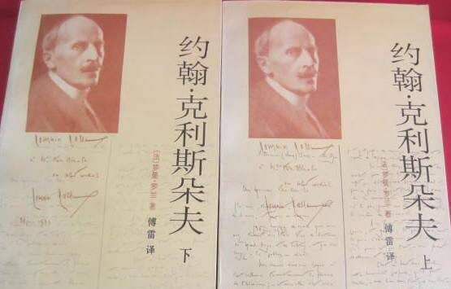
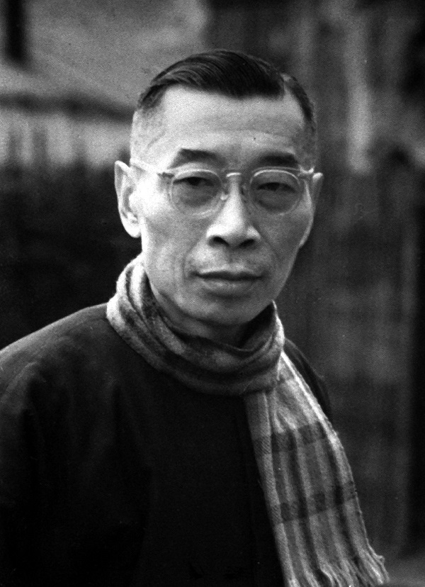
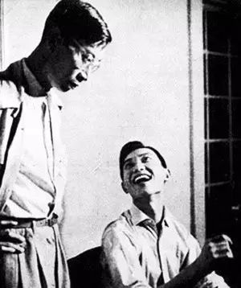
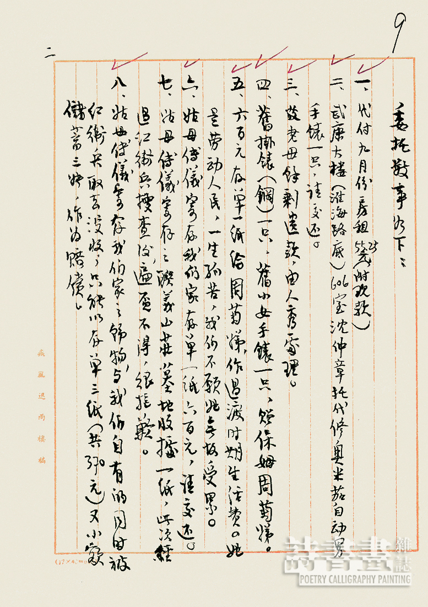
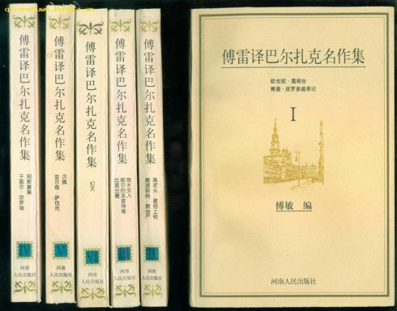
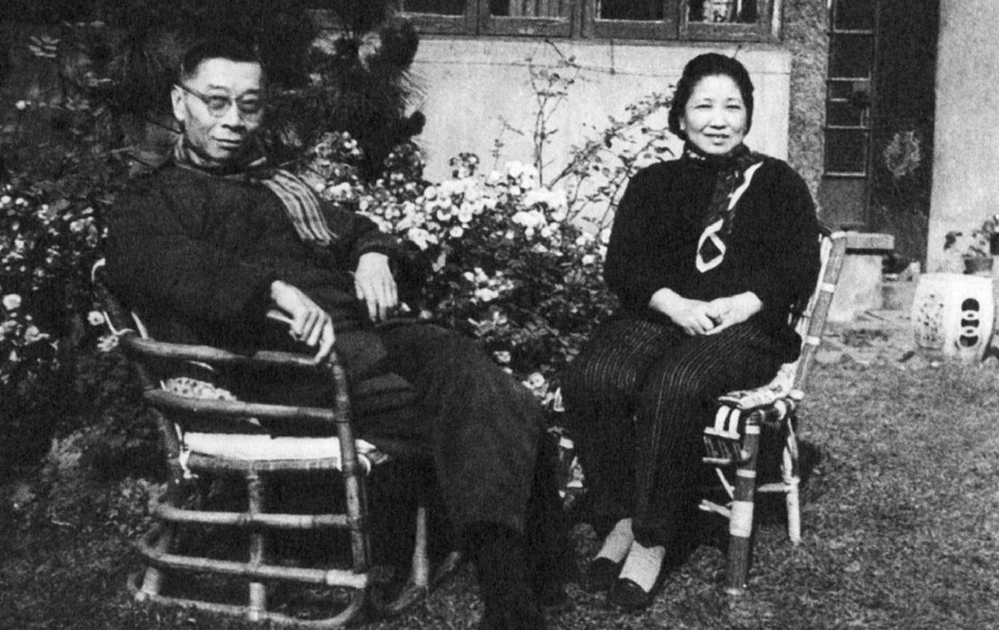

## 0903傅雷（资料）

### 成就特点

- 中国著名的翻译家
- 文革当中，被红卫兵逼于家中服毒自尽。
- 儿子傅聪为世界范围内享有盛誉的钢琴家
- 傅雷对其子家教极严，而又父爱至深，其家书后由傅敏整理成《傅雷家书》，至今影响深远、广为流传。
- 出生于今上海市浦东新区

### 生平

1908年4月7日，傅雷生于中国江苏省南汇县傅家宅（今上海市浦东新区航头镇王楼村五组）。

1912年时，父亲因冤狱病故，由母亲抚养成人。

1920年（12岁），考入上海南洋公学附属小学（今南洋模范中学），次年考入上海徐汇公学，1924年因批评宗教而被开除，同年考入上海大同大学附属中学。

1925年，参加五卅运动。

1926年，在北伐胜利的鼓舞下，与同学姚之训等带头参加反学阀运动，大同校董吴稚晖下令逮捕，母亲为安全起见，强行送子回乡。秋后考入上海持志大学读一年级。

1928年，傅雷留学法国巴黎大学，学习艺术理论。开始受罗曼·罗兰影响，热爱音乐。

1931年，傅雷回国任教于上海美术专科学校（现南京艺术学院），任校办公室主任，兼教美术史及法文，致力于法国文学的翻译与介绍工作。

傅雷的译作多为法国文豪巴尔扎克和罗曼·罗兰的名著。15卷《傅雷译文集》，共五百多万字，是中国翻译史上空前的巨著。

如：罗曼·罗兰《米开朗琪罗传》、《约翰·克利斯朵夫》、《贝多芬传》；巴尔扎克《欧也妮·葛朗台》、《高老头》、《贝姨》、《邦斯舅舅》等。

中日战争时期，留在上海，此后参加中国民主促进会，曾发表亲美言论。

1932年，傅雷与青梅竹马的表妹朱梅馥结婚，是傅雷的“秘书”。

1949年之后，曾任上海市政协委员、中国作协上海分会理事及书记处书记等职。

1958年，在上海“反右补课”中，被上海市作协划为戴帽“右派分子”。

1958年12月，留学波兰的傅雷长子傅聪驾机出逃英国。此后，傅雷闭门不出。《傅雷家书》出自这一时期傅雷与其子的书信来往中。

1961年9月，傅雷“摘掉帽子”。

1966年8月底，文革初期，傅雷遭到红卫兵抄家，受到连续四天三夜批斗，罚跪、戴高帽等各种形式的凌辱，被搜出所谓“反党罪证”（一面小镜子和一张褪色的蒋介石旧画报）。

9月3日上午，女佣周菊娣发现傅雷夫妇已在江苏路284弄5号住所“疾风迅雨楼”双双自杀身亡，傅雷系吞服巨量毒药，在躺椅上自杀，享年58岁，夫人朱梅馥系在窗框上自缢而亡。

傅聪收到父亲的最后赠言是：“第一做人，第二做艺术家，第三做音乐家，最后才是钢琴家。”

1979年4月，由上海市文学艺术界联合会和中国作家协会上海分会主办傅雷朱梅馥追悼会，柯灵致悼词，宣布1958年划为右派分子是错误的，应予改正；文革中所受诬陷迫害，一律平反昭雪，彻底恢复政治名誉。

 2013年10月27日，傅雷及夫人朱梅馥骨灰由龙华烈士陵园迁葬于上海浦东福寿园海港陵园的如茵园内。墓碑上题有傅雷名言：“赤子孤独了，会创造一个世界。”

【收藏骨灰】在听闻傅雷死后，江小燕，傅译名着的一个普通爱好者，从傅家保姆周菊娣那里得知，当时凡自杀身亡的“黑五类”，一律不准留尸骨，就毅然冒险来到寄存骨灰的万国殡仪馆。那里的工作人员被这个从天而降的傅雷“干女儿”的泪水打动，答应把骨灰交给她。她从殡仪馆的登记簿上，她查到了朱人秀的地址，在朱的帮助下，她买了一个大塑料袋，将傅、朱的骨灰装好，并以“怒安”为名，寄存于上海永安公墓。

【棍棒教子】

傅聪是傅雷的长子，也是知名的钢琴家，傅雷是个身教言教并重的权威式家长，与当时颇算开明的家长教育格格不入，傅雷甚至会对傅聪施以暴力教育，让傅聪在儿时和求学时苦不堪言，身上经常带着不只一处二处的伤痕去学校上课。据傅聪的回忆，在傅聪约十岁时，当时他已正式学琴约三年。傅聪在傅宅楼下琴房练琴，傅雷在楼上翻译《高老头》，只要没听见琴声，或是琴声错误，傅雷马上下楼痛揍傅聪，甚至把傅聪的头抓向墙壁撞！长大以后，傅聪去欧洲留学，收到父亲傅雷亲笔写的家书，傅雷在家书中对傅聪幼时的暴力教育感到后悔，希望儿子(傅聪)能原谅他。傅聪其实心里深深明白当时的暴力教育只是为了要磨砺他，所以原谅了父亲傅雷，父子和好如初。

【傅雷家书】

《傅雷家书》最早出版于1981年，是当时轰动性的文化事件，三十多年来一直畅销不衰。它是傅雷夫妇在1954年到1966年5月年间写给傅聪和儿媳弥拉的家信，由次子傅敏编辑而成。

【巴尔扎克和罗曼·罗兰】

傅雷的译作多为法国文豪巴尔扎克和罗曼·罗兰的名著。15卷《傅雷译文集》，共五百多万字，是中国翻译史上空前的巨著。

傅雷作为一个翻译家，别人说“没有他，就没有巴尔扎克在中国”，他译介罗曼·罗兰的《约翰·克利斯朵夫》深深影响了几代中国人；作为音乐鉴赏家，他写下了对贝多芬、莫扎特和肖邦的赏析；作为文学评论家，他对张爱玲小说的精湛点评，为学界作出了文本批评深入浅出的典范；他写给长子傅聪的家书《傅雷家书》自80年代出版至今，已经感动了数百万读者。

【美术批评家】此外，傅雷还是一位杰出的美术批评家。24岁的他就译出了《罗丹艺术论》这样不朽的名著。26岁的傅雷在上海美术专科学校讲课时，写出了《世界美术名作二十讲》，文章不仅分析了一些绘画、雕塑名作，更触及了哲学、文学、音乐、社会经济和历史背景等等，足见其知识之渊博，多艺兼通。在《贝多芬传》里，傅雷以一位音乐鉴赏家的角度用“自己的笔与贝多芬心灵相通，在与命运的搏斗中彼此呼应”。

【信达雅】其翻译的作品强调“神似”，即“翻译应当像临画一样，所求的不在形似而在神似”，认为“理想的译文仿佛是原作者的中文写作”，并要求文字“译文必须为纯粹的中文，无生硬拗口的毛病”。(此即翻译三原则：“信”、“达”、“雅”，也就是“让阅读者信服”、“文笔要练达而流畅”和“字句要通俗而文雅，但忌粗俗之字句”。)

【评价】

好友 楼适夷：“傅雷的艺术造诣是极为深厚的，对古今中外的文学、绘画、音乐各个领域都有极渊博的知识。但总是与流俗的气氛格格不入，他无法与人共事，每次都半途而去，不能展其所长。”

好友 杨绛：“傅雷满头棱角，动不动会触犯人又加脾气急躁，止不住要冲撞人，他知道自己不善在世途上园转周旋，他可以安身的‘洞穴’，只是自己的书斋。”

复旦大学历史系教授朱维铮：“傅雷这个人，我觉得是，在反右里面，应该讲是最没有反党情绪的，最想我们的党变得好一点的人。结果后来，在反右以后被批判的是最厉害。这个我想傅雷的理想的头，碰了一个那么大的钉子，碰到的头破血流，跟他后来不断地失望，到最后走上自杀的道路，是应该有关系的。”

傅雷先生一生在文学、音乐、美术理论、美学批评等领域多有建树，体现出勤奋、正直、热心、严谨、慈爱的美德，凝聚成了独特的“傅雷精神”。

【维基概述】

傅雷（1908年4月7日－1966年9月3日），原江苏省南汇县人，中国著名的翻译家、作家、教育家、美术评论家。早年留学法国巴黎大学。他翻译了大量的法文作品，其中包括巴尔扎克、罗曼·罗兰、伏尔泰等名家著作。文革当中，被红卫兵逼于家中服毒自尽。

傅雷一生嫉恶如仇，其翻译作品也是多以揭露社会弊病、描述人物奋斗抗争为主，比如《欧也妮·葛朗台》、《高老头》、《约翰·克里斯朵夫》等。傅雷对其子家教极严，而又父爱至深，其家书后由傅敏整理成《傅雷家书》，至今影响深远、广为流传。傅雷有两子傅聪、傅敏，傅聪为世界范围内享有盛誉的钢琴家，傅敏为英语教师。

【】

### 照片

