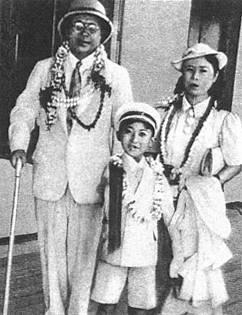
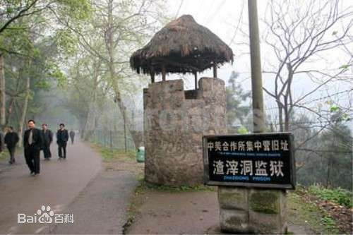

## 68年前的今天，出身绿林游侠的西安事变领导人杨虎城被杀于重庆中美技术合作所

（万象历史特约作者：一一）

68年前的今天，西安事变的领导人杨虎城与小萝卜头一同被杀

杨虎城（1893年11月26日－1949年9月6日），陕西蒲城人。出身绿林游侠，西安事变领导者之一，坚持要把蒋介石除之后快，但不被接受。曾经申请加入中国共产党，希望“能做第二个贺龙”，但是却因阴差阳错没能加入。

西安事变后，遭流放国外，为抗日秘密回国，被囚十二年。1949年9月6日，于重庆中美合作所，与小萝卜头等人一同被杀。其孙多次请求台湾当局为杨虎城平反，但均遭拒绝。

死守西安的绿林游侠

1893年11月26日，杨虎城生于陕西蒲城农民家庭，起自绿林游侠。伯父为哥老会首领。清政府搜捕杨虎城的父亲抓去顶罪，处以绞刑。后来伯父被捕，活生生打死。杨虎城一生识字不多，文牍皆由身边人代劳。

1911年（18岁），武昌起义爆发后，参加陕西民军向字营与清军作战。1915年（22岁），率众参加陈树藩陕西护国军，反对袁世凯洪宪称帝。

1917年（24岁），孙中山在广东组织军政府，号召护法。陕西靖国军兴起响应。1918年，于右任被推为靖国军总司令，杨虎城为第三路第一支队司令。1922年（29岁），驻军陕北榆林时，结识陕西共产党创始人之一魏野畴。魏野畴对他影响很大，曾长期在杨部任职。

1924年（31岁），杨虎城经孙中山亲自介绍加入中国国民党，积极参与国民革命军北伐。1926年，吴佩孚指使镇嵩军七万人围攻西安，杨虎城率部与友军死守西安八个月，直到援军来到解围。

申请做第二个贺龙

1927年（34岁），“四一二事件”后，杨虎城的国民革命军第十军的共产党员曾达200余人。以此为基础，成立中共皖北特委，隶属中共河南省委，负责人是魏野畴、南汉宸、蒋听松。杨虎城于此时申请加入中国共产党，希望“能做第二个贺龙”，将部队改编为中国工农红军。但中共河南省委未予批准。

1928年，杨虎城同中共党员谢葆真在皖北太和县结婚4月，第十军暴动失败，魏野畴等被杀，杨虎城此前已与妻子远赴南京上海一带游览，后赴日本。同年秋，中共中央《致东京市委信》中同意杨虎城加入，但因负责人等都已提前回国，此信未能送达。杨虎城生前对此毫无所知，此后再没有提出申请。

抗日救国的铁三角

1929年（36岁），投入蒋介石麾下，任国民革命军新编第十四师师长，中原大战后，升格为国民革命军第十七路军，6万多人，被称为“西北军”。之后，杨虎城被任命为讨逆军第十七路总指挥，驻防陕西，后兼任陕西省政府主席、西安绥靖公署主任等职。

1933年6月（40岁），和红四方面军签订了“共同反蒋抗日”的“汉中密约”，又称“巴山协定”。 由于得到杨虎城的帮助，红四方面军由入川时的1万人发展至8万之众，成为其历史上的鼎盛时期。

1935年，蒋中正调张学良东北军剿共，西安出现以张学良、杨虎城和邵力子为首三种势力并存局面。杨虎城掌握西安市军事控制权。1936年9月，中国共产党与东北军正式签订《抗日救国协定》，双方正式结束敌对状态，中国工农红军、张的东北军、杨的西北军形成拥护“民族统一战线”的“铁三角”。

改变历史的西安事变

1936年12月，蒋介石来到西安，目的是部署和监督剿共。杨虎城和张学良联合发动“兵谏”，杀害及扣留蒋介石等数百名国民政府军政核心要员。张杨对蒋提出“停止一切内战准备抗日”、“改组国民政府”、“驱逐亲日派和容纳抗日分子”、“释放政治犯”等8项政治主张，史称西安事变。

在苏联强烈反对杀害蒋介石的要求下，与宋美龄、周恩来等多方协调下，张学良释放蒋中正。当时舆论大部分强烈反对这种兵变行为——如胡适当时评论说：“在外族入侵的时候，有以绑架肩负国家和民族安危的元首来爱国的吗？”

闻一多在课堂上说：“真是胡闹，国家的元首也可以武装劫持！一个带兵的军人，也可以称兵叛乱！这还成何国家？国家绝不容许你们破坏！领袖绝不容许你们妄加伤害！”。

西安事变和平解决后，杨虎城失去了对西北军控制。6月29日，杨虎城出国考察军事。

与杨虎城将军.jpg)

.jpg)

与小萝卜头一同被杀

杨虎城抵达欧洲，继续批评国民政府。七七事变后，多次致电要求回国参与中国抗日战争。1937年12月，他偷偷回国，遭到国民政府逮捕，和秘书、家人软禁在南昌。此后一直被关押12年。其间，杨虎城小女儿出生，妻谢葆贞病死。

1949年9月6日，杨虎城及其幼子杨拯中、幼女杨拯贵，其秘书宋绮云和夫人徐林侠以及他们的幼子宋振中（昵称“小萝卜头”），随从副官阎继明和警卫员张醒民等一共8人在重庆戴公祠（戴继元公庙）被杀死。

中华人民共和国成立后，葬于陕西省西安市长安区之“杨虎城将军烈士陵园”内。

不给平反的“千古罪人”

中国国民党对杨虎城评价极低，称他是“祸国殃民的千古罪人”。

杨虎城的孙子曾多次写信给连战，请求为杨虎城“平反”。2006年12月12日，中国国民党党史史料编纂委员会主任邵铭煌在作出回应：“张学良与杨虎城当年身为国民党将领，不仅没有积极剿共，还以非常手段挟持统帅，这种行为几乎等于是‘军事政变’，即使在今天的中国，也应该受到制裁，不可能被容忍，更没有所谓‘平反’的问题。”

2013年，再次写信给马英九，请求平反。中国国民党党史馆主任王文隆表示，西安事变受军法审判，目前没有平反问题。

### 

