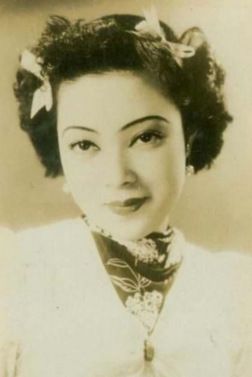
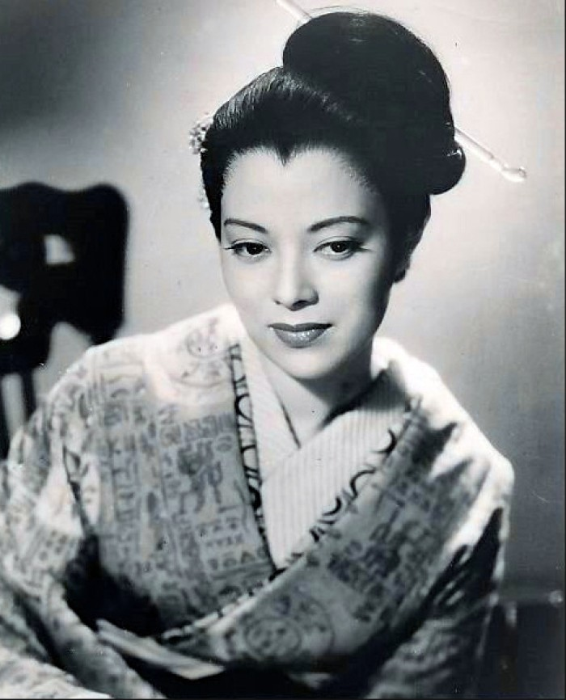
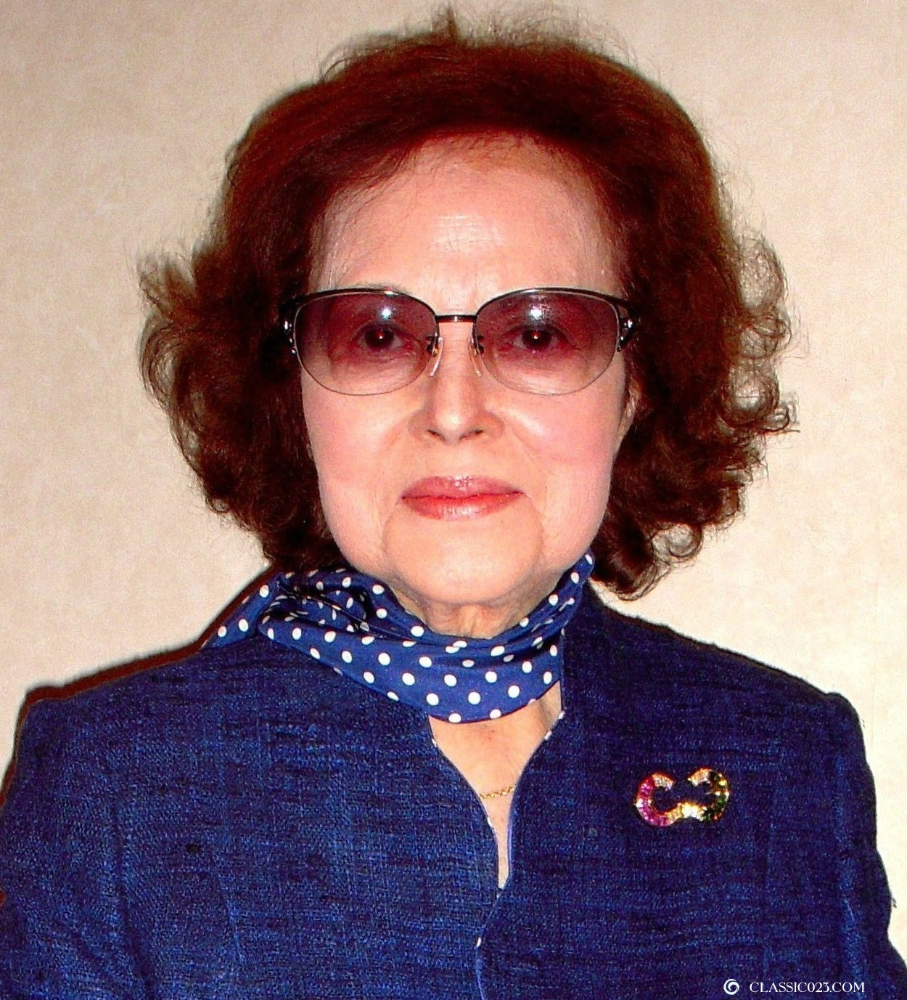
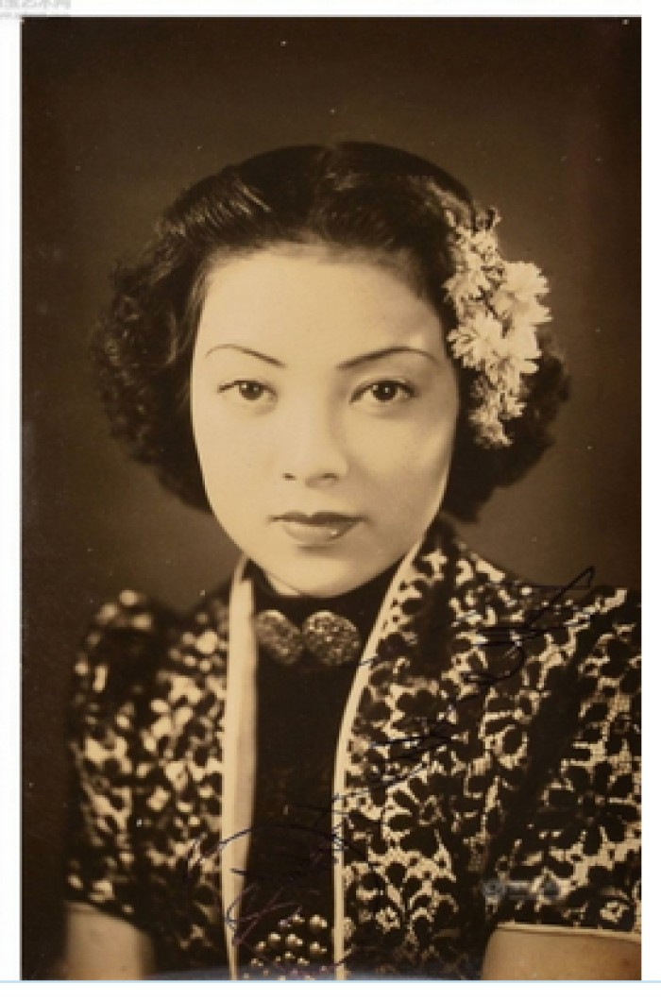
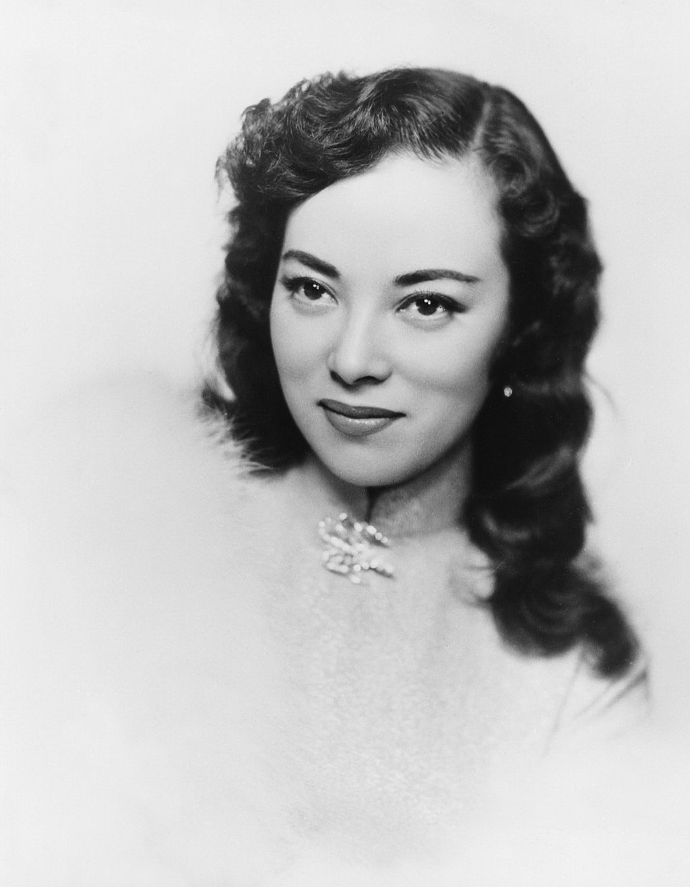
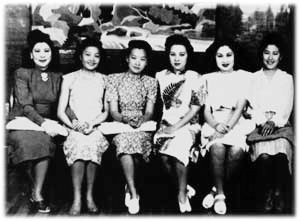

## 0907李香兰（资料）

### 成就特点

- ​
- ​

### 生平

3年前的今天，李香兰去世

李香兰（1920年2月12日－2014年9月7日），日本人。生于中国今辽宁省灯塔市，李香兰是其义父给她取的中文名，说得一口非常标准京片子官话。李香兰是当时极为知名的歌手、电影演员，一曲《夜来香》，风靡满洲国、上海滩、台湾、日本等地。

抗战胜利后，被国民政府以汉奸罪起诉，后证明是日本人，得以无罪释放。回日本后，嫁于外交官，转为从政，支持中日友好。2014年9月7日病逝，中国外交部发言人表示哀悼。

一口京片子的日本姑娘

1920年2月12日，李香兰生于今辽宁省灯塔市。父亲山口文雄在满铁会社所属的抚顺煤矿任职。1933年（13岁），被父亲的义兄弟沈阳银行经理李际春收为义女，起中文名为李香兰。

她也是天津市长潘毓桂义女。曾以潘淑华的名义在北平翊教女子中学就学，1937年（17岁）毕业。然而她从不公开自己的身世，中国人都不知她的日本血统，说得一口非常标准京片子官话的她，中国人都认为她是地道的北京人。

（学生时代的李香兰与父亲的合影）

满洲国的头号女星

她跟流亡奉天市（今沈阳）的意大利人学习声乐，曾在满洲国的流行歌曲大赏赛中获得头奖。1937年，满洲映画协会（简称“满映”）成立。李香兰进入满洲国电影界，并成为满洲头号女星。拍摄了多部电影，其中多以扮演崇尚日本皇军的中国女子角色。

她奉天广播电台新节目《满洲新歌曲》中演唱了《渔家女》《昭君怨》《孟姜女》等中国歌曲，声名大噪。于是，“歌星李香兰”就这样被推上前台，并且迅速在歌坛和影坛被大众所熟知。

轰动台湾和日本

1941年1月，李香兰至台湾巡回公演，当时台北街头处处挂起“世纪之宠儿李香兰来台”的广告标语，掀起台湾史上史无前例的追星浪潮。在台北市西门町“大世界馆”公演5天，场场客满。

1941年2月，李香兰担任“日满亲善歌唱大使”，前往日本东京参加2月11日纪元节的庆典大会，连续一周在东京有乐町“日本剧场”表演，节目名称为“歌ふ李香蘭（欢唱的李香兰）”，在日本造成大轰动。

表演首日，大批歌迷涌向日本剧场，排队购票的队伍将日本剧场围了整整七圈半，即所谓“日剧7圈半事件”（日劇7まわり半事件）。

上海滩的七大歌后

1942年，到上海发展，拍了经典电影《万世流芳》，并主唱电影主题曲《卖糖歌》及插曲《戒烟歌》使之红遍全中国，跟着《夜来香》、《恨不相逢未嫁时》、《海燕》使之更上一层楼，成为与龚秋霞、周璇、姚莉、白光、白虹、吴莺音齐名的上海滩“七大歌后”之一。

1943年，演出电影《沙韵之钟》再度掀起热潮。1945年，李香兰在北京记者会上为演出多部媚日影片引发国人愤慨而道歉，并辞职离开满映。同年，李香兰在上海举行个人演唱会“夜来香幻想曲”。

，左起依次为白虹、姚莉、周璇、李香兰、白光、吴莺音.png)

（上海滩七大歌后中的六位的签名合影，左四为李香兰）

被无罪释放的假汉奸

第二次世界大战结束，日本投降，满洲国解散，李香兰被控以汉奸罪罪名被中华民国政府逮捕。但之后，户籍誊本送到上海，证明了她是日本人而非汉人，得以被无罪释放，遣返回日。

1946年2月（26岁），回日本。改回原名山口淑子，在日本继续其演艺事业，为东宝、松竹拍了一系列电影。1951年，山口淑子嫁给了美国的雕刻艺术家野口勇，1956年离婚。

转向政坛的后半生

1958年（38岁），山口淑子嫁给外交官大鹰弘后，告别舞台转而从政。1974年，山口淑子获时任首相田中角荣的邀请，接受自由民主党提名，成功当选日本参议院议员。1978年，访问了北京、上海、哈尔滨和长春等地。

1993年，从政20年后引退，成为亚洲妇女基金会的号召人。2005年，李香兰发表长文，劝诫首相小泉纯一郎不要参拜靖国神社，原因是“那会深深伤害中国人的心。”

2014年9月7日上午10时42分，李香兰逝世，终年94岁。中国外交部发言人洪磊表示：“李香兰女士战后支持和参与中日友好事业，为此作出积极贡献，我们对她的逝世表示哀悼。”

【】

### 照片

.jpeg)

