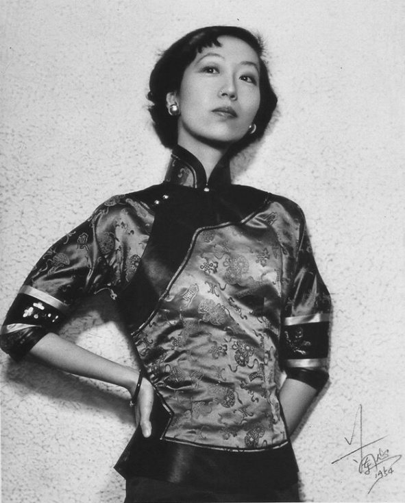
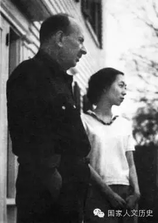

## nnnn姓名（资料）

### 成就特点

- 出自名门，曾外祖父：李鸿章；祖父：张佩纶
- 小说家；《金锁记》“是中国自古以来最出色的中篇小说”。
- 与汉奸胡兰成
- 嫁给大36岁的德裔美国作家
- 四大才女
- 奇装炫人

### 生平

（万象特约作者：东西望）

22年前的今天，出身名门、一生跌宕起伏的才女张爱玲在美国去世

出身名门下的离异父母

1920年9月30日，张爱玲出生在上海公共租界。张爱玲的家世显赫，祖父张佩纶是清末名臣，祖母是北洋大臣李鸿章的女儿。父亲是典型的遗少，母亲黄素琼则是长江水师提督的孙女。2岁时，父亲任天津津浦铁路局英文秘书，全家搬家到天津。

4岁时，张爱玲的姑母赴英国留学，母亲黄素琼撇下子女陪同前往。父亲则纳妾，并接到家中，沉迷于鸦片。8岁时，母亲从英国回国，张爱玲一家搬回上海。10岁时，为了上美国教会学校，改名为张爱玲。“爱玲”为英文“Eileen”的译音。同年，父母离婚，张爱玲随父亲生活。

后妈虐待下的离家出走

1934年（14岁），父亲与民国政府前总理孙宝琦的女儿结婚。张爱玲和弟弟则在继母的虐待下长大。此时，张爱玲已读了几年红楼梦，完成《摩登红楼梦》，父亲为之撰回目。1937年（17岁），中学毕业，已在一些刊物上发表了多篇小说。1938年，与继母和父亲发生口角冲突后，离家出走，投奔母亲黄素琼。

1939年（19岁），入学香港大学文学院。1941年12月，太平洋战争爆发后，香港被日军占领。1942年，张爱玲不得不中断学业，回到上海，就读于圣约翰大学。但是两个月后，就因为经济窘困辍学。她选择从事文学创作为生，最初为英文报刊撰写影评。

与姑姑张茂渊合影.jpg)

轰动上海的倾城之恋

1943年春（23岁），张爱玲见到了上海著名作家周瘦鹃，获得赏识，在随后的两年中，连续发表多篇轰动性的中短篇小说，包括《沉香屑·第一炉香》、《倾城之恋》、《心经》、《金锁记》等，在沦陷时期的上海一举成名。

傅雷（笔名迅雨）发表了《论张爱玲的小说》的评论文章，高度评价张爱玲的小说。有人认为《金锁记》“是中国自古以来最出色的中篇小说”。在当时上海漫画家所绘的“上海女作家三画像”中，给三位最活跃的著名女作家的定位为：“辑务繁忙的苏青”、“弄蛇者潘柳黛”和“奇装炫人张爱玲”。

（张爱玲与李香兰合影）

短暂的婚姻半生缘

1944年，张爱玲结识汪精卫政权宣传部次长、作家胡兰成，并与之交往。8月，胡兰成离婚后，与张爱玲在上海秘密结婚。“胡兰成与张爱玲签订终身，结为夫妇。愿使岁月静好，现世安稳。”前两句是出自张爱玲之手，后两句出自胡兰成。

不久，胡兰成前往武汉，在医院期间与17岁的护士周训德同居。一年之后，1945年8月，日本投降，胡兰成逃亡到浙江温州，任教于温州中学。在流亡期间，胡兰成与范秀美同居。1946年2月，张爱玲曾前往温州探视。 1947年6月10日（27岁），张爱玲写信与逃亡中的胡兰成分手。

1948年（28岁），张爱玲发表《十八春》（后来改名为《半生缘》）。

留不下的中国大陆

1949年，新中国成立后，张爱玲留在上海。1950年夏，张爱玲曾经到苏北农村参加土改两个月。由于与胡兰成的关系，面临着政治方面的压力。1952年7月，只身离开中国大陆，迁居到香港。

张爱玲在香港期间，任职于美国新闻处。开始创作小说《秧歌》与《赤地之恋》，小说的故事背景是“土改”时期。由于作品与主流格调不合，被作为“毒草”而批判。在大陆文学界，张爱玲也因此长期被作为反面典型，直到改革开放之后才有所改观。

在美国的窘迫人生

1955年，张爱玲赴美国。1956年（36岁），生活窘迫的张爱玲结识了65岁的左翼剧作家赖雅并怀孕。同年8月14日，和赖雅结婚。不久，不幸流产，未能产子。

张爱玲在美国翻译清代小说《海上花》，或写作回忆旧上海的作品，夫妇生活颇为窘迫。后来依靠再版其1940年代的小说抽取版税，维持生活。1967年10月8日（47岁），赖雅去世。

没入太平洋的人间才女

1973年（53岁），张爱玲定居洛杉矶，晚年于寓所深居简出。张爱玲晚年生活放在两件事情上：一是研究《红楼梦》，二是翻译《海上花列传》，张爱玲“将那种嗲声嗲气的吴语对白，悉数转换成了地道的晚清官话。

1995年9月8日，张爱玲被发现逝世于加州洛杉矶西木区罗彻斯特大道的公寓，终年75岁。死因为动脉硬化心血管病，其遗嘱：“尽速火化；骨灰洒于空旷原野；遗物留给宋淇夫妇处理。”9月19日，遵照其遗愿，将她的遗体火化，没有举行公开葬礼。同年的忌辰日（9月30日），几位朋友将其骨灰撒入浩瀚的太平洋。

（老年张爱玲）

