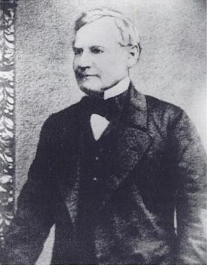
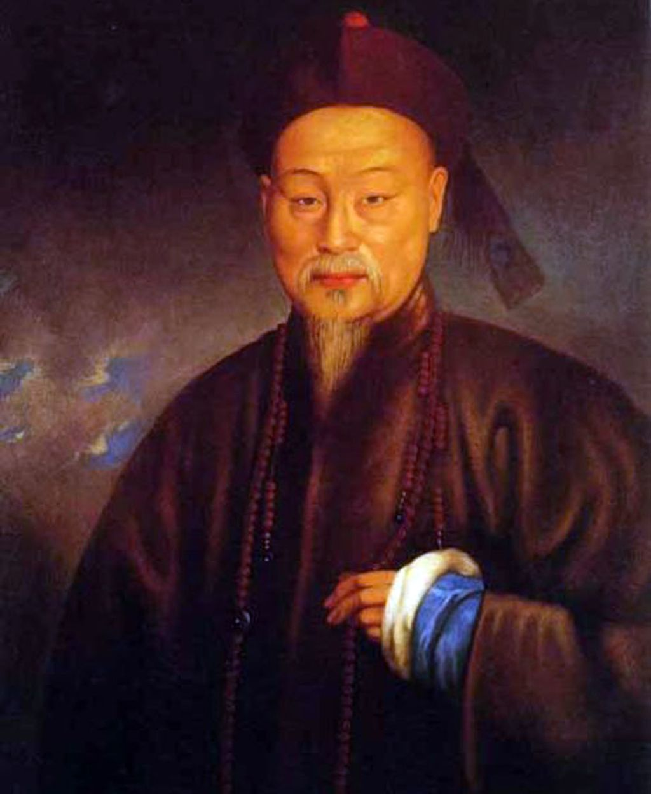
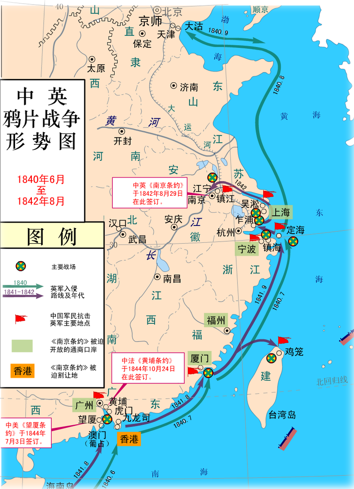
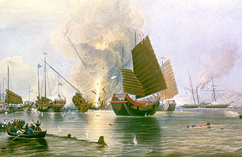
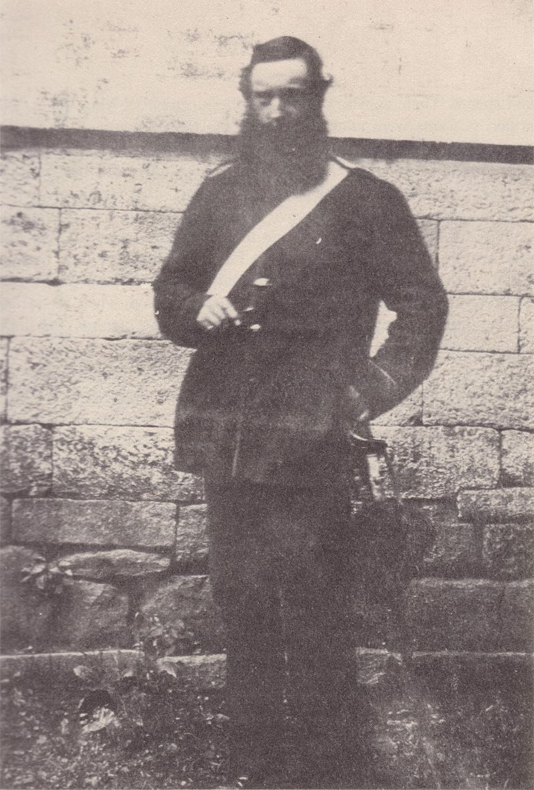

## nnnn姓名（资料）

### 成就特点

- 因鸦片贸易问题，使得英国对清廷宣战，引发第一次鸦片战争外
- 派兵占领香港
- ​

### 生平

142年前的今天，占领香港，引发鸦片战争的殖民者义律去世

义律（英语：Charles Elliot，1801年8月15日－1875年9月9日），英国海军上将和殖民地官员。1836年至1841年，担任英国驻华商务总监，后因鸦片贸易问题，使得英国对清廷宣战，引发第一次鸦片战争，并在1841年1月26日派兵占领香港。

支持废奴的海军上校

1801年8月15日，义律出生于德国萨克森州。父亲是一名英国官员，当时一家人正在当地公干。1815年（14岁），义律加入英国皇家海军，在东印度和非洲沿岸一带服役，取得上校军衔。

1828年（27岁），他从海军退役，并转到殖民地部工作。1830年，被派往圭亚那保护当地的黑奴，成为一位废除奴隶制度的支持者。

（义律的妻子）

被拒绝接见的驻华商务总监

1834年（33岁），义律跟随首位英国驻华商务总监律劳卑勋爵抵达中国，担任贸易专员秘书。律劳卑在同年逝世后，义律获升任为驻华商务副总监。1836年12月（35岁），出任英国驻华商务总监。

义律本人其实是反对鸦片贸易的，他认为以鸦片贸易赚取利润是英国的耻辱，但他认为中英两国之间应该存在对等和公平的贸易。他致函两广总督的邓廷桢，表示希望两人能够在广州见面。然而，经过多次交涉后，清方始终拒绝接见。

（义律在澳门的住所）

上升为两国矛盾的虎门销烟

1838年12月31日，道光帝任命钦差大臣林则徐南下广州禁烟。1839年3月10日，林则徐抵达广州，随即展开严厉的禁烟行动。由于外商反应冷淡，结果林则徐下令派兵封锁十三行，并且断绝粮食供应，迫令烟商交出鸦片。

3月28日，义律向林则徐呈送了《义律遵谕呈单缴烟二万零二百八十三箱禀》，着令英商交出所有鸦片共20,283箱。义律向英商保证他们的损失一概由女皇陛下政府负责。

1839年6月3日，虎门销烟正式开始。到20日，共销毁两百三十七万六千二百五十斤鸦片。于是，禁烟上升为两国政府间的矛盾。

（林则徐）

打架斗殴引发的鸦片战争

1839年6月20日，有醉酒水手在尖沙咀村与村民发生殴斗，其中村民林维喜在打斗中伤重不治。8月12日，义律在英国船只上开庭审案，对五名凶手判罚金和监禁后，送回英国的监狱服刑，并在事后知会中国官方。并拒绝按照《大清律例》，交出其中一名水手偿命。

8月15日，林则徐宣布中断贸易，派兵驱逐义律。义律撤退到九龙对开的海港，寄居于货船上。9月5日，义律派人与林则除谈判，要求解除禁令和恢复水粮，恢复正常贸易关系，但通通遭到拒绝。1小时后，英国军舰与中国船舰交火。这次冲突揭开了第一次鸦片战争的序幕。

英国国会以271票对262票，通过出兵中国。10月1日，英国政府以“受到侮辱”、“生命安全受威胁”和“财产受损”为名对清廷宣战。1840年2月，英国政府任命义律的堂兄懿律为海军统帅及全权代表，义律为副代表。1840年6月，英军40多艘战舰和士兵4千多人抵达澳门，第一次鸦片战争正式爆发。

偷偷割让的香港岛

英军北上，攻陷定海，并在8月11日抵达大沽口。8月29日，通过琦善向清帝提交《巴麦尊照会》“伸冤”。义律以为琦善已答应要求，便折返广东，准备进一步的和谈。9月，琦善被委任为钦差大臣。9月28日，免去林则徐的官职。

11月29日，琦善抵达广州。义律向琦善提出14点要求，当中包括重开商埠、赔偿烟价和兵费、订定税则和治外法权等等。道光帝十分愤怒，不同意。1841年1月6日，谈判破裂。7日，英军攻占沙角炮台和大角炮台。琦善与义律在1月20日拟定了《穿鼻草约》，当中清廷除了要赔偿英国政府600万银元外，更要割让香港岛。

1841年1月26日，英军乘HMS硫磺号登陆香港岛，并由义律出任香港的行政官。一般认为，香港自当日起成为英国的属土。第二日，在岛上升起英国国旗。琦善对割让香港岛一事一直加以隐瞒，2月10日被广东巡抚揭发，琦善立即被革职查办。

（穿鼻洋之战）

打打停停的鸦片战争

1月27日，道光帝正式下诏对英国宣战。2月26日，义律再次攻陷虎门，3月3日已兵临广州城下。3月20日，停火，重开贸易。然而，道光帝深感不满，改派奕山为“靖逆将军”，赴援广州。5月10日，奕山向英军发动进攻，短暂恢复的贸易再度停止。5月22日，英军炮轰广州，击溃清兵。5月27日，奕山投降，签订《广州和约》，向义律缴交赎城费六百万银元。《和约》签署后，义律始率英兵撤离广州。

此时，义律却突然被伦敦政府以“未有坚持英国政府的全部诉求”和“未有依从训令”的理由罢免，并召他回国。因为英国外务大臣认为《穿鼻草约》条款过于宽松，英方得益太小，根本没有达到全面开放商埠的目标；而割让给英方的香港岛更被他批评为“鸟不生蛋之地，一间房屋也建不成”。

1841年8月，驻华商务总监璞鼎查爵士抵华，于是战事再起。直至1842年8月29日，清政府承认失败，签订了中国历史上第一个不平等条约《南京条约》。

尊贵的殖民地总督

义律被召回国后，过了一段日子才获重新起用。1842年8月6日，出任驻德克萨斯共和国的英国代办。义律大力支持废除奴隶制度，建立自由贸易。1845年，德克萨斯正式合并到美国后，卸任返回英格兰。

之后，义律先后出任百慕大总督、特立尼达总督、圣海伦那岛总督。1856年，义律获颁赠KCB勋衔，即最尊贵的巴斯勋章，成为爵士。1865年9月，获海军上将军衔。1875年9月9日，于英格兰去世。

### 

