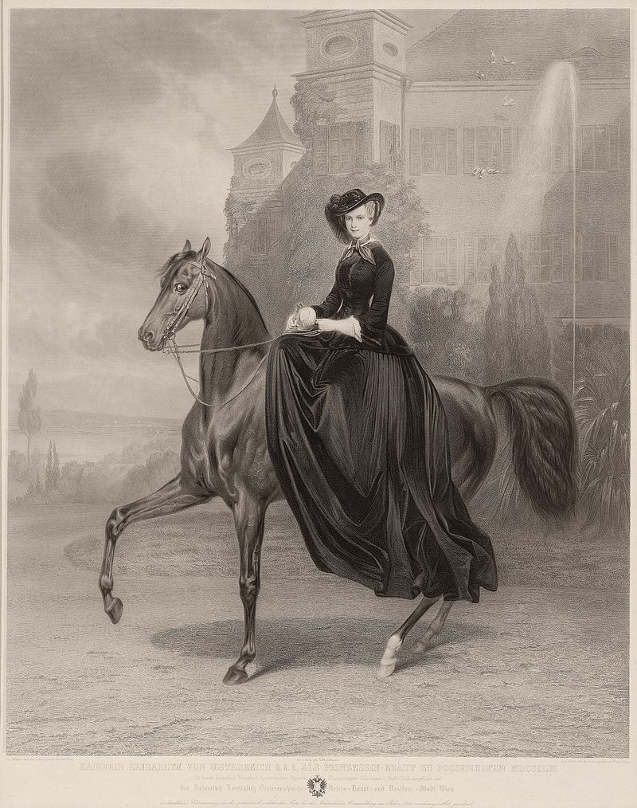
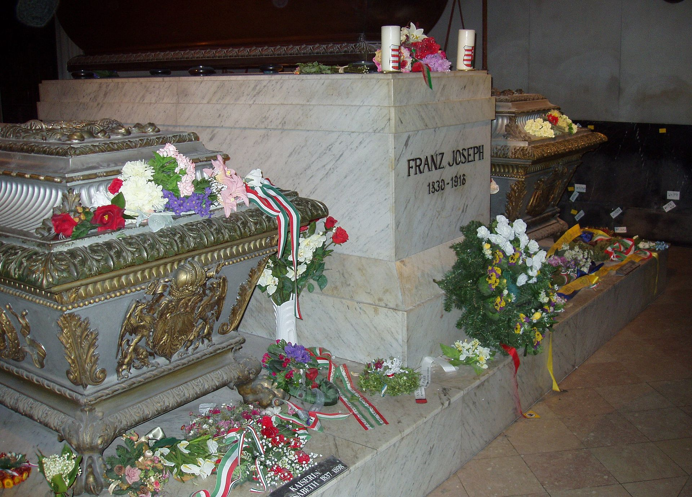

## 119年前的今天，世界上最美丽的皇后茜茜公主去世

（万象特约作者：一一）

茜茜公主，本名为伊丽莎白·阿马利亚·欧根妮（德语：Elisabeth Amalie Eugenie，1837年12月24日－1898年9月10日），意思是“奥匈帝国的伊丽莎白”。她是奥地利皇帝弗朗茨·约瑟夫一世的妻子，她是奥地利帝国皇后、匈牙利王后、波希米亚及克罗地亚王后。她的美貌和魅力征服了整个欧洲，被世人称为“世界上最美丽的皇后”。

茜茜公主是在自由精神和传统宫廷规矩间徘徊的悲剧人物，虽然贵为皇后，但是她的家庭生活不幸，和丈夫冷战，儿子自杀。由于后来影视作品的渲染，她成了一个文化偶像，相比她的显赫身世，世人更爱她展现出来的爱美、写诗、厌食、消瘦等符号。这和她在童年时代就流露出来的忧郁，多愁善感的性格符合，这种性格伴随她一生，直到她被一个无政府主义者刺杀身亡。

【意外相爱】

1837年12月24日，伊丽莎白出生于德国巴伐利亚的一个贵族家庭。童年的茜茜就表露出了忧郁，多愁善感的特质，这种性格伴随她一生。

1853年，伊丽莎白随她母亲与18岁的姐姐海伦赴奥地利的度假村巴德伊舍。原定计划是姐姐海伦应在那里引起其23岁的表亲、奥地利皇帝弗兰茨·约瑟夫一世的注意，并与之订婚。但出乎意外的是弗兰茨·约瑟夫一世竟然爱上了16岁的妹妹伊丽莎白。

弗兰茨违拗了他母亲索菲的意见，两人于1年后的1854年4月24日在维也纳的奥古斯丁教堂结婚。

【宫廷生活】

从一开始，16岁的伊丽莎白就很难接受哈布斯堡王朝严格的宫廷规矩，因此她在皇宫里非常孤立。她本人喜欢骑马、读书和艺术，而这些却是维也纳宫廷无法理解的。

婚后她生下两个女儿、一个儿子。但被婆婆兼姨妈——索菲剥夺了子女们的抚养权，她与丈夫弗兰茨·约瑟夫之间的关系开始恶化，遗传下来的精神不稳定也越来越明显。

【大女儿去世】

1857年，悲剧发生，伊丽莎白不顾医生的反对意见，带着她的两位女儿离开了奥地利前往匈牙利度假。但两位女孩患上腹泻，她2岁的大女儿因此而死亡。长女的死亡对伊丽莎白的生活和休息造成严重影响，并使她与丈夫产生永久性的裂痕，他们的婚姻渐渐崩溃。

【奥匈帝国】

1867年，伊丽莎白与她疏远的的丈夫团聚一起，于布达佩斯加冕为匈牙利王后。随着两人的复合，不久她又生下一个女儿。这次她坚持要按自己的方式抚养这个女儿。但此后不久伊丽莎白就又开始了她漫无目的的旅行生活。

她极端重视其外貌，以致花了很多时间来保持她的美丽；此外，她遵循着严格且苛刻的饮食和运动疗法，以维持她约50公分（20英寸）的腰围，这让她达到近乎消瘦的程度。

伊丽莎白后来不仅只因美丽而有名。她的时尚感、饮食和运动处方、马术运动的热爱、写诗等，也受到报纸和大众的热捧。

【儿子逝世】

1889年，一个打断伊丽莎白平静的日子发生了，她的儿子逝世。30岁的奥地利皇储鲁道夫与女友的遗体一起在他于下奥地利的行宫里发现，经过事后调查认定并非谋杀而是自杀，伊丽莎白从此陷入忧郁症，再也没有恢复过来。

从此以后，她只穿黑色衣服，打着一把皮制阳伞，用一把棕色扇子遮住面孔。这是伊丽莎白最著名的个人标志。

她去访问了当时北方皇室没有去过的国家：葡萄牙、西班牙、摩洛哥、阿尔及利亚、马耳他、希腊、土耳其和埃及等等。旅行不仅成了她生活的意义，而且帮助她逃避痛苦。

【被刺身亡】

1898年9月10日，在瑞士日内瓦，60岁的伊丽莎白沿着日内瓦湖边的勃朗峰滨湖路步行时，准备登上日内瓦号轮船前往蒙特勒，被意大利年轻的无政府主义者卢伊季·卢切尼用一把磨尖的锉刀刺伤心脏。

她遭到袭击后，不知道她的受伤严重程度，还继续登船。直到除去紧身衣，周围人才意识到问题的严重。终因流血过多身亡，时年60岁。她的最后一句话是：“出了什么事？”

她被葬在维也纳的皇家墓室里，几个世纪以来它一直是哈布斯堡王朝家族成员的主要安葬地。

【影视】

在20世纪伊丽莎白成为了一个代表性人物，在这一点上她可以与戴安娜王妃相比：一个喜爱自由的，被束缚在陈腐的宫廷仪式中的人。许多作家、电影编剧、戏剧作家都从她的生平中吸取题材。

1955年，电影《茜茜公主》使她的名字广为人知。值得注意的是，电影与原著小说的原文片名“Sissi”与公主实际上的小名“Sisi”在拼字上有点出入。

1992年9月3日，一部取材她的诗歌和绘画，伊丽莎白真实一生的音乐剧《伊丽莎白》，首演于维也纳大剧院并创下了当地票房的历史纪录，“重振维也纳戏剧艺术的辉煌”，自此成为迄今最成功的德语音乐剧。

