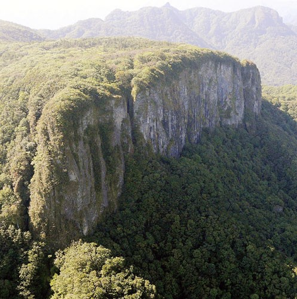
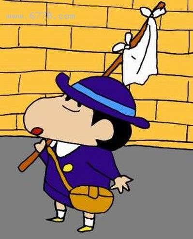

## nnnn姓名（资料）

### 成就特点

- ​
- ​

### 生平

8年前的今天，蜡笔小新之父，漫画家臼井仪人登山中不幸摔死

臼井仪人（日语：うすい よしと，1958年4月21日－2009年9月11日），日本的著名漫画家，代表作为《蜡笔小新》。

四格漫画的新人赏

1958年4月21日，出生于静冈县静冈市，成长并住于埼玉县春日部市，也就是《蜡笔小新》的故事舞台。1977年（19岁），从春日部工业高等学校毕业后，草草读了半年技术学校后辍学，一边打工赚钱，一边坚持画漫画。

1985年（27岁），在周刊《漫画ACTION》发表《不良百货公司物语》。1987年（29岁），以《不良百货公司物语》得到“新人赏”佳作。由于他画的是四格漫画，不好拍成动画，无法吸引大范围的观众，影响并不大。

一炮而红的蜡笔小新

1990年（32岁），在双叶社的成人漫画杂志上连载长篇漫画《蜡笔小新》，开始受人注目。故事内容讲述一个色色的五岁日本男童野原新之助的生活琐事，反映都市人心理特质，亦不乏露骨的情节，并翻译成多种语言发行至世界各地。

1992年4月，开始播放电视动画版，一炮而红，一时间到处都是小新热，成为至今少有的长寿动画，目前在日本收视率最高仍达12%，在中港台地区相当受欢迎。

1995年起（37岁），连载以家庭主妇的日常琐事为主的四格漫画《秀逗妈妈月美》。臼井仪人的风格为夸张化日本社会现象的短篇剧情，如黑道、堕胎潮、拜金女等，并渗入部分成人情节。

独自登山失踪

2009年9月11日早上（51岁），臼井仪人前往群马县与长野县之间的荒船山登山，并向家人说当日晚上将会回家。但当晚并没有回家，手机也无人接听。翌日，家人报警。

9月19日上午，一位登山者发现了臼井仪人的尸体。9月20日，日本警方出动直升机将遗体运出，当时这具遗体上半身穿着衣服，下半身只著内裤，所着及膝短裤挂在下落点上空的树枝上。经家人鉴别，确认遗体正是臼井本人。

由于无发现遗书，其随身物品亦完好，警方已排除自杀及他杀之可能，初步相信是山路无围栏而失足坠崖致死。9月21日，双叶社召开记者会称，警方发现的相机中留有约30张照片，最后一张是从上往下拍摄的山崖照片，因此死因怀疑是拍照时脚底打滑失足而摔死。

（臼井尸体被发现的地方-日本荒船山舻岩）

神秘低调的离去

9月22日，家人为臼井仪人举行私人葬礼，只允许其近亲和发行《蜡笔小新》的双叶社约30名职员出席。灵堂内没有挂上他的遗照，亦没有挽联，只有鲜花摆设，贯彻臼井生前的神秘和低调作风。葬礼完成后，遗体随即送往火葬场火化。

臼井仪人会是自杀吗？2009年8月10日在日本出版的第49集《蜡笔小新》里面，有一页是小新脸上有着浓浓的阴影，他说“我很快就要启程去远方了……”、“我要在死前，向娜娜子告白”，风格和以前的无厘头和搞笑相比，顿时让人感到十分沉重，似乎在预言些什么。

再看一看蜡笔小新

### 