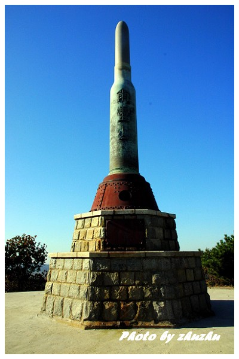
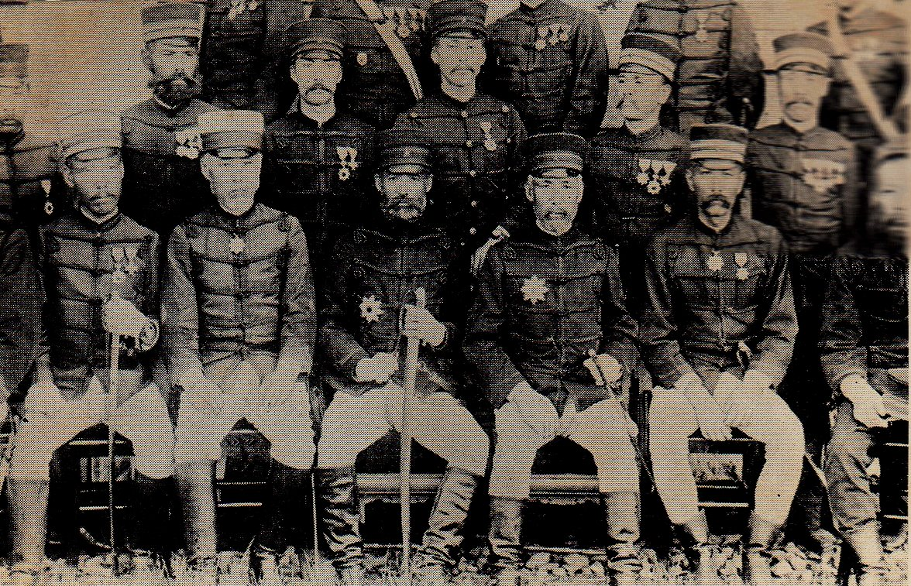
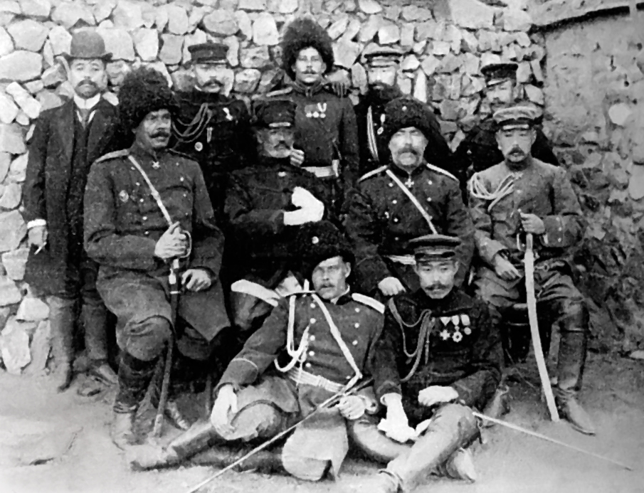
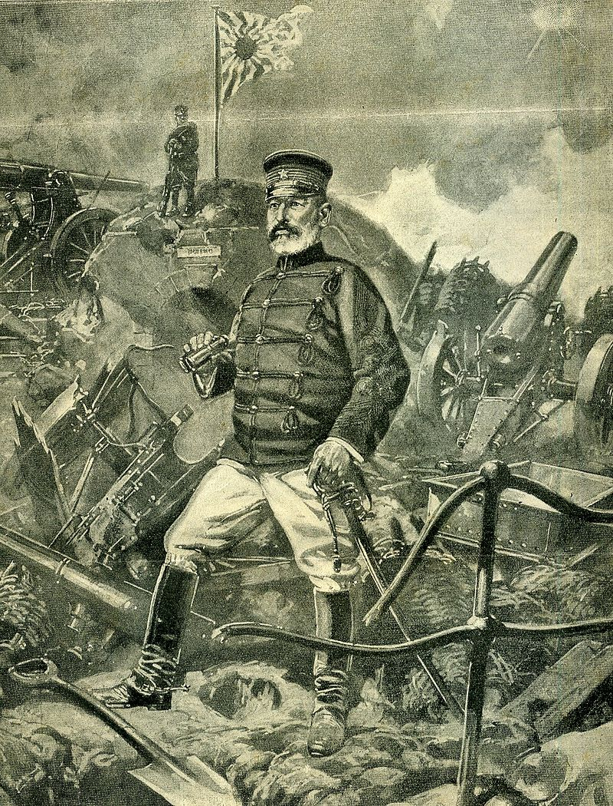
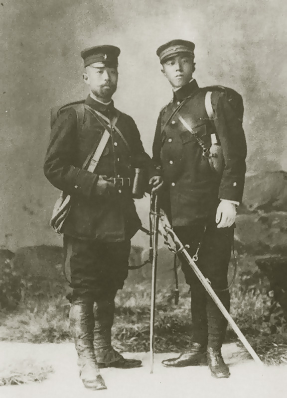
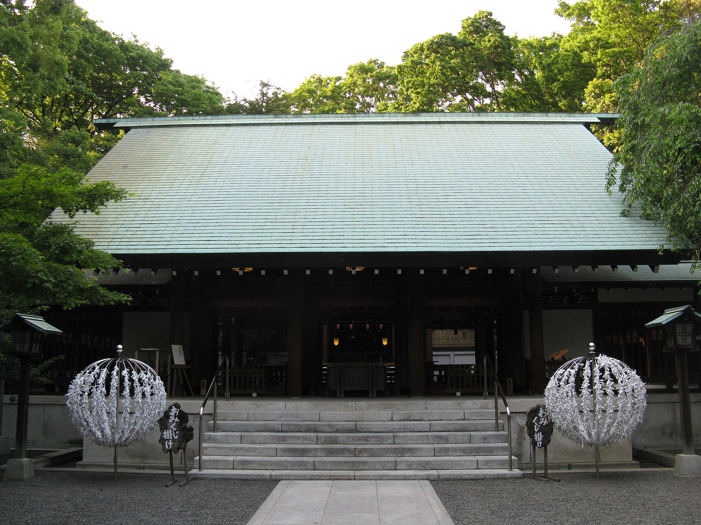
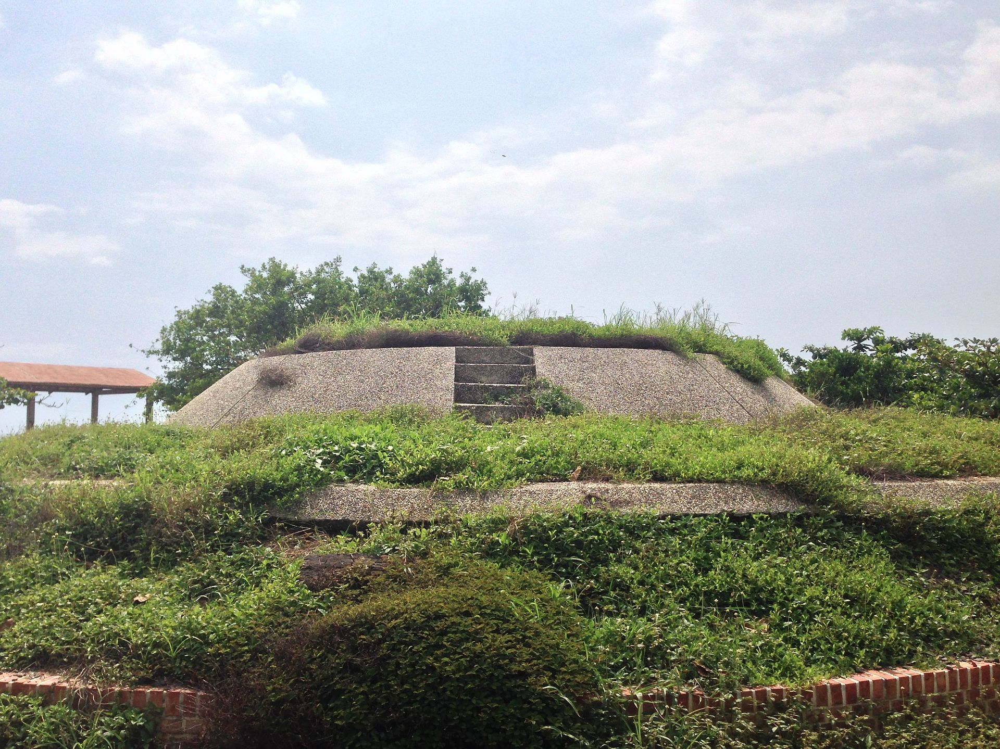
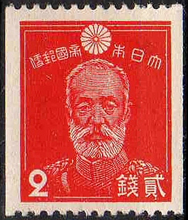
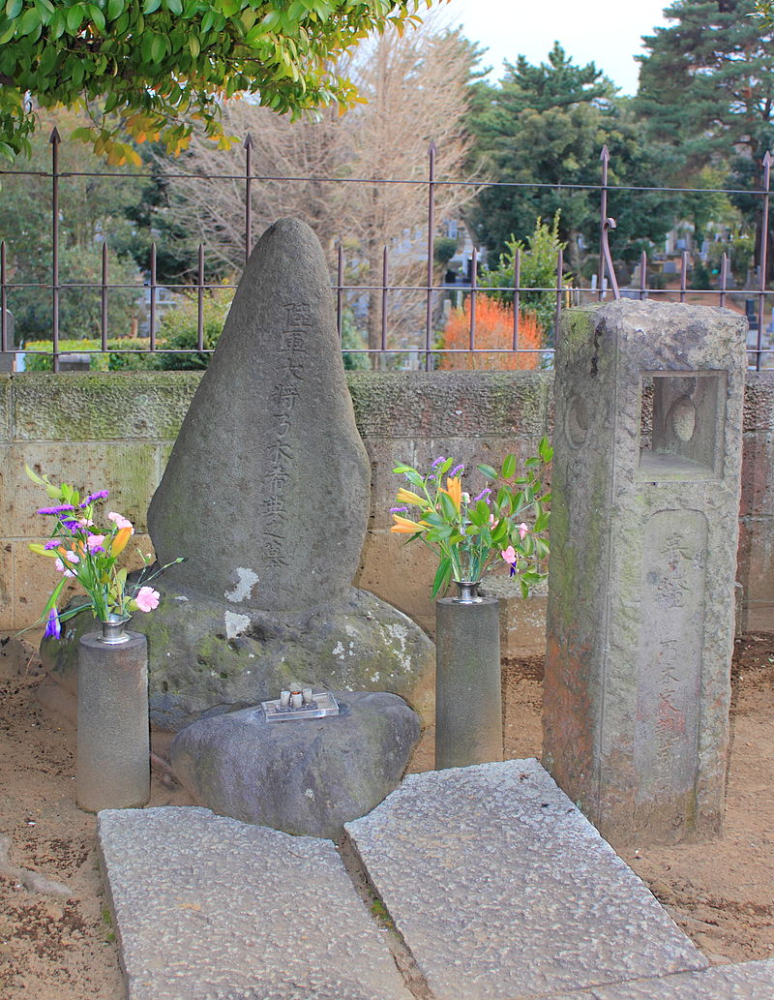

## nnnn姓名（资料）

### 成就特点

- 大日本帝国陆军大将
- 台湾日治时期第3任总督（1896-1898）
- 以“肉弹”战术攻克旅顺，在二战前被多数日本人奉为“军神”。
- 善于写中国诗
- 两个儿子战死
- 1912年明治天皇病逝后，同其妻剖腹殉节，成为日本武士道精神的典型代表

### 生平

乃木希典（1849年12月25日－1912年9月13日），大日本帝国陆军大将，台湾日治时期第3任总督（1896-1898）

1849年12月25日，乃木希典出生于日本本州山口县一个下层武士的家庭。自幼的基本教育是武士道精神与儒学忠君思想。

1871年（明治四年），日本开始实施效忠天皇的“亲兵制度”，组建中央统帅的直辖部队，从萨摩藩、长州藩、土佐藩三处征集将兵，乃木希典以藩兵身份遴选为天皇“亲兵”。

【失掉军旗】

1877年（28岁），在镇压西乡隆盛反叛的西南战争中，身为第十四联队少佐联队长的乃木率军增援途中，联队军旗被夺走。乃木希典非常自责，拚命往前冲，企图战死，负伤之后，被抬到野战医院，仍旧企图逃脱到前线作战。

后来乃木希典写请罪书给总指挥官山县有朋，请求严厉处分。虽然山县有朋并不问罪，但乃木希典仍相当自责，曾企图切腹自杀，被儿玉源太郎发现并阻止。由于自责，乃木希典染上酒瘾，经常借酒消愁。

【留学自律】

1886年－1888年，赴德国留学军事。

乃木希典赴德国留学，受到很大的震撼。回国以后，他给军部呈上“肃军意见书”，要按照德国陆军的方式整顿军队，讲究军人的风纪和精神面貌，从外表开始强调一个军人的气质和风貌。比如强调一个军人无论何时何地都必须穿军装，要干干净净一丝不苟。他的酒瘾也戒掉了，变成一个极为自律的人。

【甲午战争】

1894年，中日甲午战争中任第一旅团长，从广岛出发。临行前明治天皇送行。在酒会上乃木希典赋汉诗一首献给天皇：“肥马大刀无所酬，皇恩空沿几春秋。斗瓢倾尽醉余梦，踏破支那四百州。”

1894年10月24日，他带领先头部队在辽东半岛花园口登陆。因为有15个日军斥侯兵，被清军逮住后，绑在行刑柱上折磨至死。在旅顺破城时，屠杀了2万无辜平民。

随后，乃木希典足迹遍布辽东半岛。写下了“对峙两军今如何？战声恰似迅雷过。奉天城外三更雪，百万精兵渡大河。”的诗句。

1895年，晋升为陆军中将，特封为男爵。

【乙未战争，登陆台湾】

1895年10月11日，乃木希典率第二师团登陆屏东枋寮，占领东港、凤山后。 10月20日，刘永福弃守台南城内逃到厦门，乃木希典不费一枪一弹占领台南。

1896年10月14日，任第3任台湾总督(1896年10月14日－1898年2月)。

【卖台湾】

然而，台湾抗日情绪激烈，1896年12月，爆发陆军少尉结城亨与其部下21人，于花莲新城遭到太鲁阁族歼灭，史称新城事件。

1897年春，乃木希典利用回国之机，对首相表示，应把台湾卖掉。他抱怨日本统治台湾一事：“就像乞丐，讨到一匹马，既不会骑，又会被马踢。”他建议将台湾卖给英国，这样既可甩掉一个包袱，又可获得一大笔钱，一举两得。然而，英国人并不感兴趣，而法国人十分感兴趣。双方的外交官员经过讨价还价，初定台湾的售价为1500万法郎。

1898年，伊藤博文重新成为日本首相。再次提出卖台湾事，一度出现以一亿日圆的价格将台湾卖给法国的想法，甚至是卖还给清朝。儿玉源太郎认为是管理无能，主动请缨担任总督。于是乃木希典辞职，儿玉源太郎成为第四任台湾总督。。

【血战203】

1904年2月6日，日俄战争爆发，乃木出任第3集团军司令官，并晋升为陆军大将，负责指挥旅顺会战。

5月27日，乃木的长子在金州（在旅顺北方）的南山战役中受伤死亡。赋诗“山月草木转荒凉，十里血腥新战场。征马不前人不语，金州城外立斜阳。”

明治天皇为保留乃木家的香火，拟诏回与乃木同行的次子。但乃木父子联名上书请求继续参战。

5月29日，登陆大连湾，争夺旅顺。

11月27日，日军进攻旅顺203高地（今旅顺的猴(后)石山）（高地长不到250米，宽仅30多米，因海拔203米而得名，可俯瞰旅顺军港）。

11月30日，乃木次子战死在203高地西北坡。

12月5日，日军以“肉弹”战术冲锋肉搏，最后夺取203高地。203高地争夺战中，日军共出动兵力 6.4 万人，死伤 1.7 万人。

1905年1月，日军占领了203高地之后，从山上向旅顺城区和港口猛轰，停泊在港里的俄舰全被击毁。俄军的城防司令也被炸死。俄军辽东地区总司令官施特塞尔投降。

乃木攻下高地后，日军在顶峰修建了一个炮弹型的纪念碑，乃木赋汉诗纪念：“尔灵山（乃木希典为203高地取的名，203之谐音）险岂难攀，男子功名期克坚，铁血覆山山形改，万人齐仰尔灵山。”

1905年3月，乃木参加了奉天会战。1907年，因战功而昇为伯爵。

【学习院院长】

由于在旅顺攻打战中日军死伤惨重，因此当时乃木已起自杀请罪之念，并向明治天皇请辞。但明治天皇不许，并任命为学习院院长，负责教导皇孙裕仁（即后来昭和天皇）。乃木希典于学习院院长任内，推行军事式教育，而且对裕仁亦很严格。据说当时明治天皇命乃木希典任院长时曾说过“你为朕失去了两个儿子，现在朕将这班孩子交给你。”

乃木希典一直任学习院院长，1912年7月30日明治天皇驾崩，1912年9月13日明治天皇出殡当天晚上，乃木希典的妻子静子首先以刀刺自己的胸部自杀，接着乃木希典切腹，然后再自行介错，切断自己的颈动脉，死亡。享年62岁

【武士道精神的象征】

乃木希典为天皇自杀，被日本人称为“殉死”。乃木希典也成了“武士道”精神的象征。死后当局为他在其故居等多地建“乃木神社”，宣传武士道精神。

乃木希典的殉死后来被许多日本作家作为题材写进文学作品中，如：
森鸥外的《兴津·弥五右卫门的遗书》
夏目漱石的《心》
三岛由纪夫的《忧国》
司马辽太郎的《殉死》
芥川龙之介的《将军》
渡边淳一的《静寂之声》
1921年，郑孝胥为悼念乃木希典而作诗。诗碑现存于青岛博物馆。博物馆刻意将碑体斜立，以示对郑孝胥和乃木的反感。

【】

现代的日本史学界对其军事能力，特别是在日俄战争旅顺战役中的战役指挥，大多持否定态度。
有些更激进的如司马辽太郎干脆就给他戴上一个“愚将”的称呼，战前对乃木的肯定和吹嘘，实则是鼓吹愚忠天皇的人为神话而已。

### 照片

