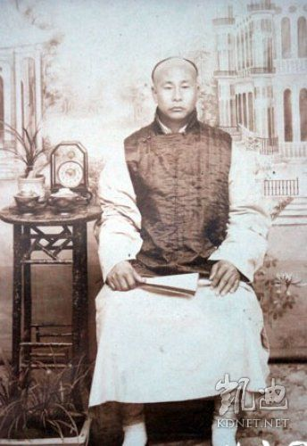
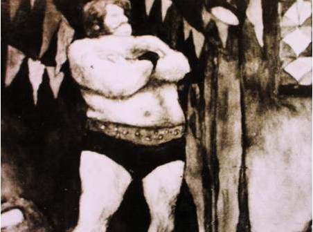
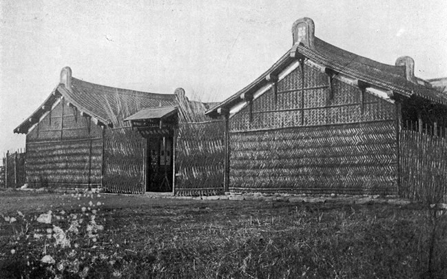
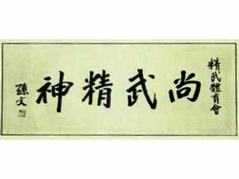
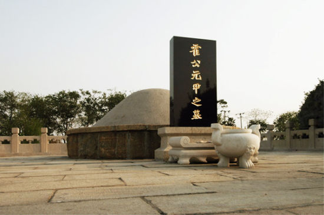

## nnnn姓名（资料）

### 成就特点

- ​
- ​

### 生平

107年前的今天，没有打大力士的传奇大侠霍元甲去世

当装卸工的武林高手

1868年1月18日，霍元甲出生于今天津市西青区精武镇，原名南河镇，2009年为纪念霍元甲而更名。父亲以保镖为业。霍元甲幼年体弱，在27岁以前基本上生活在故乡，时常挑柴到天津去卖。

28岁后，到天津码头当装卸工，后来在同盟会会员农劲荪开设的怀庆药栈当帮工，升任掌柜。

轰动上海的大力士比武

1909年春，英国大力士奥皮音来到上海，在北四川路52号亚波罗影戏院“登台表演举重，露肌及健美种种姿态，约二十分钟，一连数晚，最后一场言，愿与华人角力。于言谈中，带多少轻蔑口吻，翌日见于报端，沪人哗然。”于是陈其美、农劲荪等人“咸欲聘请技击名家，登台与赛，以显黄魂。”

（大力士奥皮音在张园摆擂台比武）

农劲荪便推荐霍元甲应战。1909年3月，霍元甲与徒弟刘振声赶到上海，商谈比武事宜，并商定“用摔跤方式，以身跌于地分胜负”。

于是，在上海静安寺路张氏味莼园（张园）内搭建了“高四尺，宽广二十尺”的擂台。六月中旬下午四时，比赛的时间已到，但奥皮音并没有来。就这样，霍元甲名扬上海。

（比武结束后，霍元甲与徒弟合影）

短短一年的精武门

同盟会会员陈其美曾提议：要短期内训练出有强健体魄，又有军事技能的青年。热血年轻商人陈公哲等人，便成立了一所小武馆，称作精武体操学校。霍元甲便被邀请在“精武体操会”中主教武术。

1910年，“精武体操会”易名精武体育会。几个月后，1910年9月14日（42岁），霍元甲去世。后来霍元甲被塑造为民族英雄，以宣传反对日本、俄国的侵略。

精武会改由霍元甲的哥哥霍元卿、儿子霍东阁任教。十数年后，海内外精武分会达43处，会员逾40万人。1919年，精武体育会在上海举行成立十周年纪念活动时，孙中山亲笔题赠“尚武精神”匾额，并担任名誉会长，还为特刊《精武本纪》撰写了序文。

（最初的精武会会所）

"慢性烂肺药"的传闻

1912年，向恺然（平江不肖生）出版《拳术》和《近代侠义英雄传》两部作品。他根据传闻，编写了霍元甲被日本医生秋野用“慢性烂肺药”毒死的故事。该说法广为流传。

另一个说法是霍元甲死于肝病。霍元甲长久以来患有黄疸，众所周知。

霍家后人宣称，1989年，在给霍元甲坟墓迁移时，发现遗骨上有黑色斑点。经过天津市公安局实验室检测，该黑色斑点为砷化物（即砒霜）。但也可能与服用的中药中，含有雄黄有关。

（天津西青区小南河村的霍元甲墓）

万里长城永不倒的大侠

霍元甲的传奇被多次拍成电影及电视剧。1981年，由香港出品，黄元申、米雪、梁小龙主演的《大侠霍元甲》，曾经风靡中国大陆。主题曲《万里长城永不倒》，几乎人人会唱。1982年，由袁和平执导，梁家仁主演了电影《霍元甲》。

2001年，由赵文卓主演电视剧《霍元甲》。2006年，由李连杰演的《霍元甲》，内地票房过亿。2008年，由郑伊健（饰演霍元甲）、陈小春（饰演陈真）主演的新版电视剧《霍元甲》，再次诠释了霍元甲的生平。

