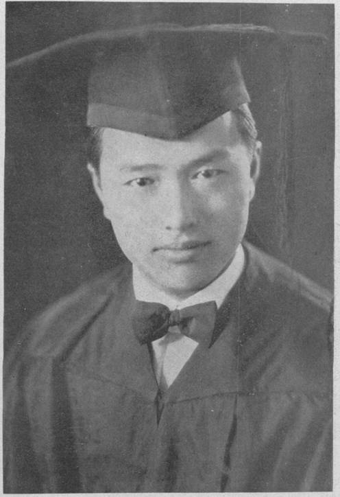
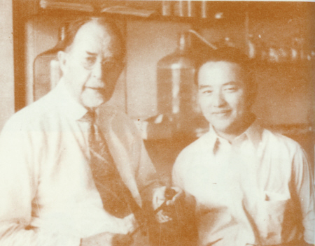
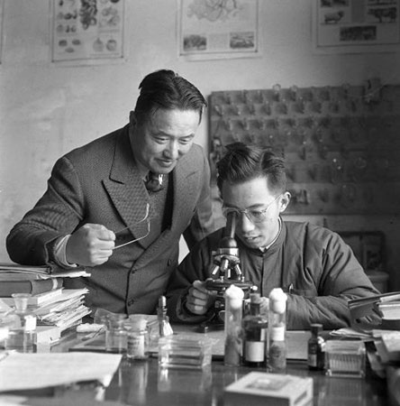
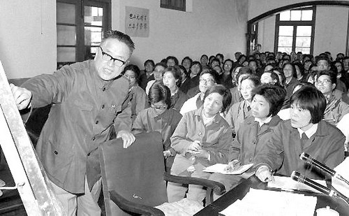

## nnnn姓名（资料）

### 成就特点

- 中国现代遗传学的主要奠基人之一，有“中国遗传学泰斗”之称。
- 将“基因”一词首次带入中文
- 在复旦大学相继建立了中国第一个遗传学专业、第一个生命科学院和第一个遗传学研究所。
- 曾连任三届中国民主同盟中央名誉主席。
- 1999年，国际编号为3542号小行星被命名为“谈家桢星”
- 中国的摩尔根

### 生平

108年前的今天，创造“基因”一词的中国遗传学泰斗谈家桢出生

【转学保送上大学】

1909年9月15日，谈家桢出生于浙江宁波慈溪。父亲是邮政局的一名小职员。6岁上私塾，12岁毕业于教会办的道本小学，进入宁波斐迪中学。后转学到湖州东吴三中。1926年（17岁），保送苏州东吴大学，主修生物学。

1930年（21岁），大学毕业，进入燕京大学，跟随唯一研究遗传学的李汝祺教授学习。1932年（23岁），研究生毕业，获理学硕士学位。 

【中国的摩尔根】

1934年（25岁），谈家桢新婚夫人，赴美国加州理工学院攻读博士学位，师从现代遗传学奠基人摩尔根。摩尔根发现了染色体的遗传机制，创立染色体遗传理论， 是现代实验生物学的奠基人。获得1933年的诺贝尔医学奖。

1936年（27岁），他的论文《果蝇常染色体的遗传图》通过答辩，获哲学博士学位。谈家桢也被人称为“中国的摩尔根”。

（谈家桢与摩尔根）

【抗战期间回国效力】

1937年（28岁），回国后，浙江大学校长竺可桢聘他为生物系教授。 不久全面抗战爆发，浙江大学辗转内迁。最后生物系迁到贵州遵义湄潭的一个破旧不堪的祠堂里。在艰苦的环境里，谈家桢不但培养了一批优秀的学生，在研究上也取得了重要的成就。

1944年（35岁），谈家桢发现了瓢虫鞘翅色斑变异的镶嵌显性遗传现象，这一创新性研究成果，至今仍被列为教科书的经典内容。1946年，发表了“异色瓢虫色斑遗传中的嵌镶显性”的论文。这些成果丰富和发展了摩尔根遗传学说，引起国际遗传学界的巨大反响。

【基因一词的创造者】

1952年（43岁），院系调整后，任复旦大学生物系系主任。1961年起，曾先后担任复旦大学遗传所所长，复旦大学副校长，生命科学院院长等职务。这是中国的第一个遗传学专业，第一个遗传学研究所，第一个生命科学院。

基因的英文是「Gene」，是 「开始」 、「生育」 的意思。这个名词最初是由丹麦学者约翰森提出来的。 而中文的「基因」这个词，则出自谈家桢的生动音译，既与英文原文读音相近，也表达出了其生命的「基本因子」的意思。

他先后发表了百余篇研究论文，对遗传学做出重大贡献。他写的科普文章《奇妙的克隆》收录在初中语文教科书（人教版八年级）。

【得到广泛认同的多国院士】

1980年（71岁），当选中国科学院院士。1985年，当选第三世界科学院院士、美国国家科学院外籍院士。1987年，当选意大利国家科学院外籍院士。1999年，当选为纽约科学院名誉终身院士。

1995年，获得求是科学基金会杰出科学家奖。1999年，国际编号为3542号小行星被命名为“谈家桢星”。

2008年11月1日7时18分，在上海华东医院逝世，享年99岁。

（2005年6月，参加复旦百年校庆的谈家桢）

