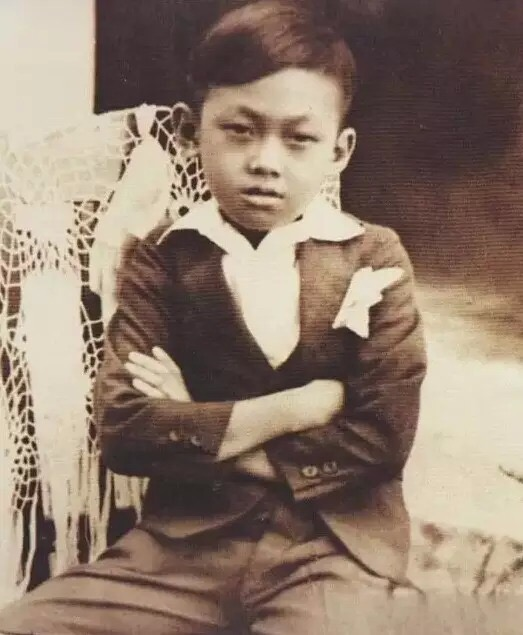
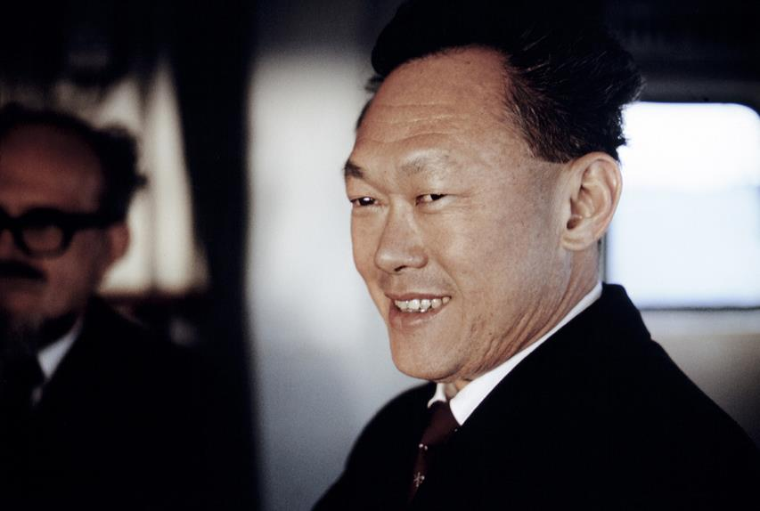
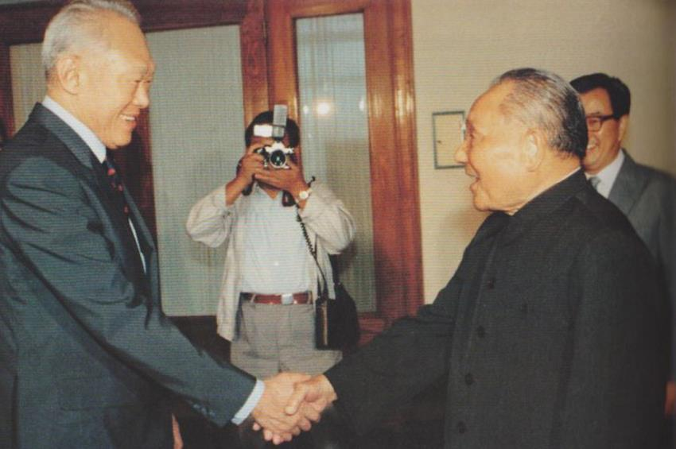

## nnnn姓名（资料）

### 成就特点

- 首任新加坡总理，新加坡国父，首任人民行动党秘书长
- 新加坡李氏家族政治的创始人
- 2011年，《商业内幕》网站在其“20世纪最成功的独裁者”排名中将李光耀列为第二位
- ​

### 生平

94年前的今天，20世纪第二成功的独裁者，新加坡国父李光耀出生

【为日本工作的中国移民】

1923年9月16日，李光耀生于新加坡的一座别墅内。客家人，祖籍广东梅州市大埔县。曾祖父在60年前，移居到这里——海峡殖民地。

1935年（13岁），李光耀考入当地的英语学校莱佛士书院；1940年，进入高中部，但在日军占领新加坡后中断学业。1942年，开始学习中文和日文，并成为首届官方日语考试毕业生。

1943年起，在日本大本营陆军参谋部报道部工作。这段经历，使得他对日本严厉的管理方式非常推崇。

【帮助新加坡自治的律师】

二战结束后，1946年，李光耀凑集学费，并获大英帝国女王奖学金，远赴英国留学，就读于伦敦经济学院。一年后，李光耀转到剑桥大学攻读法律。1949年，获双重一等荣誉学位，名列榜首毕业，取得律师资格。

1950年，与学姐柯玉芝结婚。柯玉芝于1937在莱佛士书院念高中，是这所传统男校的唯一女生。8月，李光耀回到新加坡，开始从事律师工作。

1952年，李光耀代表“新加坡罢工的邮差”与政府谈判而声名大噪，在工会中建立了群众基础，为将来的从政之路奠定了基石。1954年10月，参与成立人民行动党，李光耀顺利当选立法议会议员，为新加坡争取自治地位。1959年6月3日，新加坡自治邦成立，李光耀出任自治邦政府总理。

【被迫独立的新加坡】

1961年，行动党内部，“反共分子”与“亲共分子”发生决裂，李光耀逐渐右倾。1963年2月，李光耀配合马来亚、英国殖民政府发起大规模保安行动（即著名的“冷藏行动”），拘捕了上百人“亲共分子”。7月，李光耀在伦敦与马来亚政府达成协议，新加坡加入马来西亚联邦，正式合并。

新马合并后，双方在政策上很快产生了严重的分歧。1964年，新加坡发生种族骚乱，双方互相指责，多次协商未果。1965年8月9日，新加坡被驱逐出马来西亚联邦，被迫宣布独立。

【30年成功的独裁者】

新加坡独立后，李光耀积极推动经济改革。在位期间推动开发了裕廊工业园区、创立公积金制度、成立贪污调查局，并进行教育改革等多项政策，成功使得新加坡在三十年内发展成为最富裕繁荣的国家之一。新加坡政府以高效率、廉洁著称，人民的生活水平提高，只是自由备受限制。

 2011年，《商业内幕》网站在其“20世纪最成功的独裁者”中将李光耀排列为第二位。（而第一位为伊德里斯一世，第三位是佛朗哥，蒋介石名列第四位）

【20年垂帘听政】

1990年，李光耀辞去总理职务，担任内阁资政，被指“垂帘听政”。2011年5月14日，人民行动党在大选中获得建国以来最低得票率，李光耀发表声明，宣布不再出任新内阁任何职务。他结束了长达20年的资政生涯。连同之前的总理生涯，他控制新加坡政府长达52年。此后，他的长子李显龙正式接班。

2015年3月23日凌晨3时18分，李光耀因重症肺炎医治无效逝世，享寿91岁。3月29日下午14时, 在新加坡国立大学文化中心举行国葬。

【个人第二的亚洲价值观】

他始终提倡亚洲价值观，认为亚洲国家不需要完全依照西方的价值观行事。李光耀因此也一直对西方国家对他专制独裁的批评不加理会，他认为西方民主不能强加给亚洲人民。

他说：“西方人相信，只要有一个好的政府制度，一切问题都可以解决；东方人是不相信的。东方人相信，个人离不开家庭，家庭属于家族，家族又延伸到朋友与社会。……在西方，特别是在二次大战后，政府被认为可以对个人完成过去由家庭完成的义务；这种情况鼓励了单亲家庭的出现，因为政府被认为可以代替父亲，这是我这个东亚人所厌恶的。家庭是久经考验的规范，是建成社会的砖瓦。”

对亚洲价值阐明得最清楚的，可能是新加坡提出的五大原则：一、社会与国家比个人更重要；二、国之本在家；三、国家和社会要尊重个人；四、和谐比冲突(指言论多元的社会)更能维持社会秩序。五、宗教与宗教之间不仅应和平共处，而且应互补。用李光耀的最概括的话来说，就是“社会第一，个人第二”

