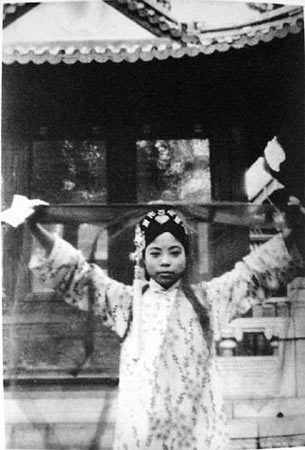

## nnnn姓名（资料）

### 成就特点

- 末代皇帝溥仪的淑妃
- 与皇帝离婚
- ​

### 生平

文绣（1909年12月20日－1953年9月17日），字蕙心，自号爱莲，傅玉芳，蒙古族，鄂尔德特氏，满洲鄂尔德特氏端恭之女，为清朝末代皇帝溥仪的妾侍，溥仪册封她为淑妃，此后直至两人于1931年离婚为止，未再得进封。

1909年12月20日，文绣出生。父亲曾任内务府主事，蒙古族，属于满洲八旗中上三旗的镶黄旗。母亲为汉族。

8岁时，到北京私立敦本小学读书，天资颇为聪颖，学名傅玉芳。

1921年初（12岁），已退位但仍保留帝号的溥仪选皇后。因她祖上是已入旗籍的蒙古族贵族，符合候选条件。溥仪已经无心选皇后，拿笔随便在图册上花了一个圈，那个人就是文绣。

但文绣长相平平，而另选择的婉容号称满洲第一美女，且家世显赫，最后还是选了婉容当皇后。而文绣既被皇帝圈上了，也不能再嫁别的人，于是成了妃子。

1922年，溥仪大婚，时长五天，即11月29日至12月3日。未满13周岁的文秀进宫，成了16岁的溥仪的淑妃。

1922年11月30日，文绣先于正宫皇后婉容一天，被溥仪以隆重的婚礼娶进皇宫，皇宫里称她为淑妃。新婚之夜，溥仪也未住进淑妃的新房。次日，溥仪再娶进皇后婉容，也是不与皇后同房，都是单身一个人独寝养心殿。

文绣自入宫之后，并未获得溥仪的宠幸。她每天早上梳洗完毕，就先到溥仪的寝殿问安，再到婉容皇后和诸位太妃的寝宫中依序请安，之后回到她所居住的长春宫并关上宫门。

1924年，冯玉祥发动北京政变，囚禁总统曹锟，推翻直系曹锟政府，驱逐清废帝溥仪出宫。

1925年2月24日，溥仪一家人及亲信们，在罗振玉和芳泽谦吉的合谋下，离开北京的日本公使馆，迁移到天津日租界的宫岛街，在张彪从前的别墅——张园住下，后来又搬迁到日租界协昌里的静园居住。在天津，溥仪下榻在张彪的私人花园中的一幢三层楼的白色小洋房里，他跟婉容住在二楼，而把文绣抛在楼下。

在一个农历除夕的晚上，溥仪与婉容在寝宫嬉戏，这时，有宦官奏报淑妃用剪刀捅自己的小腹，溥仪生气地说：“她惯用这伎俩吓唬人。谁也不要理她！”而这件事也造成日后“刀妃革命”的导火线。

【】

1931年8月25日，文绣从天津住所静园出走，住进宾馆，淑妃文绣通过律师正式向溥仪要求离婚，原因是她再也承受不了溥仪对她的冷落，和宫中的不自由。这件事情对逊清皇室及前清王公大臣，还有溥仪本身都造成相当大的震撼，这可以说是对旧式文化的一种挑战，之后的两个月，淑妃文绣坚持自我的想法，不顾家族的反对和指责，也不理睬溥仪聘请的律师所提出的和解方案，坚决的向天津地方法院要求和溥仪离婚。

双方律师寻求庭外和解，于1931年10月22日达成离婚协议。

文绣的族兄文绮为此写了一封信，并将之登在报上指责她：
蕙心二妹鉴： 顷闻汝将与逊帝请求离异，不胜骇诧。此等事件，岂我守旧人家所可行者？我家受清室厚恩二百余载，我祖我宗四代官至一品。且漫云逊帝对汝并无虐待之事，即果然虐待，在汝亦应耐死忍受，以报清室之恩。今竟出此，吾妹吾妹，汝实糊涂万分，荒谬万分矣！

而文绣也不甘示弱地回了一封信给文绮：
文绮族兄大鉴： 妹与兄不同父，不同祖，素无来往，妹入宫九载未曾与兄相见一次，今我兄竟肯以族兄关系，不顾中华民国刑法第二百九十九条及三百二十五条之规定，而在各报纸上公然教妹耐死。又公然诽谤三妹，如此忠勇殊堪钦佩。惟妹所受祖宗遗训，以守法为立身之本：**如为清朝民，即守清朝法；如为民国民，即守民国法。**逊帝前被逐出宫，曾声明不愿为民国国民，故妹袖藏利剪，预备随逊帝殉清。嗣因逊帝来津，做民国国民一分子，妹又岂敢不随？**既为民国国民，自应遵守民国法律。**查民国宪法第六条，**民国国民无男女、种族、宗教、阶级之区别，在法律上一律平等。**妹因九年独居，未受过平等待遇，故委托律师商榷别居办法，此不过要求逊帝根据民国法律施以人道之待遇，不使父母遗体受法外凌辱致死而已。不料我族兄竟一再诬妹逃亡也、离异也、诈财也、违背祖宗遗训也、被一般小人所骗也、为他人作拍卖品也... ...种种自残之语不一而足，岂知妹不堪在和解未破裂以前不能说出之苦，委托律师要求受人道待遇，终必受法律之保护。若吾兄教人耐死，系犯公诉罪。检察官见报，恐有检举之危险。理合函请我兄嗣后多读法律书，向谨言慎行上作工夫，以免触犯民国法律，是为至盼。

“皇妃与皇帝离婚”一事传开后，被当时的人们称之为“刀妃革命”。淑妃文绣的妹妹文珊，是她家族中唯一一位支持她与溥仪离婚的人。

溥仪不愿闹上法院，遂经双方律师交涉“私了”，在经过两个月的双方律师签字和谈的结果是；淑妃文绣和溥仪皇帝完全断绝关系，溥仪必须支付五万五千银元作为赡养费，而文绣终身不得再嫁，双方互不损害名誉。

溥仪被迫答应离婚后，为挽回体面，还于1931年9月13日在京、津、沪报纸上发布广告刊登“上谕”：“淑妃擅离行辕，显违祖制，撤去原封位号，废为庶人，钦此。”

文绣在离婚后所拿到的5.5万元赡养费后，支付了律师费用和期间种种支出之后，虽然已经过回了平民的生活但宫中的习惯比如雇佣4个佣人；洗手要三次，且一次比一次温度高而又不能烫手。

【】

后来她用傅玉芳的名字去了北平私立四存中小学教授国文国画课程，她把整个身心的爱都献给了孩子们，但不久就被发现她就是末代皇妃文绣，每天都引来众多人来学校围观，记者也来报导，最后她不堪压力，辞职离开了学校。

辞职之后的仅仅芳龄24岁的她在刘海胡同的四合院里过着隐居的生活，但还是被发现，也有求婚者，但她有着和溥仪的约定，通通拒绝。她后来不能继续维持奢靡的生活，变卖了珠宝首饰等，投奔了表哥，后来做过各种粗活，最后去街头卖香烟，却也被记者曝光。

不堪压力之下她选择了落荒而逃，后经过熟人介绍在1947年，38岁的文绣在《华北日报》当了一名校对。

对日抗战胜利后，与报社社长的表弟、时任北平行营长官李宗仁部下少校军需官、40多岁尚未结婚的国军军官河南人刘振东结婚，婚宴摆在在北京当时著名的东兴楼，光是鱼翅就有10桌，她的老公后来开了板车租车行，地安门外白米斜街租了三间房屋安家度日，当起了家庭主妇，但时局动荡，家庭破产，最后变卖家产得到逃难的船票，但北平已经被围城。最后刘振东向政府交待了历史问题，在清洁队也找到了一份工作，两个人在10平米的房子里过着清贫的生活。

1953年9月17日晚10时，她因心梗死于家中，年仅44岁，只有刘振东守在身旁。事后由刘振东所在清洁队帮助钉了一具木板薄棺，埋葬在安定门外的义地里，她也是中国历史上唯一一位担任过教职的皇妃。

【】

### 照片

