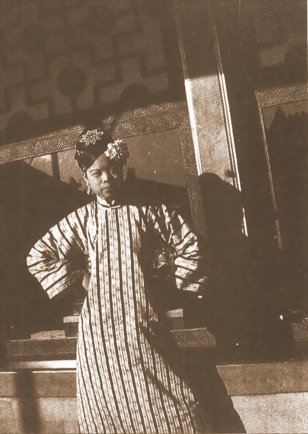
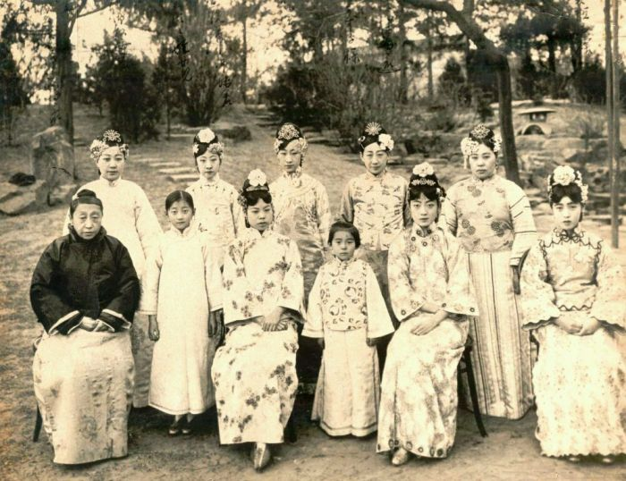
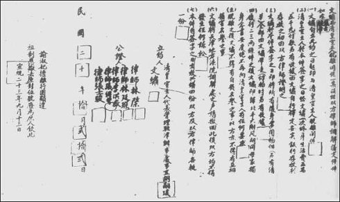
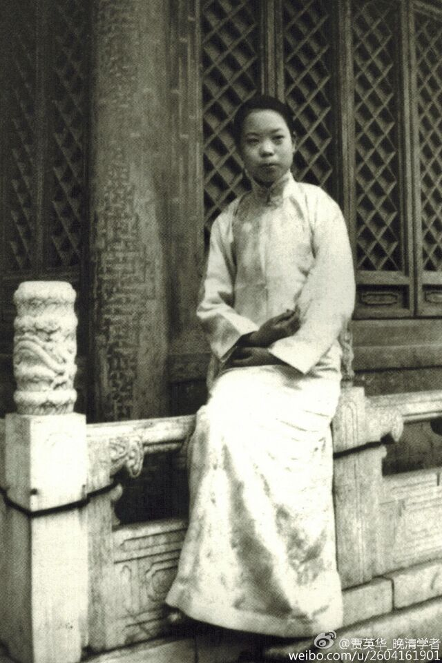

## nnnn姓名（资料）

### 成就特点

- 末代皇帝溥仪的淑妃
- 与皇帝离婚
- ​

### 生平

64年前的今天，与皇帝离婚、嫁给清洁工的末代皇妃文绣凄苦离世

【随手圈上的皇妃】

1909年12月20日，文绣出生。父亲曾任内务府主事，为蒙古族贵族，祖上已归入满洲八旗，并且是上三旗中的镶黄旗。母亲为汉族。8岁时，到北京私立敦本小学读书，天资颇为聪颖，学名傅玉芳。

1921年初（12岁），已退位但仍保留帝号的溥仪选皇后。文绣符合候选条件，亲戚交上照片，给她报了名。谁知溥仪一开始无心选皇后，随手在图册上花了一个圈，那个人就是长相平平的文绣。后来，溥仪另选择了家世显赫的满洲第一美女婉容。最后定婉容为皇后，被圈上的文绣，则成了妃子。

【没有宠幸的新娘子】

1922年11月29日至12月3日，溥仪大婚，时长五天。30日，未满13周岁的文绣进宫，成了16岁的溥仪的淑妃。新婚之夜，溥仪并未住进淑妃的新房。第二天，皇后婉容进宫，溥仪也没有与她同房。

文绣入宫之后，没有获得溥仪的宠幸。她每天早上梳洗完毕，就先到溥仪的寝殿问安，再到婉容皇后和诸位太妃的寝宫中依次请安，之后回到她所居住的长春宫并关上宫门。

（左一为文绣，左二为婉容）

【逃到天津的刀妃】

1924年，冯玉祥发动北京政变，驱逐清废帝溥仪出宫。1925年2月，溥仪一家人及亲信，离开北京的日本公使馆，迁到天津日租界的张园住下。在天津，溥仪住在一幢三层楼的白色小洋房里，他跟婉容住在二楼，文绣住在楼下。

在一个农历除夕的晚上，溥仪与婉容在寝宫嬉戏。这时，有宦官奏报：“淑妃用剪刀捅自己的小腹”。溥仪生气地说：“她惯用这伎俩吓唬人。谁也不要理她！”因为此事，后来大家称文绣为“刀妃”。

（第一排左三为文绣，左五为婉容）

【轰动天下的离婚案】

1931年8月25日，文绣离开张园，通过律师正式向天津地方法院要求与溥仪离婚，原因是她再也承受不了溥仪对她的冷落，和宫中的不自由。这件事情对溥仪、逊清皇室及前清王公大臣都造成巨大的震撼。

溥仪不愿闹上法院，双方律师寻求庭外和解。1931年9月13日，溥仪在京、津、沪报纸上刊登“上谕”：“淑妃擅离行辕，显违祖制，撤去原封位号，废为庶人，钦此。”

1931年10月22日，双方律师签字，达成离婚协议：文绣和溥仪完全断绝关系，溥仪支付五万五千银元作为赡养费，而文绣终身不得再嫁，双方互不损害名誉。

“皇妃与皇帝离婚”一事传开，成为举国轰动的新闻，被当时的人们称为“刀妃革命”。

【无法平静的平民生活】

文绣在离婚后拿到5.5万元赡养费后，回到了平民的生活，但依然保持部分宫中习惯，如雇了4个佣人；洗手要三次，且一次比一次温度高而又不能烫手。

回到北京后，她以傅玉芳的名字，在北平私立四存中学教授国文国画课。但不久就被发现她就是末代皇妃，每天都引来众多人来学校围观，记者也来报导，最后她不堪压力，辞职离开了学校。

年仅24岁的文绣在刘海胡同的四合院里，过着隐居的生活。但还是被发现，也有求婚者，但她有和溥仪的约定，通通拒绝。她后来不能继续维持奢靡的生活，变卖了珠宝首饰等，投奔了表哥，后来做过各种粗活，还去街头卖香烟，却也被记者曝光。

【改嫁清洁工的凄苦人生】

1947年（38岁），经熟人介绍，在《华北日报》当了一名校对。她与报社社长的表弟，40多岁尚未结婚的国军军官刘振东结婚，婚宴摆在在北京当时著名的东兴楼。后来刘振东开了板车租车行，在地安门外白米斜街租了三间房屋勉强度日，文绣则当起了家庭主妇。

北平解放时，文绣一家没能逃离。刘振东向政府交待了历史问题后，在清洁队也找到了一份工作，两个人在10平米的房子里过着清贫的生活。

1953年9月17日晚10时，她因心梗死于家中，年仅44岁。事后，刘振东在清洁队的帮助下，钉了一具木板薄棺，埋葬在安定门外的义地里。

