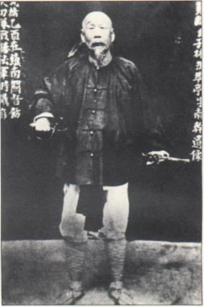
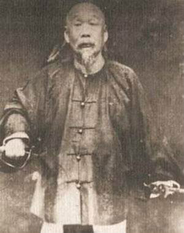
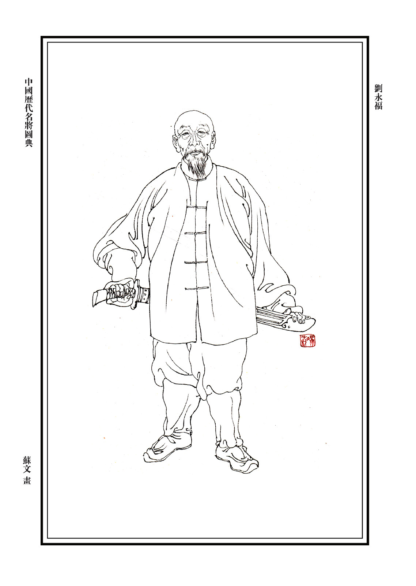
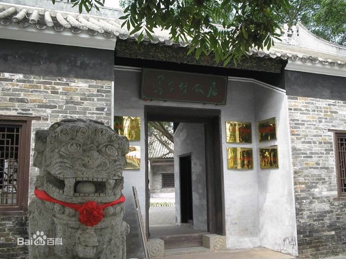
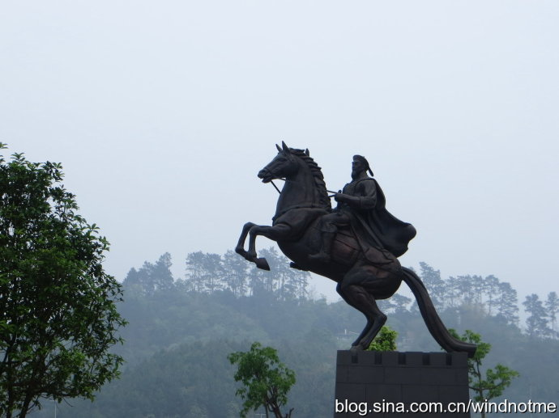
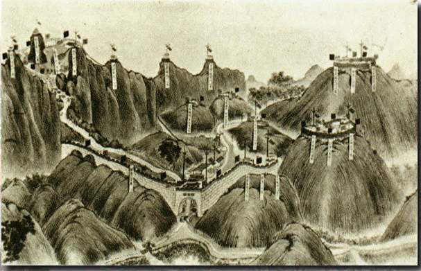

## nnnn姓名（资料）

### 成就特点

- ​
- ​

### 生平

冯子才（1818年－1903年），或名冯子材，字南干，号萃亭，清军将领，因累官至太子少保，又称冯宫保，谥勇毅。

1818年，生于今广西钦州，自幼父母双亡，与祖母、兄长相依为命，孤苦伶仃。30岁时，外出做生意，被天地会劫持。

逃脱后，投奔团总，参加清剿天地会、粤桂边界的农民起义军等，因作战勇敢，获八品顶戴，积军功升至千总。1851年（33岁），随广西提督向荣力抗太平天国，一路尾追到江南，在南京城外建立“江南大营”。

1856年（38岁），江南大营被太平军摧毁，冯子材败逃丹阳。1858年，重建江南大营，冯子材深得器重，一步步升为总兵。

1860年（42岁），太平军第二次攻破“江南大营”。冯子材收聚残军，退往镇江固守。以后，冯子材以孤军3000人守御镇江数年。1864年，天京陷落，清廷大封功臣，冯子材被赏黄马褂，封骑都尉世职。

1865年（47岁），冯子材被派往广东剿灭当地反清起义军，不久就任广西提督。此后18载，冯子材在广西提督任上连连用兵，翦除各地反清武装，并3次率兵赴越南，追剿反清队伍。

1882年（64岁），冯子材告病还乡。

1883年，中法两国因越南的保护权问题争执不下，兵戎相见，中法战争爆发。

1884年，法军打到滇桂边境，两广总督张之洞奏请起用冯子才，督办团练，组建编成“萃军”。1885年3月，法军第2旅2500余人从谅山出发，大举攻入镇南关。冯子材指挥“黑旗军”、“恪靖定边军”英勇作战。法军分三路发起冲击，冯子材带领两个儿子并亲自手持长矛进行肉搏，经过两天激战，法军伤亡93人，全线崩溃，清军乘胜追击，连克越南文渊、谅山。

1885年3月30日，谅山被攻破的消息传到法国，内阁总理引咎辞职。6月9日，李鸿章和法国公使在天津会谈，签订了《中法新约》。约定法国军队移交台湾，中国军队撤出越南，从此越南脱离中国，成为法国属地。

中法战争结束后，冯子材获太子少保衔，三等轻车都尉世职。1886年（68岁），率军赴海南岛，镇压黎族人民起义。在海南岛中部五指山上，书写“手壁南荒”巨形山壁古刻。

1894年，中日战争爆发，他又率军北援，驻节镇江，以备调遣。后任过云南、贵州提督。

1903年9月18日，在军旅途中，冯子材在南宁逝世。朝廷谥号勇毅，归葬故乡钦州。

【】

### 照片

