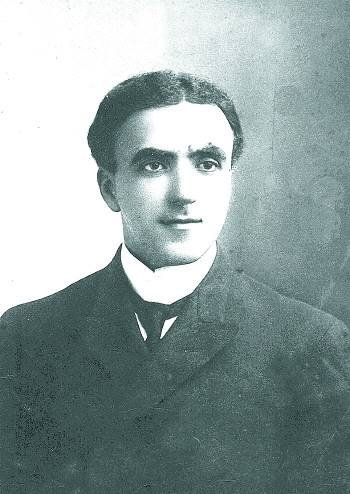
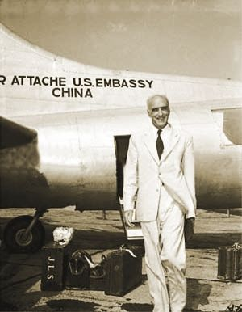

## nnnn姓名（资料）

### 成就特点

- 中华民国迁往台湾前最后一任美国驻华大使
- 燕京大学创始人
- 出生于中国杭州，杭州市荣誉市民
- 美国传教士

### 生平

55年前的今天，死了也要埋在中国的美国大使司徒雷登病逝

【生在杭州的美国人】

1876年6月24日，司徒雷登出生于杭州。父母都是早期到中国的美南长老会传教士。从血统上说，他是一位纯粹的美国人。但司徒雷登用一口纯正的杭州话说：“我是一个中国人更多于是一个美国人”。

11岁时，回到美国弗吉尼亚州上学，被人讥笑为不会说英语的怪物。进入大学后，受“学生志愿国外传教运动”的影响，立志于传教，转入纽约协和神学院。1904年（28岁），他携妻子回到杭州，成了第二代美南长老会传教士。

1908年（32岁），司徒雷登应邀前往南京，出任金陵神学院希腊文教授。1910年，任南京教会事业委员会主席。辛亥革命时，兼任美联社驻南京特约记者。

【最美丽的燕京大学校长】

1918年（42岁），北京的教会大学，汇文大学和协和大学，计划合并，却矛盾太多，多次协商未果。1919年1月，司徒雷登应邀北上，经多方斡旋，以“燕京大学”为校名，并出任首任燕京大学校长。

司徒雷登接手的燕京大学，校址在北京东城的盔甲厂胡同，规模很小，学生不到100人。从1922年起，他15年内往返美国10次，募捐筹款，其中一次就募得150万美元，这在当时几乎是个天文数字。

司徒雷登以以6万大洋从陕西督军陈树藩手中，购得清华园西边一块废弃的园地，也就是今天北京大学所在地。经过数年建设，1929年（53岁），一所宫殿式的美仑美奂的新校园正式投入使用。校园融合中西文化，司徒雷登曾自豪地宣称：“凡是来访者，无不称赞燕京大学是世界上最美丽的校园。”

（司徒雷登在燕园）

【中国最高水平的教会大学】

司徒雷登不惜重金请来中外著名学者如许地山、顾颉刚、赵紫宸、容庚、钱穆、吴文藻等人来燕大任教，提升燕大知名度和学术地位。1927年，燕大与哈佛大学合作组成了著名的哈佛燕京学社，促进中美文化交流。到1930年代，燕大已发展成为中国学术水平最高的教会大学。

司徒雷登提倡学术自由，注意与学生、员工互动交流，对学生和蔼可亲，对教职员热情温暖，给许多学生和员工留下深刻印象。司徒雷登同情学生运动，九一八事变后，他甚至亲自带领学生上街游行，高呼抗日口号。

燕京大学仅仅存在了33年（1952年停办），注册学生总共不超过10000名，却培育了一大批高水平的顶尖人才：其中中国科学院院士42人，中国工程院院士11人，再加上其他卓有成绩者，超过100人，占注册学生的1%以上，可说是科学家的摇篮。

【抗战期间被监禁4年】

1930年，美国普林斯顿大学授予他荣誉文学博士学位。1933年，美国总统罗斯福召见司徒雷登，并听取他对中国时局的意见。

1941年，太平洋战争爆发后，他被日军关押在北京。1945年8月，得以获释。四年的监禁生活中，司徒雷登完成了他的大部分自传。后来，写成《在华五十年》一书。获释后，他继续担任燕大校长（后为校务长）。1945年秋，重庆谈判期间，曾被毛泽东宴请。

（司徒雷登（左一）与蒋介石、宋美龄合影）

【最后的美国驻华大使】

1946年7月11日，司徒雷登出任美国驻华大使。同年，被国民政府授予杭州市荣誉市民。作为一名外交界新手，却要应付当时复杂的国内外局势，他一厢情愿地希望将中国引向和平的方向，但其努力既得不到国共双方的接受，也从未得到美国政府信任。

1949年4月，解放军攻占南京，他留在南京。8月2日，无奈的司徒雷登离开南京返美。8月8日，毛泽东写了一篇文章《别了，司徒雷登》，文中借他对国民党和美国当局极尽讽刺。这篇文章曾被收入中学语文教材，这使司徒雷登在中国比在美国更知名。他被长期当作是美国对华政策失败的代表人物。

（1949年，司徒雷登乘飞机离开中国）

【死了也埋在中国】

司徒雷登回到美国后，被美国国务院下了“禁言令”，又被反共极右的麦卡锡主义者骚扰。1949年12月，患了脑血栓，导致半身不遂和失语症。1952年11月28日，他正式辞去大使。

1962年9月19日，司徒雷登因心脏病突发在华盛顿病故。他一直希望能够将骨灰送到中国，埋在燕京大学校园内，并就此立下遗嘱。

司徒雷登的学生兼私人秘书的傅泾波，以此为自己的使命，多次访问北京，写信给邓小平。1986年6月，经中共中央书记处批准，同意将司徒雷登骨灰以原燕京大学校长名义安葬于临湖轩。不料，一群‘马列主义老太太’联名反对，事情不得不搁置。因为司徒雷登是毛泽东点名批评的人。

1988年，傅泾波去世。傅的后人为完成其心愿，也不断努力。终于得到杭州政府的同意，2008年11月18日，司徒雷登的骨灰正式移葬杭州半山安贤园。

（位于杭州司徒雷登故居的塑像）

