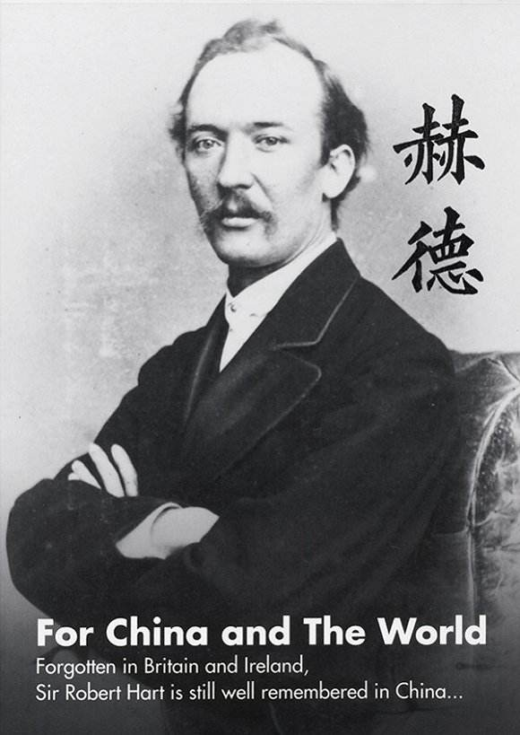
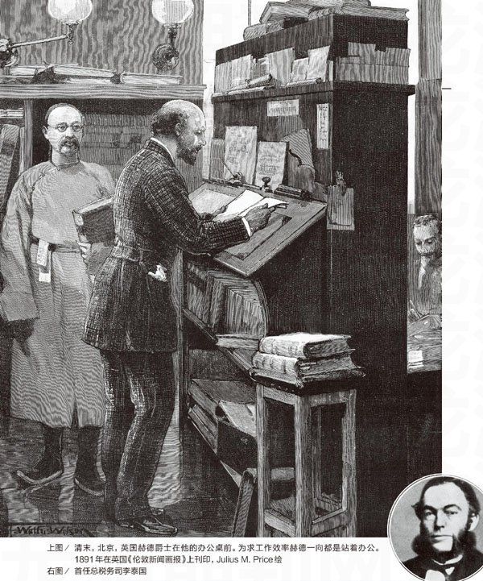
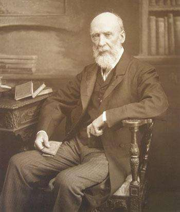
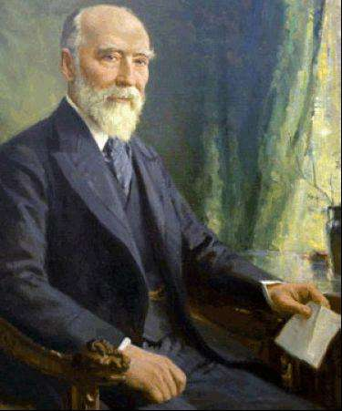
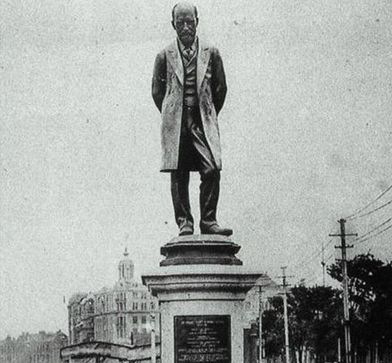

## nnnn姓名（资料）

### 成就特点

- 担任晚清海关总税务司半个世纪（1861年－1911年）
- 倡议下中国第一所新式学校—京师同文馆成立
- 全球最清廉的海关
- 创建了中国的现代邮政系统
- 中国雇员
- 拒绝出任驻华、韩公使
- 一品大员
- 助葡萄牙“永据”澳门
- 购买八艘军舰，后来成为北洋水师的起源

### 生平

106年前的今天，开创新式海军、海关、学校、邮政的英国人赫德逝世

106年前的今天，为清朝工作50年、官封一品的英国人赫德逝世

【中国的翻译官】

1835年2月20日，赫德出生于英国北爱尔兰。父亲在酒厂工作。少年赫德学习勤奋，15岁时结束中学课程，轻松考入新创立的贝尔法斯特女王学院。1853年（18岁），获得文学学士学位。

1854年5月（19岁），本准备继续攻读硕士的赫德，被提名加入驻中国的领事团队，离开英国。他先抵达香港，担任见习翻译三个月。随后，在宁波英国领事馆任翻译官。

1858年3月（23岁），赫德被调到英法联军占领下的广州，担任英法政务总局书记官，同时任香港督署书记官。赫德在政务总局的上司是巴夏礼（第二次鸦片战争的关键人物），对赫德工作非常认可。10月，赫德改任英国驻广州领事馆翻译官。

【入职大清皇家海关】

1859年（24岁），与赫德熟识的两广总督劳崇光，请赫德在广东建设新式海关。于是，大清皇家海关第一任总税务司李泰国（英国人）邀请赫德出任副税务司。赫德申请后，英国政府准许赫德从领事队伍辞职，但威胁不得再回来。1859年5月，赫德正式递交辞呈，入职中国海关。

1861年（26岁），在太平军逼近上海，李泰国请病假离开。赫德为清廷任命的两名署理总税务司之一。随着天津条约的签署，中国通商口岸迅速增加，赫德走访全国各地筹办海关，管理日益增多的国际贸易。

1862年（27岁），在赫德与恭亲王的倡议下，中国第一所新式学校—京师同文馆成立，并在广州设立分部。同文馆旨在培养中国未来的外交等人才，学生学习外语、外国文化以及科学，经费来自海关税收，分责人由总税务司推荐。同文馆后来并入京师大学堂，今北京大学。

（曾经树立在上海外滩海关大楼前的赫德铜像）

【全球最清廉的海关】

1863年（28岁），为了对付太平天国，李泰国从英国购买军舰回到上海。但军舰不愿直接听从清政府命令，李泰国被勒令解职，由赫德正式接替担任海关总税务司。从此，赫德为清政府收取关税，并将新式海关制度推广到帝国各处。

在海关任内，赫德一直利用他对清廷的影响推动近代化改革。赫德创建了税收、统计、浚港、检疫等一整套严格的海关管理制度，新建了沿海港口的灯塔、气象站，为清政府开辟了一个稳定的、有保障的税收来源。中国海关成为当时全球最清廉的海关；赫德还创建了中国的现代邮政系统。

1864年，赫德加按察使衔，成为清朝的正三品大员。1865年，总税务署从上海迁到北京。从此，赫德居住在北京40多年。1869年，晋布政使衔，官阶从二品。

【差点出任总海防司】

1874年（39岁），中国开始建设新式海军，总理衙门委托赫德通过金登干购买了四艘舰艇。1879年，赫德又协助清政府购买了八艘军舰，这些军舰后来成为北洋水师的起源。赫德还向总理衙门提议试办海防条例，组装南北两洋海军，并自荐出任总海防司。

然而，有人担心赫德的权力过大，提出反对意见。因此，总理衙门要求赫德在总税务司与总海防司之间选择其一。赫德选择继续担任总税务司、放弃了总海防司职位。

【避免一次又一次战争】

赫德富有外交才能，与中西官员建立了友好关系。他在中国任官长达五十年，与掌管总理衙门的恭亲王奕䜣、以及后来的李鸿章关系密切，为清政府的外交做了许多努力。

赫德鼓励清朝在其他国家设立使领馆。1876年（41岁），在赫德的斡旋下，与英国签订《烟台条约》，避免了与英国之间的又一次战争。

1884年（49岁），中法越南冲突爆发后，赫德派人会见法国总理，并说服总理衙门同意在赔款和越南问题上做出让步，促成双方在天津签署了《中法新约》。

【忠心为清政府卖命】

1885年（50岁），英国政府请赫德出任驻华公使，赫德认识到自己中国雇员的身份，在犹豫四个月后拒绝了任命。1886年，赫德获赏花翎、双龙二等第一宝星。1889年，升为正一品，1893年，赏三代一品封典。

1900年（65岁），八国联军入京镇压义和团后，赫德与李鸿章配合参加《辛丑条约》谈判，尽力维护中国利益。此后晋太子少保。1902年，召入觐，赐“福”字。

【离开中国魂归故土】

1908年，73岁高龄的赫德打算因病休假离职回国，在办公室留下一张意味深长的便条：“1908年4月13日上午7时，鹭宾·赫德走了。”此后，他仍然挂着总税务司的头衔直到1910年。

三年后，1911年9月20日，赫德因肺炎发作、心脏衰竭病逝于英国，享年76岁。9月25日，大清驻英公使参加赫德葬礼。清廷追赐优恤、加尚书衔、太子太保。

(1911年9月25日，伦敦，驻英公使刘玉麟参加赫德（大清海关总税务司）葬礼）

### 照片

