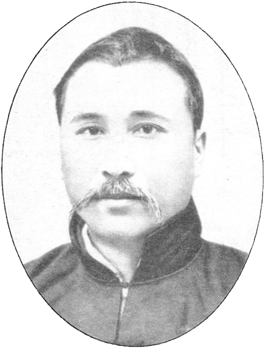
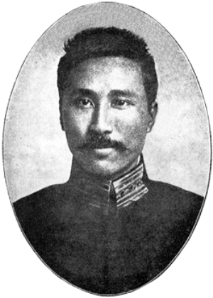
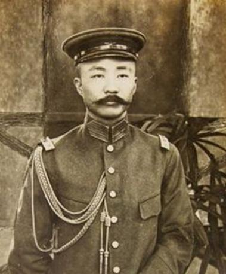
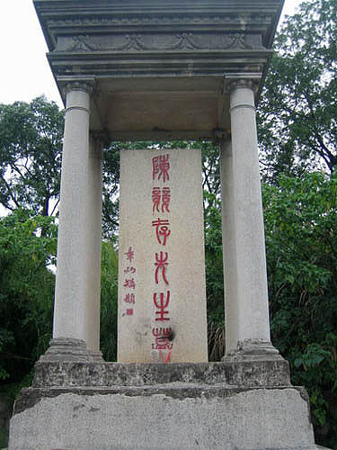
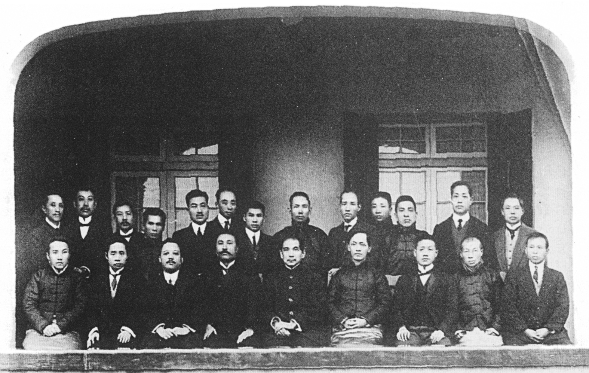
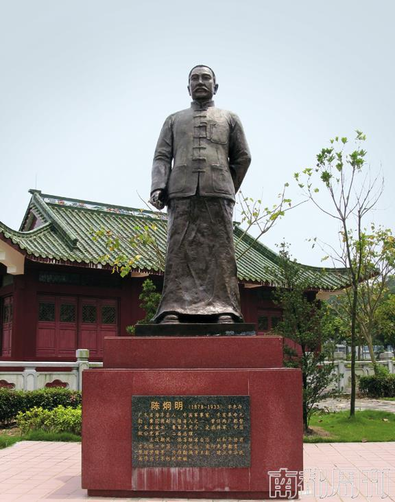
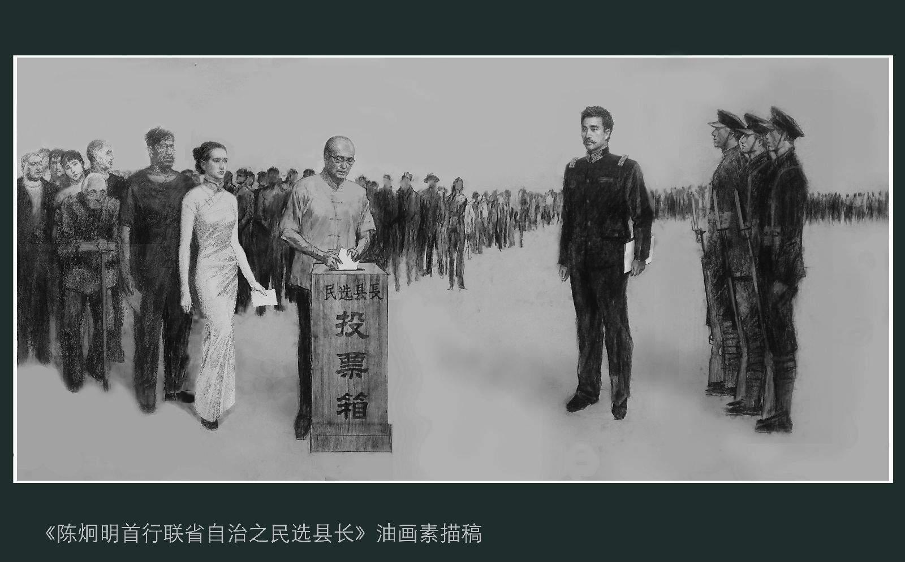
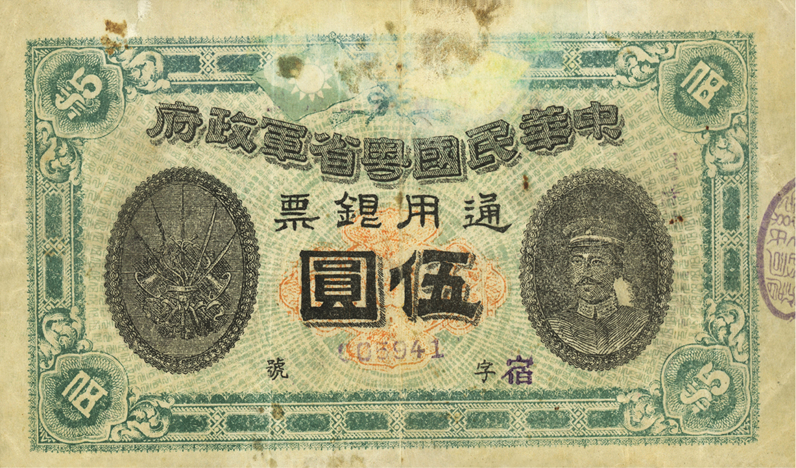

## nnnn姓名（资料）

### 成就特点

- 曾经出任粤军总司令、广东省省长
- 中国致公党首任总理
- 设立广州市
- 主张联省自治。他反对国民革命军北伐
- 黄花岗起义起义中，陈炯明为敢死队第四队队长

### 生平

陈炯明（1878年1月13日－1933年9月22日），字竞存，绰号“阿烟”(因炯之字形,详“王希文回忆录”），惠州府海丰县人，曾经出任粤军总司令、广东省省长、中华民国陆军部陆军总长兼内务部内务总长及中国致公党首任总理。他主政广东期间推动广东建设，设立广州市。陈炯明为无政府主义者，政治上主张联省自治。他反对国民革命军北伐，并且因此驱逐其曾经支持的孙中山。最后陈炯明被孙中山打败，退居香港。

1878年1月13日，生于广东海丰县白町乡。

1898年，中清朝秀才。

1906年，陈炯明入读广东法政学堂，为第一届学员。于1908年7月以“最优等生”成绩毕业。 陈炯明毕业后回乡一年倡办海丰地方自治会，戒烟（指鸦片，非香烟）局等社会工作。又筹办《陆安自治报》（后改称《海丰自治报》）。

1909年7月，陈炯明当选广东咨议局议员，积极推行各种改革社会与保障人权的议案，后在上海加入同盟会，创办《可报》支持革命党。

1910年，参与倪映典的庚戌新军起义。起义失败后，经香港回海丰，期间也有参加刘师复组织的“暗杀团”活动。至5月返回广州，参加谘议局议论整顿粤汉铁路及筹抵赌饷等事的临时会议。

1911年3月，黄花岗起义起义中，陈炯明为敢死队第四队队长。之后陈避居香港九龙城南，后在南洋华侨的资助下，在海陆丰筹备革命武装力量，占领惠州后改称“循军”。广东光复后，他带领循军入广州，亲往清朝新军滇军的将领龙济光处将其说服，并将其部队交回其管理，任命其为广东总绥靖处副经略使。陈炯明在广州整顿军队编制，循军自行解散。

民国成立后，陈炯明历任广东副都督，代理都督。龙济光在二次革命时跟随袁世凯，击败陈炯明控制了广东地区。陈炯明逃到香港又遭到香港政府的驱逐，留在新加坡以图日后反攻。期间孙中山重组中华革命党，要求画押宣誓效忠孙文个人，陈炯明认为不符合民主思想，并未参加。

1916年，陈炯明潜逃至广东东江地区组织广东共和军，反对洪宪称帝的袁世凯。陆荣廷的旧桂系部队击败龙济光进入广东，中央政府调停龙济光退驻广东西南的雷州地区。陈炯明被中央政府封为“定威将军”，调派回京“有要事谘询”，广东共和军由朱庆澜省长接收。

1917年12月中旬，时任广东省省长朱庆澜交还陈炯明二十营警卫军改编为“援闽护法粤军”，向福建进军抵抗闽督李厚基的攻势。陈炯明兼任惠潮梅督办，在当地设立筹饷局，在汕尾建立造弹厂等设施，并协助当地人修筑道路。1918年8月31日，援闽护法粤军进驻漳州。11月下旬停战。

陈炯明部驻军福建期间，苏俄曾派人送列宁亲笔信与陈炯明联系，并咨询陈是否有合作的可能。陈指出苏俄革命后治权侵夺了人权，又称辛亥革命后国人已对民主有所认识，“民众懂得有更好的共和政制，即不患再有反革命”。

陈炯明在闽南逗留了两年零四个月。桂系操纵的广州军政府于1920年8月11日下令以沈鸿英为攻闽总司令，分三路进攻福建。陈炯明和亲孙中山的许崇智部队反攻，陈于1920年11月回到广东就任省长。长期受到桂系力量打压的广东地区欢迎陈炯明主政，省外广东人合资汇款60万支持陈，又有华侨捐献飞机12架。陈炯明邀请孙中山、唐绍仪、伍廷芳回广东，11月孙中山从上海回到广州，并改编陈的军队由其直辖。11月29日，军政府任陈为总司令。

1921年2月中旬，孙中山召集广东的国会议员召开非常会议，推选孙中山为非常大总统。6月，军政府派为援桂总司令。同月，桂系军阀再次进逼广东，陈炯明带兵迎敌。此战虽大败桂系且一度反攻广西，但死伤人员约有全军五分之一，士气大受打击。

陈炯明主张实行“联省自治”（民选议员和地方长官等)；这与孙中山的北伐、武力统一的主张有所冲突。8月初，陈炯明进入南宁后，原打算协助马君武筹划仿照广东省的“地方自治”计划，包括恢复省议会，筹设仿照广州的市政府。但孙再下令陈炯明北伐，激化其与陈的矛盾。

1922年夏，孙“自桂回粤”。4月，孙执意北伐，陈炯明无法接受孙的条件，遂被罢黜，回惠州隐居。4月21日，孙裁撤援桂总司令一职，“免陈炯明职”。同日，广东省政府免陈炯明广东省省长职，任命伍廷芳接任。

1922年4、5月间，第一次直奉战争爆发，奉军战败，徐世昌宣布辞职，之后黎元洪复职。北方各界以护法运动目的已达为由，纷纷希望孙下野，以求打破两个总统的僵局。而粤军中的叶举等人也联名发电文要求孙下野。陈的部下，粤军将领邓铿遭暗杀，孙文一方坚称是陈炯明所为，但近年来一些学者根据史料认为此事有可能是孙文一方所为。

6月16日，陈部下叶举在通知孙后，出兵围攻总统府，鸣炮警示孙离开广东。“陈率部叛变”，占据广州城。孙转移到永丰舰（后改名中山舰）还击轰炸广州后离开广东，史称“六一六事变”。9月16日，陈自任总司令。蒋介石即回师广州讨伐陈部。

1923年1月4日，孙文通电讨伐陈炯明， 并收买滇军杨希闵部、桂军刘震寰部，与拥护孙文的许崇智粤军联合，组成东西两路“讨贼军”，合击陈炯明。1月15日陈炯明宣布下野，次日撤出广州退守惠州东江。2月21日孙中山重回广州。

1923年5月28日到10月27日，支持孙中山的部队围攻惠州，粤军死守。陈炯明实际未有参加战斗。10月粤军反攻发动广州近郊攻势，未果后双方保持僵局。后1924年广州发生广州商团事变，广东各界由于孙中山的行为而转向同情粤军。陈炯明也已经策划好反攻计划，但让他始料不及的是，孙中山的部队获得了苏联的支持，得到了大量较粤军有优势的武器。

1925年，孙中山派蒋中正率黄埔军校学生军两次东征，彻底打垮陈炯明部。尤其是在第二次东征中，苏联派将官直接指挥部队行动。陈炯明被迫解散军队，退居香港。

1925年10月10日，其前身为前清洪门秘密会社的“美洲致公堂”，正式改组为中国致公党，陈炯明被推举为为总理。

陈炯明晚年生活拮据，有时甚至三餐不继。九一八事变后，有日本人送他八万元支票，陈炯明在支票上打叉退还。1933年他病逝于香港，停尸的是家中的一张行军床，连棺材也是母亲备用的棺木。

陈家收到各方挽联达三千多幅，陈立夫、邹鲁、章太炎、吴佩孚、段祺瑞、居正、尢列、张东荪、张君劢、朱庆澜、曹亚伯、徐傅霖、黄绍竑、陈铭枢、黄素居、徐景唐、黄三德、褚辅成、马育航、黄季陆、谢炳文等均有送联。因家中无钱下葬，灵柩存放于香港东华义庄。1934年他的旧部发起募捐活动，社会各界纷纷捐资，其中包括有汪精卫、陈济棠、蒋中正等人。1934年4月3日（农历三月初一，1921年陈任省长时下令禁烟的日子）终葬于惠州西湖旁紫薇山。

【政绩】

陈炯明在任期间，广州市的正式建市。

陈主政广东，就马上禁赌、烟（指鸦片）。并在广州东校场公开销毁十四万两，价值四十万元的鸦片烟。

1921年初，广东省议会选出省宪起草委员会进行起草省宪。同年12月19日，正式通过“广东省宪法草案”。这比湖南与浙江两省的省宪晚几个月。广东省宪规定比较简单，起草主任黄毅与湘浙两省宪的起草人，中华民国约法起草人之一王正廷有密切联络。 陈炯明并没有批准和实行广东省的宪法草案，到了他那儿就石沉大海。

民国时期的联省自治并不是陈炯明最早提出的，梁启超在其所写的《解放与改造发刊词》中，首次提出联省自治的政治主张。

1920年12月15日《香港华字报》转载《上海新申报》对陈炯明的评论云：“陈氏为人刚毅果敢沉默寡言，其私人道德，可为南北权要之模范。”章太炎誉陈“清操绝于时人，于广中弥不可得”。孙逸仙曾坦言陈炯明“不好女色，不要舒服，吃苦俭朴，我也不如”。

无论是中国国民党主导的国民政府，还是中国共产党主导的中华人民共和国政府，在教科书上描述陈炯明都以“逆党”、“叛军”、“叛徒”称之。1990年代以后，部分学者开始对此进行考证，尤其是陈炯明之子陈定炎查阅了当时的大量报刊资料，企望让世人重新认识陈炯明。

1920年代初，彭湃发起了海陆丰农民运动，陈炯明最初对该运动抱持宽容与支持之态，并试图说服彭湃为其服务。随着海陆丰农民运动的发展和农会的扩大，海丰士绅阶层屡向陈炯明报告农会的危险性，尤其农会与国民党和共产党之间愈益密切的关系；陈炯明终于1924年下令予以镇压、解散农会，农会被迫完全转入地下并与陈炯明对立。[21] 1925年2月黄埔军校革命军第一次“东征”陈炯明，彭湃和海陆丰农会积极参加及配合东征军，击溃陈炯明的部队，海丰县农会于1925年3月恢复；6月东征军暂离开海丰，陈炯明部重占海丰后对农会进行了报复[22]，并毁了彭家[23]。殷丽萍对陈炯明与海陆丰农民运动关系的研究亦认为陈是受当地地主豪绅压力而开始反对农民运动

【】

### 照片

