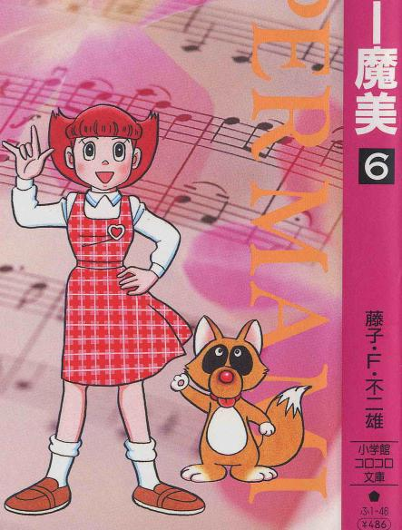
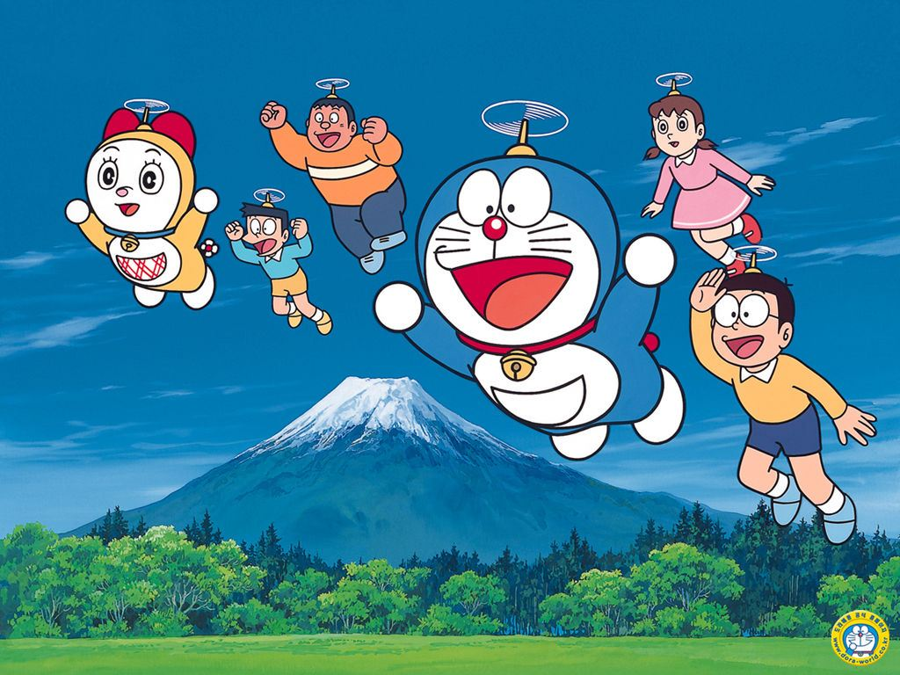
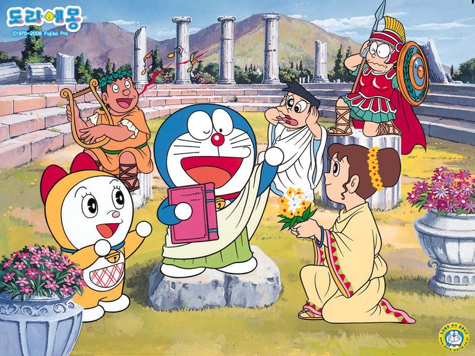
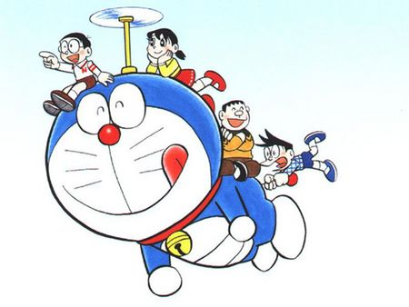
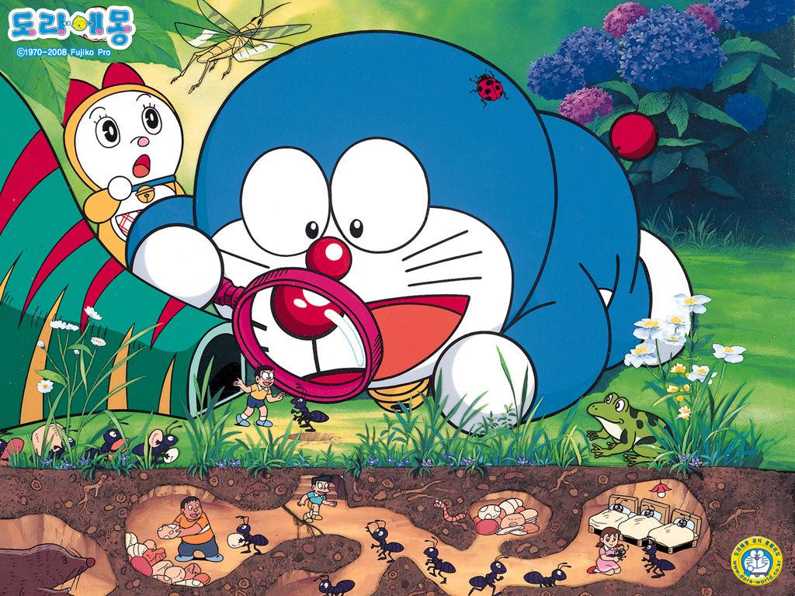
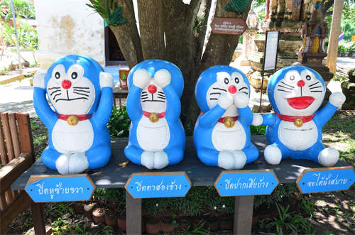
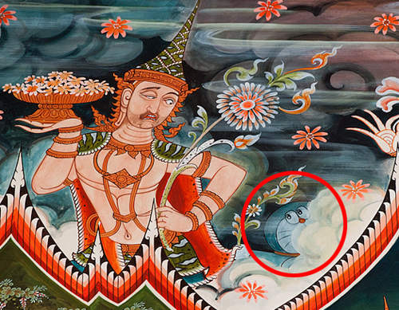
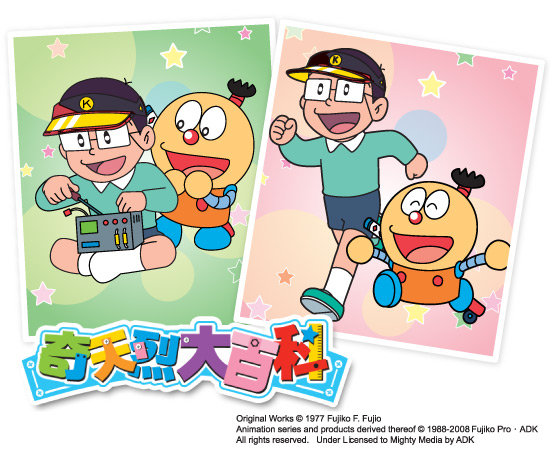
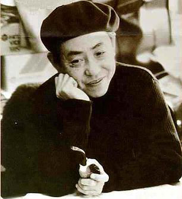
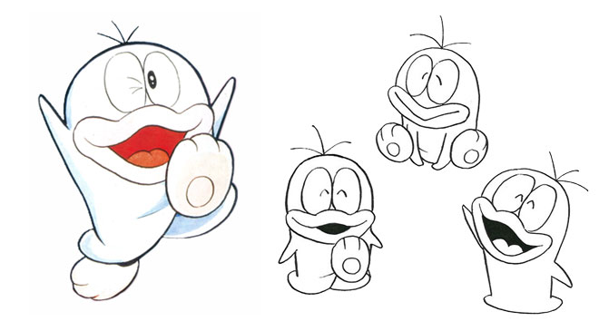

## nnnn姓名（资料）

### 成就特点

- 哆啦A梦 = Dream
- ​

### 生平

藤子·F·不二雄（1933年12月1日－1996年9月23日），本名藤本 弘（日语：藤本 弘／ふじもと ひろし Fujimoto Hiroshi），日本漫画家。富山县高冈市人、毕业于富山县立高冈工艺高等学校电气科。血型O。曾经长期与安孙子素雄（笔名藤子不二雄Ⓐ）共用藤子不二雄的笔名。代表作有《哆啦A梦》、《飞人》、《奇天烈大百科》、《超能力魔美》等。

1996年9月21日，藤子·F·不二雄先生在绘画将作为电影放映的影画原作《哆啦A梦大长篇──发条城市冒险记》（《ドラえもん のび太のねじ巻き都市冒険記》）的执笔途中，突然失去意识昏倒，一直没有醒来，经抢救后仍回天乏术，于9月23日（星期一）凌晨2时10分因肝衰竭宣告不治，享寿62岁。他的葬礼于9月29日（星期日）在日本东京都台东区的宽永寺举行。

1933年12月 藤本弘在富山县高冈市出生。

1949年 3月 看过迪士尼的《白雪公主》，可说是启发了藤子成为漫画家的原动力。

1951年12月 与安孙子素雄一起向‘每日小学生新闻’投稿处女作《天使之玉》并被发表。两名17岁的漫画家初试啼声。

1964年 2月 《Q太郎》【《少年SUNDAY》】开始漫画连载
1965年 8月 《Q太郎》首播

1967年 1月 《小超人帕门》（飞人）【《少年SUNDAY》】开始漫画连载
1967年 4月 《小超人帕门》首播

1969年12月 《哆啦A梦》【《小学馆の学习杂志》】开始漫画连载

1982年：小学馆漫画赏儿童部门奖（《哆啦A梦》）

1987年与安孙子素雄解除合作关系，以藤子不二雄F的笔名开始活动。不过，在一年后更名为藤子·F·不二雄。

1996年9月20日：执笔大长篇《大雄的发条都市冒险记》途中突然失去意识。
1996年9月23日：因为肝衰竭逝世，享年62歳。

2011年9月3日 藤子·F·不二雄博物馆在日本川崎市开馆，将在哆啦A梦出生前的101年开馆，里面将展示部分哆啦A梦的道具

【飞人(港译：神奇小子)】

《飞人》是一了无论体育还是学习都不擅长却富于正义感的小学生。由于超人（“スーパーマン”，后来因为著作权的问题，改称为“鸟人”バードマン）选中了他，还给了他头盔、斗蓬和变身机器人，让他在变身后执行维持和平的任务。
连载期间：1967年 - 1968年（《周刊少年Sunday》小学馆学习雑志）、1983年 - 1986年（《快乐快乐》、小学馆学习雑志、《好孩子》）
电视动画1967年 - 1968年、1983年 - 1985年、2003年（电影）、2004年（电影）

【】

《哆啦A梦》是藤子·F·不二雄的代表作，也是一部未完的作品。（严格来说有3个如同最终回一般的剧情）。全部共有1345篇作品（一开始计为1344话，加上之后完成的一作为1345个）。基本上以一话完结的短编作品。于1991年完成最后的短篇，1994年完成最后的中篇《來自ガラパ星的男人》。

连载期间：1969年 - 1991年、1994年
动画：1973年（日本电视台系）、1979年 - 放映中（朝日电视台系）

1973年，本作首度被制成动画在日本电视台播放，半年后由于日本电视台动画公司倒闭而终止播出，其后由朝日电视台于1979年起制作播放至今。1980年起亦有电影制作，每年3月上映一部动画电影[注 2]。

从1969年12月开始同时在日本小学馆发行的儿童学习杂志（《好孩子杂志》、《幼稚园》（幼稚園）、《小学一年生》（小学一年生）、《小学二年生》（小学二年生）、《小学三年生》（小学三年生）、《小学四年生》（小学四年生））的1970年1月号开始刊载（日本月刊杂志刊载时间比实际发行早1个月，通常在1月出版2月号，2月出版3月号，如此类推）。

《哆啦A梦》是继同作者的前作《酸梅星王子》（ウメ星デンカ，1968年～1969年）之后所连载于学年志的漫画。作者在开始执笔“哆啦A梦”之前，一直到需要交稿的时候都还没有任何概念（正确来说应该是在交稿期间为止，作者都还没有整理出概念开始作画）。在紧张焦虑与凌乱的状况之下，藤子创作出了“哆啦A梦”这个角色。

到了1973年时，《小学五年生》和《小学六年生》也开始刊载本作品，在小学馆发行的每一本儿童学习杂志上刊载的《哆啦A梦》内容在各学年别的杂志上大多不同。

在1980年时，《哆啦A梦》最多曾同时连载于89本杂志上。

总计在《哆啦A梦》中由藤子·F·不二雄亲自执笔的内容共有1345篇（包含短、中、长篇的合计）。

从1974年开始，由作者选出部分短篇故事集结成四十五册单行本，在1974年至1996年间陆续发行，收录短篇共821篇，到1992年为止发行量已经超过8000万本。

到1996年时，漫画单行本在日本约已卖出1亿本。根据日本《出版月报》的数字，在2000年度末时点算，包含日本以外以及盗版作品，推估超过了1亿7000万本以上[6]，成为了小学馆的代表作品。

1973年哆啦A梦电视动画开始播映，1980年动画电影亦开始播映。同年开始为了拍摄动画电影，藤子·F·不二雄开始创作单行本一本的长篇故事，这就是《哆啦A梦大长篇》的开始。

在1996年藤子·F·不二雄过世后，电视动画及电影动画的制作依然持续，由麦原伸太郎（笔名为むぎわらしんたろう，是藤子·F·不二雄的入室弟子，也是《哆啦A梦超棒球外传》[注 4]的作者）和冈田康则（1998年进入藤子·F·不二雄制作公司，2001年为大长篇大雄与翼之勇者们的主画者）共同执笔。

官方译名“哆啦A梦”是直接根据原作的日文原名“ドラえもん”（Doraemon）音译而来。

在中文世界，早于1975年《哆啦A梦》曾以粤语《叮当》来命名。1982年第5卷第2期的《日本画报》刊登《动画片轰动一时》中翻译为“杜拉蒙”。单是台湾就有机器猫小叮当（青文出版社早期）、超能猫小叮当（东立出版社早期）、神奇小叮当（大然文化早期）、小叮当（阳铭书局早期）等，中国大陆为小叮当（出版社不详）、机器猫（人民美术出版社，后在1990年代取得版权），香港就有叮当（海豹丛书、玉郎漫画、TVB）等等译称。

藤子·F·不二雄病逝之后，朝日电视台继承《哆啦A梦》的著作权，并依其遗愿“希望亚洲地区统一改以日本音译，使每个不同地方的读者只要一听就知道在讲同一个人物”[20]；于是促使台湾大然文化在1997年以《哆啦A梦》为中文名称，发行小学馆授权的《哆啦A梦》台湾中文版。其后，台湾青文出版、香港的文化传信、中国大陆的吉林美术出版社（吉美）这些漫画丛书发行代理商也陆续跟进。

港台方面，2005年，阿福、技安最后也相继改名为小夫、胖虎；中国大陆的央视方面，2000年代初把“大熊”改为“大雄”，后来康夫、小静、强强也相继改名为小夫、静香、胖虎。

哆啦A梦为了帮助大雄，经常从他的四维空间口袋里拿出来自未来世界的道具，香港与台湾动画版（有时）一般称之为“法宝”，台湾早期电影版译为“工具”。水田版动画则改称“秘密道具”，各种道具的创意和科幻想像成为哆啦A梦的特色之一。截至2004年5月为止，最权威的统计是漫画版的哆啦A梦共有1963个道具（横山泰行教授统计），但若含动画版出现的道具则总数超过2200个。[22]

【大长篇】

《大长篇哆啦A梦》是每年春季公映的《哆啦A梦》长篇剧场版动画和原作漫画版的通称。在电影公映前会先在小学馆发行的面向儿童的漫画杂志《corocoro》进行数月的连载。

仅2005年中断了一次。2005年，哆啦A梦电影中断一次。

连载期间：1980年 - 1997年
剧场版动画：1980年 - 2004年、2006年 -

【奇天烈大百科 (港译：奇天烈百科全書)】

《奇天烈大百科》：发明家祖先留下可以制造各种不可思议物品的4册书籍“奇天烈大百科”给小学生木手英一，从而制作出各种奇怪的物品，开始冒险故事。
连载期间：1974年 - 1977年
动画：1988年3月 - 1996年6月（富士电视台系）
电视剧：2002年1月（NHK）

【超能力魔美】超能力魔美[编辑]
《超能力魔美》
藤子·F·不二雄的连载作品。
连载期间：1977年 - 1982年（漫画雑志《マンガくん》（后の《少年ビッグコミック》）に创刊号から连载。）
电视动画：1987年 - 1989年（朝日电视台系）
电视剧：2002年（NHK、ドラマ爱の诗シリーズ）

为了纪念藤子·F·不二雄先生，一座展览有藤子先生生前创作的原画等展品的纪念馆，于2006年年初在川崎市多摩区的生田绿地诞生。藤子先生从1961年开始住在这里，在1996年去世之后，妻子正子女士（67岁）向该市给予了原画约4万件的赠礼。2011年9月3日，藤子‧F‧不二雄博物馆正式开幕，地址为：川崎市多摩区长尾二丁目8番1号。

【】

### 照片

