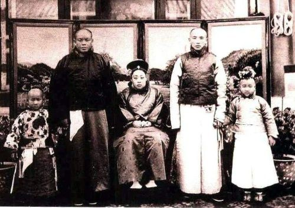

## nnnn姓名（资料）

### 成就特点

- 是光绪帝仅有三位后妃之一
- 珍妃的姐姐
- 逼死溥仪的生母
- 被盗墓
- ​

### 生平

瑾妃（1873年10月6日－1924年9月24日），他他拉氏，满洲镶红旗人，为礼部侍郎长叙之女，清朝末年光绪帝妃。瑾妃有一妹，同为光绪帝之妃，即珍妃。

1873年10月6日，瑾妃出生。他他拉氏，满洲镶红旗人，父亲为礼部侍郎长叙。她有一个小2岁的妹妹，也就是珍妃。

1888年，在光绪帝的选后大典上，瑾妃和妹妹珍妃同时入选，成为光绪帝的妃子，并在隔年元月行大婚礼，之后分别以瑾嫔和珍嫔的身份入宫。慈禧太后选定其弟（副都统桂祥）的女儿叶赫那拉氏（即隆裕皇后）为光绪帝的皇后。

在入宫之后，瑾嫔住在东六宫之一的永和宫，妹妹珍嫔也同样的住在同为东六宫之一的景仁宫。瑾嫔不像珍嫔一般美貌灵巧，所以在宫中并未如妹妹珍嫔一般，获得光绪帝之宠幸，相反的，她和皇后一般受到冷落，但瑾嫔不以为意。

六年后，两人被晋升为瑾妃和珍妃。

1894年，珍妃因故得罪慈禧太后，姐姐瑾妃也受到牵连而一同被降为贵人，

十月二十九日因忤逆太后以及被认定习尚浮华不尊家法，与瑾妃一起降为贵人。据说在降珍、瑾二妃为贵人的前一天，光绪帝在给慈禧请安时，慈禧铁青着脸，不理睬他，光绪帝竟在地上跪了两个多小时。最后慈禧恶狠狠地说：“瑾妃、珍妃的事，你不管，我来管。不能让她们破坏家法，干预朝政。下去吧！”根据清宫档案记载，证实珍妃在十月二十八日这天遭到了“褫衣廷杖”，即扒去衣服打。皇妃遭此惩处，这在有清一代是极为罕见的。翁同龢曾在慈禧面前为珍、瑾二妃求情，建议缓办，但遭到拒绝。结果，不仅珍妃受到惩处，连瑾妃也受到妹妹的牵连。

但1895年，两人由嫔位恢复原本的妃子位号，但珍妃却受到了监禁，而瑾妃却依然保有自由、继续住在永和宫。

1900年七月，八国联军攻入京师，慈禧太后携宫眷出逃紫禁城，珍妃被逼投井，而瑾妃便是其中一员。

在溥仪登基之后，瑾妃继续住在永和宫，并被尊为兼祧皇考瑾贵妃。

在宣统逊位后，上徽号为端康皇太妃，她和溥仪的关系一般。溥仪母亲醇王妃瓜尔佳氏就是因受了瑾妃无理训斥，一气之下吞鸦片烟自尽。

终光绪一朝除隆裕皇后外，以瑾妃地位最尊。而其他三位太妃，虽是同治帝妃子，但在宫中身份只是皇帝的寡嫂。所以在隆裕太后崩逝后，瑾妃地位自动成为宫中最尊。瑾妃是四大太妃中年龄最轻，思想也较开通的。民国十一年，在逊清朝廷为溥仪议婚时，瑾妃支持受过受西方教育的郭布罗婉容为皇后。

瑾妃在永和宫过着很有品味的生活，时常以丹青书法自娱。在永和宫的摆设中，有着数样的瓶盘盆景、上头都镶嵌著精致出色的钟表和花鸟人物，同时她也是一位美食家，经常派人到京城附近的天福号买酱肘子供她吃早餐，由于瑾妃喜爱美食，因此永和宫里的小膳房，烹饪相当地出色，逊清的王公旧臣都爱吃她赏的饭。

1924年，在和溥仪及其余逊清皇室成员欢度中秋后，瑾妃受了风寒一病不起，五天后因情况恶化病逝在永和宫，享年五十二岁，以端康皇贵太妃的身份，下葬于光绪帝的崇陵妃园寝，溥仪谥温靖皇贵妃。

虽然此时溥仪已逊位，天下是中华民国了，可办个体面的皇家丧礼是没有问题的。但棺材（清皇家叫“金棺”）还摆在慈宁宫的时候，便出了天大的事情冯玉祥将溥仪小皇帝赶出了紫禁城，瑾妃棺材也只得移出，送到地安门外鸦儿胡同的广化寺内暂厝。

光绪死后入葬崇陵，依大清丧俗，又在陵东大约五百米的地方营造了妃子墓园。之前，墓园已有珍妃入葬。瑾妃死后，朝廷在珍妃墓的东侧给她造了墓穴。实际上，当时朝廷根本没有钱，原有的墓穴很寒酸，瑾妃父亲看不过去，拿出钱来，对妃园进行了重新改造，将砖石墓（砖券），改成了石室墓（石券），将墓围加高加大。

1925年（民国十四年）12月13日，一支队伍从西直门火车站，用火车将瑾妃的棺材拉到清西陵，葬入崇陵妃墓园内，瑾妃也因此成为清西陵内最后一位入葬的皇妃。

1938年11月初，盗墓所见，脸上皮肉尚存、五官依稀可辨。以为是珍妃，应该是瑾妃。

【北京政变】

10月23日，冯玉祥率部返回北京，包围了总统府，迫使直系控制的北京政府下令停战并解除吴佩孚的职务，监禁大总统曹锟，宣布成立“国民军”。

政变后，冯玉祥授意摄政内阁通过了《修正清室优待条件》，废除帝号，清室迁出紫禁城，驱逐溥仪和婉容及嫔妃出宫。溥仪于1924年11月29日偕同郑孝胥、陈宝琛逃往日本使馆；1925年2月，又赴天津。

【溥仪生母】

幼兰（1884年－1921年），满洲正白旗人，瓜尔佳氏，大学士、军机大臣荣禄之女，是醇亲王载沣之嫡福晋（正妻），因此也被称为醇亲王妃，是溥仪和溥杰的母亲。

她与醇亲王的婚姻对她来说是个不愉快的经历。她在溥仪年幼时就与他分离，和他很少机会见面。1911年，她的丈夫又纳妾，并生了几名子女。1921年，宣统帝溥仪与端康太妃因范一梅辞退事件爆发激烈冲突，她与醇亲王之母一同被端康太妃召入宫中，受到训斥，因她的个性极强，受不了这个刺激，从宫里回去后就吞鸦片烟自尽，年仅37岁。

【溥仪】

我从三岁起，就离开了我的母亲，一直到我十一岁，我母亲才被允许每年进宫两、三次来看我，因此，我并没有对她感到特别亲热。因为我们母子之间的骨肉情分，早已被那冷如冰霜的封建专制制度给割断了。我母亲是在1921年，即我16岁的时候死去的。而她的死，则是与我和端康太妃之间的争吵有关。
在我十四、五岁时，端康太妃由于我追逐时髦，狠狠地训斥了我一顿，并打了两个太监每人二百大板。自从发生了这件事之后，她便效仿起西太后对待光绪的老办法，每天派她宫中的六七名太监，轮流地来“服侍”我，其实就是派他们来做监视我的“特务”。我当时敢怒而不敢言，直到有一天，我真觉得有些按捺不住了，便借机和太监大闹起来。太妃知道，这是我对她的一种“取瑟而歌”的间接示威，便知趣地把“特务太监”撤走了。

端康太妃的一举一动都模仿西太后，因此，在她所住的那个“永和宫”的势力圈子内，经常漂浮着一种浓厚的专制气氛

关于这次争吵的直接导火索，是因为有一天，端康下了一道命令，把太医院的御医范一梅开除了。我听到此事后非常气愤，当然这也和我平日对于她的种种不满有关。我就想：过去隆裕太后在世的时候，我和太后坐在一起吃饭，她不是拿着一个“瑾妃”资格，站在地上吃的么？……我于是就给她下了个结论：她本是一个妾的身份，而不是妻的身份，并不能算是我的母亲。现在她既这样对我毫不客气，我为什么要怕她呢？于是我愈想愈可气。但是在那家长制度凛然不可侵犯的宫廷中，我还不敢下定决心，当面去质问她，便把此事告诉了陈宝琛，并和他作了一番商量，而他居然赞成了我这样做。于是，我就鼓足了勇气，到她那里质问她为什么开除了范一梅。当然她是不会向我让步的，于是我们母子便闹翻了脸争吵起来。我粗暴地扬言不承认她是我的母亲。我表明了这种决裂态度之后，便愤愤地回去了。

端康太妃盛怒之下，把我的祖母刘佳氏和我的生母瓜尔佳氏叫到宫里来，并迁怒于她们，对她们作了严厉的斥责。她们在这种情形下，也只得向太妃赔礼，但太妃还不甘心，把我父亲载沣和各王公大臣全都叫进宫来。而我呢，也不肯对她示弱，便也把这些“宗亲国戚”（除我父亲）等叫到我这里来，我也同样对他们哓哓不休地讲了一大篇道理。当然，他们对我是毫无办法的，不过是唯唯诺诺地说调停的话而已。最后，我还是在我祖母和母亲的努力说服下，才勉强地到端康面前下了一跪，并且认了错，这场风波才算平息下来。

【】

### 照片

等在延禧宫观赏金鱼.jpg)

