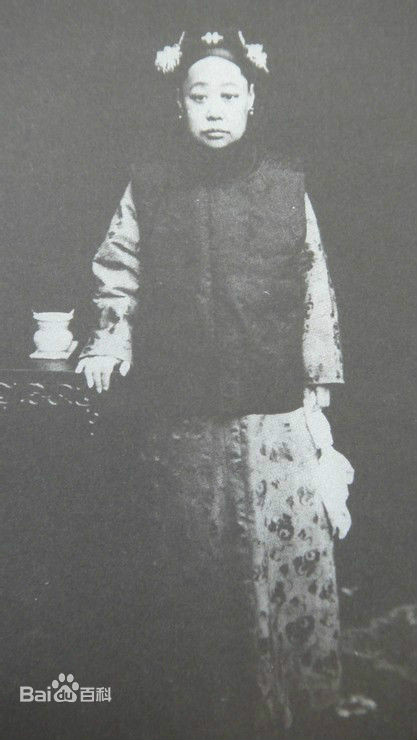
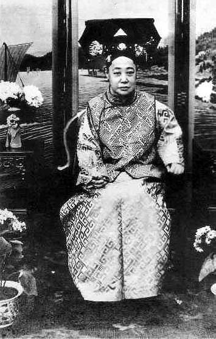
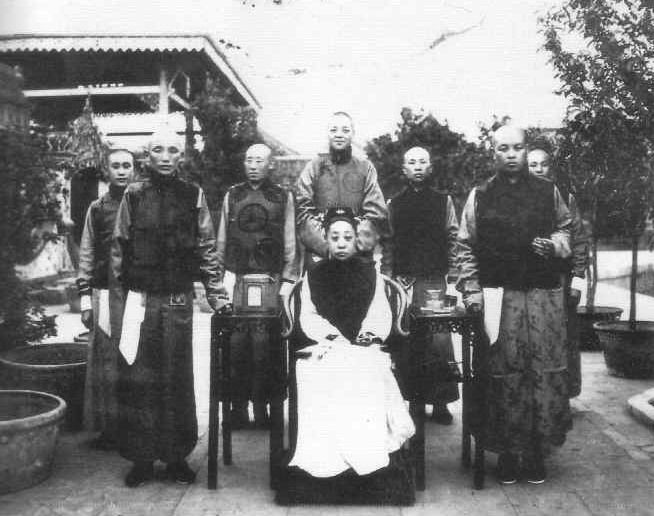
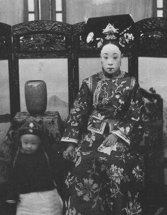
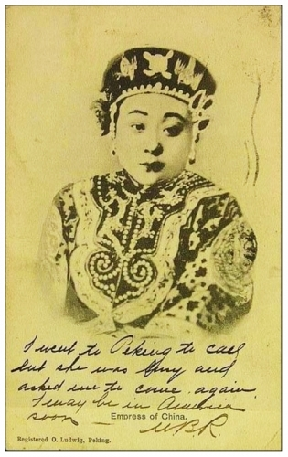

## nnnn姓名（资料）

### 成就特点

- 是光绪帝仅有三位后妃之一
- 珍妃的姐姐
- 逼死溥仪的生母
- 被盗墓
- ​

### 生平

93年前的今天，逼死皇帝亲妈，早餐要吃酱肘子的胖娘娘瑾妃去世

【姐妹同时嫁给皇帝】

1873年10月6日，瑾妃出生。父亲为礼部侍郎，他他拉氏，满洲镶红旗人。她有一个小2岁的同父异母妹妹，也就是珍妃。

1888年（15岁），在光绪皇帝的选后大典上，瑾妃和妹妹珍妃同时入选，成为光绪帝的妃子。第二年元月，举行婚礼，两人分别以瑾嫔和珍嫔的身份入宫。皇后为慈禧太后的侄女隆裕皇后。这是光绪皇帝仅有的三个妃子。

入宫后，瑾嫔住在东六宫的永和宫，妹妹珍嫔住在景仁宫。瑾嫔不像珍嫔一般美貌灵巧，没有获得光绪帝的宠幸，相反她和皇后一样受到冷落，但瑾嫔不以为意。

【相似却又不同的命运】

姐妹两人的命运，大多是联系在一起的。1894年（21岁），慈禧60大寿，两人被晋升为瑾妃和珍妃。同年，珍妃忤逆太后，在十月二十八日这天遭到了极为罕见的“褫衣廷杖”，也就是扒去衣服打屁股。瑾妃与珍妃一起降为贵人。

1895年（22岁），两人又恢复了妃子称号，但珍妃受到了监禁，而瑾妃保有自由，继续住在永和宫。

1900年（27岁），八国联军攻入京师，慈禧太后逃出紫禁城前，逼珍妃投井而死。瑾妃则跟随慈禧一起逃到了西安，后来又一起回到北京，继续住在永和宫。

【紫禁城里的后宫主人】

1908年（35岁），光绪去世，溥仪登基，瑾妃尊为兼祧皇考瑾贵妃。1912年（39岁），辛亥革命后，溥仪宣布退位，但仍居住在紫禁城。瑾妃上徽号为端康皇太妃。1913年2月（40岁），隆裕太后去世。

这时，皇宫里有四大太妃，瑾妃年龄最轻，地位最尊。其他三位太妃，虽是同治帝妃子，但在宫中身份只是皇帝的寡嫂。瑾妃成了后宫的主人，是溥仪名义上母亲。她一举一动都模仿西太后，年轻的溥仪受到管制，对她非常不满。

【逼死皇帝的亲生母亲】

1921年，瑾妃下令开除了太医院的御医范一梅。而溥仪认为，开除御医必须经得皇帝同意。平时积累的不满爆发，溥仪与瑾妃大吵一架，扬言不承认她母亲身份。

瑾妃盛怒之下，把溥仪的生母瓜尔佳氏和祖母刘佳氏叫到宫里来，严厉斥责。还把溥仪的父亲载沣和各王公大臣全都叫进宫，哓哓不休地讲了一大篇道理。最后，溥仪下跪认错，这场风波才算平息下来。

然而，溥仪的生母瓜尔佳氏，因个性极强，受不了屈辱，从宫里回去后就吞鸦片烟自尽了，年仅37岁。瓜尔佳氏的死因，溥仪当时并不知情。溥仪自小入宫，跟生母也没有深厚感情。

（溥仪的生母）

【酱肘子当早餐的胖娘娘】

瑾妃在永和宫过着很有品味的生活，经常写字画画自娱。在永和宫的摆设中，瓶盘盆景上头都镶嵌著精致花鸟人物。她喜爱美食，经常派人到京城附近的天福号买酱肘子当早餐。

1924年，在和溥仪及其余皇室成员欢度中秋后，瑾妃受了风寒一病不起。5天后，9月24日，因情况恶化病逝在永和宫，享年51岁。溥仪谥温靖皇贵妃。

【死后不得安宁的皇妃】

此时溥仪虽已逊位，可办个体面的皇家丧礼是没有问题的。但棺材（清皇家叫“金棺”）还摆在慈宁宫的时候，冯玉祥发动了北京政变，随后将溥仪赶出了紫禁城。瑾妃棺材也只得移出，送到地安门外鸦儿胡同的广化寺内暂存。

光绪死后入葬崇陵，依大清丧俗，又在陵东大约五百米的地方营造了妃子墓园。之前，墓园已有珍妃入葬。瑾妃死后，朝廷在珍妃墓的东侧给她造了墓穴。实际上，当时朝廷根本没有钱，原有的墓穴很寒酸，瑾妃父亲看不过去，拿出钱来，对妃园进行了重新改造，将墓围加高加大。

1925年12月13日，一辆从西直门火车站出发的火车，瑾妃的棺材拉到清西陵，葬入崇陵妃墓园内。瑾妃成为清西陵内最后一位入葬的皇妃。

1938年11月初，有人盗墓，声称脸上皮肉尚存、五官依稀可辨。盗墓者以为是珍妃，但珍妃投井而死，尸骨应早已腐烂。被盗的应该是瑾妃墓。

