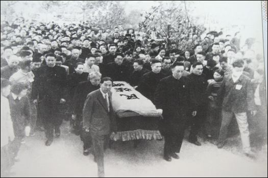
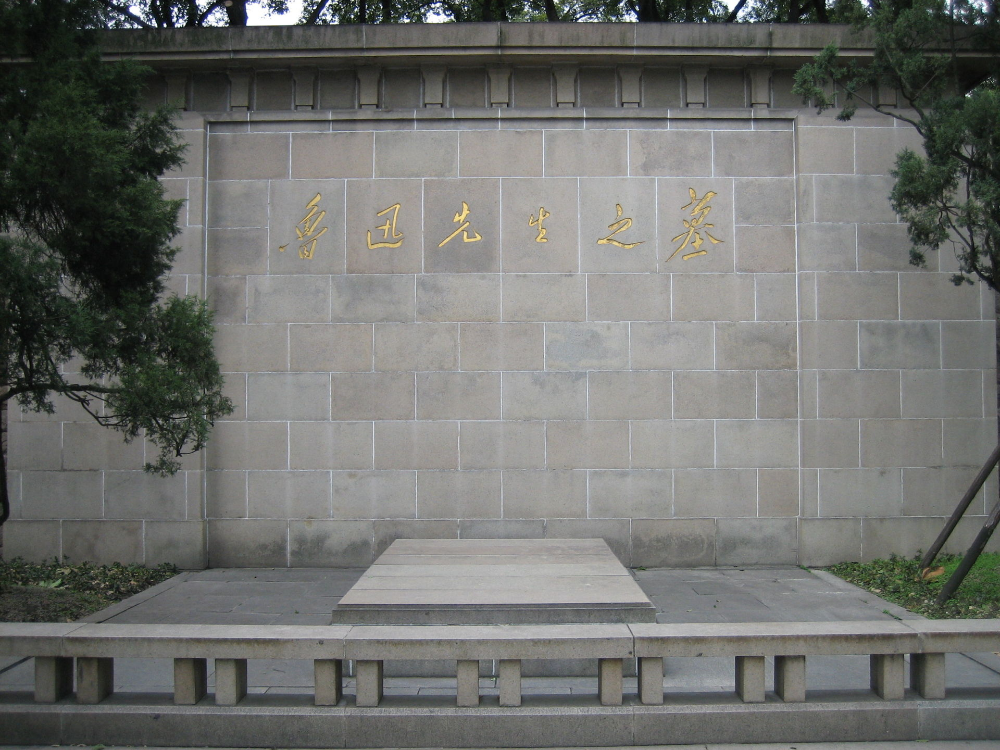

## nnnn姓名（资料）

### 成就特点

- 新文化运动的领导人之一
- 中国现代文学的奠基人和开山巨匠
- 二十世纪东亚文化地图上占最大领土的作家
- 设计北大校徽
- 与学生谈恋爱
- 被教育部开除
- 祖父考试行贿
- 学什么都不行
- 毛泽东评价为现代中国的圣人
- 遗言：对别人应许的事物不可当真
- 遗言：儿子不要当文学家或美术家

### 生平

136年前的今天，设计北大校徽，师生恋的文学巨匠鲁迅出生

【祖父行贿导致家庭败落】

1881年9月25日，鲁迅出生于浙江绍兴的一个书香门第，父亲是一名秀才。童年生活于百草园、咸亨酒店、外婆家一带的农村等地，这成为后来小说集《呐喊》、《徬徨》和散文集《朝花夕拾》的重要素材来源。

1892年（11岁），就读于私塾三味书屋。1893年（12岁），祖父向浙江乡试主考官行贿，谋求父亲录取，结果被举报，革职下狱，被判斩监侯。家庭从此中落，4年后，父亲病逝；8年后，祖父才得以赦免。家庭的变故对鲁迅产生了深刻的影响。

1898年4月（17岁），鲁迅进入‘无需学费的学校’：江南水师学堂，分在管轮班。才读几个月，便转考入南京矿务铁路学堂（简称矿路学堂）。学校的主要目的是采煤，鲁迅感到非常新鲜。1902年1月，毕业后，考取了官费对日留学生。

【留学日本改学医再改从文】

1902年2月（21岁），鲁迅进入日本东京弘文学院，这是专为中国留学生创办的速成学院。期间，他是班上第一个剪掉辫子的人。他与许寿裳、陶成章等组织浙江同乡会，出版月刊《浙江潮》宣传革命。1903年，鲁迅参加了鼓吹革命的“浙学会”。

1904年4月（23岁），从东京弘文学院毕业后，按清政府给予的官费资格，应该升入东京帝国大学采矿冶金科学习。但鲁迅决意学医，进入偏僻的仙台医学专门学校，成了该校第一个中国留学生，学制四年，不收鲁迅学费。在仙台给鲁迅影响最大的是解剖学老师藤野严九郎。同年底，鲁迅成为光复会第一批会员。

1906年（25岁），鲁迅在课堂上观看日俄战争的幻灯片，认识到“医学并非一件紧要事，凡是愚弱的国民，即使体格如何健全，如何茁壮，也只能做毫无意义的示众的材料和看客，病死多少是不必以为不幸的。所以我们的第一要著，是在改变他们的精神，而善于改变精神的是，我那时以为当然要推文艺。”不久，鲁迅作为医专大二生退学。回到东京，专门从事文艺译著工作。

【14年的教育部公务员】

1909年（28岁），鲁迅从日本回到中国，担任浙江两级师范学堂优级生理学、初级化学老师，绍兴府中学堂监学，绍兴山会初级师范学堂校长等职务。此时，鲁迅才写出第一篇小说《怀旧》（文言文小说）。

1912年（31岁），鲁迅到中华民国政府教育部工作，搬到北京，任教育部佥事。这时，他沉迷于收集研究拓本之中。后投身于新文化运动，兼任北京女子高等师范学校教授和北京大学兼职讲师。

（鲁迅与泰戈尔合影）

鲁迅共做了14年的北洋政府公务员，直到1926年被教育部署总长章士钊免职。他主要的业绩有：担任国语统一会教育部代表，协调制定注音字母；参与中华民国国徽设计案；设计了当时北京大学的校徽，系“北大”二字的美术字体；督导京师图书馆（今中国国家图书馆）等。

（鲁迅设计的北大校徽）

【与女学生相恋被开除】

1918年（37岁），首次用“鲁迅”为笔名，在《新青年》上发表中国史上第一篇用现代形式创作的短篇白话文小说《狂人日记》，成为新文化运动的重要作者。1921年12月，发表中篇小说《阿Q正传》。

1925年10月（44岁），鲁迅与小他17岁女学生许广平相恋。1926年3月，鲁迅抗议三·一八惨案，写文《记念刘和珍君》。8月，许广平发起北京女子师范大学罢免校长的学潮，鲁迅表示支持，被教育部免职（后曾提起行政诉讼并获胜）。

于是，在许广平陪同下，鲁迅南下，任厦门大学任文科教授。1927年1月16日，进入广州中山大学任文学系主任。10月，搬到上海，为避免政治迫害，住在上海公共租界。

【万众瞩目的民族魂】

1930年起（49岁），他先后加入中国自由运动大同盟、左翼作家联盟和中国民权保障同盟。在上海期间，鲁迅写了大量杂文，与许多文艺界人士如郭沫若、郁达夫等发生论战。他扶植了不少文学青年，包括柔石、白莽、萧军、萧红等。

1936年10月19日清晨（55岁），鲁迅在上海因肺结核病去世。

他的死引起全中国的注意，治丧委员会由宋庆龄、蔡元培等知名人士组成。10月21日下午，给鲁迅送葬的队伍，从徐家汇一直排到虹桥万国公墓。鲁迅灵柩上覆盖写有“民族魂”的白旗，轰动一时。到达万国公墓墓地时，现场人山人海，约两万余人。民众自发为一个文艺界人士举行了前所未有的隆重的葬礼。

1956年，鲁迅墓迁移重建于上海虹口公园。

【有的人死了他还活着】

1937年10月19日，毛泽东在鲁迅逝世周年大会上发表的《论鲁迅》演讲，称鲁迅是“现代中国的圣人”，对鲁迅评价极高。在延安创办的文学院，也改名为鲁迅艺术文学院。1949年，中华人民共和国成立后，鲁迅的文学地位得到了高度肯定。鲁迅的众多文章被选为中小学语文教材的课文。而鲁迅在台湾，则被当作反面教材加以贬低。

（毛泽东为鲁迅墓题字）

在鲁迅一生最后的6年中，他是左翼报刊读者群心目中的偶像。他死后不久，二十大本的《鲁迅全集》就立即出版，成了近代中国文学界的大事。但是更引人注目的是有关鲁迅的著作大批出笼：回忆录、传记、关于他作品与思想的论著，多得不可胜数。在中国现代作家中，从没有人享此殊荣。

1949年，臧克家为纪念鲁迅逝世13周年而写了一首抒情诗，题为《有的人》，“有的人活着，他已经死了；有的人死了，他还活着。”

（1966年，纪念鲁迅逝世30周年）

