## nnnn姓名（资料）

### 成就特点

- 与林风眠，刘海粟和颜文梁并称“四大校长”
- 中国现代美术的奠基者
- 与张书旗、柳子谷三人被称为画坛的“金陵三杰”。
- 尤以奔马享名于世
- 主张发展“传统中国画”的改良，立足中国现代写实主义美术，提出了近代国画之颓废背景下的《中国画改良论》。

### 生平

徐悲鸿（1895年7月19日－1953年9月26日），原名徐寿康，江苏宜兴屺亭镇人。中国现代画家、美术教育家。中国现代美术的奠基者，与林风眠，刘海粟和颜文梁并称“四大校长”。

1895年7月19日，江苏宜兴市屺亭镇人。

徐悲鸿自幼随父徐达章习诗文书画。父亲徐达章是私塾先生，能诗文，善书法，自习绘画，常应乡人之邀作画。徐悲鸿9岁起正式从父习画。13岁随父辗转于乡村镇里，卖画为生，接济家用。

1912年，在宜兴女子初级师范等学校任图画教员。17岁时，徐悲鸿独自到当时商业最发达的上海卖画谋生，并想借机学习西方绘画，但数月后却因父亲病重而不得不返回老家。

1915年，在上海从事插图和广告绘画。

1916年，入震旦大学法文系半工半读。其间认识了著名的油画家周湘、岭南画派的代表人物高奇峰、高剑父，在画作上得到了他们的赞许和指点，增强了绘画创作的信心。他还结识了维新派领袖康有为。

1917年，留学日本学习美术。

回国后任北京大学画法研究会导师。在京期间，相继结识了蔡元培、陈师曾、梅兰芳及鲁迅等各界名人，深受新文化运动思潮的影响，树立了民主与科学的思想。

1918年5月14日发表著名的《中国画改良论》（原名《中国画改良之方法》）。争取到公派赴法留学的机会。

1919年，携夫人蒋碧薇赴法留学。5月抵巴黎，入徐梁画院进修接受正规的西画教育。

入巴黎国立美术学校，学习油画、素描，并游历西欧诸国观摹研究西方美术。开始接受正规的西方绘画教育。

由于北洋政府一度中断学费，徐悲鸿被迫转至消费水平较低的德国柏林。

1926年，自感这一年是创作最多的一年，其中不乏得意之作，如油画《箫声》、《睡》等。

1927年先后游历了瑞士及意大利的米兰、佛罗伦萨、罗马等地

1927年回国，上海成立南国艺术学院，担任绘画科主任

1928年1月，与田汉、欧阳予倩组织“南国社”。

1928年10月，北京大学艺术学院院长。年底辞职。

1929年移居南京，于国立中央大学任教。

孙多慈于1930年到南京中央大学美术系作旁听生。当时徐悲鸿正好是美术系主任，也时常亲自授课。1931年7月，孙多慈考取了中央大学美术系。在以后的4年里，孙徐二人师生间的情感日见笃厚。

1930年完成油画《田横五百士》

1931年春，在比利时首都布鲁塞尔举办个人画展。完成《九方皋》第七稿。

1933年完成油画《徯我后》。应法国国立美术馆之邀前往巴黎举办中国近代绘画展。

1934年游历意大利威尼斯、佛罗伦萨、罗马等历史文化名城。至德国柏林、前苏联莫斯科和列宁格勒等地举办中国近代画展，宣传中国传统绘画。此次欧洲之行，在法、比、德、意、苏共举办展览7次，在各大博物馆、大学中成立四处“中国近代美术展览室”。这次中国近代绘画的欧洲巡礼引起了各国的普遍重视，宣传了中国绘画艺术。8月，返回南京。

1936年与汪亚尘、颜文梁等人组织画会“默社”。创作《逆风》、《沉吟》、《柳鹊》等画作。

1937年在香港、广州、长沙等地举办画展。在香港购得视为自己生命的吴道子画《八十七神仙图》卷。10月，随中央大学内迁赴重庆。创作《巴人汲水》。

1939年在新加坡举办筹赈画展。在印度国际大学举办中国近代画展。
1940年继续在印度逗留，与泰戈尔结下深厚的友谊。在加尔各答举行作品展。完成中国画《愚公移山》。

1941年由印度回国，途经槟城、怡保、吉隆坡等地，举办画展，并将几年来卖画所得近10万元美金全部捐出用于抗战救灾。

1945年与蒋碧微女士离婚。在郭沫若起草的《文化界对时局进言》上签名，主张废除国民党的一党专政。

1946年1月，与廖静文女士结婚。1946年任国立北平艺术专科学校校长，

1950年任中央美术学院院长。

1950年在全国战斗英雄、劳动模范代表大会上为战斗英雄画像。为创作《毛主席在人民中》画了大量速写和构图。

1951年抱病到山东导沭整沂水利工程工地体验生活，为劳模、民工画像，搜集反映新中国建设的素材。7月，患脑溢血，半身不遂。1952年抱病卧床一年有余，脑溢血病症尚未完全消除。自9月起，加强身体锻炼。

1953年抱病指导中央美术学院教学工作，为结业班的学生讲课，为教员油画和素描进修小组上课。为抗美援朝的志愿军画《奔马》。9月23日，担任第二次文代会执行主席，脑溢血症复发。26日晨，逝世于北京医院。周恩来总理前往吊唁。入葬北京八宝山革命烈士公墓。

【家庭】

徐悲鸿17岁时父母为他娶亲，但他不满这门婚事离家出走，后被父亲抓回来结婚。18岁生长子取名为劫生，意即“遭劫而生”，但家人为他改名为吉生 ; 后来徐悲鸿的太太在家乡病逝，留下长子，由祖母养育，7岁时因天花而夭折。

【蒋碧微】徐悲鸿不愿被家室拖累，到上海学画。认识老师兼同乡蒋梅笙教授，同时认识他二女儿蒋碧微(棠珍)，蒋碧薇原已安排好许配给苏州查家，在徐悲鸿到法国前与他私奔。

1917年一起私奔东渡。1921年，留学欧洲的徐悲鸿夫妇在中国驻德国公使馆的一次酒会上结识了英俊潇洒的青年画家张道藩。

1927年12月26日，徐悲鸿和蒋碧微生子徐伯阳，后来生了长女徐静斐。

1930年，徐悲鸿在中大恋上18岁的学生孙韵君(多慈)。和孙多慈分手后 ; 当时蒋碧微已成为有妻女的张道藩的情人，致28年后夫妇分手。

1937年初，张道藩+蒋碧微，他们住到了一起

1945年底，他们终于办完了离婚手续，徐悲鸿答应了蒋碧薇的一切条件，并赠送早年在法国为蒋碧薇画的一幅肖像《琴课》。

【廖静文】廖静文是徐悲鸿的学生，徐悲鸿身体不好的时候照顾他，1946年嫁给比自己大28岁的老师，同年生子徐庆平、后来生女徐芳芳，一直陪伴徐悲鸿直到他去世，结婚只有7年。

【画】

徐悲鸿最擅长画马。在绘画创作上，他提倡“尽精微，致广大”，对中国画，提倡“古法之佳者守之，垂绝者继之，不佳者改之，未足者增之，西方绘画可采入者融之。”擅长油画、中国画，尤精素描。人物造型，注重写实，传达神情。曾创作《九方皋》、《六朝人诗意图》、《中国负伤之狮遥望美国飞虎飞将军》、《愚公移山》等寓有进步思想的历史画，所画花鸟、风景、走兽，简练明快，富有生气，尤以画马驰誉中外，画能融合中西技法，而自成面貌。

【画作】

1931年日军侵华加剧，民族危亡之际，徐悲鸿创作了希望国家重视和招纳人才的国画《九方皋》；

1933年创作了油画《徯我后》，表达苦难民众对贤君的渴望 之情；

1939年创作《珍妮小姐画像》，为徐悲鸿最著名的油画人物肖像之一，为支持国内抗战而作；

1940年完成了国画《愚公移山》，赞誉中国民众坚忍不拔的毅力和夺取抗日最后胜利的顽强意志。

除此之外，还创作了《巴人汲水》、《巴之贫妇》等现实题材，《漓江春雨》、《天回山》等山水题材以及大量人物肖像和动物题材的作品。

【台城月夜】

《台城月夜》是画家徐悲鸿的一幅巨幅油画，创作于1930年冬季。这幅真人大小的油画，应该算是艺术大师的纪实性油画作品。画面上一男一女，男人席地而坐，少女侧立其左。天际皓皓明月，远处隐隐台城。画上的少女，脖颈间一方纱巾，随风诗意般飘动。 
《台城夜月》原本放在国立中央大学徐悲鸿画室里。徐悲鸿夫人蒋碧薇发现后，气冲冲将它带回了家。夫妇之间长达十余年的冷战，也由此展开。后徐悲鸿忍痛将《台城夜月》刮去，为好友刘大悲画了“刘老太爷”人物肖像。 
徐悲鸿是当代画坛巨匠，他的巨幅画作，如《放下你的鞭子》、《奴隶与狮子》等，拍价都在6000万左右，《愚公移山》也拍到了3000万以上。《台城夜月》如果流传至今，它的价格又值多少？从这个角度，蒋碧微那一怒，可是“千金”之重啊！ 

### 照片

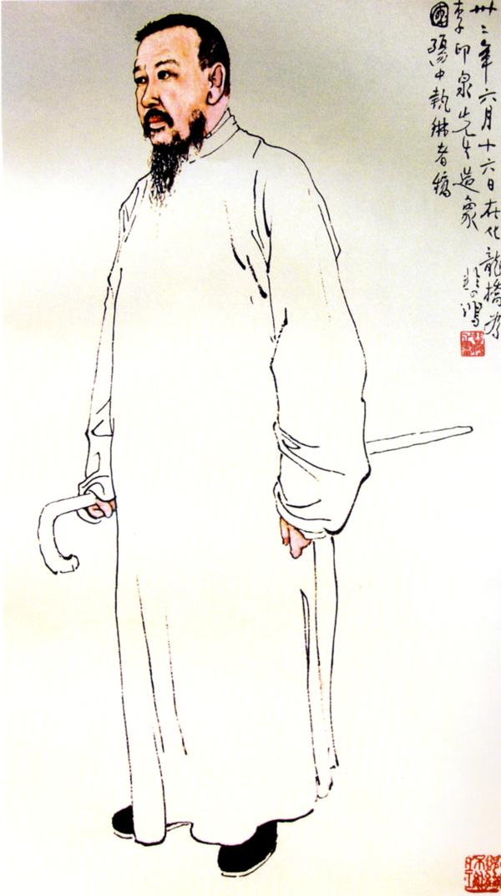

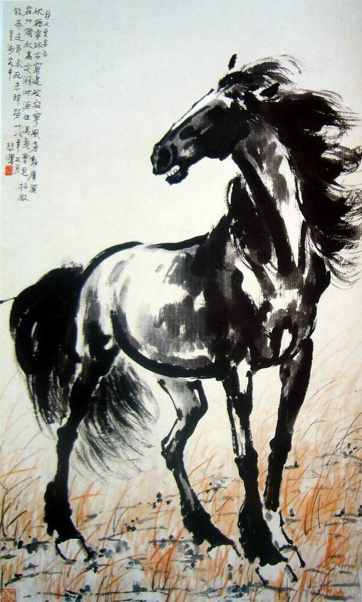

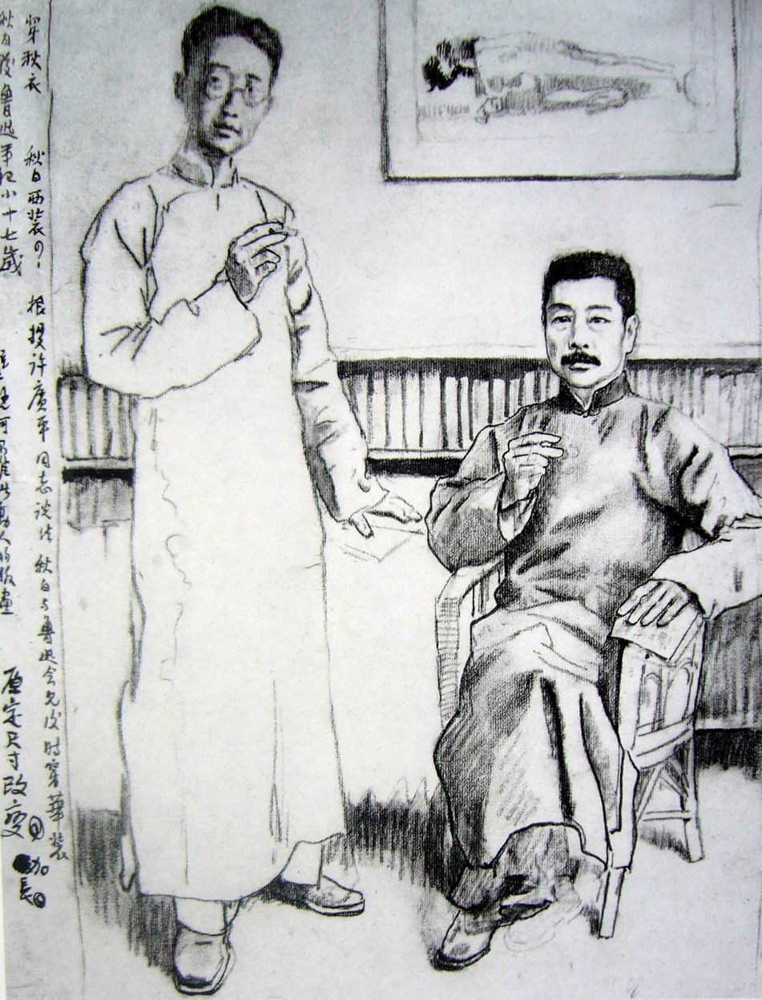

[徐悲鸿油画《放下你的鞭子》](徐悲鸿油画《放下你的鞭子》)

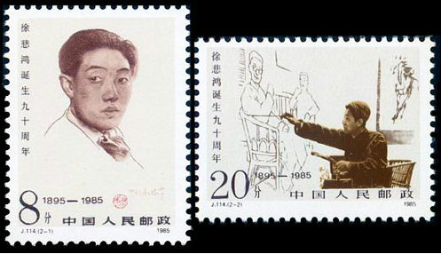

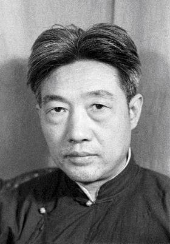

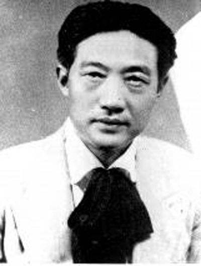

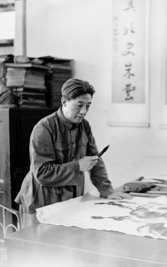

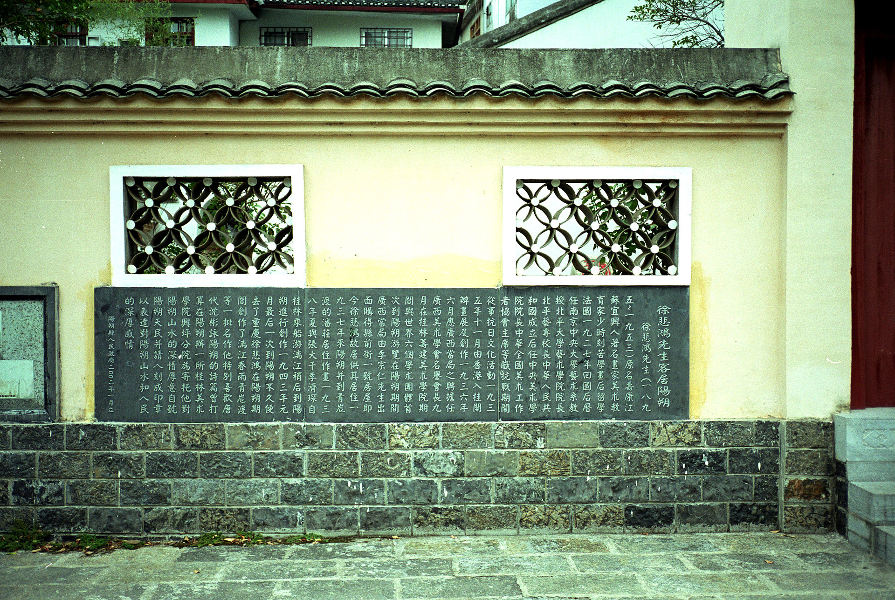

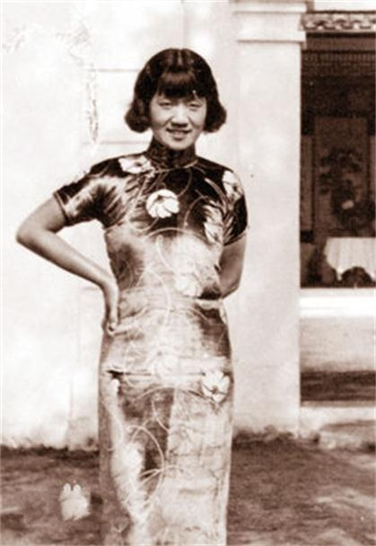

[当年徐悲鸿创作情景](当年徐悲鸿创作情景)

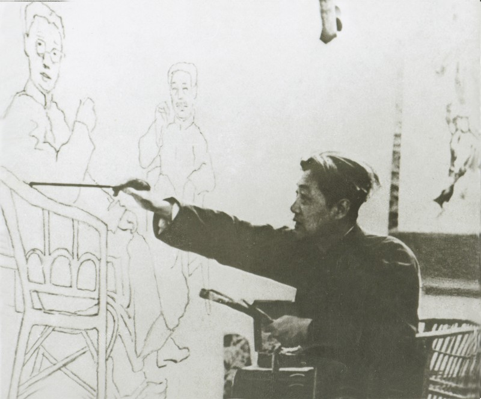

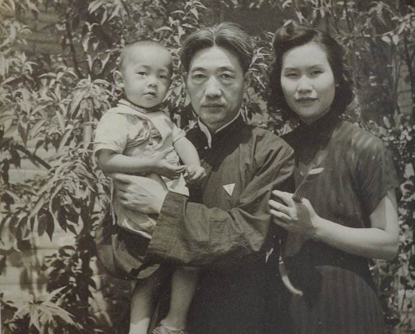

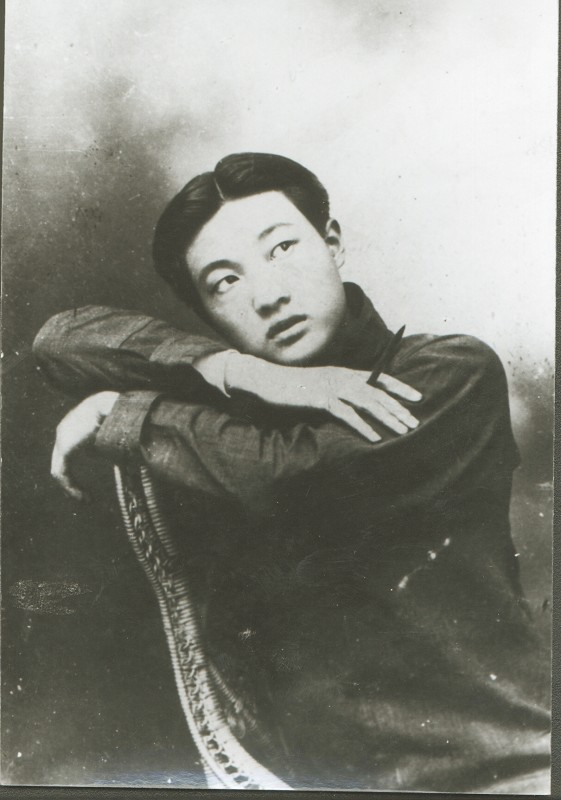

