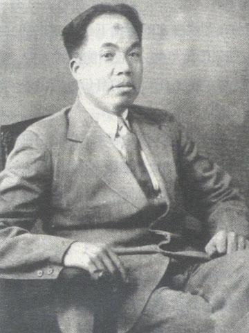
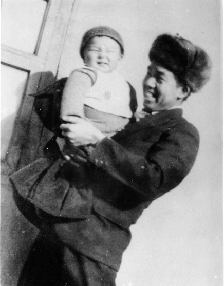
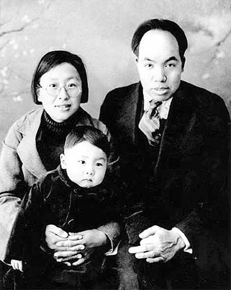
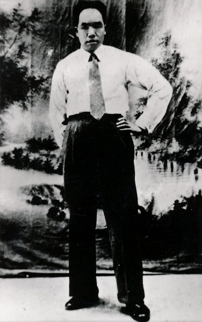
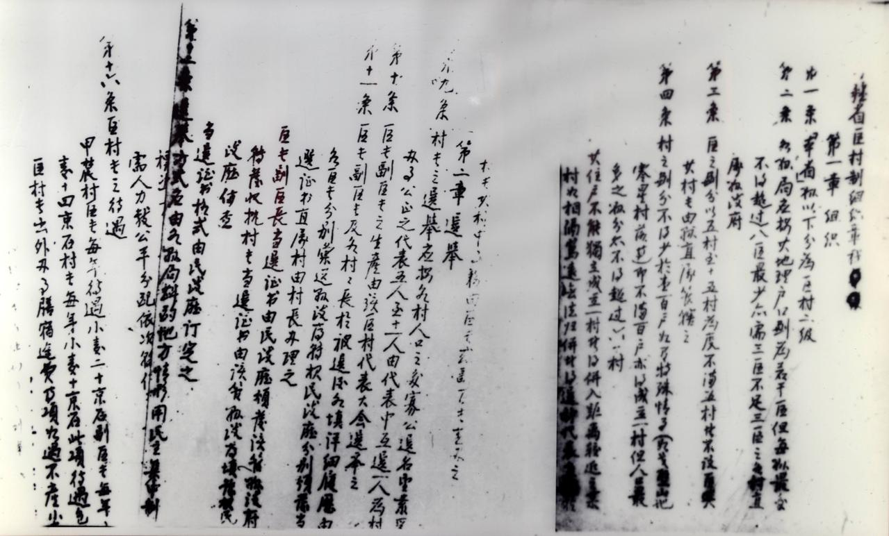
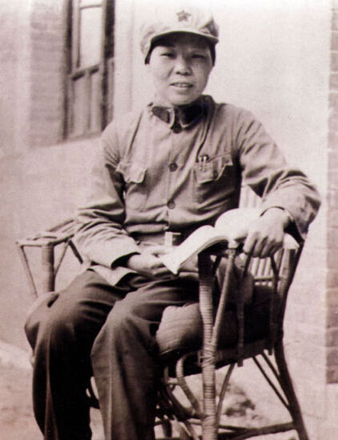

## nnnn姓名（资料）

### 成就特点

- 毛泽东之弟
- 中国共产党财经干部
- 抗日战争时期被转而采取反苏反共政策的盛世才势力杀害。
- 中华苏维埃国家银行行长

### 生平

毛泽民（1896年4月3日－1943年9月27日）字咏莲，后改为润莲，湖南湘潭韶山人，

毛泽民从小在家务农。

1913年，毛泽民和王淑兰完婚。

1921年春，随哥哥毛泽东到湖南长沙，起初在湖南第一师范附小做教务，同时在长沙工人补习学校学习。1921年秋后，来到毛泽东创办的湖南自修大学学习，并在该校从事庶务工作。同年，由陈子博介绍在湖南长沙加入中国共产党。

1922年被派到制笔业工人中间开展活动。受中共党组织派遣到江西安源煤矿从事工人运动，创办了中国首个工人消费合作社。

1925年2月，随哥哥毛泽东回到湖南湘潭、湘乡开展农民运动，同年9月奉派到彭湃主持的广州农民运动讲习所学习。

1925年底，从广州到上海从事地下工作，任中共中央出版发行部经理。任内，他在中国各地奔波建立发行网，使上海、武汉、广州、长沙、宁波等地都设有书店，香港和法国巴黎也设有代售处。

1929年冬，毛泽民率钱希均等9名中国共产党党员和中国共青团团员从上海来到天津，创办中共的秘密印刷厂。

1931年初，进入中央苏区。1931年夏，出任闽粤赣军区经济部部长，随后抵达江西瑞金，协助毛泽东筹备第一次中华苏维埃共和国代表大会。1931年11月，在中华苏维埃第一次全国代表大会上，决定成立中华苏维埃国家银行，并任命毛泽民为行长，负责筹建该银行。1932年3月，中华苏维埃国家银行在瑞金叶坪成立。

1933年5月，兼任闽赣省苏维埃政府财政部部长。1934年9月，兼任国家对外贸易总局局长，领导苏区银行、贸易、财政、工矿等方面的经济工作。在中央苏区，毛泽民兼钨矿第一任总经理，扩大了3个矿场，将钨出口到香港。1933年钨产量1800百吨，1934年产值200余万元。毛泽民还兼任没收征集委员会的领导之一，常赴前线随部队筹粮、筹款。

1934年初，第五次反围剿战争接连失利，中央苏区受到的经济封锁加强，财政困难，苏区纸币信誉大跌。毛泽民为此多次到前线筹集物资，并通知前线部队将缴获没收的物资全部运回苏区合作社，他还指示金库拿出银元、光洋公开兑换苏区纸币。

1934年10月，中央红军开始长征，财政部和国家银行组成十五大队，毛泽民任十五大队队长，并任没收征集委员会副主任（林伯渠任主任），负责整个中央红军的筹粮、筹款及全部供给工作。红军长征到达陕北后，1936年2月，毛泽民任中华苏维埃工农民主政府国民经济部部长

【新疆工作】

抗日战争爆发后，1937年底，毛泽民积劳成疾，胃病严重，身体虚弱。中共中央决定让毛泽民取道亲苏联的盛世才统治下的新疆省，赴苏联治病。

1938年2月1日，毛泽民抵达新疆省迪化（今乌鲁木齐），但因中苏边境地区发生鼠疫导致交通断绝，一时无法赴苏联。正逢盛世才希望中共派干部到新疆省工作，毛泽民接受了中共中央驻新疆代表邓发的建议，并征得中共中央同意，留在新疆省工作，化名“周彬”，担任新疆省财政厅副厅长、代理厅长。

当时，新疆省由于连年战乱，呈现出经济衰弱、财政混乱、通货膨胀的景象。毛泽民上任后改革税收及币制，稳定物价，发行建设公债，财政上开源节支，在三年内对新疆省财政进行了大力整顿。

1939年，盛世才批准毛泽民到苏联治病4个月。1939年6月初，毛泽民以治病为名抵达苏联莫斯科。随即投入工作，先后撰写了《关于新疆情形的报告》、《关于博古、李德等同志领导党和红军的错误问题》等近10万字的报告，还参加了共产国际监委会审查李德问题的会议。

1939年12月28日，应共产国际干部部的要求，毛泽民代毛泽东填写了《个人履历表》。1940年1月17日，毛泽民参加了由总书记季米特洛夫主持的共产国际执委会主席团会议。在会上，中共中央副主席周恩来宣读了周恩来起草的《中国问题备忘录》。1940年1月22日，根据共产国际执委会和苏联内务部的安排，毛泽民离开苏联莫斯科回新疆。

1941年2月，毛泽民调任新疆省民政厅厅长，任内主持制定了《新疆省区村制章程》，推行民主选举，在新疆省整顿和扩建17座救济院，举办医药医疗训练班，为新疆省培养了一批少数民族医务人员。

1942年，新疆督办盛世才投靠蒋介石，转而采取反苏反共政策。1942年9月17日，盛世才以“督办请谈话”为名，扣押了毛泽民、陈潭秋、林基路等在新疆工作的140多名中国共产党党员及家属，软禁在迪化满城邱公馆。

1943年2月7日，将毛泽民等人投入监狱。在狱中，毛泽民遭到软硬兼施、酷刑审讯，逼迫他招认所谓中共在新疆搞“暴动”的阴谋，逼迫他脱离中国共产党并交出中国共产党在新疆的组织。毛泽民回答：“决不脱离党，共产党员有他的气节。”“我不能放弃共产主义立场！”

1943年9月27日深夜，毛泽民、陈潭秋、林基路在迪化被盛世才秘密杀害，毛泽民享年47岁。在埋葬毛泽民等人后，同年10月，因盛世才到重庆后给迪化来电报说，军统要看尸体照片，执法队队长张思信乃奉命带人扒开坟墓，补拍照片寄往重庆。

对于毛泽民、陈潭秋、林基路等人的遇害过程，中共一直不知情，外界也有种种揣测。

1946年7月11日，经张治中努力，被盛世才关押的129名中国共产党党员及家属从新疆集体出狱，回到延安。当天，朱旦华带儿子毛远新看望了毛泽东。

1949年秋，中国人民解放军第一野战军攻占甘肃武威、张掖、酒泉，进逼新疆。

1950年初，中共新疆分局社会部部长刘护平发现了当年审讯毛泽民的记录，记录时间是1943年5月5日。次日他到六道湾坟场寻找毛泽民的遗骨，但一无所获。

不久，公安机关从对被捕特务的审讯中得知，李英奇潜伏在北京，李英奇手下的执法队队长张思信在武威一带瞎混。1950年春，张思信在武威落网，随即被押解到迪化，经刘护平审讯，张思信交代了1943年9月27日深夜处决毛泽民等人的情况，以及同年10月扒坟拍照的情况。张思信还在六道湾坟场指认出毛泽民、陈潭秋、林基路的遗骸。刘护平等人将三位烈士遗骸放入棺中重新安葬，每位烈士坟前立下一个高2尺的木碑，并简单举行了祭奠仪式。

1950年8月，刘护平的一位当年的维吾尔族狱友向他报告，有人在北京西单商场见到很像李英奇的人在摆烟摊。刘护平当即电告北京市公安局协助查清。不久，李英奇、富宝廉等人被捕并被押至乌鲁木齐。1950年冬，李英奇、富宝谦、张思信等杀害毛泽民等人的凶手被公审处决。1953年清明节，毛泽民、陈潭秋、林基路的灵柩被移至乌鲁木齐市革命烈士陵园重新安葬。

李英奇（当年盛世才手下的公安管理处处长、审判委员会副主任）

【家庭】

第一任妻子：王淑兰，湘乡县团田区刘家湾人，与毛泽民同岁。1917年结婚。[3]和毛泽民育有三子二女，其中三子一女夭折（长子七岁得黄疸肝炎死亡），仅有女儿毛远志长大成人。

第二任妻子：钱希均。1926年底结婚，1939年冬离婚获得组织批准。和毛泽民无子女。

第三任妻子：朱旦华。1939年订婚，1940年5月结婚。和毛泽民育有一子毛远新，这是毛泽民第四子，也是唯一长大成人的儿子。1949年6月，在北京与当年的新疆狱友方志纯结婚。

【】

### 照片

和钱希均(右二)在兰州八办..jpeg)

