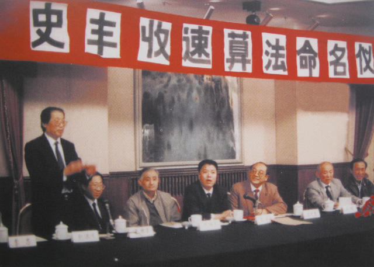

## nnnn姓名（资料）

### 成就特点

- ​
- ​

### 生平

8年前的今天，两个月就可以掌握的神奇速算法的发明者史丰收去世

【痴迷计算的小小子】

1956年2月23日，史丰收出生于陕西省大荔县。他从小沉迷于计算，自己琢磨出一套速算方法。他“天天算”，“时时算”，家里到处写满了数字。这样算了三年，在解决一位数乘法的基础上，又摸索出了一套多位数乘法和加、减、除法的速算规律。

1972年（16岁），史丰收曾在西北大学附中学习，不久又离开省城回到家乡。1978年1月（22岁），史丰收到了北京，受到了中国科学院教育局的热情接待，他的速算法也受到了有关专家的肯定。

【一举成名的破格大学生】

1978年（22岁），在经国务院副总理兼中国科学院院长方毅的指示下，被中国科学技术大学数学系破格录取。学校还特意委派一位讲师与史丰收住在一起，给予重点培养。

1979年3月（23岁），在学校的支持帮助下，撰写出版了他的第一部专著《快速计算法》，此书先后发行2000多万册。同年9月，中央电视台特邀他举办《快速计算法》电视讲座，在全国引起轰动。史丰收立即闻名遐迩、成了全国青少年崇拜的偶像。

【比电脑还要快】

1987年8月（31岁），联合国教科文组织总干事姆博访华，会见了史丰收，并看了他的速算表演，惊叹不已。10月23日，在联合国教科文组织大厦，史丰收为参加大会的158个会员国的代表进行了速算表演。担任裁判的印尼大使说：“我的结论是，你的脑子比计算机的电脑快！”

1988年9月（32岁），在第九届亚太地区联合国教科文组织全体委员大会上，史丰收再向40多个国家的代表作速算表演，获得一致肯定。联合国教科文组织总干事亲自出题，并称赞说：“史丰收速算法是教育科学史上的奇迹，对开发人脑智能有重要意义，应向全世界推广”。

【涉嫌剽窃的官司】

1989年2月，红极一时的史丰收将“珠心算”速算家陈子镜起诉至北京市中级法院，主诉内容是陈子镜侵害了自己的“速算法”发明权，核心就是“乘法进位规律”。

然而，随着事情的披露，“乘法进位规律”原来是由另一个速算家杨凌云发明的。1989年初夏，正式开庭审理此案，审判长说：由于个别当事人不尊重法律，不听从法庭劝告，到处找领导人，干扰法庭的正常工作，致使本案开庭延期。

经过三年多的周折，法庭清楚地证明：1，陈子镜的教材都是自己写的，而史丰收公开出版的书是抄别人的。1979年出版的《快速计算法》（与1975年他自己写的《快速计算法》不是同一本书）一书，竟是从1976年《陕西教育》杂志几期连载中原样照抄下来的；2、陈子镜的29句口诀来源于1974年杭州课本，比史丰收1979年书中的“29句口诀”时间早5年。

【被编入教材】

1990年（34岁），他发明的速算方法被正式命名为“史丰收速算法”。该方法被编入九年制义务教育《现代小学数学》教材，史丰收的事迹也被编入小学《语文》、《思想品德》课本及中学《政治》课本等。

1991年5月（35岁），史丰收速算法国际研究与培训中心在深圳成立，美籍华人、世界著名数学家陈省身教授和诺贝尔奖获得者杨振宁教授分别题词祝贺。此后，史丰收速算法在美国、加拿大、新加坡、马来西亚、台湾、香港等国家和地区得到广泛推广和传播，学生达上千万。

（诺贝尔奖获得者杨振宁会见史丰收）

【刷新吉尼斯世界纪录】

2002年8月21日（46岁），香港11岁男童林以轩，使用史丰收速算法，以18.8秒成功打破一个印度人22年前创下的19.2秒，刷新吉尼斯世界纪录。

2009年9月29日（53岁），史丰收因心脏病发作在北京逝世。10月4日，骨灰送至陕西省大荔县安葬。2010年9月30日，史丰收故居及生平展馆在陕西大荔县两宜镇揭牌。

【两三个月就可以掌握】

史丰收速算法的主要特点：由高位算起（左至右）。他打破了四则运算从低位算起的计算顺序，建立了一整套从高位算起的速算体系，使读、写、算数的顺序一致。

史丰收速算法有一套别具一格的计算法则，计算口诀，也就是计算规律。史丰收速算法道理不深，方法不繁，规律不多，动感性强，所以，少年儿童都爱学。这种速算法，小学生连续学上两三个月就可以基本掌握。

钱学森教授曾评价过史丰收的速算法，说：“他演算比电子计算器还快，是他脑子里记住了一些具体计算的结果，有一个大储存库，你出了题以后他用库里的东西凑一下就解决了。”

（2016年10月，史丰收速算法全国精英挑战赛）

